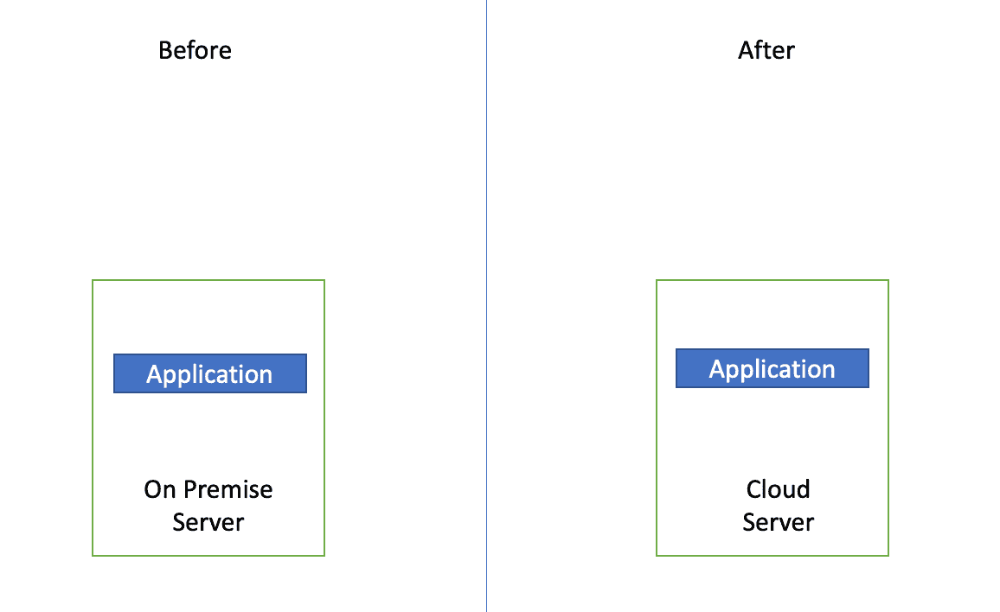
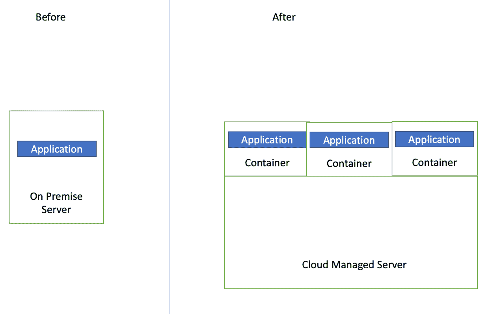

# 练习将工作负载迁移到云的 3 种方法

> 原文：<https://acloudguru.com/blog/engineering/3-ways-to-practice-migrating-workloads-to-the-cloud>

将工作负载迁移到云中时，有许多途径可供选择。 [7 Rs](https://docs.aws.amazon.com/prescriptive-guidance/latest/migration-retiring-applications/apg-gloss.html#apg.migration.terms) (或七种常见的[云迁移](https://acloudguru.com/blog/business/what-is-cloud-migration)策略)强调了业界用来评估云迁移任务的适当方法的事实模式。这篇文章将通过解释每种方法的利弊并提供实践每种方法的实践研讨会来强调其中的三种方法(重新托管、重新平台和重构)。

* * *

## 加速您的职业发展

[从 ACG 开始](https://acloudguru.com/pricing)通过 AWS、Microsoft Azure、Google Cloud 等领域的课程和实际动手实验室改变你的职业生涯。

* * *

## 1.**主机更换**

“提升和转移”是将工作负载转移到云的经典方式。这种策略有助于快速实现将应用程序迁移到云中的好处，而无需进行任何更改，并且停机时间最短。

通过利用云中的虚拟服务器，重新托管应用程序是利用云技术承载工作负载的一种简单方法。

[AWS 应用程序迁移服务](https://aws.amazon.com/application-migration-service/) (AWS MGN)提供迁移服务，将应用程序提升和转移到云。

该服务通过自动将源服务器从物理、虚拟或云基础架构转换为在 AWS 上本机运行，最大限度地减少了耗时、易出错的手动流程。它使您能够对各种应用程序使用相同的自动化流程，从而进一步简化了您的迁移。通过在迁移前启动无中断测试，您可以确信 SAP、Oracle 和 SQL Server 等最关键的应用程序将在 AWS 上无缝运行。

如果你想接触 AWS MGN，你可以试试这个[研讨会](https://catalog.us-east-1.prod.workshops.aws/v2/workshops/0d3405e5-e63b-4a66-ac87-60ba62dcce7b/en-US/migrating-to-amazon-ec2)，它会引导你将一个简单的应用程序迁移到云端。

## 2.**重新平台化**

“提升和重塑”提供了一种方式来引入某种程度的优化，以利用云功能，同时仍然保持较低的开发成本。

通过使用容器，平台化应用程序提供了一种模块化应用程序的方法，因此它们可以有多种方式，而不必依赖于服务器。

[AWS Fargate](https://aws.amazon.com/fargate/) 是一项技术，你可以与[亚马逊 ECS](https://aws.amazon.com/ecs/) 一起使用，运行容器，而不必管理服务器或亚马逊 EC2 实例集群。有了 Fargate，您不再需要供应、配置或扩展虚拟机集群来运行容器。这消除了选择服务器类型、决定何时扩展集群或优化集群打包的需要。

如果你想着手容器化一个应用程序，你可以试试这个[研讨会](https://catalog.us-east-1.prod.workshops.aws/v2/workshops/0d3405e5-e63b-4a66-ac87-60ba62dcce7b/en-US/migrating-to-aws-fargate)，它将一个应用程序转变成一个已部署的容器。

* * *

观看此[免费点播网络研讨会](https://go.acloudguru.com/cloud-migration-patterns-that-really-work-webinar),了解云应用的重新托管、重新平台化和重新架构的成本和复杂性。

* * *

## 3.**重构**

这里不准抬东西！重构是指完全重建应用程序，以充分利用云的原生特性来提高敏捷性、性能和可伸缩性。这是以更长的开发时间为代价的，因为要构建一个新的应用程序。

为了充分利用云，依赖于函数而不是服务器或容器的无服务器应用程序提供了最模块化的接口来部署您的代码。

[AWS Lambda](https://aws.amazon.com/lambda/) 是一种无服务器、事件驱动的计算服务，让您无需配置或管理服务器，即可为几乎任何类型的应用程序或后端服务运行代码。这种范式允许开发人员专注于代码和响应事件，而不是管理基础设施。

如果你想着手开发一个无服务器应用程序，试试这个[研讨会](https://catalog.us-east-1.prod.workshops.aws/v2/workshops/0d3405e5-e63b-4a66-ac87-60ba62dcce7b/en-US/migrating-to-aws-lambda)，它将一个应用程序转变成一个无服务器应用程序。

*在 Twitter 上关注 Banjo，点击 [@banjtheman](https://twitter.com/banjtheman) 和 [@AWSDevelopers](https://twitter.com/awsdevelopers) ，了解更多关于云计算和 AWS 的有用提示和技巧。*

#### **关于作者**

Banjo 是 AWS 的一名高级开发人员，他在那里帮助开发人员对使用 AWS 感到兴奋。Banjo 热衷于将数据操作化，并围绕利用数据启动了一个播客、一个 meetup 和开源项目。当没有建造下一个大东西时，Banjo 喜欢通过玩视频游戏特别是 JRPGs 和探索他周围发生的事件来放松。