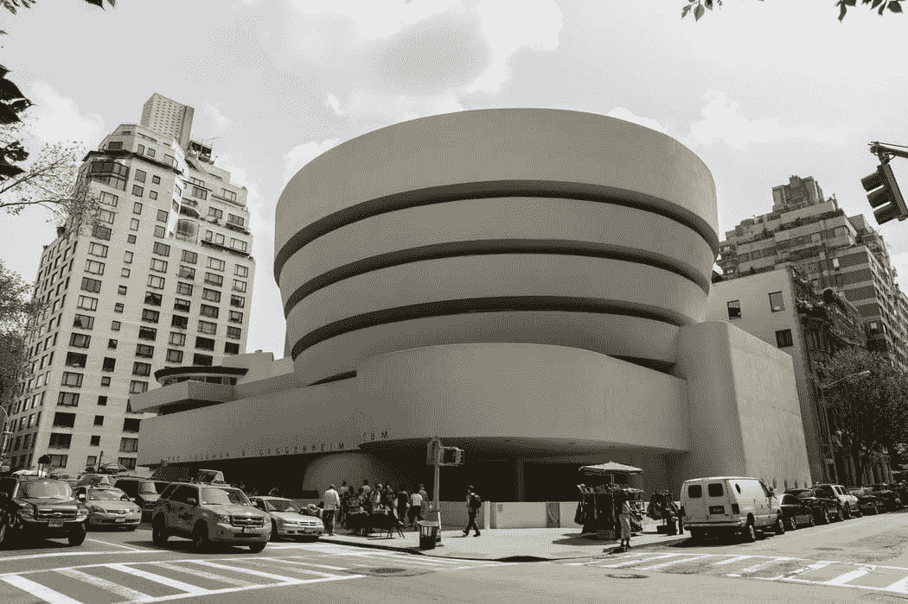
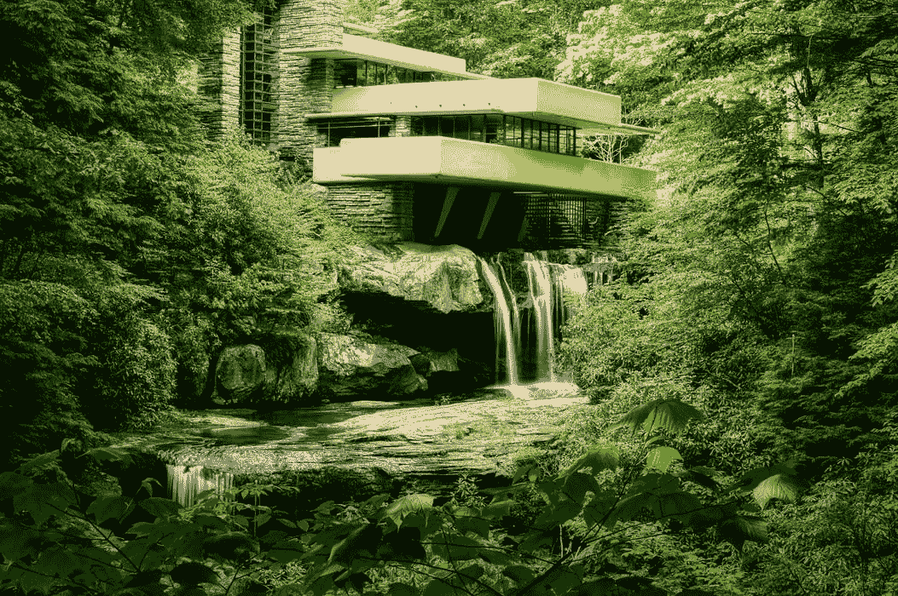

# 云架构师可以从云专家 Frank Lloyd Wright 那里学到的 5 课

> 原文：<https://acloudguru.com/blog/engineering/5-lessons-cloud-architects-can-learn-from-frank-lloyd-wright>

架构和云架构有什么共同点？很好的问题！(我们希望有一个答案，因为我们发了一整篇关于它的帖子。)以下是云架构师可以从弗兰克·劳埃德·赖特那里学到的五件事。

*这篇文章是根据 Joe 在 [ACG 社区峰会](https://acloud.guru/series/acg-community-summit)上的讲话撰写的。你可以(也完全应该)在这里看看[。为了清晰、简洁和/或总体美观，下面的内容已经过编辑。任何错误都可能是编辑的错，而不是乔的错。](https://acloud.guru/series/acg-community-summit/view/202)*

## 云中的有机建筑原则

您可能对云架构感兴趣。(毕竟你正在读一篇关于它的博文。)但即使你对传统意义上的建筑不感兴趣，你也可能听说过弗兰克·劳埃德·赖特(Frank Lloyd Wright)。

弗兰克·劳埃德·赖特设计了 1000 多座建筑。他活跃了 70 年的创作，他影响了一代又一代的建筑师，他还创办了自己的建筑学院来培养建筑师。(所以…他也是一名训练建筑师？酷！我和很多人在一起。)

弗兰克·劳埃德·赖特和云有什么关系？我们快到了。

弗兰克·劳埃德·赖特称他的设计哲学为“有机建筑”物理世界中的有机架构和云计算架构的世界有许多相似之处——特别是在[谷歌云](https://acloudguru.com/blog/engineering/what-is-google-cloud-platform-gcp)上。

在本帖中，我们将谈论建筑——在建筑设计和云计算解决方案的意义上，以及这两者如何比你想象的更相似。我们将看看有机架构的一些原则，看看我们如何将这些架构智慧应用到云中的构建中——无论您只是在考虑[哪种谷歌云认证最适合您](https://acloudguru.com/blog/engineering/which-google-cloud-certification-is-best-for-me)还是希望创建您的谷歌云杰作。

* * *

*对升级或开始云架构之旅感兴趣吗？云专家的 [GCP 架构师认证](https://acloudguru.com/learning-paths/gcp-architecture)学习路径提供适合初学者和高级专家的定制课程！*

* * *

### 1.深刻理解你的材料

一旦你知道了你正在处理的东西的特征，它会引导你找到有趣的(和新颖的)解决方案。

以纽约市的古根海姆博物馆为例。构成古根海姆博物馆的主要材料是混凝土。混凝土流动。这种内在的运动可以形成曲线和螺旋，导致一种包含其他艺术的艺术形式

我们如何将这种方法应用于谷歌云？

*   了解你的材料的属性和好处
    正如建筑设计师必须了解他们的材料及其属性和好处一样，谷歌云架构师必须了解可用的 GCP 服务、它们的主要用途、它们擅长什么，以及它们不擅长什么。了解所有的 GCP 服务确实是一个 GCP 建筑师的基本要求。

*   **根据他们的长处选择材料** 接下来，你要根据他们最擅长什么来选择材料。对于古根海姆博物馆来说，混凝土是一个自然的选择，因为它具有流动性，赖特希望将这种流动性融入到他的设计中。对于云，您希望整合最合适的服务。

    例如，假设您的团队需要将他们的 Apache Hadoop 数据管道 ETL 功能转移到云中。Google 有两个非常棒的数据管道服务:Dataproc 和 Dataflow。你选择哪个？(Dataproc 吧？它也是基于 Hadoop 的，比数据流更容易转换。)

*   使用尽可能少的材料另一个相关的原则是使用尽可能少的不同材料。这简化了设计，描绘了它的本质，而没有不必要的繁忙工作。在云中，这种方法带来了更高的效率——尤其是当涉及到最重要的资源:人员时。涉及的技术越少，组织越紧密。

### 2.注意建筑中的语法

另一个在两种建筑形式中都有共鸣的有机建筑原则是语法。

每座建筑都有自己的语法——独特的模式和形式词汇。你可以在赖特的作品中看到这一点，比如东方的[塔里辛](https://en.wikipedia.org/wiki/Taliesin_(studio))和西方的[塔里辛](https://en.wikipedia.org/wiki/Taliesin_West)。这两座建筑的形式、元素和总体设计都大相径庭。但与此同时，每一个都是内在一致的。

一般来说，语法的共性和特性让我想起了 [DevOps](https://acloudguru.com/blog/engineering/devops-vs-agile-whats-the-difference) 的一个关键原则，特别是[站点可靠性工程](https://acloudguru.com/course/reliability-engineering-concepts)，这是谷歌云架构的一个组成部分。也就是说:通过找到与您共享语言、工具和方法的系统，您可以做三件事:

*   充分利用这些资源
*   远离可能导致困难的分歧
*   让每个人都朝着一个共同的目标努力

* * *

[**获得痛苦的云词典**](https://get.acloudguru.com/cloud-dictionary-of-pain)
说云不一定要努力。我们分析了数以百万计的回复，找出了最容易让人犯错的概念。抓住这个[云指南](https://get.acloudguru.com/cloud-dictionary-of-pain)获取一些最痛苦的云术语的简洁定义。

* * *

### 3.合并形式和功能

你可能听说过“功能决定形式”这句话这来自路易斯·沙利文，他认为建筑的目的应该是其设计的出发点。弗兰克·劳埃德·赖特为沙利文工作，但他并不只是盲目追随他的导师。

Wright 认为形式和功能应该是一体的——尤其是当涉及到建筑和它的位置时。你可以在莱特的杰作《落水》中看到这一点。

莱特的客户买下了这处房产，以为他会建一栋能看到瀑布的房子。但是赖特设计了瀑布顶端的房子。

正如 Wright 看到了建筑和场地之间的关系一样，我也看到了云解决方案和你为之设计解决方案的公司之间的密切关系。我们来分析一下。

*   同样，任何云计算系统都应该为组织服务。也许这看起来是理所当然的，但是在提出符合要求的计算机系统设计的压力下，很容易忽略这个概念。你可能会想出一个*的*解决方案，但是这个*的*解决方案适合公司吗？

*   在云计算方面，我认为这意味着与现在所在的公司合作。如果他们正处于从本地云到云的初始[云迁移](https://acloudguru.com/blog/business/what-is-cloud-migration)过程中，您可能会做出与他们在云之旅中成熟并寻求提高效率和范围时不同的决定。

*   **建筑是站点**
    独有的，因此，您的云架构设计应该是公司和项目独有的。定制。定制。定制。

* * *

[**后 COVID DevOps:加速未来**](https://get.acloudguru.com/post-covid-devops-accelerating-future-webinar) COVID 如何影响甚至加速了 DevOps 最佳实践？[观看 DevOps 领导者的免费点播网络研讨会](https://get.acloudguru.com/post-covid-devops-accelerating-future-webinarhttps://get.acloudguru.com/post-covid-devops-accelerating-future-webinar)，我们将探索后 COVID 时代的 DevOps。

* * *

### 4.给予你们造物的居民庇护

让我们来解决有机古风的另一个原则:庇护所。莱特说:“一座建筑应该传达一种庇护、避难或抵御恶劣天气的感觉。它的居民永远不应该缺乏隐私或感到暴露和不受保护。”这如何适用于云？

*   避难所的感觉
    我看到避难所，我立刻把它转化为安全感。在设计云计算解决方案时，您必须始终将安全性放在第一位。如果您让网络对坏人敞开大门，那么即使您设置了正确的 Kubernetes 引擎集群配置也没有用。

*   **抵御自然灾害** 你不必只对人类保持警惕——大自然、你周围的世界以及你所依赖的其他系统都是如此。谷歌云的许多服务都内置了高度冗余，你绝对应该好好利用这一点。并且还添加了额外的适当的故障安全或回退机制。

*   "**永远不要缺少隐私或感到暴露"** 这是一个治理、风险和[合规](https://acloudguru.com/blog/business/compliance-is-cumbersome-but-cloud-can-help)的时代——尤其是对服务于全球市场的跨国公司而言。许多国家都有非常具体的法规来保护公民。如果您要将您的应用程序提供给这些领域，您必须了解并遵从所有这些领域。

    Google Cloud 拥有强大的加密功能，无论是传输中的数据还是静态数据。但是作为谷歌云架构师，你应该足够精明，能够清除那些控制之外的敏感数据。例如，以用户日志为例，您可能希望利用 Google Logging agent 的 Fluentd 功能。这需要知识，注意细节，并坚持到底。

### 5.迭代，迭代，迭代

Frank Lloyd Wright 的许多其他原则也唤起了地球和云端建筑的类似概念，包括空间、比例、尺度和简单性的概念。但要记住的关键是，正如 Wright 所写的，“有机建筑的理想的完整目标永远不会实现。也不需要。有什么有价值的理想达到过吗？”

或者，用我的话说:迭代。迭代。迭代。不断优化您的解决方案，并继续使您的系统尽可能具有容错能力。

我希望这些思考对您有所帮助，让您从一个全新的角度来看待 Google 云平台的架构解决方案！

* * *

## 在云中建立更好的职业生涯。

向一位云计算专家了解更多关于谷歌云、云架构和最受欢迎的技术技能的信息。查看[本月的免费课程](https://acloudguru.com/blog/news/whats-free-at-acg)或[获得 7 天免费试用](https://acloudguru.com/pricing)。