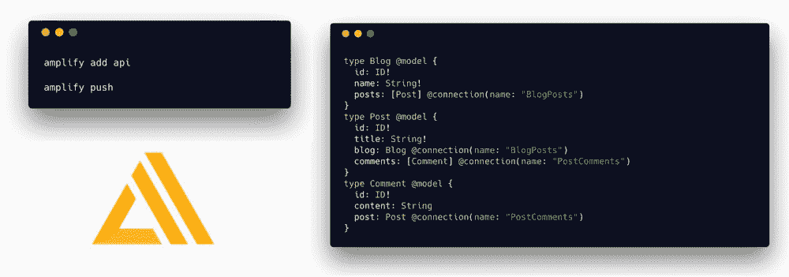
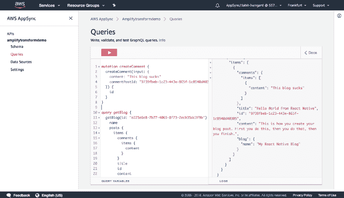

# 使用 AWS Amplify 构建自己的无服务器 GraphQL API 的 8 个步骤

> 原文：<https://acloudguru.com/blog/engineering/8-steps-to-building-your-own-serverless-graphql-api-using-aws-amplify>

## 

随着新的 [AWS Amplify](https://acloudguru.com/blog/engineering/create-a-serverless-python-api-with-aws-amplify-and-flask) CLI 的发布，开发人员现在能够从命令行移植[AWS app sync](https://acloudguru.com/course/introduction-to-aws-appsync)graph QL API。

在这篇文章中，我们将学习如何使用 CLI 创建 AWS AppSync API，以及如何将您的新 API 连接到客户端 web 或移动应用程序。

CLI 可以自动创建一个全功能的 GraphQL API，包括数据源、解析器和用于变异、订阅和查询的附加模式。我们还可以直接从本地环境中更新和删除 API 中的模式、数据源和解析器。



### 放大 GraphQL 变换

我们还能够在本地环境中直接从 CLI 使用 [Amplify GraphQL Transform](https://github.com/aws-amplify/amplify-cli/blob/master/graphql-transform-tutorial.md#graphql-transformer-tutorial) 库添加强大的功能，如弹性搜索、用户授权和数据关系。

Amplify GraphQL Transform 是一个库，用于简化开发、部署和维护 GraphQL APIs 的过程。通过它，您可以使用 GraphQL 模式定义语言(SDL)定义您的 API，然后将它传递到库中，在那里它被转换并在 AWS AppSync 中实现您的 API 的数据模型。

> 虽然该库附带了 transformers 来完成构建典型 API 所需的大部分工作，但是您甚至可以[编写自己的 GraphQL Transformer](https://github.com/aws-amplify/amplify-cli/blob/master/how-to-write-a-transformer.md) 。

例如，如果我们想要构建一个 GraphQL API，创建一个数据源、解析器、模式，然后将所有数据流式传输到 Elasticsearch，我们可以创建以下类型，并使用 AWS Amplify CLI 将它推上来:

```
type Pet @model @searchable {
  id: ID!
  name: String!
  description: String
}
```

在上面的模式中，注释`@model` & `@searchable`将为我们自动创建数据源&所有的资源。

还有一个`@connection`注释，允许您指定`@model`对象类型&之间的关系；一个`@auth`注释，允许您指定 GraphQL API 中的授权模式。

让我们看看如何使用 Amplify CLI 和 Amplify GraphQL 转换库创建一个新的 AWS Appsync API，并将其连接到客户端 React 应用程序。

### 1.安装和配置 CLI

首先，我们将安装 AWS Amplify CLI:

```
npm i -g @aws-amplify/cli
```

安装了 AWS Amplify CLI 后，我们现在需要使用 IAM 用户对其进行配置:

```
amplify configure
```

> 有关如何配置 AWS Amplify CLI 的视频演示，请单击此处的。

### 2.将 API 连接到客户端应用程序

接下来，我们将创建一个新的 React 应用程序，并进入新目录:

```
npx create-react-app blog-app
cd blog-app
```

现在我们需要安装 AWS Amplify 客户端库:

```
yarn add aws-amplify aws-amplify-react
# or
npm install --save aws-amplify aws-amplify-react
```

### 3.初始化 AWS Amplify 项目

从根目录或新创建的 React 应用程序中，让我们初始化一个新的 AWS Amplify 项目:

```
amplify init
```

> 当询问您是否想要使用 AWS 概要文件时，选择 Yes，使用我们在前面配置项目时创建的概要文件。

一旦项目被初始化，我们将把 GraphQL API 特性添加到我们的 Amplify 项目:

```
amplify add api
```

这将引导我们完成创建 AWS AppSync GraphQL API 的以下步骤:

*   请从下列服务中选择一项:**graph QL**
*   提供 API 名称:**blogapp**
*   选择 API 的授权类型:**API _ KEY**
*   你有带注释的 GraphQL 模式吗？:**N**
*   您想要一个引导式模式创建吗？**Y**
*   什么最能描述你的项目:**一对多关系(例如，“博客”与“帖子”和“评论”)**
*   您想现在编辑模式吗？**Y**

这将在您选择的编辑器中打开一个预先填充的模式，并为您提供所创建的新模式的本地文件路径。

让我们来看看这个模式。我们还将通过向`Post`类型添加`content`字段来做一个小小的更新。更新模式后，继续保存文件:

```
type Blog @model {
  id: ID!
  name: String!
  posts: [Post] @connection(name: "BlogPosts")
}
type Post @model {
  id: ID!
  title: String!
  content: String!
  blog: Blog @connection(name: "BlogPosts")
  comments: [Comment] @connection(name: "PostComments")
}
type Comment @model {
  id: ID!
  content: String
  post: Post @connection(name: "PostComments")
}
```

在上面的模式中，我们看到`Post` & `Blog`类型有`@model `注释。用`@model `标注的对象类型是生成的 API 中的顶级实体。当被推动时，它们将创建 DynamoDB 表以及附加的 Schema &解析器，以将所有内容连接在一起。

> 要了解更多关于@model 注释的信息，请点击[此处](https://github.com/aws-amplify/amplify-cli/blob/master/graphql-transform-tutorial.md#model)。

我们还看到了在类型中使用的`@connection`注释。`@connection `注释使您能够指定`@model`对象类型之间的关系。目前，`@connection`支持一对一、一对多、多对一的关系。如果您尝试配置多对多关系，则会引发错误。

> 要了解更多关于`@connection`型的信息，点击[这里](https://github.com/aws-amplify/amplify-cli/blob/master/graphql-transform-tutorial.md#connection)。

模式准备就绪后，我们现在可以推动一切来执行资源的创建:

```
amplify push
```

一旦创建了资源，我们就可以创建应用程序了&开始与 API 交互。

我们现在还可以通过点击新的 API 名称在 [AWS AppSync 仪表板](https://console.aws.amazon.com/appsync/home)中查看 API。

从 [AWS AppSync 仪表板](https://console.aws.amazon.com/appsync/home)中，我们也可以通过点击左侧菜单中的**查询**来开始执行查询&突变:



让我们试着创建一个包含帖子和评论的新博客，然后查询博客数据。

在 [AWS AppSync 仪表盘](https://console.aws.amazon.com/appsync/home)中，点击**查询**。

首先，我们将创建一个新的博客:

```
mutation createBlog {
  createBlog(input: {
    name: "My Programming Blog"
  }) {
    id
    name
  }
}
```

接下来，我们将在这个博客中创建一个新帖子(用从上面的变异中返回的 id 替换`postBlogId`):

```
mutation createPost {
  createPost(input: {
    title: "Hello World from my programming blog"
    content: "Welcome to my blog!"
    postBlogId: "bcb298e6-62ec-4614-9ab7-773fd811948e"
  }) {
    id
    title
  }
}
```

现在，让我们为这篇文章创建一个评论(用上述变异返回的 ID 替换`commentPostId`):

```
mutation createComment {
  createComment(input: {
    content: "This post is terrible"
    commentPostId: "ce335dce-2c91-4fed-a953-9ca132f129cf"
  }) {
    id
  }
}
```

最后，我们可以查询博客以查看所有文章和评论(用你博客的 **id** 替换 **ID** ):

```
query getBlog {
  getBlog(id: "bcb298e6-62ec-4614-9ab7-773fd811948e") {
    name
    posts {
      items {
        comments {
          items {
            content
          }
        }
        title
        id
        content
        blog {
          name
        }
      }
    }
  }
}
```

### 4.从 React 连接到 API

为了连接到新的 API，我们首先需要用我们的 Amplify 项目凭证来配置 React 项目。您会注意到 src 目录中有一个名为`aws-exports.js`的新文件。这个文件包含了我们的本地项目需要了解的关于我们的云资源的所有信息。

要配置项目，打开`src/index.js` &在最后一次导入下面添加以下内容:

```
import Amplify from '@aws-amplify/core'
import config from './aws-exports'
Amplify.configure(config)
```

现在，我们可以开始对 API 执行变异、查询和搜索。

我们将要执行的 GraphQL 变异的定义如下所示:

```
// Create a new blog
const CreateBlog = `mutation($name: String!) {
  createBlog(input: {
    name: $name
  }) {
    id
  }
}`
// Create a post and associate it with the blog via the "postBlogId" input field
const CreatePost = `mutation($blogId:ID!, $title: String!, $content: String!) {
  createPost(input:{
    title: $title, postBlogId: $blogId, content: $content
  }) {
    id
  }
}`
// Create a comment and associate it with the post via the "commentPostId" input field
const CommentOnPost = `mutation($commentPostId: ID!, $content: String) {
  createComment(input:{
    commentPostId: $commentPostId, content: $content
  }) {
    id
  }
}`
```

我们将执行的 GraphQL 查询的定义如下所示:

```
// Get a blog, its posts, and its posts comments
const GetBlog = `query($blogId:ID!) {
  getBlog(id:$blogId) {
    id
    name
    posts {
      items {
        id
        title
        content
        comments {
          items {
            id
            content
          }
        }
      }
    }
  }
}`
```

### 5.配置客户端应用程序

首先要做的是用您的 web 应用程序配置 Amplify。在您的应用程序的根目录下(在 React 中这将是`src/index.js`)，在最后一次导入的下面，添加以下代码:

```
import Amplify from 'aws-amplify'
import config from './aws-exports'
Amplify.configure(config)
```

现在，我们可以开始对 API 执行操作了。

### 6.从客户端执行突变

创建新博客:

```
// import the API & graphqlOperation helpers as well as the mutation
import { API, graphqlOperation } from 'aws-amplify'
import { CreateBlog } from './your-graphql-definition-location'
// next, we create a function to interact with the API
state = { blogName: '' }
createBlog = async () => {
  const blog = { name: this.state.blogName }
  await API.graphql(graphqlOperation(CreateBlog, blog))
  console.log('blog successfully created')
}
```

为博客创建帖子:

```
// import the API & graphqlOperation helpers as well as the mutation
import { API, graphqlOperation } from 'aws-amplify'
import { CreatePost } from './your-graphql-definition-location'
// next, we create a function to interact with the API
state = { postTitle: '' , postContent: '' }
createBlog = async () => {
  const post = {
    title: this.state.postTitle,
    content: this.state.postContent,
    postBlogId: this.props.blogId // Or where your blogId data lives
  }
  await API.graphql(graphqlOperation(CreatePost, post))
  console.log('post successfully created')
}
```

对帖子发表评论:

```
// import the API & graphqlOperation helpers as well as the mutation
import { API, graphqlOperation } from 'aws-amplify'
import { CommentOnPost } from './your-graphql-definition-location'
// next, we create a function to interact with the API
state = { content: '' }
createBlog = async () => {
  const comment = {
    content: this.state.content,
    commentPostId: this.props.commentPostId // Or where your commentPostId data lives
  }
  await API.graphql(graphqlOperation(CommentOnPost, comment))
  console.log('comment successfully created')
}
```

### 7.从客户端执行查询

列出包含帖子和帖子评论的博客:

```
// import the API & graphqlOperation helpers as well as the query
import { API, graphqlOperation } from 'aws-amplify'
import { GetBlog } from './your-graphql-definition-location'
// next, we create a function to interact with the API
getBlog = async () => {
  const data = await API.graphql(graphqlOperation(GetBlog, { id: this.props.blogId }))
  console.log('blog successfully fetched', data)
}
```

### 8.修改 s **方案**

如果您想随时修改模式以添加、更新或删除任何内容，您可以打开模式所在的文件，进行编辑，然后运行`amplify push`来更新您的 AWS AppSync API。

* * *

## 视频漫游

在本视频演练中，我们使用 Amplify CLI 创建一个 AWS AppSync GraphQL API，并将其连接到 React 应用程序。

* * *

如果您有兴趣了解更多关于使用 AWS AppSync 构建 GraphQL APIs 的信息，请关注[阿德里安·霍尔](https://medium.com/u/f3a20aa7b323?source=post_page-----42c21770424d--------------------------------) &查看他的帖子[使用 AWS Amplify Model Transforms 以简单的方式构建 GraphQL 服务](https://medium.com/open-graphql/build-a-graphql-service-the-easy-way-with-aws-amplify-model-transforms-b3929b4f24c3)。

要了解更多关于 AWS Amplify 的信息，请查看文档或 [Github](https://github.com/aws-amplify/amplify-cli) 。

*我的名字是* [*纳德达比特*](https://twitter.com/dabit3) *。我是一名开发者，在 AWS Mobile 从事类似项目的工作，比如:AWS AppSync、AWS、AWS Amplify、AWS、AWS、AWS、AWS、AWS、AWS、AWS、AWS、AWS、AWS、AWS、AWS、AWS、AWS、AWS、AWS、AWS、AWS、AWS、AWS、AWS、AWS、AWS、AWS、AWS、AWS、AWS、AWS、AWS、AWS、AWS、AWS、AWS、AWS、AWS、AWS、AWS、AWS、AWS、AWS、AWS、AWS、AWS、AWS、AWS、AWS、AWS、AWS、*