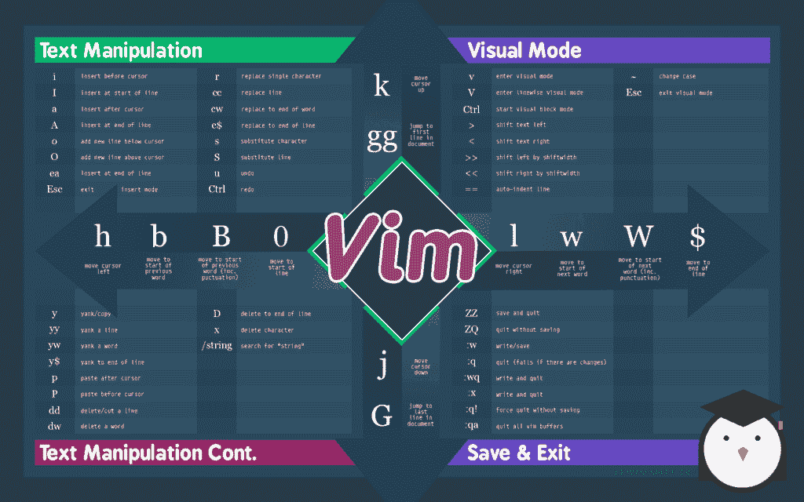

# Vim 备忘单:终极命令指南

> 原文：<https://acloudguru.com/blog/engineering/a-vim-cheat-sheet-reference-guide>

Vim 是一个强大的文本编辑器，是许多系统管理员和开发人员的最爱。唯一的问题是:随着权力而来的是一个学习曲线。由于要使用和记忆各种各样的命令，在 Vim 中编写和编辑文件似乎令人望而生畏。幸运的是，有一位云计算专家为您提供了这个有趣的 vim 备忘单，它是基本(和一些不太基本的)Vim 命令的背景图像格式！点击查看它的全尺寸荣耀，并使用它来满足您所有的 Linux 培训需求！

## VIM 光标移动

H–向左移动光标
j–向下移动光标
k–向上移动光标
L–向右移动光标
H–移动到屏幕顶部
M–移动到屏幕中间
L–移动到屏幕底部
W–向前跳到单词的开头
W–向前跳到单词的开头(单词可以包含标点符号)
E–向前跳到单词的末尾
E–向前跳到单词的末尾(单词可以包含标点)
B–向后跳到单词的开头
B–向后跳到单词的开头(单词可以包含标点)
0–跳到行首
^–跳到行首的非空白字符
$–跳到行尾
g _–跳到行尾的非空白字符
gg–跳到文档首行
g–跳到文档末行
5g–跳到第 5 行
FX–跳到下一个 character x
tx–跳转到下一个出现的字符 x
}–跳转到下一个段落(或函数/块，当编辑代码时)
{–跳转到上一个段落(或函数/块，当编辑代码时)
ZZ–光标在屏幕上居中
Ctrl+b–向后移动一个全屏
Ctrl+f–向前移动一个全屏
Ctrl+d–向前移动 1/2 个屏幕
Ctrl+u–向后移动 1/2 个屏幕

## VIM 文本操作

I–在光标前插入
I–在行首插入
A–在光标后插入(追加)
A–在行尾插入(追加)
O–在当前行下方追加(打开)新行
O–在当前行上方追加(打开)新行
ea–在字尾插入(追加)
Esc–退出插入模式

r–替换单个字符
J–将下面的行合并到当前行
cc–更改(替换)整行
CW–更改(替换)到字尾
c $–更改(替换)到行尾
S–删除字符并替换文本
S–删除行并替换文本(与 cc 相同)
XP–转置两个字母(删除并粘贴)
u–撤消
Ctrl+r–重做
。–重复最后一个命令

## VIM 视觉模式

v–启动视觉模式，标记线条， 然后执行一个操作(比如 d-delete)
V–开始逐行视觉模式
Ctrl+V–开始逐块视觉模式
O–移动到标记区域的另一端
O–移动到块的另一角
aw–标记一个字
aB–带有()
aB 的块–带有{}
ib 的块–带有()
iB 的内块–带有{}的内块
Esc–退出视觉模式
视觉命令
>–文本右移
<–文本左移
y–猛拉(复制)标记文本
d–删除标记文本
~–切换大小写

## VIM 寄存器

:reg–显示寄存器内容
" xy–拉入寄存器 x
" XP–粘贴寄存器 x 的内容

## VIM 标记

:标记–标记列表
ma–设置标记 A 的当前位置
` A–跳转到标记 A 的位置
y ` A–将文本拉至标记 A 的位置

## VIM 宏

QA–记录宏 a
q–停止记录宏
@ a–运行宏 a
@ @–重新运行上次运行的宏

## VIM 剪切和粘贴

YY–猛拉(复制)一行
2yy–猛拉(复制)2 行
yw–猛拉(复制)该单词的字符从光标位置到下一个单词的开头
y $–猛拉(复制)到行尾
P–将剪贴板放在光标之后
P–放在光标之前(粘贴)
DD–删除(剪切)一行
2dd–删除(剪切)2 行
dw–删除(剪切) 从光标位置到下一个单词开始的单词的字符
D–删除(剪切)到行尾
D $–删除(剪切)到行尾
x–删除(剪切)字符

## VIM 退出

:w–写入(保存)文件，但不要退出
:w！sudo tee %–使用 sudo
:wq 或写出当前文件😡或者 ZZ–写入(保存)并退出
:q–退出(如果有未保存的更改则失败)
:q！或者 ZQ——退出并丢弃未保存的更改

## VIM 搜索和替换

/pattern–搜索模式
？pattern–向后搜索模式
\ v pattern–非常神奇的模式:非字母数字字符被解释为特殊的正则表达式符号
N–在相同方向重复搜索
N–在相反方向重复搜索
:% s/old/new/g–在整个文件中用新的替换所有旧的
:% s/old/new/GC–在整个文件中用新的替换所有旧的并进行确认
:noh–删除搜索匹配的突出显示

## 在多个文件中进行 VIM 搜索

:vim grep/pattern/{ file }–在多个文件中搜索模式
，例如
:vimgrep /foo/ **/*
:cn–跳转到下一个匹配项
:CP–跳转到上一个匹配项
:copen–打开一个包含匹配项列表的窗口
处理多个文件
:e file–编辑新缓冲区中的文件
:bnext 或:bn–转到下一个缓冲区
:bprev 或:BP–转到上一个缓冲区
:BD–删除一个缓冲区(关闭一个文件)
:ls–列出所有打开的缓冲区
:sp 文件–在新的缓冲区中打开一个文件并拆分窗口
:vsp 文件–在新的缓冲区中打开一个文件并垂直拆分窗口
Ctrl+ws–拆分窗口
Ctrl+ww–切换窗口
Ctrl+wq–退出一个窗口
Ctrl+wv–垂直拆分窗口
Ctrl+wh–将光标移动到左侧窗口(垂直拆分)
Ctrl+wl–将光标移至右侧窗口(垂直拆分)
Ctrl+wj–将光标移至下方窗口(水平拆分)
Ctrl+wk–将光标移至上方窗口(水平拆分)

## VIM 标签

:tab new or:tab new file–在新标签页打开一个文件
Ctrl+wT–将当前拆分的窗口移动到自己的标签页
gT or:tab next or:tabn–移动到下一个标签页
gT or:tab prev or:tabp–移动到上一个标签页
# gT–移动到标签页编号#
:tabmove # –将当前标签页移动到#th 位置
:tabclose 或:tabc–关闭当前标签页及其所有窗口
:tabonly 或:tabo–关闭除当前标签页之外的所有标签页
:tabdo 命令–对所有标签页运行该命令

如何从 Vim 小抄走，成为 Vim pro？查看我们的 [Vim 改进编辑器课程](https://acloudguru.com/course/vim-the-improved-editor)和[开始免费试用！](https://acloudguru.com/pricing)

### 寻找更多的提示和技巧？