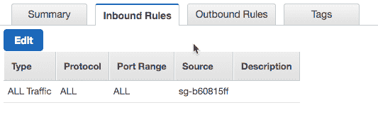
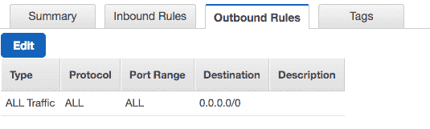

# AWS VPC:部署无服务器多区域活动后端

> 原文：<https://acloudguru.com/blog/engineering/adding-support-for-vpc-build-a-serverless-multi-region-active-active-backend-solution>

一个被问了几次的问题:如何在亚马逊 VPC(虚拟私有云)中部署无服务器的多区域、主动-主动后端**？**我想，如果我能进一步推进我们的方法，并改进解决方案来回答这些问题，那就太好了。

## 什么是 VPC？

VPC 提高了隐私和安全性，尤其是对于具有严格合规性和审计要求或敏感数据的应用。通常，您使用 VPC，这样就无法从公共互联网访问 VPC 内部的资源。这些资源可以是 AWS 服务资源，比如您的数据仓库、缓存集群或数据库。

因为默认情况下，Lambda 函数不能访问 VPC 中的资源，所以我们必须做一些额外的工作。

## 如何允许λ进入 VPC？

为了允许您的 Lambda 函数访问您的 VPC 内部的资源，我们必须提供额外的特定于 VPC 的信息，例如 VPC 子网 id 和安全组 id。该信息用于建立弹性网络接口 [(ENI)](http://docs.aws.amazon.com/AmazonVPC/latest/UserGuide/VPC_ElasticNetworkInterfaces.html) ，该接口使得 Lambda 功能能够连接到 VPC 内的资源。

此外，我们还需要启用 DynamoDB [VPC 端点](https://acloudguru.com/hands-on-labs/create-a-vpc-endpoint-and-s3-bucket-in-aws)并将我们的 [VPC 路由信息](https://aws.amazon.com/blogs/aws/new-vpc-endpoints-for-dynamodb/)添加到其中。

***注*** *:为了多样性，我将从命令行界面(CLI)创建一切，但你当然也可以从控制台做一切🙂*

让我们开始吧！

* * *

## 提升您在云中的职业生涯

希望提升您的云计算职业生涯？免费与云专家一起开始，了解我们的实践方法如何帮助您掌握现代技术技能。

* * *

## 建立 VPC 网络基础

### 第 1 步——创建我们的 VPC

当然，我们首先需要在我们想要部署后端的每个地区创建我们的 VPC。在这个例子中，我将使用**美国东部-1** 和**美国西部-2** 地区。

在 **us-west-2** 地区做同样的事情。

### 第 2 步—在每个 VPC 内部创建一个子网

***注意:*** *您可以在每个可用性分区中添加一个或多个子网，事实上，您应该这样做，因为这是最佳做法*。

当然，我们需要为 ***us-west-2*** 地区做同样的事情。

### 步骤#3 —获取每个 VPC 的路由信息

在 ***us-west-2*** 地区重复此操作，并将“ **RouteTableId** ”字段信息放在身边，因为您稍后会用到它。

* * *

## 创建 DynamoDB 全局表

这与我上一篇文章中的 [*步骤#1:在 DynamoDB* 中创建一个全局表非常相似:](http://step%20/#1:%20Creating%20a%20Global%20Table%20in%20DynamoDB)

很好，现在我们有了一个全局表，可以从 VPC … **中的 Lambda 函数访问它，是这样吗？**

嗯……不！！！我们的默认 DynamoDB 全局表还不在 VPC，所以它被视为公共互联网。既然我们已经将 Lambda 函数配置为在 VPC 内部运行，我们需要为 DynamoDB 创建一个我们称之为[的 VPC 端点](https://aws.amazon.com/blogs/aws/new-vpc-endpoints-for-dynamodb/)。

dynamidb 已经提供了数据保护和安全性，使用 TLS 端点进行传输加密、[客户端加密库](https://github.com/awslabs/aws-dynamodb-encryption-java)、以及使用 AWS 身份和访问管理(IAM)**的细粒度访问控制，那么我们为什么要为 dynamidb 使用 VPC 端点呢？**

简而言之，它进一步提高了隐私和安全性，特别是对于具有严格合规性和审计要求或处理敏感数据的应用程序。

事实上，如果您从 VPC 连接到 DynamoDB，您不再需要互联网网关或 NAT 网关，因此您的 VPC 保持关闭并与公共互联网隔离。VPC 端点还提供简化的网络配置，使您无需设置和维护防火墙来保护您的 VPC 免受网络攻击。

> **更高的安全性=更满意的客户**

### 步骤 4——为 DynamoDB 创建一个 VPC 端点

### 步骤#5 —将 VPC 路由添加到 DynamoDB 端点

这里我们需要添加之前返回给命令的"***【RoutingTableId】***"值。

太好了！现在，我们的 DynamoDB 全局表可以从我的 VPCs 中访问。

***注意*** *:当然，我们需要为每个区域复制命令🙂*

* * *

### 使用部署在 VPC 中的 API 网关和 AWS Lambda 函数创建后端

后台功能和我上一篇文章中的[一样，这里没有改动；我们还有一个**获取** *物品 id* ，一个**发布** *物品 id* 和一个**获取** *生命值*。](https://read.acloud.guru/building-a-serverless-multi-region-active-active-backend-36f28bed4ecf)

改变的**是用于在 VPC 中部署 Lambda 函数和配置 API 网关的 ***无服务器*** 框架**模板。****

**然而，在我们这样做之前，我们需要在每个区域为我们的 Lambda 函数创建安全组。下面是默认的 ***入站*** 和 ***出站*** 规则的安全组配置为我的一个 VPC。注意到 ***入站*** 规则在源中引用了它自己吗？**

********

*****注意*** *:您为某个功能选择的安全组将控制该功能对子网内和互联网上的资源的访问。所以可以随意修改。***

**现在，我们可以使用 ***无服务器*** 框架更新部署后端所需的*_ _ all _ _*VPC 字段，由于我不想管理每个地区的模板，我将使用框架支持的[变量](https://serverless.com/framework/docs/providers/aws/guide/variables/)，因为它们允许用户动态替换 ***无服务器. yml*** 文件中的配置值。**

 **请注意模板的 VPC 部分，以及我如何使用 cool 变量语法根据我部署的地区将地区信息传递给配置？

> **${file(env_${opt:region}。yml):lambdaExecSecurityGroups }**

***注意*** *:请确保将*[*server less . yml*](https://gist.github.com/adhorn/cab4b461f46cc66f27d49e1de4230c7f)*文件中的“xxxxxxxxxxxxx”替换为您之前创建 DynamoDB 表时使用的 AWS 帐户 ID 以及 env 文件中的正确子网和安全组 ID。*

在 ***us-east-1*** 和 ***us-west-2*** 中部署 API，其中部署了带有 VPC 端点的 DynamoDB 全局表。

其余的都不会改变——所以你可以从我之前的博客文章中的“第三步:创建自定义域名”开始，一路走下去🙂

瞧啊。希望你喜欢这个小小的 ***安可。*** 我计划再多几个..敬请关注！

阿德里安**