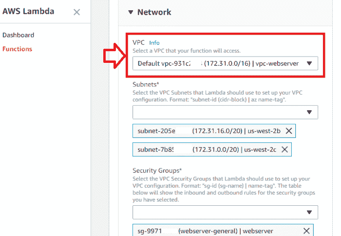
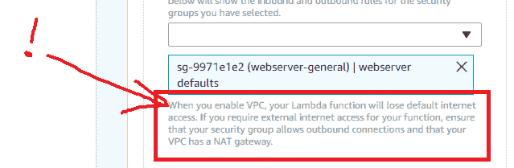
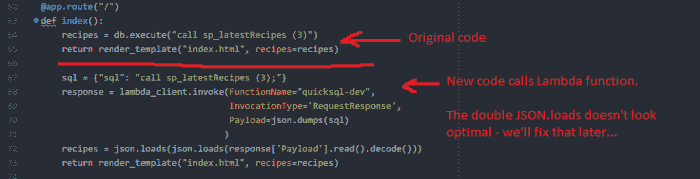
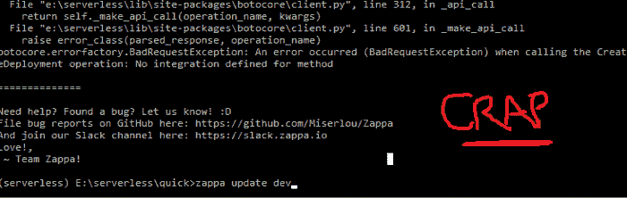
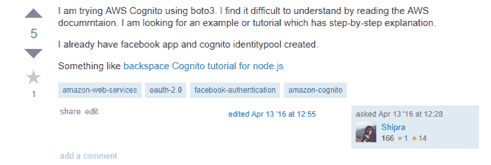

# 将 Flask App 从 Elastic Beanstalk 迁移到 AWS Lambda 

> 原文：<https://acloudguru.com/blog/engineering/adventures-in-migrating-to-serverless>

在纽约参加了一个云专家的 [Serverlessconf](https://nyc.serverlessconf.io/) 会议后，我受到启发，花了一个周末的时间来尝试实施我从研讨会和演讲者会议中学到的东西。我的目标是将我在 AWS Elastic Beanstalk 中编排的简单 web 应用程序迁移到 AWS Lambda 中的[无服务器实现中。让周末开始吧！](https://acloudguru.com/blog/engineering/aws-lambda-is-winning-but-first-it-had-to-die)

我的简单食谱网站是一个 Flask 应用程序，它在 MySQL 数据库中查询食谱，并允许用户使用他们的 Twitter 帐户创建购物清单。

简单的 recipe 应用程序使用托管在 AWS Elastic Beanstalk 上的 Python、Flask、OAuth、JavaScript、JQuery、RDS。它并不花哨，但它是测试新技术的好地方，它让我在学习新技术时有了目标——比如无服务器！

这个网站几乎没有流量，所以为最少的资源付费真的让我很恼火。我可能会把每月 10 美元花在咖啡上。现在，它有一个由 Route 53 托管的域名和一个指向 Elastic Beanstalk 上的单实例部署的负载平衡器。在无服务器的世界里，这几乎不需要任何费用。

让我们谈谈目标:我的目标是尽可能多地提升和移动*。我知道我们可以很容易地用 DynamoDB 在 Node 中重写这一点，但我们坚持使用 Python/Flask 组合，因为这个小小的应用程序是更大迁移的代理。Flask 为我们提供了很好的服务，添加路由和调试非常简单，我们希望它能在这次过渡中幸存下来。这是周六早上，我喝了咖啡因做这件事！*

## *将烧瓶应用程序移动到 AWS Lambda*

*事实证明，有几个框架旨在使将 Flask 移动到 Lambda 变得“容易”——[Zappa](https://github.com/Miserlou/Zappa)和[Chalice](https://github.com/aws/chalice)——所以我们*可能会在午餐时间完成*。几个小时后，很明显，Chalice 是 Zappa 的克隆，它添加了一些自动 IAM 魔法，但提供了其功能的一小部分，并需要对我的应用程序进行重大代码更改。*

*我丢掉圣杯，专注于扎帕。*

*这个 *Hello World* 的例子运行得如此之好，以至于我的期望很高——但是当我试图部署我的应用程序时，我得到了当天的第一个错误。这不是一个友好的 Python/Flask 错误，而是一个长达一页的 AWS 错误，让我质疑我的职业选择。*

*到午餐时间，我发现 Zappa 在读取 Windows 上的文件时有问题，所以我将一个 UTF-8 默认值直接破解到有问题的 Zappa python 文件中，以继续运行。我喜欢早上技术债的味道。*

**哎呀，更多错误*:*

1.  *Zappa 需要一系列极其复杂的 IAM 权限，似乎没有人需要将它们记录在一个地方。到处都是碎片，但我最终还是从地狱构建了一个 IAM 策略来使它工作。我避免了显而易见的“完全管理员访问”方法，试图学习一些东西并以正确的方式做事。很明显，是我的错。*
2.  *Lambda 似乎不喜欢 [mysqlclient](https://pypi.python.org/pypi/mysqlclient) Python 库。我能找到的所有 AWS 例子都使用 [pymysql](https://github.com/PyMySQL/PyMySQL) ，所以我花了几分钟把它们切换出来。午餐时间结束了，我开始了漫长的下午。*
3.  *我运行`zappa deploy dev`并等待两分钟。它上传，我在控制台看到绿色而不是红色，并得到一个 API 端点。成功！我在浏览器中剪切并粘贴网址，然后等待，等待…然后超时了。我的胜利多么短暂。这似乎不是很重要，但标志着一个野生品种鹅追逐的开始，这一天剩下的时间沉。*

## *AWS Lambda RDS 和 OAuth 解决方案*

*在 Lambda 中使用 RDS 是一种反模式，因为您将扩展瓶颈推到了数据库。但现实是，即使不是大多数，也有许多 web 应用程序使用 SQL 数据库——所以我忍住了转向 DynamoDB 并继续解决这个问题的冲动。对于像我这样很少使用的爱好网站，RDS 选项仍然有效。*

*问题的症结在于 RDS 是一个使用 VPC 的资源。为了让你的 Lambda 函数看到数据库，它也在 VPC 中。当你打开 Lambda 函数的网络部分时，这是你可以设置它的地方。*

*在这一点上，如果你还没有完成任何形式的 AWS 认证，你可能应该停下来[寻求一些帮助](https://acloud.guru/learn/aws-certified-solutions-architect-associate)。幸运的是，我有证书——所以我可以在没有任何帮助的情况下轻松迷惑自己！*

**

*在配置了必要的安全组设置后，我刷新 URL 并加载页面。但遗憾的是，所有的菜单链接都因为一个危险的禁止错误而失败。一些快速的谷歌搜索显示，在 Zappa 中创建的 API 端点包括*阶段名称*，它打破了 Flask 应用程序中的所有路线。*

*关注积极的一面，至少主页是管用的。*

*幸运的是，这个问题可以通过使用自定义域名来解决。我使用 Route 53 和 Certificate Manager 来快速设置域，并像往常一样休息 30 分钟，而 CloudFront 会做*该做的事情*。这是我的午餐加晚餐，让我在进入第二轮之前有几分钟时间理清思绪。*

*部署完成后，应用程序现在成功加载了所有路线，看起来我差不多完成了。*差不多*。*

*我发现我的 Twitter OAuth 在被点击时超时了，这很遗憾，因为它是应用程序的一个关键部分。嗯，代码中没有任何错误——但是在钻研了晦涩的错误消息并到处设置日志消息后，看起来我的应用程序再也无法到达 Twitter 的 API 了。*

*令人沮丧的是，一旦 VPC 中有了 RDS 所需的 Lambda 函数，它就无法访问互联网。听着，这个次要但重要的点的主要文档在λ函数的网络部分的*浅灰色文本*中:*

**

*现在我需要一个每小时 0.045 美元或每月 32 美元的 NAT 网关，这不符合我零成本的预期。这一切似乎都是错误的。我悄悄上床睡觉，看看明天能不能解决这个问题。*

### *周日早上:回到马背上*

*现在是早上 7 点，55 度，鸟儿在外面唱歌——但是我的屏幕一直停留在这个超时错误上，就像我从来没有离开过一样。我需要几秒钟来重组并提醒自己我们在这里做什么。*

*我有一个 Flask 应用程序，它与 RDS 对话，并使用一个简单的 Twitter OAuth 从访问者那里获取 ID——我们希望将这一切都转移到 Lambda。就是这样。为了解决这个 VPC 问题，除了支付 NAT 网关的费用之外，我认为有几个选择:*

1.  *抛弃我的 [Flask OAuth](https://pythonhosted.org/Flask-OAuth/) 库和那十几行神奇的代码，转移到 **AWS Cognito** 。由于这是 Amazon 内部的托管服务，我不需要 Lambda 函数的互联网访问。*
2.  *删除 RDS 并将数据移至 DynamoDB。这将完全消除对 VPC 的需求，因此我可以保留现有的 OAuth 解决方案。*
3.  *将数据库逻辑分离到它自己的 Lambda 函数中(在 VPC 内部),将应用程序的其余部分分离到 VPC 外部的函数中。这似乎很有希望。*

*该应用程序只有少数非常简单的数据库查询，这些查询获取食谱，计算出用户选择了哪些食谱，并计算出购物清单。在一个小时内，我构建了一个代理 Lambda 函数，它将返回这些结果集，手动打包 zip 和库(urgh ),一切看起来都很好。*

*我创建了一个没有 VPC 的测试工具函数来调用这个数据库函数，它返回 Python 就绪的数据行字典。看起来不错！我返回到主应用程序，更新列出所有食谱的路径——让它调用 Lambda 函数，而不是调用数据库:*

**

*此时，我只想看到 Lambda 函数返回相同的查询结果。我做了一个`zappa update dev`然后等待…*

*看哪！没用！*

**

*玩这个，看起来当你通过 boto3 调用 Lambda 函数时，Zappa 开始抖动了。我不确定为什么——但是只有当我删除对 Lambda 的 boto3 引用时，部署操作才能再次工作。我试着调试了一个小时，但毫无进展。*

*我想得越多，让 Python 以这种方式调用 SQL-proxy Lambda 就越觉得奇怪。我减少了损失，并着眼于下一个选择——cogn ITO！*

### *因此认知为哑*

*我对这个选择感到兴奋。Cognito 满足了您对用户管理的需求，提供了用户池、联合身份管理和各种各样的好处。原则上，我可以抛弃 OAuth，与 Cognito 集成，不再需要 NAT 网关。*

*除了——不是这个案例——我在接下来的几个小时里发现。*

*我现在在 Chrome 上打开了太多标签，我几乎看不到标题。我以前没有用过 Cognito，所以我很惊讶地发现…*

1.  *文档很薄弱，没有针对 web 应用的全面示例。*
2.  *它是为 Node 和 JavaScript 量身定制的，几乎没有提到 Python。*
3.  *对于基本认证来说，这是一个太大的解决方案。在这个应用程序中，我们只需要一个 Twitter ID 来跟踪用户选择的食谱——我们不需要 IAM 权限、用户数据库或任何复杂的东西。*

*对于为无服务器从头开始编写的 Node 或 JS 应用程序，Cognito 无疑是解决方案，但对于我的 Python-heavy Flask 应用程序，还不清楚这将如何工作。*

*在谷歌上搜索 Python Cognito 示例，很快就发现我不是第一个问这个问题的人。*

**

## *为什么远离 RDS？*

*如果我消除 RDS，我就解决了几个问题。一个是传统数据库的扩展瓶颈问题，第二个是对 VPC 的需求，它解决了我的 OAuth 的互联网访问问题。*

*但是困难在于跨表移植到 DynamoDB。菜谱表在一个单独的表中分解配料，还有第三个表跟踪哪些用户选择了菜谱。*

*它从关系世界中的几个表变成了两个 NoSQL 表——向后端添加了一些聚合逻辑。从表面上看，这是一个小的迁移，但是它确实导致重写了主应用程序查询和处理数据的方式。*

*这个练习的目的是提升和移位，RDS 与 DynamoDB 的切换将导致重写大约三分之一的 Python 代码。在用尽了所有其他东西(和我自己)之后，这似乎是最好的解决方案——但它并不微不足道。如果我走这条路，我还不如用 JavaScript 重新编写应用程序，完全抛弃 Python、Flask 和 Zappa。*

*这有点令人泄气——但这就是周末的结局。我走了相当多的路，但没有成功完成我所希望的简单任务。*

### *匆忙下结论*

*这方面的大部分工作还在进行中，我很可能在这篇文章中的一些事情上是错误的。我仍然在黑暗中摸索，并真诚地在这里抛出我的结论——希望它们能引发一些对话。*

***Flask 不属于** 编写 Flask 应用程序非常容易，我可以在这种环境下快速完成一些相当复杂的事情。但是将一个简单的 Flask 应用移植到 Lambda 似乎是错误的方法，Flask 并不真正属于那里。即使这样做了，Zappa 最终还是创建了一个与无服务器架构背道而驰的单一功能。*

*不要改造
这与我使用 Elastic Beanstalk 的经验相反，它使部署 web 应用程序变得非常容易，并与基于 WSGI 的框架如 Flask、Bottle 和 Pyramid 紧密配合。但是在向无服务器迁移的过程中，我认为我们需要使用无服务器提供的东西，而不是改造超出其预期用途的东西。*

*文档很少
和许多 AWS 服务一样，文档也很少。在过去，我已经解决了 S3 CORS 问题、CloudFront 发行版配置和未记录的弹性 Beanstalk 特性，最终理解并自信地解决了问题。但是我在这个周末的练习中一无所获，仍然有许多问题没有答案。*

*需要更多的模式
在编码方面，我一直发现我是通过鼓捣实实在在的例子来学习的，但似乎很难在这里找到任何具体的东西。我毫不怀疑这些服务的健壮性，但亚马逊肯定会给我们一些教程、例子和最佳实践。*

*TL；将 Python web 应用程序提升和转移到无服务器的灾难恢复版本:*

1.  *您的应用程序所使用的服务组合(在我的例子中是 RDS + Flask + OAuth)可能不像预期的那样容易在无服务器环境中工作。*
2.  *一个提升和转移可能需要足够的修改来保证重写，即使是对于表面上简单的应用程序。*
3.  *文档(特别是缺乏)可能是追踪神秘错误的主要时间消耗。*

*而我将继续把无服务器作为我们的主要交付机制。我谨慎地认为任何迁移都是微不足道的。重新开始可能更容易——但这是我另一个周末的计划。*

*我很想在下面的评论中听到你的想法！*

* * *

## *提升您的云计算职业生涯*

*无论您是云新手还是经验丰富的专家，云专家都能让您轻松(而且非常棒)地获得认证并掌握现代技术技能。查看 ACG 目前的免费课程或立即开始免费试用。*

* * *