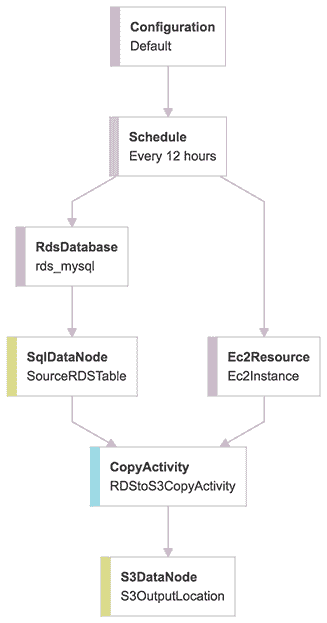

# 借助 AWS 数据管道和 Athena |云专家扩展数据分析

> 原文：<https://acloudguru.com/blog/engineering/affordable-and-scalable-data-analytics-on-amazon-web-services-using-athena-and-data-pipeline>

如果你正在使用亚马逊网络服务，或者只是在某种程度上关注他们的服务产品，你不能错过他们最新推出的分析服务。这是一个非常符合[最近无服务器云计算](https://acloudguru.com/blog/engineering/whats-this-serverless-thing-anyway)趋势的工具。本质上只是计算，而不必自己分配基于云的资源。

## AWS 雅典娜是什么？

AWS Athena 与 Google 的 [BigQuery](https://cloud.google.com/bigquery/) 一样，是一个无服务器的工具，用于查询大数据集，而无需设置物理或虚拟机集群。在 AWS 领域，比较公平的说法是，Athena 对于 EMR 就像 Lambda 对于 EC2 一样。

您有很多限制，只能执行非无服务器选项所能执行的部分任务。但是一旦你真的考虑到这些限制，你就可以构建一些以非常低的价格交付结果的东西。

## 雅典娜在工作

我们决定将我们为立法者意识形态所做的一些计算移植到我们对 Athena 的应用中，目标是能够更好地扩展和削减成本。

Statehill 使用 AWS 来衡量政府的影响，并将其转化为可操作的情报，以帮助您有效地进行宣传

> [Statehill 将世界各地的立法数据联系起来，以发现](https://statehill.com/product/)，分析和衡量政府对你的影响。我们首先收集立法信息并将其组织成可操作的情报，以提高您有效倡导的能力。

从本质上说，我们正在做的是获取历史投票记录，并确定立法者在一些类别上倾向于共和党还是民主党。我们目前正在美国多个州开展这项工作，包括蒙大拿州、T2、得克萨斯州和威斯康星州。


Ideology for Alan Redfield (R), Montana legislator in the 65th session

* * *

*对升级或开始云数据之旅感兴趣吗？云专家的 [AWS 数据学习路径](https://acloudguru.com/learning-paths/aws-data)提供适合初学者和高级专家的定制课程！*

* * *

## 如何将数据移动到 AWS 数据管道

首先，我们必须得出结论，我们可以只用 SQL 来完成这项任务，因为这就是你查询 Athena 的方式。一旦我们确定了这一点，我们的第一步就是将数据以 CSV 格式从 RDS 实例发送到 S3，这样我们就可以在 Athena 中创建一个表。还有[你如何定期有效地将数据从 RDS](https://acloudguru.com/course/introduction-to-amazon-rds) 发送到 S3？明明用的是数据管道！



**数据管道是一种非常强大的瑞士军刀式服务，**得益于调度，它可以成为运行重复性数据转换任务的可行选项，甚至仅用于计算任务。这就是我们最终用它来查询 Athena 的原因。

Athena 乍一看可能只是一个图形用户界面。但是您仍然认为可以使用 AWS SDK 运行查询吗？没那么快，在 GUI 之外实际运行查询的唯一方法是使用 JDBC 和使用 [Athena 驱动程序](http://docs.aws.amazon.com/athena/latest/ug/connect-with-jdbc.html)进行连接。

因此，为了让我们定期查询 Athena，我们最终再次使用了数据管道，但这一次的目标是运行一个 *ShellCommandActivity* 来准备在 S3 的查询结果，然后再将其发送回我们的 RDS 实例。

## 使用数据管道查询 Athena

为了实现这一点，我们必须用 Java 1.8 构建一个定制的 AMI(默认的 EC2 AMI 是 1.7)，构建一个可以连接到 Athena 的小 Java 类，运行查询，然后在指定的位置输出结果。现在我无论如何都不是一个好的 Java 开发人员，但是我可以到处走走。最后，我们得到了类似这样的结果(大致基于 AWS 提供的示例):

```
statement = conn.createStatement();
ResultSet rs = statement.executeQuery(sql);
ResultSetMetaData rsmd = rs.getMetaData();
CSVWriter writer = new CSVWriter(
  new FileWriter(outputLocation),
  ',',
  CSVWriter.NO_QUOTE_CHARACTER,
  CSVWriter.NO_ESCAPE_CHARACTER
);
while (rs.next()) {
  String[] entries = new String[rsmd.getColumnCount()];

  for (int i = 1; i < rsmd.getColumnCount() + 1; i++) {
    entries[i — 1] = rs.getString(i);
  }
  writer.writeNext(entries);
}
```

这工作得非常好，因为`sql`变量和`outputLocation`实际上来自`args`，我们可以为将来的查询重用同一个类，并且简单地复制管道。

[](https://acloudguru.com/blog/engineering/your-aws-terminology-cheat-sheet)

Final setup, now serving data for our customers in production

### 结论

Athena 是一个非常强大的工具,我建议你看看它。这是一种运行分布式查询的廉价而快速的方法，现在它为我们的应用程序提供生产数据。每 TB 数据扫描费用为 5 美元，大数据处理的准入门槛已显著降低。

当然有一些方法可以改进我们的设置，几乎总是有的。但是最主要的事情可能是将我们在 Athena 中查询的 CSV 文件替换为拼花文件，以节省成本并提高查询性能。关于这一点，Mark Litwintschik 写了一篇关于 Athena [here](http://tech.marksblogg.com/billion-nyc-taxi-rides-aws-athena.html) 的比较不同数据格式的精彩文章，我推荐阅读。

* * *

## 提升您的云计算职业生涯

无论您是云新手还是经验丰富的专家，云专家都能让您轻松(而且非常棒)地获得认证并掌握现代技术技能。查看 ACG 目前的免费课程或立即开始免费试用。

* * *