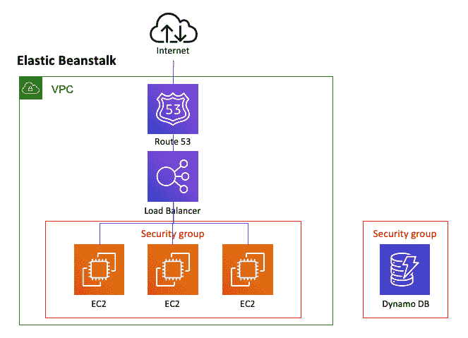
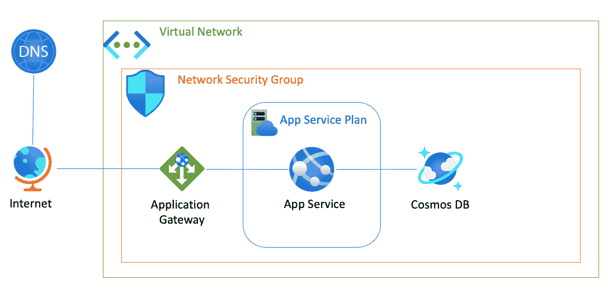

# Azure AWS 用户指南

> 原文：<https://acloudguru.com/blog/engineering/an-aws-users-guide-to-azure>

熟悉 AWS，但希望尝试 Azure？你并不孤单。虽然 AWS 是顶级的公共云提供商，但越来越多的开发人员、管理人员和云奇才都想尝试一下贝佐斯打造的云。

但是如何优雅地从 AWS 迁移到 Azure 呢？我以为你不会问了！(事实上，我*认为*你可能会问，所以我写了下面的博客来为 AWS 用户和 [AWS 管理员](https://acloudguru.com/course/intro-to-azure-for-aws-admins)指导 Azure。请继续。)

*想了解更多关于 Azure 认证的信息吗？*
*查看我们的 [Azure 认证和学习路径。](https://acloudguru.com/azure-cloud-training)*

* * *

### 在云计算专家的指导下边做边学

学得更快。动作快点。借助 AWS、Azure、Google Cloud 和 Linux 中的课程和实际动手实验室，立即实现转型。

* * *

### 名称又能代表什么呢用天蓝色，少废话

从内心来说，我是一名 Azure 开发人员，所以我将从迁移到 Azure 的最佳部分开始。命名。只是。。。有道理。如果你想创建一个新的虚拟机，你可以创建一个(等等)“虚拟机”需要储物？这就是所谓的“存储”需要自动化服务吗？是的，你猜对了。这叫做“自动化”

将 Azure 与 AWS 进行比较并不是苹果与苹果之间的比较，但至少有了 Azure 服务，你可以肯定 10 次中有 9 次你的苹果会被称为“苹果”，而不是听起来像新克里斯托弗·诺兰电影的东西。(我看着你呢，推论。)

“但是 Cosmos DB 和 CycleCloud 呢？”你可能会问。是的，是的。规则总有例外。但是当谈到 Azure 时，更多时候命名的关键是考虑服务做什么——而不是愚蠢的名称营销可以想象出来的。(旁注:可悲的是，这种直截了当的命名并没有延续到 Azure cert 考试令人困惑的命名惯例中。)

### 我如何创建一个可伸缩的、高度可用的 web 应用程序来轻松地进行持续集成？

为了回答这个问题，AWS 创造了 Elastic Beanstalk。如果您接触 AWS 有一段时间了，您可能知道如何使用 Elastic Beanstalk 或 EB 来创建 web 应用程序。(是的，我上面关于 AWS 命名的观点仍然有效。)

AWS 提出的 EB 的标准架构如下所示:

记住这一点，让我们将其转换为 Azure。首先，一个小表格显示了我们需要的服务和位在 AWS 和 Azure 之间的“转换”:

| 部分 | 自动警报系统 | 蔚蓝的 | 评论 |
| --- | --- | --- | --- |
| **网络应用** | 弹性豆茎 | 应用服务 | Elastic Beanstalk 是许多服务的包装器。App Service 是代码部署到的实例。 |
| **托管环境** | EC2 实例 | 应用服务计划 | 应用服务计划定义了用于托管应用服务的资源(VM)。 |
| **数据库** | 迪纳摩 DB | CosmosDB | 两者都是 NoSQL 数据库服务。 |
| **网络** | 虚拟私有云 | 虚拟网络 | – |
| **安全** |  |  | – |
| **域名服务** | 53 号公路 | 域名服务器(Domain Name Server) | – |
| **负载平衡器** | 弹性负载平衡 | 应用网关 | 应用服务的负载平衡器是应用网关。对于虚拟机，您将使用 Azure 负载平衡器。 |
| **资源组** | 如果你喜欢的话 | 你一定有(用你最好的德国口音说) | [AWS 资源组](https://acloudguru.com/hands-on-labs/using-aws-tags-and-resource-groups)是 AWS 中可选的资源分组。在 Azure 中，所有资源必须存在于一个资源组中。 |

当我们将这些 Azure 组件放在一起创建一个 web 应用程序时，我们会得到一个类似这样的架构:

这两种实现并没有很大的不同。主要区别在于，在 AWS 上，弹性 Beanstalk 实现是组成 web 应用程序的所有服务的包装器。对于 Azure 来说，应用服务是你的代码被部署到的应用的实际实例。

### 这总是一个简单明了的映射，对吗？

不，抱歉，不是。我特意选择了一个简单的 web 应用程序场景，因为它很常见，是一个很好的通用用例。云架构的每一个实现都是不同的。我的观点是，AWS 上用于常见计算场景的大多数服务都可以在 Azure 上找到。我的建议是查看 Azure 的参考架构图中与您的 AWS 场景最接近的部分。这些非常有助于为您指明正确的方向并了解该领域的服务范围(即，使用容器将涉及 ACR、ACI、AKS 等)。)

选择适合您的工具通常与您使用的云计算提供商没有多大关系。我的建议是永远选择最适合你的工具。如果你是那个喜欢 Vim 的人，那就利用它。(虽然我们不能成为朋友。)

你为 AWS 使用的大多数工具对 Azure 来说是一样的。然而，Azure 专业人员倾向于使用一些工具。还有什么比在漂亮的桌子上分享细节更好的方式呢？我知道你也喜欢这些。

| 工具 | 自动警报系统 | 蔚蓝的 |
| --- | --- | --- |
| 编写代码 | Visual Studio 代码 | Visual Studio 代码 |
| 代码工具 | AWS SDK | Azure SDK |
| Line Use 指令 | AWS CLI | Azure CLI |
| 代码提交 | 开源代码库 | 开源代码库 |
| 基础设施脚本 | 云的形成 | PowerShell |
| 定义部署 | YAML | YAML |

你可以看到重叠非常明显。从 AWS 到 Azure 的主要区别是用于定义基础设施的 PowerShell(Azure nerds*1000 ve*)和 Azure CLI。

### 从 AWS 切换到 Azure 有多难？

想知道你是否应该冒险一试？与其说是跳水，不如说是轻微的水花。如果您对 AWS 和云计算有相当的了解，那么许多服务、概念和架构都是非常相似的。如前所述，命名非常直接(大多数情况下)，并且这些工具具有一些共性。然而，ACG 提供了几个 Azure 动手实验室和认证学习路径，包括 T2 AZ-900。

您是否希望开始使用 Azure——在涉足之前获取一些信息？也许你在问自己，“self，[为什么我要获得 Azure 认证](https://acloudguru.com/blog/engineering/why-should-i-get-an-azure-certification)？”或者你可能很好奇[哪种 Azure 认证适合你](https://acloudguru.com/blog/engineering/which-azure-certification-is-right-for-me)。我们已经为你提供了大量的 Azure 课程和资源来帮助你入门，包括大量关于 Azure 的免费课程，从对 Azure 核心概念的[介绍](https://acloudguru.com/course/az-900-microsoft-azure-fundamentals-2020)，到 Azure 架构设计，以及 Azure 的[身份和访问管理](https://acloud.guru/learn/17e4d37f-5a2a-4840-81a7-c2884425c576)。

所以继续吧。制造轰动。蔚蓝海岸见。