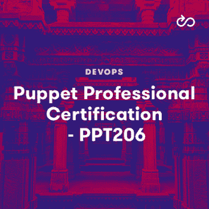

# Ansible vs Puppet:哪个适合你？

> 原文：<https://acloudguru.com/blog/engineering/ansible-vs-puppet-which-is-right-for-you>

作为 DevOps 工程师、系统管理员和开发人员，我们经常需要在一致的、可重复的服务器上工作。特别是对于 DevOps 工程师和管理员来说，他们可能要管理数千台服务器，他们需要进行更改，并以一致的配置一次配置多台服务器，这是最重要的，而且我们基础架构的可靠性往往取决于此。

这个问题的答案以无数配置管理平台的形式出现，这些平台让我们定义我们想要的配置任务或最终状态，然后使用这些定义在运行它们的任何服务器上进行一致的更改。其中两个平台是 [Ansible](https://acloudguru.com/course/ansible-quick-start) 和 [Puppet](https://acloudguru.com/course/puppet-quick-start) 。

| **可回答的** | **木偶** | **写于** |
| 计算机编程语言 | Ruby，C++，Clojure | **架构** |
| 控制节点；SSH 上的无客户端 | 服务器/客户端，其中客户端必须得到服务器的批准 | **安装过程** |
| 仅安装在控制节点上 | 较长的安装过程；安装在服务器和客户端上的软件包 | **配置管理语言** |
| 亚姆 | PuppetDSL，带有 YAML 数据存储 | **CM 语言风格** |
| 程序的 | 宣言的 | **易用性** |
| 现有 YAML 知识有帮助；剧本是以面向用户的方式编写的 | PuppetDSL 基于 Ruby，但却是自己的领域特定语言；Puppet 更面向系统 | **可扩展** |
| 是的，在任何可以输出 JSON 的语言中 | 是的，用红宝石 | **特性** |
| 资源调配、配置管理、应用部署、持续交付、流程编排、自动化 | 资源调配、配置管理、补救、协调、自动化、事件驱动的自动化、法规遵从性 | 一目了然 |

## Ansible 是一个配置管理、云供应和应用程序部署工具，用 Python 编写，由 Red Hat 维护。对于配置管理，用户编写[基于 YAML 的任务列表，称为“剧本”，](https://acloudguru.com/course/ansible-playbooks-deep-dive)描述配置服务器相关部分的步骤。

Ansible 不需要在我们配置的服务器上下载额外的包，只需要将 Ansible 安装在它的控制节点上——这是我们的 Ansible 剧本和模块的主要来源。

为了管理我们的基础设施，我们将创建清单文件，这是包含我们所需服务器的 DNS 或 IP 信息的简单列表，Ansible 使用 SSH 来访问这些服务器，并在我们的行动手册运行时进行更改。

Ansible 是可扩展的，用户也可以编写自己的模块，这些模块提供了可以在剧本中使用的功能。虽然 Python *是 Ansible 的母语，但为了使用方便，这些模块可以用任何支持 JSON 的语言编写。*

Ansible 是开源的，虽然是一个企业产品，Ansible Tower，它增加了仪表板、基于角色的访问控制(RBAC)、作业调度、集成通知和图形化库存管理。

木偶一瞥

## Puppet 是一个用 C++、Clojure 和 Ruby 编写的自动化和配置管理平台，由 Puppet，Inc. [维护。配置管理](https://acloudguru.com/blog/engineering/how-to-get-rid-of-configuration-drift-with-puppet)以声明的方式完成，其中用户通过基于 Ruby 的 PuppetDSL 描述所需的最终状态。

Puppet 是幂等的，manifests 可以写成跨平台的。这些结束状态描述然后被映射到运行“pupept-agent”服务的批准的服务器。

与 Ansible 不同，Puppet 使用客户机-服务器架构，您需要在 Puppet 管理的任何服务器上安装 Puppet 代理。然后，客户机服务器必须在 Puppet 服务器上被接受，Puppet 服务器是我们管理 Puppet(以及 Puppet 执行下的服务器)的主要服务器。

***使用 Puppet 却不想自己编写模块？***

* * *

*尝试使用 [Puppet Forge](https://acloudguru.com/hands-on-labs/using-modules-from-the-puppet-forge) 的动手实验室，这是一个由 PuppetLabs 托管的在线存储库，存储在 Puppet 基础设施中使用的公共模块。*

Puppet 也是可扩展的，尽管您将在 Ruby 中实现这一点。

* * *

Puppet 有一个开源产品，但是 [Puppet Enterprise](https://acloudguru.com/hands-on-labs/installing-puppet-enterprise) 增加了广泛的仪表板、RBAC、云供应和合规性。

比较 Puppet 和 Ansible:它们有什么不同？

## 哪种解决方案最适合您(如果有！)最终取决于你的目标。

易用性

### Ansible 的设置很快，行动手册是用熟悉的用户友好语言 YAML 编写的。这意味着用户通常可以比 Puppet 更快地掌握它，PuppetDSL 使用了一种与 Ruby 相近的语言。由于其客户端-服务器架构，Puppet 的设置速度也较慢，并且需要花费时间来批准任何受管节点(或者自动批准节点)。

灵活性

### 但是速度和易用性并不是我们在选择配置管理平台时应该考虑的唯一方面。Puppet 的清单有一个 Ansible 的剧本所没有的优势:Ansible 的剧本本质上是一个必须按顺序运行的命令列表，Puppet 的清单和模块是可重用的部分，可以按任何顺序运行，并且可以模块化使用。

Puppet 还每 15 分钟运行一次“puppet apply ”(或您设置的任何时间),确保您的服务器全天处于强制执行状态。这有助于 Puppet 不仅作为一个合规性审计工具工作，而且作为一个合规性自动化工具工作。

平台成熟度

### Puppet 也有成熟的好处:Puppet 比 Ansible 大七岁。然而，Ansible 有 Red Hat 的支持，而 Puppet 由它自己的私人公司所有——作为一个 Puppet 用户，我发现这是一件喜忧参半的事情。

Ansible 长期以来有一个明确的目标和精确的实现:在离开一段时间后重新投入 Ansible 并不困难。然而，有时候感觉就像是一个傀儡用户站在不断变化的地面上。我开始用木偶 3 和木偶 4 来玩木偶。回到 Puppet 6，没有使用过 Puppet 5，感觉就像从头开始重新学习 Puppet，这是我没有预料到的，也是其他配置管理平台没有的体验。

看看[木偶 5.5](https://puppet.com/docs/puppet/5.5/type.html) 和[木偶 6.22](https://puppet.com/docs/puppet/6.22/type.html) 之间的资源类型数量的差异就是证据——木偶 5.5 有 48 个，而木偶 6.22 和更高版本有 12 个。这并不意味着这些变化是不好的，但 Puppet 在其生命周期中已经发生了许多实质性的变化，人们可能会考虑到这些变化。

木偶和天使哪个更好？

Are you a Puppet pro? Get ready for the 206 Puppet Professional cert at ACG with [16 hands-on labs](https://acloudguru.com/course/puppet-professional-certification-ppt206).

## 不可能说出哪个平台更好，您只能确定哪个平台更适合您的需求。除了考虑上述差异之外，在做出任何决定之前，一定要花时间亲自了解这两个平台。你也可以根据自己的需要考虑其他选择，比如厨师，盐，甚至 Terraform。

最终，这两个平台都是高度可扩展的，提供自动化和云供应功能，并提供广泛的企业产品和支持。Ansible 的入门门槛较低，而 Puppet 的 DSL 可能需要更多的时间来学习，以换取强大的声明性语言。在启动和运行您的配置管理时，这两者都是强有力的候选者。

Elle Krout 曾是多家公司的技术作家，在过渡到 DevOps 并成为技术培训师之前，技术作家不仅仅是写作。她已经在 DevOps 上编写并发布了超过 11 门课程，包括[木偶](https://acloudguru.com/course/puppet-professional-certification-ppt206)、[盐](https://acloudguru.com/blog/engineering/getting-started-with-salt)、YAML，以及她个人最喜欢的[正则表达式深潜](https://acloudguru.com/course/mastering-regular-expressions)。

*Elle Krout was a technical writer at various companies where technical writers do more than write before transitioning to DevOps and working as a technical trainer. She has written and released over eleven courses on DevOps, including [Puppet](https://acloudguru.com/course/puppet-professional-certification-ppt206), [Salt](https://acloudguru.com/blog/engineering/getting-started-with-salt), YAML, and her personal favorite, a [regular expressions deep dive](https://acloudguru.com/course/mastering-regular-expressions).*