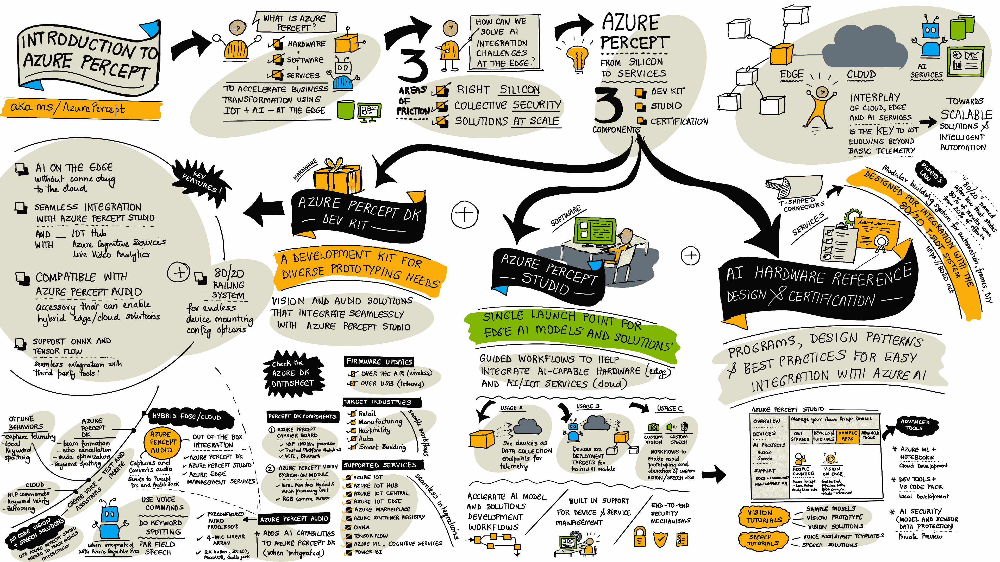

# 边缘的人工智能:构建按需物联网技能

> 原文：<https://acloudguru.com/blog/engineering/artificial-intelligence-at-the-edge-building-in-demand-iot-skills>

在这篇博文中，我们将谈论 AI 在边缘以及为什么它对开发者很重要；Azure 生态系统中支持应用人工智能和物联网的核心技术；以及如何开始了解[微软 Azure](https://acloudguru.com/blog/engineering/what-is-microsoft-azure) 和物联网，并提高物联网应用人工智能的技能。

## 物联网技能需求量很大

物联网的全球市场正在呈指数级增长，从 2020 年的 2500 亿美元增长到 2025 年的 1.6 万亿美元。在物联网中使用人工智能是[确定的增长趋势之一](https://www.researchnester.com/reports/ai-in-iot-market/3317)，对三种技能的需求不断增长:

*   处理大量物联网数据(MLOps、分析)
*   大规模集成基于云的智能(认知服务、物联网中心)
*   部署更多支持人工智能的物联网设备(物联网边缘)

作为开发人员，这对您意味着什么？这意味着需要具有人工智能经验和知识的物联网工程师——现在是提高技能的最佳时机。

在这篇博客文章中，我们将重点关注边缘人工智能的主题，并为您留下一些很好的资源来启动您的物联网探索，包括来自微软 Learn 的官方课程内容，以及可以帮助您获得 AZ-220 Azure 物联网开发人员认证的云专家资源。

这篇文章旨在帮助:

*   让每个人都知道相关资源
*   为物联网初学者开启物联网学习之旅
*   面向物联网从业者的物联网人工智能技术技能

让我们开始吧！

* * *

### 成为 Azure 物联网开发者

亲自动手了解 Azure 物联网解决方案基础设施，并与 ACG 一起准备[微软 Azure 物联网开发人员(AZ-220)考试](https://acloudguru.com/course/azure-iot-solution-infrastructure-az-220-course-1)。

* * *

## **什么是边缘的人工智能？**

**边缘的人工智能**是一个新兴领域，它结合了人工智能的最新突破和[机器学习](https://acloudguru.com/course/introduction-to-machine-learning)来驱动硬件解决方案，这些解决方案通常需要接近实时的关键任务洞察力，而不需要完全连接到互联网。

这些独立的解决方案通常由硬件加速器件驱动，但也可以在微型微控制器上使用。

人工智能在边缘的主题是#JulyOT 的主题之一，31 天的内容和项目旨在激励那些对物联网感兴趣的人在物联网领域追求个人项目，并与社区分享他们的学习成果以激励他人。(在[微软物联网技术社区](https://aka.ms/julyot)查看#JulyOT 帖子，了解更多信息。)

## Azure Percept 的可视化指南

[Azure Percept](https://docs.microsoft.com/en-us/azure/azure-percept/?WT.mc_id=iot-21003-cxa) 是由微软的*硬件、软件和服务*组成的新兴家族，旨在加速在边缘使用物联网和人工智能的业务解决方案的创新和部署。

下面的视觉指南提供了 Azure Percept 核心组件(开发工具包、工作室和最佳实践)的摘要，并强调了其探索遥测之外的物联网场景的**芯片到服务**方法。

微软的 [#JulyOT 内容](https://aka.ms/julyot)涵盖了广泛的这些场景，特别关注来自微软的 [Azure Percept DevKit](https://docs.microsoft.com/en-us/azure/azure-percept/overview-azure-percept-dk?WT.mc_id=iot-21003-cxa) ，使用由 NVIDIA 硬件支持的[转移学习策略来增强机器学习模型，以及使用来自 Edge Impulse 的微控制器和机器学习解决方案开发的](https://techcommunity.microsoft.com/t5/internet-of-things/train-smarter-with-nvidia-pre-trained-models-and-tao-transfer/ba-p/2528400?WT.mc_id=iot-20412-cxa) [AI 驱动的鼻子](https://www.youtube.com/watch?v=ZT_YpIG7L-I)。

探索围绕“人工智能在边缘”的完整系列内容——从学习核心应用人工智能概念，到探索使用 Azure 服务的代码的全功能项目。

#### 边缘的物联网和人工智能学习资源

## 30 天学会它:初学者友好型！

既然你已经意识到应用人工智能对于物联网的价值，那么让我们谈谈资源，让你作为一个绝对初学者开始你自己的物联网之旅。

我们希望通过 [Azure 物联网开发者之旅](https://aka.ms/iotlearningjourney)挑战您，强化您对 Azure 物联网服务的了解，该旅程旨在指导学习者寻求成为[认证的 Azure 物联网开发者](https://docs.microsoft.com/en-us/learn/certifications/exams/az-220?WT.mc_id=iot-21003-cxa)。

需要进一步激励吗？试试“ [30 天学习 It 云技能挑战](https://developer.microsoft.com/en-us/offers/30-days-to-learn-it?challenge_option=6437124F-B20B-4840-9715-CFD6D3F25C89?WT.mc_id=iot-21003-cxa)”，这是一个限时促销活动，挑战你通过完成来自[微软在线学习平台](https://learn.microsoft.com/?WT.mc_id=iot-21003-cxa#/)的[策划的一系列互动学习](https://docs.microsoft.com/en-us/users/cloudskillschallenge/collections/n52yhn0emjx0?WT.mc_id=cloudskillschallenge_6437124F-B20B-4840-9715-CFD6D3F25C89?WT.mc_id=iot-21003-cxa)模块来学习和应用你的 Azure 物联网知识。

注册参加本次挑战，如果您在 30 天内完成指定的模块，您可能有资格**获得 50%的折扣券，以参加官方 [AZ-220 物联网开发人员认证考试](https://docs.microsoft.com/en-us/learn/certifications/exams/az-220?WT.mc_id=iot-21003-cxa)** 。

以下是你将在这个 [Azure 物联网开发者集合](https://docs.microsoft.com/en-us/users/cloudskillschallenge/collections/n52yhn0emjx0?WT.mc_id=cloudskillschallenge_6437124F-B20B-4840-9715-CFD6D3F25C89?WT.mc_id=iot-21003-cxa) (18 个模块，15 个小时)中学习到的内容:

| 1.[实现数字化转型](https://docs.microsoft.com/en-us/learn/modules/enable-digital-transformation/?WT.mc_id=cloudskillschallenge_6437124F-B20B-4840-9715-CFD6D3F25C89%3FWT.mc_id%3Diot-21003-cxa&ns-enrollment-type=Collection&ns-enrollment-id=n52yhn0emjx0&WT.mc_id=iot-21003-cxa)–了解什么是*数字化转型*以及它如何帮助推动使用云、人工智能和物联网的商业解决方案。 |
| 2.[微软 Azure 物联网战略和解决方案](https://docs.microsoft.com/en-us/learn/modules/azure-iot-strategy-and-solutions/?WT.mc_id=cloudskillschallenge_6437124F-B20B-4840-9715-CFD6D3F25C89%3FWT.mc_id%3Diot-21003-cxa&ns-enrollment-type=Collection&ns-enrollment-id=n52yhn0emjx0&WT.mc_id=iot-21003-cxa)—了解更广阔的 *Azure 物联网前景*—它提供的工具和服务，以及如何使用它来构建和部署物联网解决方案。 |
| 3.[Azure 物联网中心](https://docs.microsoft.com/en-us/learn/modules/introduction-to-iot-hub/?WT.mc_id=cloudskillschallenge_6437124F-B20B-4840-9715-CFD6D3F25C89%3FWT.mc_id%3Diot-21003-cxa&ns-enrollment-type=Collection&ns-enrollment-id=n52yhn0emjx0&WT.mc_id=iot-21003-cxa)简介——了解如何使用 Azure 物联网中心和组件服务部署和管理*大规模物联网*解决方案。 |
| 4.[了解如何作为 IT 管理员管理物联网设备](https://docs.microsoft.com/en-us/learn/modules/manage-iot-devices/?WT.mc_id=cloudskillschallenge_6437124F-B20B-4840-9715-CFD6D3F25C89%3FWT.mc_id%3Diot-21003-cxa&ns-enrollment-type=Collection&ns-enrollment-id=n52yhn0emjx0&WT.mc_id=iot-21003-cxa)——了解如何配置 Azure 物联网中心、注册和运行物联网设备——以及*为您的组织管理物联网部署*。 |
| 5.[创建您的第一个 Azure IoT Central 应用](https://docs.microsoft.com/en-us/learn/modules/create-your-first-iot-central-app/?WT.mc_id=cloudskillschallenge_6437124F-B20B-4840-9715-CFD6D3F25C89%3FWT.mc_id%3Diot-21003-cxa&ns-enrollment-type=Collection&ns-enrollment-id=n52yhn0emjx0&WT.mc_id=iot-21003-cxa)–通过构建一个 *Azure IoT Central 应用*来监控和指挥冷藏车，获得实践学习机会–学习如何导航 Azure IoT 门户网站！ |
| 6.[Azure IoT Edge](https://docs.microsoft.com/en-us/learn/modules/introduction-iot-edge/?WT.mc_id=cloudskillschallenge_6437124F-B20B-4840-9715-CFD6D3F25C89%3FWT.mc_id%3Diot-21003-cxa&ns-enrollment-type=Collection&ns-enrollment-id=n52yhn0emjx0&WT.mc_id=iot-21003-cxa)简介——了解 *IoT Edge* ，它的功能和组件，以及它解决的问题。了解何时以及如何在您的物联网解决方案中使用这一点。 |
| 7.[lambda arch 实现简介。物联网解决方案](https://docs.microsoft.com/en-us/learn/modules/introduction-lambda-architecture-iot-solutions/?WT.mc_id=cloudskillschallenge_6437124F-B20B-4840-9715-CFD6D3F25C89%3FWT.mc_id%3Diot-21003-cxa&ns-enrollment-type=Collection&ns-enrollment-id=n52yhn0emjx0&WT.mc_id=iot-21003-cxa)—了解*混合 lambda 物联网架构* —探索 Azure 存储服务选项(Blob、Data Lake、Cosmos DB)和分析(时序洞察)服务，并了解何时以及如何使用它们。 |
| 8.[探索&利用时间序列洞察](https://docs.microsoft.com/en-us/learn/modules/explore-analyze-time-series-insights/?WT.mc_id=cloudskillschallenge_6437124F-B20B-4840-9715-CFD6D3F25C89%3FWT.mc_id%3Diot-21003-cxa&ns-enrollment-type=Collection&ns-enrollment-id=n52yhn0emjx0&WT.mc_id=iot-21003-cxa)分析带时间戳的数据——了解如何收集、处理、存储、分析和查询—*您的大规模物联网数据，利用该服务的洞察*。 |
| 9.[通过设备配置服务](https://docs.microsoft.com/en-us/learn/modules/securely-provision-iot-devices-at-scale-with-device-provisioning-service/?WT.mc_id=cloudskillschallenge_6437124F-B20B-4840-9715-CFD6D3F25C89%3FWT.mc_id%3Diot-21003-cxa&ns-enrollment-type=Collection&ns-enrollment-id=n52yhn0emjx0&WT.mc_id=iot-21003-cxa)安全、大规模地自动配置物联网设备——创建一个*设备配置服务(DPS)* 来安全处理多个远程设备。 |
| 10.[通过物联网中心将数据路由到 Azure Stream Analytics 中的内置 ML 模型来识别异常情况](https://docs.microsoft.com/en-us/learn/modules/data-anomaly-detection-using-azure-iot-hub/?WT.mc_id=cloudskillschallenge_6437124F-B20B-4840-9715-CFD6D3F25C89%3FWT.mc_id%3Diot-21003-cxa&ns-enrollment-type=Collection&ns-enrollment-id=n52yhn0emjx0&WT.mc_id=iot-21003-cxa)—创建一个模拟传送带振动的应用程序。用它来探索路由，*异常检测。* |
| 11.[用 Azure 物联网 Hub](https://docs.microsoft.com/en-us/learn/modules/remotely-monitor-devices-with-azure-iot-hub/?WT.mc_id=cloudskillschallenge_6437124F-B20B-4840-9715-CFD6D3F25C89%3FWT.mc_id%3Diot-21003-cxa&ns-enrollment-type=Collection&ns-enrollment-id=n52yhn0emjx0&WT.mc_id=iot-21003-cxa) 远程监控设备——以“*监控&控制*奶酪洞里的温度/湿度”为场景，打造物联网 app(设备)+服务(云)。 |
| 12.[通过 Azure 物联网中心](https://docs.microsoft.com/en-us/learn/modules/automate-iot-devices-management-with-azure-iot-hub/?WT.mc_id=cloudskillschallenge_6437124F-B20B-4840-9715-CFD6D3F25C89%3FWT.mc_id%3Diot-21003-cxa&ns-enrollment-type=Collection&ns-enrollment-id=n52yhn0emjx0&WT.mc_id=iot-21003-cxa)实现物联网设备管理自动化——学习使用物联网中心简化复杂的物联网*设备管理流程*(例如，设备组的固件更新)等。 |
| 13.[通过警报和指标](https://docs.microsoft.com/en-us/learn/modules/manage-azure-iot-hub-with-metrics-alerts/?WT.mc_id=cloudskillschallenge_6437124F-B20B-4840-9715-CFD6D3F25C89%3FWT.mc_id%3Diot-21003-cxa&ns-enrollment-type=Collection&ns-enrollment-id=n52yhn0emjx0&WT.mc_id=iot-21003-cxa)管理您的 Azure 物联网中心——了解*指标、警报、诊断*和日志。使用振动遥测作为用例来创建物联网中心应用程序并测试警报&指标。 |
| 14.[将预建模块部署到边缘设备](https://docs.microsoft.com/en-us/learn/modules/deploy-prebuilt-module-edge-device/?WT.mc_id=cloudskillschallenge_6437124F-B20B-4840-9715-CFD6D3F25C89%3FWT.mc_id%3Diot-21003-cxa&ns-enrollment-type=Collection&ns-enrollment-id=n52yhn0emjx0&WT.mc_id=iot-21003-cxa)——以预建温度模拟器模块为例，*将其部署到物联网边缘设备*(在容器中)并查看模拟数据(在门户中)。 |
| 15.[设置物联网边缘网关](https://docs.microsoft.com/en-us/learn/modules/set-up-iot-edge-gateway/?WT.mc_id=cloudskillschallenge_6437124F-B20B-4840-9715-CFD6D3F25C89%3FWT.mc_id%3Diot-21003-cxa&ns-enrollment-type=Collection&ns-enrollment-id=n52yhn0emjx0&WT.mc_id=iot-21003-cxa)–了解物联网网关提供的功能，并演示如何将*物联网边缘设备配置为网关*。 |
| 16.[在 Azure IoT Central](https://docs.microsoft.com/en-us/learn/modules/set-up-rules-take-actions-telemetry-data-azure-iot-central/?WT.mc_id=cloudskillschallenge_6437124F-B20B-4840-9715-CFD6D3F25C89%3FWT.mc_id%3Diot-21003-cxa&ns-enrollment-type=Collection&ns-enrollment-id=n52yhn0emjx0&WT.mc_id=iot-21003-cxa) 中设置规则并对遥测数据采取行动——基于冷藏卡车示例(在#5 中)，*创建规则和行动*以响应自动化的遥测输入。 |
| 17.[使用 REST API 管理物联网中央应用](https://docs.microsoft.com/en-us/learn/modules/manage-iot-central-apps-with-rest-api/?WT.mc_id=cloudskillschallenge_6437124F-B20B-4840-9715-CFD6D3F25C89%3FWT.mc_id%3Diot-21003-cxa&ns-enrollment-type=Collection&ns-enrollment-id=n52yhn0emjx0&WT.mc_id=iot-21003-cxa)–介绍如何以编程方式*管理您的物联网应用*–添加设备模板、创建设备、设置属性、发送命令… |
| 18.[设置从 Azure IoT Central 到 Power BI 应用程序](https://docs.microsoft.com/en-us/learn/modules/continuously-export-data-from-iot-central-power-bi/?WT.mc_id=cloudskillschallenge_6437124F-B20B-4840-9715-CFD6D3F25C89%3FWT.mc_id%3Diot-21003-cxa&ns-enrollment-type=Collection&ns-enrollment-id=n52yhn0emjx0&WT.mc_id=iot-21003-cxa)的连续数据导出–基于冷藏车示例(#5、#16)将*连续数据导出*添加到 Azure Blob 存储&活动中心。 |

## **处于边缘的人工智能:专业化道路**

上述学习路径提供了一组精心策划的模块，以 Azure 驱动的技术启动您的物联网学习之旅。如果您已经对物联网生态系统有所了解，那么请探索本节中的模块，积累您在边缘应用人工智能方面的知识和经验。

该内容由微软与牛津大学合作创建，包括牛津大学官方[人工智能:云和边缘实现](https://www.conted.ox.ac.uk/courses/artificial-intelligence-cloud-and-edge-implementations)课程中使用的模块。使用来自地球上最好的程序之一的材料学习一个复杂的主题——并把你对人工智能的兴趣带到下一个水平。

查看此集合，开始行动— [点击此链接，获得以下路线图的互动版本](https://markmap.js.org/full#?d=gist:37605e89098512713f5d6641ca3abba9&WT.mc_id=iot-21003-cxa)，更详细。

想要快速入门吗？探索下面确定的简介模块，以及将认知服务与物联网解决方案集成的两个选项——在后端(由 Azure 功能触发，在云中)或在物联网边缘设备上(在云上创建，部署到边缘)。

## **总结和后续步骤**

物联网生态系统正在快速发展，物联网和人工智能/人工智能领域的开发人员技能对于支持下一代物联网部署和解决数据处理、认知服务集成和边缘智能领域的应用人工智能挑战至关重要。

想提高自己的技能为这次挑战做好准备吗？以下是您可以采取的一些措施:

请关注我们团队的下一篇博客文章，该文章专门关注“初学者、学生、教师和创客”，由一个惊人的 24 课课程和实践项目(以及 Seeed Studio 的相关工具包/捆绑包)组成。

下次见，黑客快乐！

#### 关于作者

*[保罗·迪卡洛](https://twitter.com/pjdecarlo)是微软资深云开发者，致力于物联网、操作系统、容器和 Kubernetes。Nitya Narasimhan 对此文亦有贡献。*

* * *

## Azure 您在云中的成功

获得认证，掌握现代技术技能，提升您的云计算职业生涯-无论您是新手还是经验丰富的专业人士。和 ACG 一起边做边学。