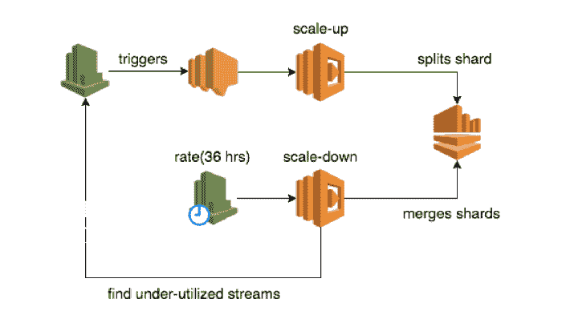
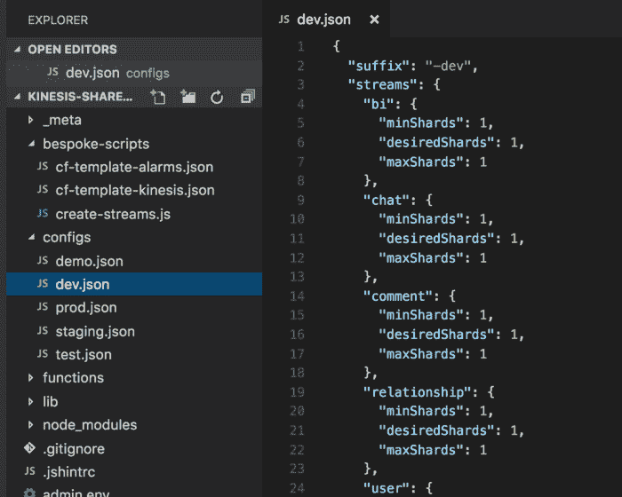

# Kinesis 数据流:使用 AWS Lambda 自动扩展|云专家

> 原文：<https://acloudguru.com/blog/engineering/auto-scaling-kinesis-streams-with-aws-lambda>

#### 使用 Lambda 函数创建自动缩放 Kinesis 流的经济高效的解决方案的方法

在我的[上一篇文章](https://read.acloud.guru/aws-lambda-3-pro-tips-for-working-with-kinesis-streams-8f6182a03113)中，我们讨论了有效使用*λ*和 *Kinesis 的 3 个有用技巧。*现在让我们来看看如何使用 *Lambda* 作为自动缩放 Kinesis 流的经济高效的解决方案。

*DynamoDB* 和 *Kinesis* 的自动缩放是 AWS 最常被要求的两个功能——当我写这篇文章时，我确信 AWS 的人们正在努力实现它。在此之前，以下是您如何自己推出经济高效的解决方案。

从高层次来看，我们希望:

*   快速扩展 *Kinesis* 流以满足负载的增加
*   缩减未充分利用的 *Kinesis* 流以节省成本

## 自动缩放 Kinesis 数据流

反应时间对于扩大规模很重要。根据个人经验，我发现轮询 *CloudWatch* 指标是一个糟糕的解决方案。原因如下:

*   云观察指标通常会落后一分钟以上
*   根据轮询频率，反应时间甚至更慢
*   高轮询频率对成本的影响很小

> 在决定实施我们自己的解决方案之前，我用 AWS 实验室的 [*Kinesis* 缩放工具](https://github.com/awslabs/amazon-kinesis-scaling-utils)进行了简单的实验。我发现它的扩展速度不够快，因为它使用了这种轮询方法，而且我在使用 [dynamic-dynamodb](https://github.com/sebdah/dynamic-dynamodb) 时也遇到过类似的问题。

相反，考虑使用基于推送的方法，使用 *CloudWatch 警报*。虽然 *CloudWatch Alarms* 不能作为 *Lambda* 功能的触发器，但您可以使用 *SNS* 作为代理:

1.  添加一个 *SNS* 话题作为 *CloudWatch 报警*的通知目标
2.  将 *SNS* 主题作为[触发器添加到*Lambda*函数中，以放大触发警报的流](https://acloudguru.com/hands-on-labs/setting-up-lambda-functions-with-s3-event-triggers)

## 触发自动缩放的指标

您可以使用多个[指标](http://docs.aws.amazon.com/streams/latest/dev/monitoring-with-cloudwatch.html)来触发缩放操作。这里有几个需要考虑的指标。

`**WriteProvisionedThroughputExceeded**`(流)

最简单的方法是一旦你被限制住了就扩大规模。使用[流级别度量](http://docs.aws.amazon.com/streams/latest/dev/monitoring-with-cloudwatch.html#kinesis-metrics-stream)，您只需为每个流设置一次警报，无需在每次缩放操作后调整阈值。然而，由于您正在重用同一个 *CloudWatch* 警报，您必须记得在扩大规模后将其状态设置为 *OK* 。

`**IncomingBytes**`和/或`**IncomingRecords**`(流)

您可以通过计算调配的吞吐量，然后将警报阈值设置为调配吞吐量的 80%，来抢先进行扩展(在您实际受到服务限制之前)。

毕竟，这正是我们在扩展 EC2 集群时要做的，同样的原则也适用于此——当您可以提前扩展时，为什么要等到受负载影响时再扩展呢？但是，我们需要管理 EC2 自动扩展服务中包含的一些额外的复杂性:

*   如果我们对`IncomingBytes`和`IncomingRecords`都发出警报，那么如果两者几乎同时触发，就有可能扩大规模(影响成本)。这可以缓解，但我们有责任确保一次只能发生一个扩展操作，并且在每个扩展操作之后都有一个冷却过程
*   在每次扩展活动之后，我们需要重新计算调配的吞吐量并更新警报阈值

`**WriteProvisionedThroughputExceeded**`(碎片)

`**IncomingBytes**`和/或`**IncomingRecords**`(碎片)

有了[分片级别的指标](http://docs.aws.amazon.com/streams/latest/dev/monitoring-with-cloudwatch.html#kinesis-metrics-shard)，你就可以知道分片 ID(在 *SNS* 消息中)的好处，这样你就可以通过分割特定分片来更精确地向上扩展。缺点是你必须在每次缩放操作后添加或删除 *CloudWatch* 警报。

## 如何放大 Kinesis 流

要真正放大一个 *Kinesis* 流，你需要通过分割一个或多个现有碎片来增加活动碎片的数量。需要记住的一点是，一旦一个碎片被一分为二，它就不再是`Active`——但它仍然可以被访问长达 7 天(取决于您的*保留策略*设置)。

概括地说，你有两种选择:

1.  使用 [UpdateShardCount](http://docs.aws.amazon.com/kinesis/latest/APIReference/API_UpdateShardCount.html) 并让 Kinesis 找出如何做
2.  选择一个或多个碎片，并使用 [SplitShard](http://docs.aws.amazon.com/kinesis/latest/APIReference/API_SplitShard.html) 自行分割

*选项 1 — UpdateShardCount —* 要简单得多，但这种方法有一些沉重的负担:

*   因为它目前只支持`UNIFORM_SCALING`，这意味着这个动作会导致许多临时碎片被创建，除非你每次都加倍。
*   在大规模情况下，加倍可能非常昂贵，而且根据负载模式可能没有必要
*   另外，还有很多其他的限制

*选项 2 —分割碎片—* 使用碎片级别指标来仅分割已触发警报的碎片。一个简单的策略是按照散列范围对碎片进行排序，并首先分割最大的碎片。

## 如何缩小 Kinesis 流

要缩小 *Kinesis* 流，只需[合并](http://docs.aws.amazon.com/kinesis/latest/APIReference/API_MergeShards.html)两个相邻的碎片。正如分割一个碎片会留下一个不活动的碎片，合并碎片会留下两个不活动的碎片。

由于缩减规模主要是为了节约成本，我**强烈建议**不要过于频繁地缩减规模。相反，如果你在缩小规模后很快又不得不扩大规模，你很容易就会增加成本——从而留下许多不活跃的碎片。

由于我们不想频繁地缩减规模，因此使用 cron 作业(即 *CloudWatch 事件*+*λ*)比使用 *CloudWatch 警报*更有意义。经过反复试验，我们决定每 36 小时缩减一次，这是我们 24 小时保留策略的 1.5 倍。

## 如何确定缩小哪个 Kinesis 流

当 cron 作业运行时，我们的 *Lambda* 函数将遍历所有的 Kinesis 流，对于每个流，我们将:

*   根据每秒字节数和每秒记录数计算其调配的吞吐量
*   获取过去 24 小时内的 5 分钟指标(`IncomingBytes`和`IncomingRecords`)
*   如果过去 24 小时内的所有数据点都低于调配吞吐量的 50%，则缩减数据流

我们采用 5 分钟指标的原因是因为这是 *Kinesis* 仪表板使用的粒度，允许我验证我的计算。请记住，您不会直接从 *CloudWatch* 获得`bytes/s`和`records/s`值，而是需要自己计算它们。

此外，我们要求过去 24 小时内的所有数据点低于 50%阈值。这有助于我们绝对确定利用率水平始终低于阈值，而不是可能由停机导致的暂时现象。

当考虑缩小 Kinesis 流的方法时，你会有与扩大相同的权衡——在使用 [UpdateShardCount](http://docs.aws.amazon.com/kinesis/latest/APIReference/API_UpdateShardCount.html) 和自己使用 [MergeShards](http://docs.aws.amazon.com/kinesis/latest/APIReference/API_MergeShards.html) 之间。

### 包扎

为了设置一个流的初始 *CloudWatch 警报*，我们使用了一个 repo 来托管我们所有 *Kinesis* 流的配置。repo 包含一个脚本，用于使用 *CloudFormation* 模板创建任何丢失的流和相关的 *CloudWatch 警报*。

*   每个环境都有一个配置文件，详细说明需要创建的所有 Kinesis 流，以及每个环境的最小和最大碎片数。
*   还有一个 create-streams.js 脚本，可以运行该脚本来创建环境中任何缺少的流，并具有所需的碎片数量。
*   该脚本还将使用 CloudFormation 模板创建相关的 CloudWatch 警报。
*   配置文件还指定了每个 *Kinesis* 流的最小和最大碎片数。当 create-streams 脚本创建一个新的流时，它将使用指定的`desiredShards`数量的碎片来创建。

我希望你喜欢这篇文章——如果你正在做类似于自动缩放你的 *Kinesis* 流的事情，请分享你的经验，并在评论中告诉我！

### 想要更多 AWS good？看看这些: