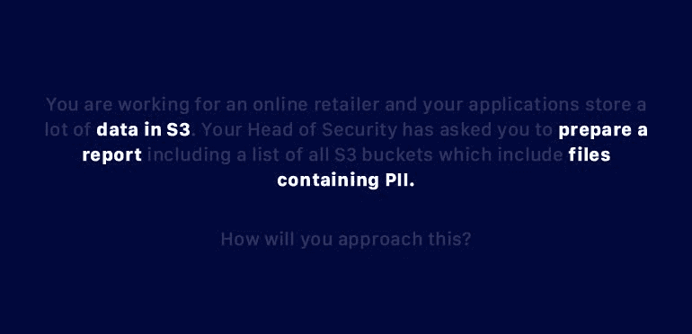
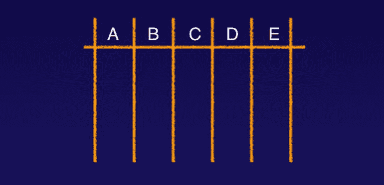
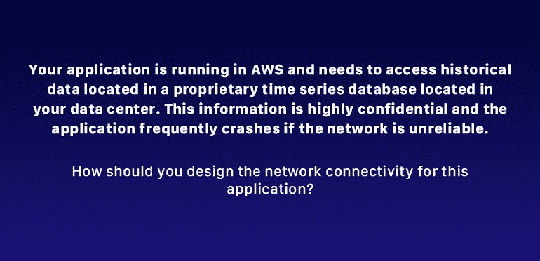
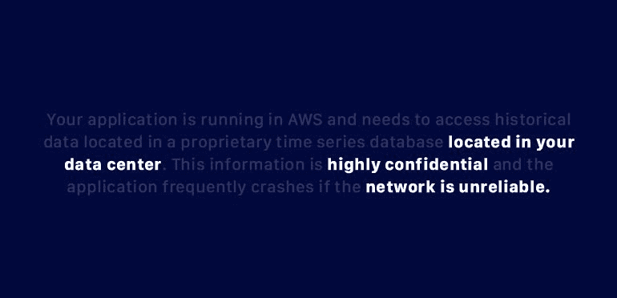

# AWS 认证安全专业考试备考指南

> 原文：<https://acloudguru.com/blog/engineering/aws-certified-security-speciality-exam-prep-guide>

准备任何 AWS 认证考试都可能会很艰难！这需要时间，需要专注，而且当您从助理升级到专业和专业级证书时，需要对 AWS 服务以及它们如何协同工作有更深入的了解。在 Cloud Guru，我们设计认证课程来帮助您掌握通过考试所需了解的主题。但我们也发现，提前知道要期待什么可以帮助你学习一门课程，甚至可以给你更好的机会第一次通过考试。

在本帖中，我们将了解 AWS 认证安全专家考试，它涵盖的内容，您需要了解的内容，您可以在哪里找到其他资源，以及您实际参加考试时可以使用的策略。

在这篇博文中，我们将讨论:

*   考试的内容范围
*   如何解决那些烦人的选择题
*   帮助你提高学习技能的小贴士
*   非常有用的亚马逊资源

在我们开始之前，先简单说一下实践经验:它是无可替代的。我们是人类，我们在实践中学习。把它想象成学习烹饪，或者自己做康普茶。你可以观看所有的 YouTube 视频，但除非你走进厨房，感受一下如何使用食材，把一切都搞得一团糟，然后从另一边走出来，否则你不会掌握这些新技能。在实际的 AWS 环境中，你花越多的时间去应用、测试、破坏和修正你将要学习的技能，你在考试时就会做得越好。

* * *

##### 获得认证之外的更多

加入云专家的行列，访问我们所有的课程、实验室、测验和新的学习路径，让您在所选的云领域逐步从新手成为专家。

* * *

### **获得 AWS 认证的大好时机**

为什么要获得 AWS 认证？尽管听起来有些夸张，但这是进入 AWS 安全专业领域的最佳时机。对于新的 AWS 安全专家来说，市场已经完全成熟了！以下是为什么现在是获得这种认证的最佳时机的一些原因:

巨大的需求。云计算的需求不用我说也知道，公司都渴望找到有丰富云安全背景的 IT 专业人士。

巨大的技能差距。在亚马逊安全知识方面，全球存在巨大的技能缺口，这为那些获得认证的人提供了大量无限的机会。

地位的提升。获得认证表明您是 AWS 中首屈一指的云计算专家。这是一个在你自己的组织中引起注意的可靠方法，也是雇主和招聘人员寻找拥有这种高水平专业知识的工程师的方法。

更高的薪水。据*福布斯*报道，[获得 AWS-cloud 认证的人的平均工资](https://www.forbes.com/sites/louiscolumbus/2019/02/11/15-top-paying-it-certifications-in-2019/#23bab2f33e7c)接近 15 万美元。因此，通过考试并在正确的时间展示你拥有正确的技能是值得的。

### **有用的资源**

我们明白了。准备 AWS 安全专业考试的前景充满压力。但你不必单干。有大量的支持工具和资源，其中许多是免费的，可以补充你准备考试时所做的一切，例如使用工具、参加我们的课程以及磨练你的考试技巧。

以下是三个值得一试的优秀资源:

**亚马逊的** [**白皮书**](https://aws.amazon.com/whitepapers/) **:** 这些白皮书涵盖了 AWS 安全专业考试的方方面面。诚然，它们读起来就像番茄酱瓶子背面的成分一样有趣。但它们还是无价的。实际上，您会非常感谢花大量时间阅读这些白皮书。

**AWS re:发明视频:**你可以在 Youtube 上找到一堆这样的[视频](https://aws.amazon.com/blogs/security/tag/reinvent/)。很多都很短，你可以在午餐时间观看。如果你已经熟悉一个主题，你可以通过以双倍速度快速浏览来节省时间。

**亚马逊的** [**常见问题解答**](https://aws.amazon.com/faqs/) **:** 你可以找到一个丰富的常见问题解答列表，其中讨论了准备 AWS 安全专业考试所需熟悉的所有技术。

### **AWS 安全专业领域**

AWS 考试分为 5 个内容领域或领域:

*   事故响应
*   记录和监控
*   基础设施安全
*   识别访问管理(IAM)
*   数据保护。

亚马逊没有给每个领域同等的权重——有些领域包含的问题比其他领域多——所以你要相应地分配你的学习时间。下面，你会在每个域名旁边看到一个百分比。这会让你知道每个主题分配了多少个问题。当然，您会想花更多的时间来研究百分比较高的领域。

#### **领域 1:事故响应(12%)**

该领域包括安全事件的检测、响应和恢复。您必须熟悉两个非常常见的安全问题:受损的 EC2 实例和暴露的访问和秘密访问密钥。让我们逐一深入研究一下:

*   **受损的 EC2 实例** —本节介绍如果您的一个 EC2 实例受损该怎么办。(一些示例包括更改您的安全组、删除互联网访问，或者隔离受危害的 EC2 实例，使其无法危害其他任何东西。)
*   **暴露的访问密钥和秘密访问密钥** —如果访问密钥意外暴露，你会怎么做？(你会惊讶有多少人慌慌张张给我打电话说这个问题。千万不要在 GitHub 上放访问键！)本节重点介绍禁用和删除访问键，使它们不能被用来对付您，以及其他有效的解决方案。

此外，您会想要熟悉这 6 种 Amazon 安全服务:

1.  [AWS 配置](https://acloudguru.com/hands-on-labs/auditing-resource-compliance-with-aws-config)(配置管理)
2.  AWS CloudTrail (IAM 审计)
3.  亚马逊云观察(日志)
4.  亚马逊守卫(威胁检测)
5.  自动响应
6.  亚马逊检查员(基础设施安全扫描)

**→事件响应资源:**

#### **领域 2:记录和监控(20%)**

在您的 AWS 帐户中有一个有效的日志记录和监控策略是非常重要的。对于这个领域，您需要知道如何设计一个策略，并使用它来有效地解决安全问题。您想要了解的主要服务有:

**→测井&监控资源:**

#### **领域 3:基础设施安全 26%**

这是最大的领域，所以一定要花大量的时间准备。它涵盖了 AWS 中安全网络的设计和故障排除。您是否已经完成了 [AWS 认证解决方案架构师助理](https://acloudguru.com/course/aws-certified-solutions-architect-associate-saa-c02)认证？如果是这样的话，你就有优势了，因为你已经了解了基础设施的安全性，以及如何在 AWS 中设置安全的网络和虚拟私有云(VPC)资源。将您的 AWS 游戏提升到新的高度，并获得 IT 领域最具挑战性和最受尊敬的认证之一， [AWS 解决方案架构师](https://acloudguru.com/course/aws-certified-solutions-architect-professional)专业认证。

对于该领域，您需要关注以下问题:

*   边缘安全性(考虑您网络的边界)
*   EC2 实例的基于主机的安全性
*   AWS 内的 DDoS 缓解
*   防范常见攻击，如跨站点脚本(XSS)和 SQL 注入

需要熟悉的主要服务包括:

*   网络应用防火墙
*   用于 DDoS 保护的 AWS 屏蔽

有许多其他服务可以保护您的应用程序免受 DDoS 攻击，并帮助您弹性地扩展以吸收攻击。它们包括:

*   CloudFront 和 Route 53(这些有内置保护)
*   弹性负载平衡器(ELB)(VPC 的保护机制)
*   EC2 自动扩展(通过扩展您的基础设施并防止攻击中断您的服务，吸收任何类型的 DDoS 攻击)
*   VPC 和网络访问控制列表(NACL)和安全组(保护您的主机和 EC2 环境)
*   工件(向监管者证明您使用的 AWS 服务符合监管要求)
    *   [注意工件提供了各种有用的文档。例如，如果您在一个必须遵守支付卡行业数据安全标准(PCI DSS)的行业中工作，您可以登录到 Artifact 并下载证明您正在使用的 AWS 服务真正符合 PCI DSS 的文档和认证。]
*   Macie(保护存储在 S3 存储桶中的任何文档中的个人身份信息(PII)。)
    *   [它实际上扫描你所有的文件，并会让你知道是否存在任何隐藏的 PII，可能需要加密。]

**→基础设施安全资源:**

*   白皮书—该领域有大量白皮书，如“VPC 连接选项”、“DDoS 最佳实践”、“AWS 安全最佳实践”、“架构良好的框架安全支柱”和“安全流程概述”
*   视频—“VPC 连接选项”、“DDoS 最佳实践”、“高级安全大师班”和“架构完善的框架安全支柱”。
*   常见问题解答— WAF、AWS Shield、CloudFront、Route 53、VPC、ELB、EC2 自动缩放、 [Lambda](https://aws.amazon.com/lambda/faqs/) 、直连、Artifact 和 Macie。

#### **领域 4:身份和访问管理(IAM) (20%)**

本节测试您在设计和排除身份验证和授权策略故障方面的知识。您将需要对该政策有一个坚实的把握，并能够翻译和故障排除。确保您熟悉这些服务:

*   CloudTrail (IAM 审计)
*   多因素身份验证(MFA)(特别是对于根帐户)
*   活动目录联合(ADF)(包括联合对 AWS 资源的访问和内部活动目录安装)

**→ IAM 管理资源:**

*   白皮书—“安全流程概述”和“AWS 安全最佳实践”
*   视频—“IAM Policy Master”和“IAM Policy Ninja”(它们是相似的)，“AWS 的 ID Federation”(观看很重要，因为我们中的许多人通常没有太多的 ADF 实践经验，并且很难在实验室环境中复制它)
*   常见问题—“IAM”、“Cognito”(用于 web 身份联合以及与 web ID 提供商(如脸书、谷歌和亚马逊)联合访问)、“CloudTrail”和“AWS Organizations”(关于如何在组织级别设置权限)。

#### **领域 5:数据保护(22%)**

为了在这个域上进行良好的测试，您需要知道如何使用加密来保护您的数据。这包括创建和管理密钥，控制各种 AWS 服务和应用程序中的加密使用，以及设计加密策略并进行故障排除。

**特别注意关键管理服务(KMS)！我怎么强调都不为过。**请务必了解静态加密和传输中加密的区别，以及加密数据所需的不同技术。值得重复的是:尽可能多地获得 KMS 的实践经验。通过加密数据、解密数据和重新加密数据来试验这些工具。

**→数据保护资源:**

*   白皮书—“KMS 最佳实践和静态数据加密”
*   视频—“KMS 最佳实践和加密深度探讨”(内容与白皮书相同。)
*   常见问题——“KMS”(值得读两遍！这是通过这个领域的关键。)特别注意 KMS 中涉及的不同类型的钥匙以及如何旋转不同的钥匙，例如何时使用自动或手动钥匙旋转。

### **用 3 个步骤解决棘手的问题**

要击败这场考试和它的选择题，必须制定一个有效的考试策略。我们屡试不爽的策略包括 3 个简单的步骤:

1.  弄清楚问题问的是什么
2.  排除可能的错误答案
3.  选择最佳答案

关于物流的一个重要提示:你需要准备一支铅笔和一些草稿纸来完成这个策略。你参加考试的考试中心应该给你提供这些(如果他们没有，问)。但是做最坏的打算也无妨，所以我们建议你带几张白纸和几支铅笔作为备用。

在我们进入第一步之前，快速浏览一下考试，回答你 100%有把握的问题。如果你不能马上确定答案，把问题标记出来，然后继续。这是一个很好的方法，可以在早期建立一些积极的动力，并确保你把时间留给更具挑战性的问题。

**第一步:弄清楚问题问的是什么**

现在，您已经准备好处理更多标记的问题。从第一个开始，找出似乎能触及问题根源的关键词，并写在你的便笺簿上。完成后，它可能是这样的:

**第二步:排除可能的错误答案**

接下来，排除看起来不对的答案。为此，在便笺簿上用列号 A、B、C、D 和 E 绘制一个网格，如下所示:

列标题 A、B、C、D 和 E 代表该问题的答案。看一看每个答案。也许其中一个看起来不正确或部分不正确，或者它没有解决所询问的问题。对于那些可疑的答案，你将做两件事情中的一件:如果答案看起来是错的，在你的格子上的答案信下面的一栏中打一个 *X* 。如果你不确定，就打个问号。如果你发现一个答案看起来很可能是正确的，请将该栏留空。

**第三步:选择正确的答案**

在理想的情况下，当你填写完网格中的列时，你应该有一列是空白的。如果是这样，这就是你的答案。如果没有一个答案是正确的，或者你留下了一大堆的问号，那么就把答案读一遍，选出一个看起来最能回答问题的答案。继续检查问题，直到你回答了考试中的每一个问题。

* * *

##### 开始模拟你的考试

我们的考试模拟器可以让你进行所有你需要的练习，所以你可以带着不可否认的信心，甚至是一点点的狂妄自大去参加你真正的考试。

* * *

### **样题**

让我们通过解决一个示例问题来实施这个策略。这个恼人的问题可能是数据保护领域的一部分:

看完问题，我们再写下一些关键词。

我写下“位于您的数据中心”，因为这似乎很重要。我喊出了“高度机密”，这告诉我，我们可能要加密数据。最后，考虑到频繁出现的崩溃，我选择了“网络不可靠”

接下来，我将绘制我的网格并添加我的列标题 A 到 e。

现在让我们看看可能的答案，并找出哪些可以消除。

1.  使用一个 [VPC 端点](https://acloudguru.com/hands-on-labs/create-a-vpc-endpoint-and-s3-bucket-in-aws)，这样数据永远不会离开亚马逊的网络
2.  使用安全端口访问数据
3.  通过直连连接在 VPC 和数据中心之间使用 VPN
4.  在 VPC 和数据中心之间使用 VPN，并使用安全端口访问数据库
5.  配置 VPC 和数据中心之间的直接连接

答:我认为这个似乎不对，因为数据在我们自己的数据中心，而不是在亚马逊的网络中，所以我要在 a 列标记一个 *X* 。

B:这个答案似乎只回答了问题的一部分，因为它没有考虑网络延迟问题，所以我也把它去掉了，并在 B 列放了一个 *X* 。

c:这个答案似乎很好，因为我们在 VPC 和数据中心之间使用 VPN，这意味着我们的链接将被加密，我们的敏感数据将得到保护。此外，我们正在使用直接连接，这将解决我们的网络不一致的问题。所以我会把 C 列留空。

d:我们使用的是 VPN，所以我们不会以明文和安全端口发送任何信息，所以我们的数据会得到很好的保护。然而，我们不能防止网络不一致，所以如果我们再次遇到网络问题，我们的应用程序仍然处于危险之中。所以我会在那一列放一个 *X* 。

e:这个答案确实解决了我们的网络不一致性问题，但它不会保护我们的敏感数据。因为是部分回答，所以得到一个 *X* 。

现在，当我们看我们的网格，最佳答案显然是 c。

### **学习小贴士**

有许多小技巧可以用来改善你的学习习惯——以及你通过考试的机会。他们也可以帮助你弄清楚你是否真的准备好了。这会让你免去重考的痛苦。记住，我们的目标是帮助你第一次通过这个怪物。关于这些学习技巧，我还要再说一点:它们不仅能帮助你准备考试，还能帮助你日常生活。怎么会？因为它们旨在帮助你获得有价值的技能，如保持组织、做出正确的决定和加强回忆。

**→学习技巧资源:**我很喜欢托尼·布赞的书 [*学习技巧*](https://www.amazon.com/Buzans-Study-Skills-Techniques-Reading/dp/1406664898) ，推荐你买一本。发明思维导图的 Buzan 讨论了许多帮助你更高效和有效学习的技巧。

**提示 1:使用思维导图**

如果你没有使用过思维导图——或者你从来没有听说过它们——那你就有得吃了。思维导图是一种强大的、图形化的笔记工具，可以帮助你更好地记忆和分类信息。思维导图的美妙之处在于，在任何时候，你都可以瞥一眼你所创建的图表，并快速回顾你所研究的信息。这比翻阅一页又一页被黄色荧光笔覆盖的教科书要好。

思维导图包括绘制富有想象力的彩色图片来帮助你记住想法。别担心，你不必是一个艺术家来使用这个工具。同样，在你开始之前，你可能想看一个 YouTube 教程来学习思维导图的基础。

看看我为 AWS Lambda 课程创建的思维导图。首先，我在页面中央画了一幅 Lambda 的图像。接下来，我画出了分支，每个分支代表子标题故障排除、权限、无服务器、事件驱动源和功能。

你真的可以从这些事情中获得乐趣。您可以使用关键字、图像、颜色和符号来更详细地解释更广泛的概念。箭头有助于显示图表不同部分之间的关系。请记住，思维导图是一种个人体验，所以以一种对你有意义的方式来构建你的思维导图。记住，目的是帮助你记住信息——你在绘制地图时越有创造性(甚至是愚蠢的),效果越好。

**提示 2:巩固你所学的知识**

褪色的记忆是我们都容易受到影响的。事实上，研究表明，我们学完知识后很快就会忘记。根据一项研究，如果我们不复习信息，我们所学的 75%会在 24 小时内丢失！

然而，如果你坚持这个复习计划，你可以提高记忆力:在你学了新东西后，在 10 分钟内复习。然后 24 小时再复习一遍。一周后。然后 1 个月后，最后，此后每 3 到 6 个月。已经确定，如果你采取这些步骤，你可以保留 90%你所学的东西！

记住，巩固你所学的东西并不总是仅仅是复习。是的，你应该回顾你的笔记，重读白皮书，浏览视频。但是你也可以通过练习应试来挑战自己。

例如，您可以参加 AWS 安全考试的练习版。如果您是 ACG 会员，请查看我们的[考试模拟器](https://acloud.guru/exam-simulator/start?courseId)。和实物非常接近，是帮助你磨练学习技巧的绝佳工具。最后，您可以参加最近发布的考试准备培训，其中包括大量的考试问题示例。

技巧 3:设定一个目标

最后，通过设定何时参加 AWS 安全专业认证考试的目标来挑战自己。现实一点，但是不要安排的太远。请记住，这是获得 AWS 安全认证的大好时机！一旦你设定了目标，就报名参加考试。是的，这是一个难题，但是如果你使用这些提示和技巧，你第一次就有很大的机会通过。