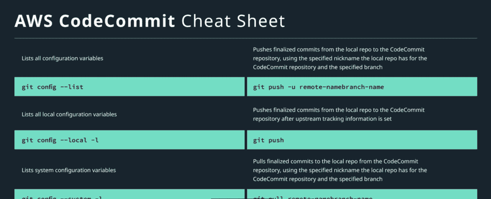

# AWS 开发人员工具概述和代码提交备忘单

> 原文：<https://acloudguru.com/blog/engineering/aws-developer-tools-overview-and-codecommit-cheat-sheet>

**什么是 AWS 开发者工具？**[AWS devo PS 专业认证考试](https://aws.amazon.com/certification/certified-devops-engineer-professional/)最近进行了更新，并对 AWS 开发人员工具套件进行了新的强调。这可能会引起新 DevOps Pro 候选人的关注。你所说的“开发者套件”是什么？我该如何开始？我要花多长时间才能赶上这只野兽？显然，没有几个迷因参考，我们就不能开始工作。所以，拿着我的啤酒，在你读这篇博客的时候保持冷静，因为这些工具的升级可能会很快。首先，我们将清楚地定义 AWS 开发人员套件，然后一点一点地分解它。AWS 开发人员工具是一套服务，旨在帮助开发人员和 IT 运营专业人员快速、安全地交付软件。总之，这些服务有助于安全地存储和版本控制您的应用程序的源代码，并自动构建、测试和部署您的应用程序到 AWS 或您的内部环境。这里有很多以开发为中心的关键词和标语:“开发运维”、“快速安全地交付软件”、“源代码”、“构建、测试、部署”。因此，开发人员套件将帮助我们自动构建和部署我们的软件？听起来很有希望，但是我们如何开始呢？**开发者工具简介**AWS 开发者工具套件提供 6 种服务:

1.  AWS 云 9
2.  AWS CodeStar
3.  [AWS X 射线](https://acloudguru.com/blog/engineering/im-here-to-tell-you-the-truth-the-good-the-bad-and-the-ugly-of-aws-x-ray-and-lambda)
4.  AWS 代码提交
5.  AWS 代码构建
6.  AWS 代码部署
7.  AWS 代码管道

*   Cloud9 是一个基于云的集成开发环境，而且是一个很好的集成开发环境。
*   CodeStar 允许您将所有部署活动整合到一个地方，并将所有其他活动与这些工具联系在一起。
*   **X 射线**允许您分析和调试您的生产应用。

因此，这些都是优秀的产品，我鼓励以后使用它们，但是为了快速提升，让我们把注意力放在其余的服务上。单独或一起使用的 AWS CodeCommit、CodeBuild、CodeDeploy 和 CodePipeline 构成了开发人员工具套件的核心服务。这些工具允许您端到端地管理应用程序的创建、构建和部署。在本系列的第一部分，我们将回顾 CodeCommit。CodeCommit 和 Git 携手并进 [CodeCommit](https://aws.amazon.com/codecommit/) 是一个完全托管的源代码控制服务，托管安全的基于 Git 的存储库。所以关键字是完全受管理的，并且是基于 Git 的。如果你知道 Git，那么你已经在了解 CodeCommit 的路上了。不要低估完全管理的部分。可以将 RDS 视为完全托管服务的一个例子。AWS 管理 CodeCommit，为您省去许多“幕后”工作，例如为 CodeCommit 提供服务器。很好，但是这和 GIT 有什么关系呢？不熟悉 Git？[查看 Git 术语解释](https://acloudguru.com/blog/engineering/git-terms-explained)。正如我们现在所知，CodeCommit 托管 Git 存储库，理解 Git 命令有助于使用 CodeCommit。现在，既然许多命令都是相同的，为什么不直接使用 Git 呢？CodeCommit 会带来哪些优势？记住，AWS 管理代码提交。CodeCommit 消除了管理您自己的源代码控制系统或扩展其基础设施的工作。没有人员来管理您的基础架构？没问题，AWS 会帮你做的。

## 让我们以备忘单的形式看看一些可以和 CodeCommit 一起使用的 Git 命令:配置变量

列出所有配置变量: `git config --list`列出所有本地配置变量:

```
 git config --local -l
```

列出系统配置变量:

```
git config --system -l
```

列出全局配置变量:

```
git config --global -l
```

远程存储库初始化本地存储库，准备将其连接到代码提交存储库:

```
git init
```

可用于在本地存储库和远程存储库之间建立连接:

```
git remote add remote-nameremote-url
```

通过在本地计算机上当前文件夹的指定子文件夹中的指定 URL 处制作 CodeCommit 存储库的副本来创建本地 repo:

```
git clone remote-urllocal-subfolder-name
```

显示了本地 repo 用于 CodeCommit 存储库的昵称:

```
git remote
```

显示了本地 repo 用于获取和推送至 CodeCommit 存储库的昵称和 URL:

```
git remote -v
```

使用本地 repo 为 CodeCommit 存储库和指定分支指定的昵称，将完成的提交从本地 repo 推送到 CodeCommit 存储库:

```
git push -u remote-namebranch-name
```

设置上游跟踪信息后，将完成的提交从本地 repo 推送到 CodeCommit 存储库:

```
git push
```

使用本地 repo 为 CodeCommit 存储库和指定分支指定的昵称，将完成的提交从 CodeCommit 存储库拉入本地 repo:

```
git pull remote-namebranch-name
```

提交显示已添加或未添加到本地存储库中的待定提交中的内容:

```
git status
```

显示本地存储库中待定提交和最新提交之间的更改:

```
git diff HEAD
```

将特定文件添加到本地存储库中的挂起提交中:

```
git add [file-name-1 file-name-2 file-name-N| file-pattern]
```

将所有新的、修改的和删除的文件添加到本地存储库中的挂起提交中:

```
git add
```

它开始在本地 repo 中完成挂起的提交，这将显示一个编辑器来提供提交消息。输入消息后，待定提交完成:

```
git commit
```

列出本地存储库中最近的提交:

```
git log
```

branches 列出本地存储库中的所有分支，在当前分支旁边显示一个星号(*):

```
git branch
```

将有关 CodeCommit 存储库中所有现有分支的信息提取到本地存储库:

```
git fetch
```

列出本地回购中的所有分支和本地回购中的远程跟踪分支:

```
git branch -a
```

仅列出本地回购中的远程跟踪分支:

```
git branch -r
```

使用指定的分支名称在本地存储库中创建新分支:

```
git branch new-branch-name
```

使用指定的分支名称切换到本地存储库中的另一个分支:

```
git checkout other-branch-name
```

使用指定的分支名称在本地存储库中创建新分支，然后切换到该分支:

```
git checkout -b new-branch-name
```

使用本地 repo 为 CodeCommit 存储库指定的昵称和指定的分支名称，将新分支从本地 repo 推送到 CodeCommit 存储库:

```
git push -u remote-name new-branch-name
```

使用指定的分支名称在本地存储库中创建新分支。然后使用本地 repo 为代码提交储存库指定的昵称和指定的分支名称，将本地 repo 中的新分支连接到代码提交储存库中的现有分支:

```
git branch --track new-branch-nameremote-name/remote-branch-name
```

将本地回购中另一个分支的更改合并到本地回购中的当前分支:

```
git merge from-other-branch-name
```

删除本地 repo 中的分支(除非它包含未合并的工作):

```
git branch -d branch-name
```

使用本地 repo 为 CodeCommit 存储库指定的昵称和指定的分支名称删除 CodeCommit 存储库中的分支:

```
git push remote-name :branch-name
```

标签列出本地存储库中的所有标签:

```
git tag
```

将所有标签从 CodeCommit 存储库中提取到本地存储库:

```
git fetch --tags
```

显示有关本地存储库中特定标记的信息:

```
git show tag-name
```

**[在这里了解更多关于 Git 的版本控制。](https://git-scm.com/book/en/v2/Getting-Started-About-Version-Control)** 使用本地 repo 为 CodeCommit 存储库指定的昵称和指定的标签名称，将特定标签从本地 repo 推送到 CodeCommit 存储库:

```
git push remote-name tag-name
```

使用本地 repo 为 CodeCommit 存储库指定的昵称，将所有标签从本地 repo 推送到 CodeCommit 存储库:

```
git push remote-name --tags
```

总而言之，对 CodeCommit 的深入研究可以作为一个备忘单供您使用。([下载到这里](https://linuxacademy.com/site-content/uploads/2019/08/AWS-CodeCommit-CheatSheet-Linux-Academy.pdf) ) [](https://linuxacademy.com/site-content/uploads/2019/08/AWS-CodeCommit-CheatSheet-Linux-Academy.pdf) 但是 AWS 开发者工具还有很多内容要介绍，所以这是一个多部分系列的第一部分。

了解如何使用 AWS 开发、部署和调试无服务器应用程序，并通过 [AWS 认证开发人员](https://acloudguru.com/course/aws-certified-developer-associate)–助理考试。本课程面向中级水平的学生，从云计算基础概述开始。然后，它将带您深入了解在 AWS 上开发、部署和维护应用程序(尤其是无服务器应用程序)的课程。