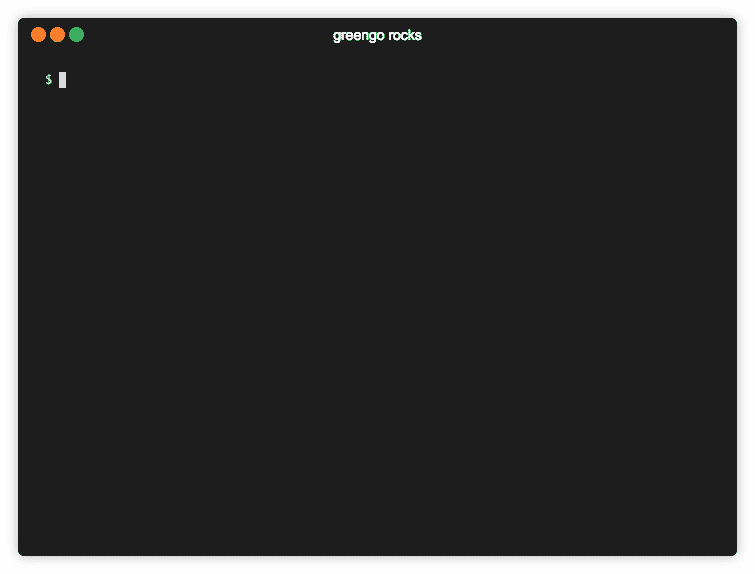

# AWS 物联网 Greengrass 提示-部署和故障排除|云专家

> 原文：<https://acloudguru.com/blog/engineering/aws-greengrass-pro-tips>

AWS 物联网 Greengrass 是一项了不起的技术:它将 AWS 云扩展到边缘，让我们能够构建跨云、边缘和本地计算的无服务器解决方案。

但是和任何新技术一样，它在某些方面仍然有点粗糙，而且不容易使用。虽然我们的 AWS 朋友们正在努力让它变得更加文明，但这里有 **10 个提示**来帮助您现在就充分利用 AWS Greengrass。快速参考:

1.  固定您的开发设置
2.  Docker 中的 Greengrass:谨慎行事(用 5 个步骤让它运转起来)
3.  基本故障排除提示—日志、部署和 lambda 位置等
4.  检查连接
5.  Lambda 函数故障排除
6.  进入 Lambda 容器
7.  将您的 Lambda 命名为快乐故障排除
8.  在本地绿草上快速修改 Lambda 代码
9.  Lambda 点播？λ长寿？都是！
10.  使用系统管理绿草生命周期

> 这些都是专业建议，假设您对 AWS Greengrass 有基本的了解，包括一些实践经验。这些技巧最适合那些用 AWS 运行真实物联网项目的人。如果您是这项服务的新手，请将此加入书签，并在查看完 [Greengrass 教程](https://docs.aws.amazon.com/greengrass/latest/developerguide/gg-gs.html)和 [AWS Greengrass 故障排除](https://docs.aws.amazon.com/greengrass/latest/developerguide/gg-troubleshooting.html)后再回来。

## AWS 物联网 Greengrass 的开发设置

有许多方法可以为不同的爱好建立一个开发环境——但是有些方法比其他方法更有效。对于第一个教程来说，通过 AWS web 控制台浏览绿草是不错的，但是在你订阅了几次之后，你会寻找更好的方法。

我更喜欢老式的本地开发，我对 GitOps 和基础设施即代码非常狂热。这影响了我的设置:

编辑器的选择，git，AWS CLI 与命名配置文件之间跳转测试和生产帐户-所有运行在我的 Mac 上。绿草核心软件安装在一个流浪的虚拟机上；所有的先决条件和安装都编在一个文件夹中。

我用 [greengo.io](http://greengo.io/) 操作绿草群作为代码。Greengo 让我将整个组(核心、订阅、策略、资源等)定义为一个简单的 YAML。然后按照定义在 AWS 中创建它，负责从本地代码在 AWS 中创建 Lambda 函数。它下载证书和配置文件，由于助手脚本，我将它们直接放入 Greengrass VM。作为奖励，`greengo`还知道清理一切！

有了这些，我可以用我最喜欢的编辑器方便地编辑 lambda 函数和 greengrass 定义。我做出改变，更新，部署，清洗，重复。我用`vagrant ssh`跳转到 Greengrasss VM 上，通过日志检查 greengrass 的健康状况，启动/停止守护进程，探索它并使用下面描述的各种技巧。

所有的工作都以代码的形式被捕获，被 git 跟踪，直接从我的笔记本电脑上传到 GitHub，并且很容易复制。GitHub 上有一个完整的代码示例——一个经过整理的 AWS ML 推理教程——供您查看和复制:[dz 亚胺/AWS-green grass-ML-推论](https://github.com/dzimine/aws-greengrass-ml-inference)。

这个设置很适合我，但这当然不是唯一的方法。你可以用 AWS 用三种常见的方法创建 Lambda 函数，并创造性地将它们扩展到你的 Greengrass 开发中。你可能会喜欢 AmazonVM 上的 Cloud9 + Greengrass，正如 Jan Metzner 在 re:Invent 2018 的 [IOT402 Workshop](https://www.portal.reinvent.awsevents.com/connect/sessionDetail.ww?SESSION_ID=89681) 上演示的那样。

如果你是 CloudFormation 模板的大师，看看优雅的 [GrassFormation](https://github.com/Neosperience/GrassFormation) 和随之而来的开发流程。无论你选择哪一个，先帮你自己一个忙——确定你的开发设置。

> 2019 年 3 月 18 日更新:AWS Greengrass [增加了对 CloudFormation 模板](https://aws.amazon.com/about-aws/whats-new/2019/03/aws-iot-greengrass-adds-new-connector-aws-iot-analytics-support-aws-cloudformation-templates-integration-fleet-indexing/)的支持。这很棒，现在你可以直接使用它，或者使用你选择的工具，比如无服务器框架或者 [SAM CLI](https://github.com/awslabs/aws-sam-cli) 。

### AWS Greengrass in Docker:谨慎行事

我在 Docker 1.7 版正式支持之前管理 Greengrass，用了几个 Docker 的招数: `devicemapper` 存储驱动代替默认的 `overlay2` ，和 `--privileged` 标志。这很有效，而且对 Greengrass 的功能没有任何限制。

但是随着 Docker，Linux 内核，和 Greengrass 的更新版本，它逐渐停止工作。我放弃了这个案子，但是你总是在[GitHub–dz 亚胺/aws-greengrass-docker](https://github.com/dzimine/aws-greengrass-docker) 碰碰运气。

现在我们可以在 Docker 容器中正式[运行 AWS 物联网 Greengrass。这是一个很大的便利，但仔细观察就会发现它更多的是一个变通办法。诚然，让 greengrass 容器在 docker 容器中运行很困难，而且不太可能适合生产。所以 AWS 引入了一个配置选项，在容器外运行 Lambdas，就像操作系统处理一样——基于每个 lambda 或每个组。](https://docs.aws.amazon.com/greengrass/latest/developerguide/run-gg-in-docker-container.html)

选择这个选项会带来[限制](https://docs.aws.amazon.com/greengrass/latest/developerguide/run-gg-in-docker-container.html):不支持连接器、本地资源访问和本地机器学习模型。嘿，损失不算大！连接器还处于起步阶段——就此而言，我更希望它们用于 Lambdas 和 StepFunctions。

当 lambdas 作为操作系统进程运行时，它们可以访问任何本地资源，因此不需要配置本地资源。一个本地 ML 栈可以很容易地定制成你喜欢的 Greengrass 图像。

> **设计考虑** 这种方法的一个更大的问题是，总的来说，[Lambdas](https://docs.aws.amazon.com/greengrass/latest/developerguide/lambda-group-config.html#lambda-containerization-considerations)的可选集装箱化，它嗅到了隐藏的依赖性——使东西变得脆弱。
> 
> 物联网工作流是关于定义云中的部署，并将其推送到一系列设备。一些设备不支持容器化的 Lambdas:无论是在 Docker 中运行的 greengrass 还是在没有容器化的受限操作系统上。从 1.7 版开始，Greengrass 说“没问题，只要一个群体选择不进行容器化，它就会运行”。但是设备并不宣传它们的能力，也没有拒绝不受支持的群组部署的防护措施。关于在什么设备上运行什么组是安全的知识必须存在于系统之外，存在于设计者的头脑中——不可否认这不是最可靠的存储。
> 
> 虽然为 Lambda 启用容器化在组定义中看似合理，但它可能会破坏部署或导致功能故障。更不用说使用和不使用容器化的运行代码在很多方面都有所不同——我确实遇到过只有在容器化时才会出现的奇怪的代码错误。
> 
> AWS 文档警告[谨慎使用该选项](https://docs.aws.amazon.com/greengrass/latest/developerguide/lambda-group-config.html#lambda-containerization-considerations)，并规定了在没有容器化的情况下运行可能值得权衡的用例。如果你想在 Greengrass 中采用 Docker，我会推荐 goling:放弃容器化，在开发和生产中使用 Docker，使用相同的容器。

### Docker 教程中的 AWS 温室

**Docker 中 Greengrass 的 5 个步骤** 如果上述限制没有阻止你使用这种方法，下面是如何用 5 个简单的步骤在 Docker 中运行 Greengrass:

1.从[云前端获取包含 Dockefile 和其他工件的压缩报告。](https://d1onfpft10uf5o.cloudfront.net/greengrass-core/downloads/1.7.1/aws-greengrass-docker-1.7.1.tar.gz) *为什么不是 GitHub？我可以把它克隆到我的 GitHub 上吗，或者说这是违反许可的吗？求 AWS* 。目前，CloudFront:

```
curl https://d1onfpft10uf5o.cloudfront.net/greengrass-core/downloads/1.7.1/aws-greengrass-docker-1.7.1.tar.gz | tar -zx
```

2.用 docker-compose 构建 docker 图像

```
cd aws-greengrass-docker-1.7.1
PLATFORM=x86-64 GREENGRASS_VERSION=1.7.1 docker-compose build
```

3.使用`greengo`创建组:将您的证书和配置放入`/certs/`和`/config`。或者死忠与 AWS 控制台，下载和整理的证书和配置。**注意:**部署必须让所有 Lambdas 选择出容器:或 API、CLI 或 greengo.yaml 定义中的`pinned=True`。

4.与坞站一起运行坞站-组合:

```
PLATFORM=x86–64 GREENGRASS_VERSION=1.7.1 docker-compose up
```

5.利润。对于任何复杂的情况，比如需要 ARM 映像或不幸在 Windows 上运行——打开 README.md，享受详细的说明。

你可能会问“为什么不在开发设置中使用 Docker，而不是一个沉重的流浪虚拟机”？你可以:我有时自己做，就像开发的试验台。

但是对于生产就绪的物联网部署，我更喜欢最能代表目标部署的环境——GG Docker 限制并不总是这样。

### AWS 温室故障排除提示

当出现问题时——很可能会出现——以下是需要检查的事项:

1.  **确认** `**greengrassd**` **已经启动**。
    查找输出中的任何错误。

```
/greengrass/ggc/core/greengrassd start
```

如果它没有启动，很可能错过了一些先决条件，您可以通过`greengrass-dependency-checker`脚本快速检查。你可以从[AWS-green grass-samples repo](https://github.com/aws-samples/aws-greengrass-samples)获得最新版本的检查器。

还有 [AWS 设备测试器](https://aws.amazon.com/greengrass/device-tester/)，这是一个较重的选项，通常由设备制造商用来认证他们的设备是否支持 Greengrass。

**2。检查系统日志是否有错误**。
看`/greengrass/ggc/var/log/system/`下，从`runtime.log`开始。AWS 文档中描述了 greengrass 功能各个方面的其他日志[。我主要看`runtime.log`:](https://docs.aws.amazon.com/greengrass/latest/developerguide/gg-troubleshooting.html#troubleshooting-logs)

```
tail /greengrass/ggc/var/log/system/runtime.log
```

这有助于将日志设置为`DEBUG`级别(默认为`INFO`)。它是通过 AWS 控制台、CLI、API 或`greengo`在 Greengrass Group 级别设置的。必须成功部署组才能应用新的日志配置。

但是，如果我正在对初始部署中的故障进行故障排除，该怎么办呢？运气不好！有一个技巧是在本地伪造一个部署，其中只有一个日志配置，但这非常麻烦；在`config.json`文件中设置会好很多。请加入我对 AWS 的提问:

**3。检查部署** 一旦您触发部署并达到“进行中”状态，当绿草握手、下载工件并重启子系统时，会在 `runtime.log` 中弹出一连串消息。部署工件本地存储在 `/greengrass/ggc/deployment` :

*   `group/group.json`–部署定义。自己探索:

```
cd /greengrass/ggc/deployment/group/
cat group.json |  python -m json.tool
```

*   `/greengrass/ggc/deployment/lambdas`–lambda 代码部署在这里。那里的内容是一个提取的 Lambda zip 包。就像在发布到 AWS 之前您的开发机器上有它一样。

**关键提示:**这些人工制品是本地绿草获取的输入。玩弄它们是创造性地摆弄绿草的好方法。

> 我热情地劝您在 Lambda 代码中编写一个深入的日志记录，并将系统和用户日志记录配置的日志级别设置为`DEBUG`。

## 检查温室部署和连接

绿草守护进程启动，但没有任何反应。部署永远停留在“进行中”状态。怎么了？很有可能是连接问题。

Greengrass 依靠 MQTT(端口 8883)进行消息传递，依靠 HTTPS(端口 443)下载部署工件。确保您的网络连接允许流量。

检查 HTTPS 是显而易见的，下面是如何测试您的 MQTT 连接( [source](https://docs.aws.amazon.com/iot/latest/developerguide/diagnosing-connectivity-issues.html:) ):

```
openssl s_client -connect \
YOUR_ENDPOINT.iot.eu-west-1.amazonaws.com:8883 \
-CAfile root.ca.pem \
-cert CERTIFICATE.pem \
-key CERTIFICATE.key
```

这不是违背了目的吗？绿草公司需要 HTTPS 拿到部署神器。如果没有办法关掉 8443，它应该如何工作？这个我没有实验过；如果您遭受过度安全的网络，请尝试并报告您的发现。

> 2019 年 3 月 10 日更新:AWS 发布了[版本 1.8](https://docs.aws.amazon.com/greengrass/latest/developerguide/what-is-gg.html#gg-core-download-tab) ，上面有一个差异:现在你也可以配置 HTTPS 使用 443。而且很管用！就在这一天，我碰巧遇到了防火墙的问题，应用了这个补丁，它真的很神奇。万岁！

## Lambda 函数故障排除

当部署成功，但似乎没有预期的事情发生时，就该看看 Lambdas 了。

检查 lambda 函数是否正在运行:

```
ps aux | grep lambda_runtime
```

查看 Lambda 日志:在`/greengrass/ggc/var/log/user/...`下潜水，直到找到它们。

一个函数可能会在创建日志文件之前崩溃:例如，由于缺少依赖项或运行时配置错误等原因，核心甚至无法启动 Lambda。

尝试手动运行 lambda:现在您已经知道它在 greengrass 设备上的本地存储位置——是的，`/greengrass/ggc/deployment/lambdas/...` —去那里运行它，观察结果。

## **进入 Lambda 容器**

Greenness 在容器中运行 lambdas(除非你[明确选择退出](https://docs.aws.amazon.com/greengrass/latest/developerguide/lambda-group-config.html#lambda-containerization-considerations))。因此，有时会发生这样的情况，当你在设备上手动启动时运行良好的功能，在 greengrass 下运行时仍然会失败。

找出你的 lambda 的 PID，用`nsenter:`进入容器

```
sudo nsenter -t $PID -m /bin/bash
```

现在，您处于 Lambda 函数的容器化环境中，可以看到和检查挂载的文件系统、对资源的访问、依赖性、环境变量——一切。

这个技巧对于固定的(长寿命的)函数来说很简单，但是常见的事件触发的 lambdas 不会长到可以跳到它们的容器中:你可能需要临时固定它们才能进入。

如果修改一个 Greengrass 组中的 lambda 定义，重新部署该组，并记住稍后切换回来感觉太麻烦，那么在设备上破解它:在`/greengrass/ggc/deployment/group`下的`group.json`的函数部分设置`pinned=True`，并重启`greengrassd`。下一次部署将重置您的本地黑客。

## 将您的 Lambda 命名为快乐故障排除

Lambda 函数和处理程序的命名约定是什么？我曾经调用我所有的 lambda 入口点`handler`并把它放在`function.py`文件中，就像这样:

```
# MyHelloWorldLambda/function.py
def handler():
    return {'green': 'grass'}
```

但是对运行 Lambda 函数的检查产生了如下输出:

```
ps aux | grep lambda_runtime
20170 ?        Ss     0:01 python2.7 /runtime/python2.7/lambda_runtime.py --handler=function.handler
20371 ?        Ss     0:01 python2.7 /runtime/python2.7/lambda_runtime.py --handler=function.handler
```

信息不太丰富，嗯？相反，考虑用 Lambda 函数名来命名处理程序或函数入口点，以获得更有洞察力的输出和更容易的故障排除。然后，为 ***提示 5*** 中的招数寻找 Lambda 进程 PID 将是轻而易举的事情。

## 在 Greengrass 上快速修改 Lambda 代码

greengrass goes 的典型开发工作流程是什么？

1.  对 Lambda 函数进行更改
2.  在本地测试
3.  将该功能部署到 AWS Lambda
4.  更新/增加别名，并确保 greengrass lambda 定义指向这个别名
5.  将群组部署到您的 greengrass 设备

完成这些步骤后，lambda 就可以被调用了。这在将最终产品代码部署到一组现场设备时非常有用。

但是在开发过程中，尤其是在调试过程中，我们经常需要尝试快速的代码更改，小到打印出一个值。整个工作流程感觉太长太麻烦了。当我们的 AWS 朋友满怀希望地致力于集成一个本地调试器时(为什么不呢？)，下面是我使用的一个快速破解方法:

*   我`ssh`到我的流浪虚拟机与绿草核心
*   转到部署文件夹
*   找到有问题的 lambda，并对其进行适当的编辑
*   重启`greengrassd`，并测试变化

如果我不喜欢更新，下一次部署将恢复更改。如果我确实喜欢更新的，我会将功能代码复制到我的本地开发环境并进行部署。

这里 [greengo.io](http://greengo.io/) 再次派上用场，处理繁琐的例程，如重新打包&上传 lambda，增加版本，更新别名，并将物联网 lambda 定义重新打印到正确的别名:所有这些都在一个简单的命令`greengo update-lambda MY_FUNCTION`之后



Update and deploy Lambda with greengo — quick and easy.

## Lambda 点播？λ长寿？都是！

AWS Greengrass 支持 Lambdas 的[两种生命周期模型:“按需”和“长寿命”。](https://docs.aws.amazon.com/greengrass/latest/developerguide/lambda-functions.html#lambda-lifecycle)

**Lambda On-Demand** 默认行为是“On-Demand ”,与云中的 Lambda 相同——这是函数被事件调用的地方。

要在 MQTT 事件上触发 Greengrass 的“按需”lambda，您需要在主题上配置一个订阅，将 lambda 函数作为目标。Greengrass 将在每个主题消息上生成函数执行，将消息作为参数传递给函数处理程序，然后函数处理程序运行不超过配置的超时时间并关闭。变量和执行上下文不会在调用之间保留。

当 Greengrass 守护进程启动时，一个“长期”的函数启动，这允许我们“锁定”一个函数，使它长期运行。这是许多用例的福音，比如视频流分析，或者协议代理，其中函数监听来自 BTLE 或 ZigBee 设备的信号，并通过 MQTT 传输它们。

保守得最好的秘密？你可以两者结合。是的，一个长寿命的函数可以按需触发。我可以用它来做好事，比如在调用之间在内存中保持一个非临界状态。

例如:我的函数用 PEWMA 算法对设备数据流运行异常检测。它必须保留几个先前的数据点来计算平均值。这些数据必须在由数据消息触发的函数执行之间保持。

要实现这一点，请将“长期”与“按需”结合起来:

1.  配置一个订阅以在接收到设备数据时触发该函数:当消息到达时，greengrass 忠实地调用带有数据有效负载的处理程序
2.  让函数长期存在:现在我可以在处理程序调用之间将状态保存在内存中。如果 Lambda 重新启动并释放状态，这没关系:算法会很快恢复，所以真正的持久性不值得麻烦。

完整的例子，请看一下我的 Greengrass [IIoT 原型](https://github.com/dzimine/gg-protocol-conversion)中的 [AnomalyCatcher 函数代码](https://github.com/dzimine/gg-protocol-conversion/blob/master/lambdas/AnomalyCatcher/function.py)。

记住，一旦 Lambda 被配置为“长期存在”，函数就不会并行运行:调用被排队，一次调用一个处理程序。检查它是否适合您的消息量，并注意您的处理程序代码，以免阻塞队列。

## 使用系统管理绿草生命周期

当你的 Greengrass 设备重启时，你会希望 greengrass 自动启动，不是吗？除非你让它成为现实。使用 systemd 管理 greengrass 守护进程的生命周期。

您需要将`config.json,`中的`useSystemd`标志修改为 true，并设置一个 [systemd](https://www.freedesktop.org/software/systemd/man/systemd.service.html) 脚本，就像这个简单示例中的那样:

```
[Unit]
Description=Greengrass Daemon
[Service]
Type=forking
PIDFile=/var/run/greengrassd.pid
Restart=on-failure
ExecStart=/greengrass/ggc/core/greengrassd start
ExecReload=/greengrass/ggc/core/greengrassd restart
ExecStop=/greengrass/ggc/core/greengrassd stop
[Install]
WantedBy=multi-user.target
```

这里是关于树莓派的详细步骤说明。如果你的 greengrass 设备支持另一个 init 系统——比如 upstart、SystemV 或 runit——查看手册并根据手册将`greengrassd`配置为守护进程。

* * *

我希望你喜欢我的 10 个绿草秘诀，并在你的物联网项目中好好利用它们。我费了些力气才弄明白:你的拍手声👏会是最好的回报。请务必访问 [AWS Greengrass 故障排除](https://docs.aws.amazon.com/greengrass/latest/developerguide/gg-troubleshooting.html)页面，并查看 [AWS 物联网 Greengrass 论坛](https://forums.aws.amazon.com/forum.jspa?forumID=254)了解更多信息。

### 想要更多 AWS good？看看这些:

* * *

*想让您的云技能和知识更上一层楼吗？从云专家的课程和学习路径开始您的学习之旅！*

* * *

请在这里为我们其他人添加**你自己的建议**。想了解更多关于物联网、DevOps 和无服务器的故事和讨论，请在 Twitter 上关注我[@ dz 亚胺](https://twitter.com/dzimine)。