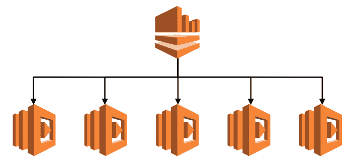
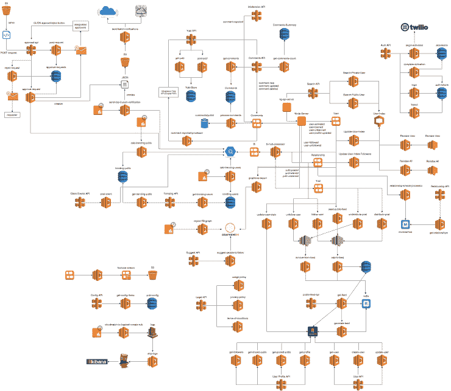
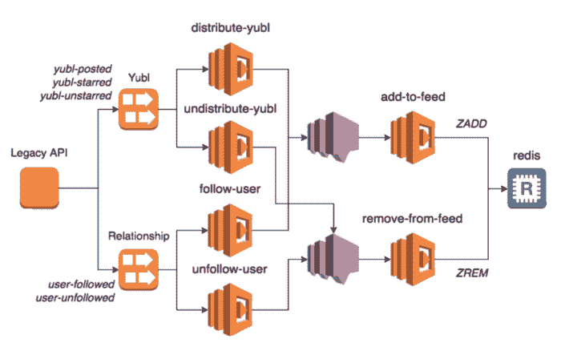
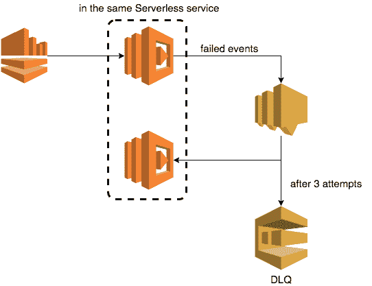
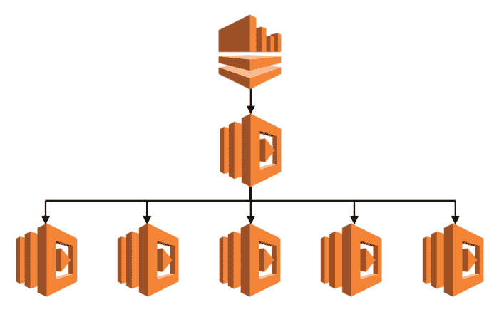

# 3 AWS Lambda 提示 Kinesis 流|云专家

> 原文：<https://acloudguru.com/blog/engineering/aws-lambda-3-pro-tips-for-working-with-kinesis-streams>

TL；DR:从我们的陷阱中吸取的教训包括考虑部分故障、使用死信队列和避免热点流

Yubl 是一款社交网络应用，其时间轴功能类似于 Twitter *。*开发团队利用了[无服务器架构](https://medium.com/@theburningmonk/yubls-road-to-serverless-part-1-overview-ca348370acde)，其中 *Lambda* 和 *Kinesis* 成为我们设计的一个显著特征。

作为设计的一部分，我们试图记住定义处理 *Kinesis* 事件的系统的特征——对我来说，这些特征必须至少具有以下三个品质:

AWS Lambda and Kinesis sitting on a tree

1.  系统应该是实时的— *如“几秒钟内”*
2.  系统应该重试失败的事件— *，但是重试不应该违反系统上的实时约束*
3.  系统应该能够检索无法处理的事件— *以便有人能够调查根本原因或提供人工干预*

Yubl had around 170 Lambda functions running in production — gluing everything together

虽然我们使用*λ*和 *Kinesis* 的体验总体来说很棒，但在这个过程中我们也必须吸取一些教训。这里有 3 个有用的提示，可以帮助你避免我们陷入的一些陷阱，并加速你自己对*和 *Kinesis* 的采用。*

### 方案 1:考虑部分故障

> AWS Lambda 轮询您的流并调用您的 Lambda 函数。因此，如果 Lambda 函数失败，AWS Lambda 会尝试**处理出错的记录批，直到数据过期** …

由于重试 *Lambda* 函数的方式，如果您允许函数在部分失败时出错，那么默认行为是重试整个批处理，直到成功或者流中的数据过期。

为了决定这种默认行为是否*适合你*，你必须回答一些问题:

1.  事件可以被多次处理吗？
2.  如果那些部分失败是持久性的呢？*也许是因为业务逻辑中的一个错误，不能很好地处理某些边缘情况？*
3.  处理每个事件直到成功比保持整个系统的实时性更重要吗？

在 *Yubl，* 的案例中，我们发现保持系统运行比暂停任何失败事件的处理更重要，即使是一分钟。

例如，当一个用户创建了一个新帖子时，我们会通过处理`yubl-posted`事件将它分发给你所有的关注者。我们面临的两个基本选择是:

1.  允许错误冒泡并使调用失败——我们给每个事件每个处理的机会；但是如果一些事件持续失败，那么没有人会在他们的提要中收到新的帖子，并且系统看起来不可用
2.  捕捉并吞咽部分失败—失败的事件被丢弃，一些用户将错过一些帖子，但系统对用户来说似乎运行正常；甚至受影响的用户可能都没有意识到他们错过了一些帖子

当然也不一定非要二选一。对于我们稍后将讨论的部分故障，有足够的空间来添加更智能的处理。

When you create a new post in the Yubl app, your content is distributed to your followers’ feeds

Yubl’s architecture for distributing a user’s posts to his followers’ feeds

我们将这两种选择封装为工具的一部分，这样我们就可以获得可重用性的好处，开发者可以为他们创建的每一个 *Kinesis* 处理器做出明确的选择

根据你要解决的问题，你可以做出不同的选择。重要的是始终考虑局部故障会如何影响整个系统。

### ProTip #2:使用死信队列(DLQ)

AWS 在 2016 年底宣布[支持死信队列(DLQ)](https://aws.amazon.com/about-aws/whats-new/2016/12/aws-lambda-supports-dead-letter-queues/) 。虽然 Lambda 对 DLQ 的支持扩展到了异步调用，如 *SNS* 和 *S3* ，但它不支持基于轮询的调用，如 *Kinesis* 和 *DynamoDB* 流。在 AWS 更新 [DLQ 功能之前，没有什么可以阻止你将这些概念应用到*Kinesis*streams yourself](https://acloudguru.com/blog/engineering/use-sns-to-retry-failed-kinesis-events)。

首先，让我们回到没有*λ*的时候。那时，我们会使用长时间运行的应用程序来自己轮询 *Kinesis* 流。见鬼，我甚至写了我自己的[生产者](https://github.com/theburningmonk/darkseid)和[消费者](https://github.com/theburningmonk/ReactoKinesix)库，因为当 AWS 推出 *Kinesis* 时，他们完全忽略了任何不在 JVM 上运行的人！

*Lambda* 已经接管了很多职责——轮询、跟踪你在流中的位置、错误处理等等。—但是正如我们上面讨论过的，这并没有让你不再需要*为自己考虑*。在使用 Lambda 之前，我的长期运行的应用程序轮询 *Kinesis* 会:

1.  事件的轮询*驱动*
2.  通过将事件传递给委托函数(您的代码)来处理事件
3.  失败的事件会重试 2 次
4.  在 2 次重试用尽之后，它们被保存到一个 *SQS* 队列中
5.  记录批处理的最后一个序列号，以便在主机虚拟机死亡或应用程序崩溃时不会丢失当前进度
6.  另一个长时间运行的应用程序将轮询 *SQS* 队列中不能实时处理的事件
7.  通过将失败的事件传递给与上面相同的委托函数来处理它们(您的代码)
8.  在最大检索次数之后，事件被传递给 DLQ
9.  这将触发 *CloudWatch* 警报，用户可以从 DLQ 手动检索事件进行调查

处理*运动*事件的*λ*函数还应该:

*   根据处理时间，重试失败事件 X 次
*   耗尽 X 次重试后，将失败的事件发送到 DLQ

由于 *SNS* 已经带有 DLQ 支持，你可以通过发送失败事件到 *SNS* 主题来简化你的设置。 *Lambda* 会再处理 3 次，然后把它传给指定的 DLQ。

Tip: Keep the functions that process Kinesis and SNS in the same service so they can share the same processing logic

### 保护 3:避免“热”流

我们发现，当一个 *Kinesis* 流有 5 个或更多 *Lambda* 函数订阅者时，我们会开始在 *CloudWatch* 中看到很多*readprovisionedthroughputexceed*错误。幸运的是，这些错误对我们来说是无声的，因为它们是由轮询流的服务处理的。

然而，我们偶尔会看到 *GetRecords 中的峰值。迭代器*度量，它告诉我们一个*λ*函数有时会落后。这种情况发生的频率不足以构成问题，但峰值是不可预测的，并且与流量峰值或传入的 *Kinesis* 事件数量无关。

增加流中碎片的数量会使事情变得更糟，readprovisionedthroughputexceed 的数量也会成比例地增加。

*根据 Kinesis* [*文档*](http://docs.aws.amazon.com/streams/latest/dev/service-sizes-and-limits.html) *…每个 shard 每秒最多可支持* ***5 个事务用于读取*** *，每秒最多可读取 2 MB 的总数据。*

*和 Lambda* [*文档*](http://docs.aws.amazon.com/lambda/latest/dg/concurrent-executions.html) *…如果你的流有 100 个活动分片，那么将有 100 个 Lambda 函数同时运行。然后，* ***每个 Lambda 函数按照事件到达的顺序处理 shard*** *上的事件。*

人们会假设前面提到的每一个 *Lambda* 函数都会独立地轮询它的 shard。因为问题是有太多的*函数轮询同一个碎片，所以添加新的碎片只会使问题进一步升级。*

> 计算机科学中的所有问题都可以通过另一种间接方式来解决。—大卫·惠勒

在与 AWS 支持团队谈过这个问题后，我们收到的唯一建议是应用**扇出**模式——通过添加另一层*λ*函数，该函数将 *Kinesis* 事件分发给其他人。

Applying the “fan out” pattern with Lambda functions and Kinesis

虽然这很容易实现，但也有一些缺点:

*   这使得处理部分故障的逻辑变得非常复杂(见上文)
*   所有的函数现在都以最慢的函数的速度处理事件，潜在地破坏了系统的实时性

我们还考虑了其他几种选择，包括

*   每个订阅者有一个流——这有很大的成本影响，更重要的是，这意味着发布者需要在一个“事务”中将同一事件发布到多个 *Kinesis* 流，没有简单的方法在部分失败时回滚，因为你不能在 *Kinesis* 中取消发布事件
*   将多个订户逻辑整合为一个——这侵蚀了我们的服务边界，因为不同的子系统被捆绑在一起，从而人为地减少了订户的数量

最终，我们没有找到一个真正令人满意的解决方案，并决定根据具体情况重新考虑 *Kinesis* 是否是我们*λ*函数的正确选择。

对于不需要实时的子系统，使用 *S3* 作为源。我们所有的 *Kinesis* 事件都是通过 *Kinesis 消防软管持续到 *S3* 的。然后，这些子系统可以使用*功能处理得到的 *S3* 文件。例如，一个这样的子系统会将事件流式传输到用于 BI 的 *Google BigQuery* 。**

对于基于任务的工作(即顺序不重要)，使用 *SNS* / *SQS* 作为来源。 *SNS* 由 *Lambda* 原生支持，我们实现了一个概念验证[架构，通过递归 *Lambda* 函数处理 *SQS* 事件，具有弹性伸缩](https://medium.com/@theburningmonk/aws-lambda-use-recursive-function-to-process-sqs-messages-part-2-28b488993d8e)。现在 *SNS* 有了 DLQ 支持，如果它的并行度不会淹没和压倒下游系统，如数据库等，它肯定会是首选。

对于其他一切，继续使用 *Kinesis* 和应用*扇出*模式作为绝对的最后手段。

## 正在总结…

好了，这就是来自一群开发者的 3 个专业技巧，他们有幸与 *Lambda* 和 *Kinesis* 广泛合作。想要更多的云好吗？看看这些:

* * *

*想要提高您的云技能和知识吗？查看云专家的[课程库](https://acloudguru.com/browse-training)，实验室和学习路径！*

* * *