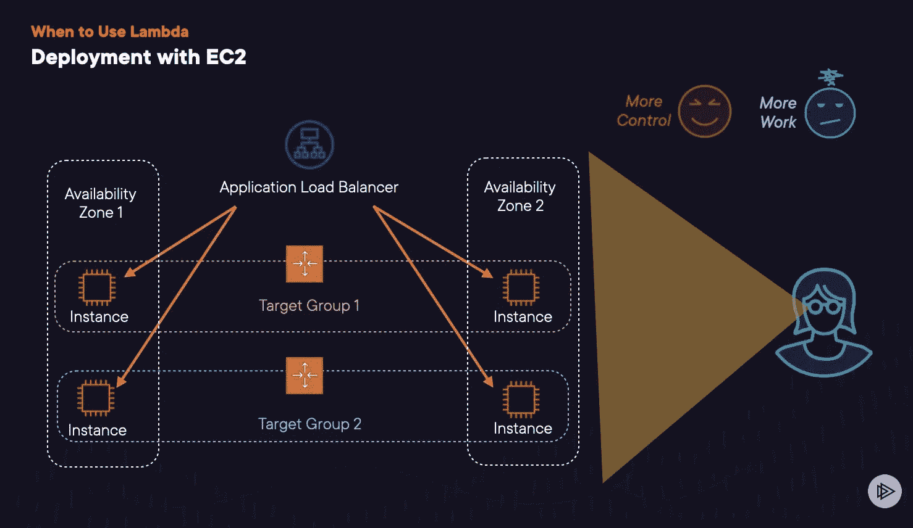
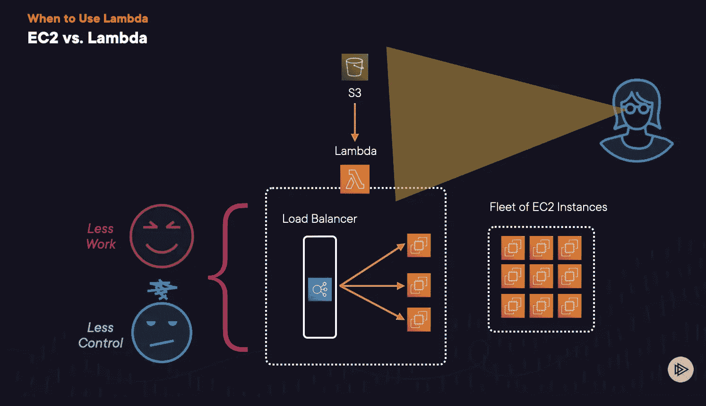
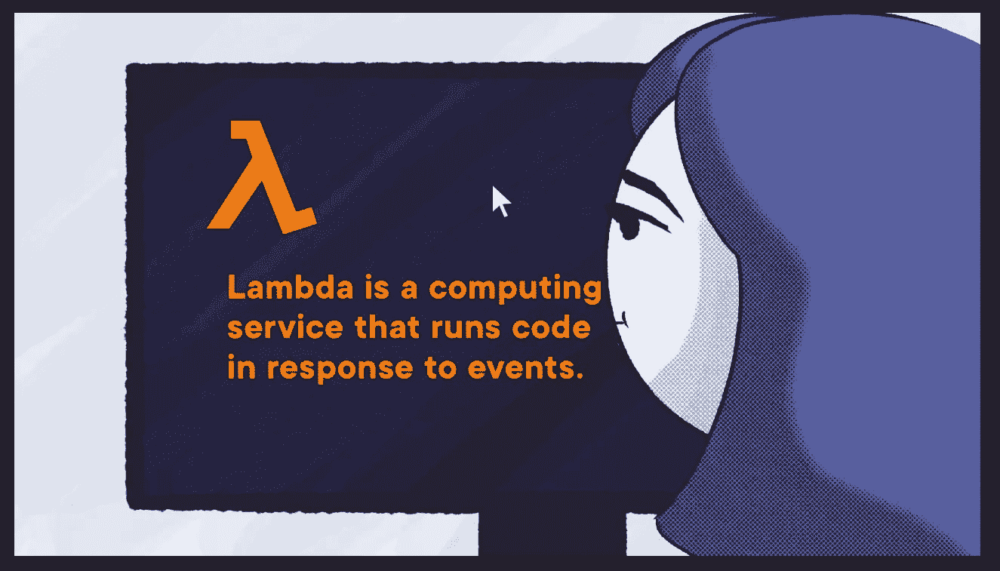
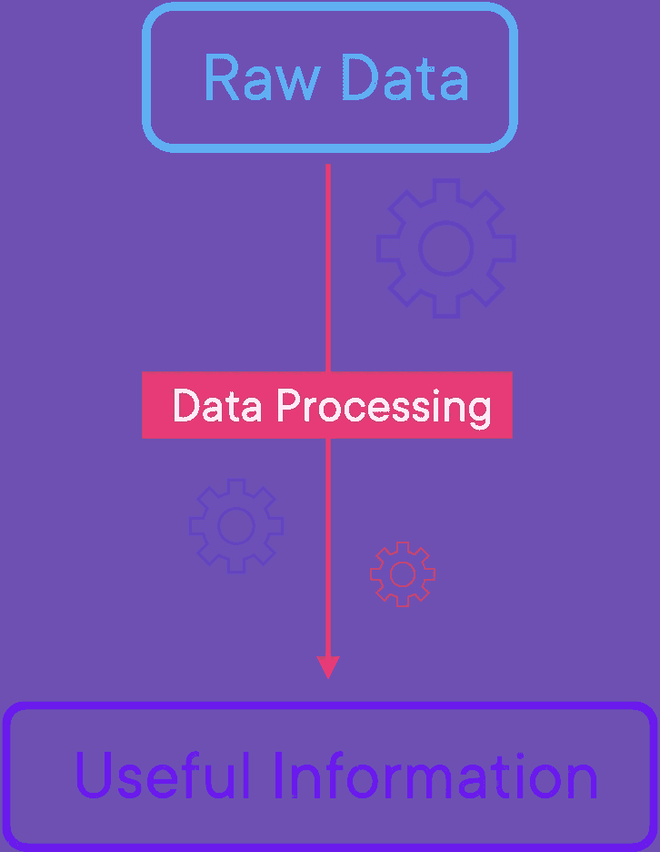
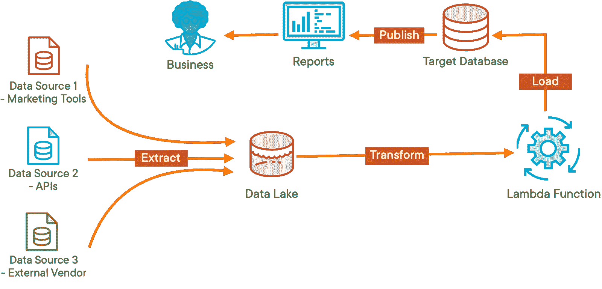

# 通过真实生活场景了解 AWS Lambda 云专家

> 原文：<https://acloudguru.com/blog/engineering/aws-lambda-tutorial>

我很兴奋地开始工作，并在没有研究可用产品的情况下，就开始绘制一个粗略的架构图。图表完成后，我继续将网站迁移到 EC2。谈论一个项目的计划不足和计划过度。

然后生活发生了变化，我决定暂停这个项目，所以我努力地从 AWS S3 取下了所有的资产和资源，除了一个静态的“即将推出”页面什么也没留下。

作为一名软件工程师，我习惯于从代码、功能和产品发布的角度来考虑项目，这也是我为什么要去掉这些特性的原因。然而，我当时的方法论并没有考虑到幕后的基础设施。或者是网站的需求发生了巨大的变化。所以我保留了 EC2 实例类型和配置。

## EC2 是给强者的

事实上，我不记得我是如何配置那个特定实例的，我不记得它是 t2.micro 还是 t2.small 实例，这表明我不应该摆弄 EC2。

然而，我清楚地记得当我看到银行对账单上列出了一笔相当大的 AWS 经常性费用时，我的困惑和惊讶。

我的困惑源于这个网站没有任何活跃的访问者。此外，我的 S3 桶几乎是空的。我以更低的成本托管了更复杂的网站，那么是什么导致了重复收费呢？

如果你是一个云计算专家，你可能已经知道 EC2 带来了很大的灵活性，而灵活性带来了更多的责任。使用 EC2 实例托管应用程序的开发人员需要对各种技术组件有深入的了解，例如:

*   如何为项目选择正确的实例类型和实例采购选项
*   如何扩展 EC2 以及如何平衡实例上的工作负载
*   如何与目标群体和应用程序负载平衡器合作
*   何时关闭实例以避免产生不必要的费用

不用说我当时的 AWS 云工具包里没有最后一个。一旦我把这些点联系起来，我意识到我完全用错了服务。

幸运的是，只需快速搜索一下，就能意识到使用 Lambda 对我的特殊需求来说是一个更好的选择。首先，我是在无服务器应用程序的“用铅笔涂鸦”版本和“在画布上水彩”版本之后。其次，我非常乐意失去细粒度的控制，将基础设施的控制权交给 AWS。我还发现，我可以轻松地将 Lambda 与 S3、AWS Amplify、亚马逊 API Gateway 和 DynamoDB 集成在一起，构建整个应用程序。

什么是 AWS Lambda？

## Lambda 是一种云计算服务，运行事件驱动的架构，这意味着外部触发器调用代码来运行它。

*   Lambda is a cloud computing service that runs an event-driven architecture, meaning that external triggers invoke the code to get it to run.

它提供了一种现收现付的模式。对于我的实验项目来说，按请求和持续时间收费比按 EC2 实例运行的每秒钟付费更有意义。

*   Lambda 还提供了对底层资源的全面而抽象的控制，从而 AWS 可以管理与底层基础设施相关的一切(例如，扩展、运行安全补丁、操作系统配置等)。).
*   Lambda 是一种功能即服务(Function as a Service，FaaS)——云计算的一个类别，它使您能够专注于构建、运行和测试响应功能(代码单元)，以构建无服务器应用程序。除了抽象底层资源的供应，AWS 还负责自动扩展应用程序以满足需求。
*   这种抽象可能会妨碍您进行某些定制。但就我而言，我不需要定制的生态系统，也不想深入到集群的粒度细节。

在 Lambda 中配置内存和执行超时对于我的项目来说已经足够了。

对于应用程序的后端，我编写并托管了健壮的代码来使用 AWS Lambda 处理数据，设置 S3 来存储数据并上传必要的文件，并通过 CloudWatch 监视日志，Lambda 会自动将日志发送到 CloudWatch。

所以我只需要三个服务来构建、托管、测试和监控一个无服务器项目的后端。

要获得全面的教程，请查看本实践教程，了解如何[构建一个无服务器的 web 应用程序](https://aws.amazon.com/getting-started/hands-on/build-serverless-web-app-lambda-apigateway-s3-dynamodb-cognito/)，该应用程序使用 AWS Lambda 和 DynamoDB 作为后端，使用 AWS Amplify 托管静态网站，使用 Amazon API Gateway 处理用户请求。

不要过于戏剧化，但我在阅读 Lambda 文档时有一种西班牙舞者表情符号的感觉，特别是经历了在 AWS 上托管一个简单应用程序的痛苦。

但是我心中的怀疑者不太喜欢这个时刻，所以我开始思考这个陷阱。我想知道 Lambda 是否只支持一组专有的语言，或者它是否有一个陡峭的学习曲线。或者它比 EC2 慢得多。

AWS Lambda 好学吗？

## Lambda 入门既简单又直接。然而，在编写非常适合 Lambda 执行环境的代码时，有一点学习曲线。作为开始，你可以试试这个 10 分钟的[“你好，世界！”10 分钟教程教程](https://aws.amazon.com/getting-started/hands-on/run-serverless-code/)自己判断。

Lambda 的简单性得益于它的关键特性，这些特性使你能够动态地编写、测试和执行代码。这些功能包括:

界面

### 您可以轻松快速地熟悉 Lambda，因为 Lambda 控制台提供了一个类似 IDE 的环境，类似于其他流行的 IDE 应用程序。GUI 有一个独特的部分用于编写和测试代码，一个选项卡用于配置应用程序，还有一个控制台用于打印结果。

功能蓝图和预构建的应用

### Lambda 控制台提供了以下三种创建新功能的方法:

从头开始创作——顾名思义，使用这个选项，您可以从头开始创建函数

*   蓝图–AWS 提供的蓝图是现成的模板，预先构建了必要的配置。你也可以使用蓝图来了解如何将 Lambda 与其他 AWS 服务和第三方库集成。
*   AWS 无服务器应用程序存储库–此选项允许您浏览以及共享预构建的应用程序。您可以公开共享应用程序，也可以与特定的 AWS 帐户私下共享。
*   支持的框架

### Lambda 原生支持多种流行语言，包括 Java、Python、Node.js、C#。NET 和 PowerShell。Lambda 还提供了一个运行时 API 来支持任何额外的编程语言，并支持[自定义运行时](https://docs.aws.amazon.com/lambda/latest/dg/runtimes-custom.html)。

层

### Lambda 层使您能够将外部库(以. zip 文件的形式)和其他依赖项导入到您的函数中。层可以是第三方库、附加代码、配置文件，甚至是定制的运行时。AWS 提供了自己的一套库，您可以立即使用。例如，他们有用于熊猫的 AWS SDK 层，您可以使用它将熊猫导入到您的函数中。

集成监控

### 默认情况下，所有 Lambda 函数都将日志导出到 AWS CloudWatch。因此，您可以使用 AWS CloudWatch Lambda Insight 指标对您的应用程序进行监控或故障排除。

Lambda 比 EC2 慢吗？

## Lambda 比 EC2 慢，因为它不会立即响应事件。这种行为是固有的，因为无服务器模型只在需要时运行。然而，这种延迟不太可能导致问题，除非您正在处理一个非常关键的应用程序。

Lambda 函数总是可用的，但它们并不总是在运行。Lambda 只有在外部事件触发时才会运行。这样想吧，你可能整天都有空，但是你可能不会检查你的空闲 DMs，除非有外部事件(比如通知)提醒你这样做。

一旦被调用，Lambda 函数可能需要 100 毫秒来执行长达 15 分钟的代码。这是一个硬限制，所以如果您的功能绝对需要超过 15 分钟运行，那么考虑 EC2 或替代服务。

当需要创建和初始化新的函数实例时，Lambda 函数也可能承受额外的延迟(超过 1 秒)。“冷启动”是指启动一个新功能实例所需的时间。根据任务的类型和紧急程度，这可能是也可能不是问题。关于这方面的更多信息，请查看我们的博客[如何保持 AWS Lambda 函数的温度](https://acloudguru.com/blog/engineering/how-to-keep-your-lambda-functions-warm)。此外，请查看我们对《发明 2022》中介绍的 [Lambda SnapStart](https://acloudguru.com/blog/business/lambda-snapstart-reinvent-2022) 的总结。Lambda SnapStart 大大缩短了 Java 应用程序的冷启动时间。

现在我们对 AWS Lambda 有所了解，让我们回到我们的故事，我试图构建一个简单的无服务器应用程序。除了 AWS Lambda 满足了我作为开发人员的所有功能需求，Lambda 还非常适合我收集和处理数据的最终目标。

自动气象站λ和数据处理

## 数据处理就是将原始数据转化为有意义信息的过程。如果说数据是新的石油，那么数据处理就是新的炼油厂。我们不能在不深入数据湖的情况下谈论数据处理。组织使用数据湖和管道来存储和提炼数据。

数据湖是一个集中的存储库，包含所有原始格式的数据。它从各种数据源中提取数据。

数据可以是结构化的、半结构化的或非结构化的。数据服务于不同阶段的不同群体。数据科学家和工程师使用 Amazon Athena 等工具，在早期阶段将非管理数据用于分析目的。

之后，数据经过验证、清理和其他转换，以服务于业务用户并发布业务报告。

数据处理是一个总括术语，指的是管理数据的过程。但是这可以是从转换和压缩文件到验证、转换、丰富或过滤数据的任何事情。这就是 AWS Lambda 的用武之地。Lambda 非常适合预处理和处理数据管道中的数据。除了处理数据，Lambda 还可以提取和接收数据。有关这方面的更多信息，请查看这个使用 Lambda 构建 ETL(提取、转换和加载)管道的[项目](https://aws.amazon.com/blogs/industries/etl-ingest-architecture-for-asset-management-based-on-aws-lambda/)。更深入和复杂的例子，请观看 [Nextdoor 的 2017 年 AWS re: Invent talk](https://www.youtube.com/watch?v=AaRawf9vcZ4) ，了解 Nextdoor 如何使用 AWS Lambda 来简化他们的 ETL 管道。

在一些情况下，您可以使用 Lambda 处理数据:

通过简单的转换来转换数据，例如，用特定的常数替换选定的值

*   转换和压缩文件，例如将 CSV 文件转换为 JSON 文件，反之亦然
*   简化压缩映像的流程，以提高性能并优化云成本。
*   结论

## 综上所述，您是否希望将更多精力放在运行时间少于 15 分钟的代码上？维护服务器的想法让你夜不能寐吗？你很难证明为空闲时间付钱是合理的吗？如果你对前面任何一个问题的回答是肯定的，你应该考虑 Lambda。请记住，您并不总是需要一个项目来修补 AWS 云计算产品。

如果你有兴趣了解更多关于 Lambda 的构建模块，请查看我的课程关于使用 AWS Lambda 处理无服务器数据。作为一名数据专业人员，本课程将教您如何利用 AWS Lambda 来满足您的业务需求。您将通过学习如何使用 Lambda 来转换数据并将其与其他 AWS 服务集成来构建简单的管道，从而解开 Lambda。

If you’re interested in learning more about Lambda’s building blocks, check out my course on [Processing Serverless Data Using AWS Lambda](https://acloudguru.com/course/processing-serverless-data-using-aws-lambda). The course will teach you how to utilize AWS Lambda to serve your business needs as a data professional. You’ll unpack Lambda by learning how to use it to transform data and integrate it with other AWS services to build simple pipelines.