# 终极 re:Invent 2022 发布阵容！

> 原文：<https://acloudguru.com/blog/engineering/aws-reinvent-2022-biggest-announcements>

re:Invent 是云计算日历上最大的事件，汇集了来自全球各地的云专业人士，听取亚马逊网络服务的最新主要发布，一周内总共超过 120 个公告！

我们在这里与您分享 AWS re:Invent 2022 最具影响力新闻的最终列表！为了帮助您更深入地了解新闻，我们将分享一些 AWS 社区成员撰写的精彩文章的链接，包括 AWS Heroes、AWS 社区建设者等。

## 用 SnapStart 解决 Java 的 Lambda 冷启动

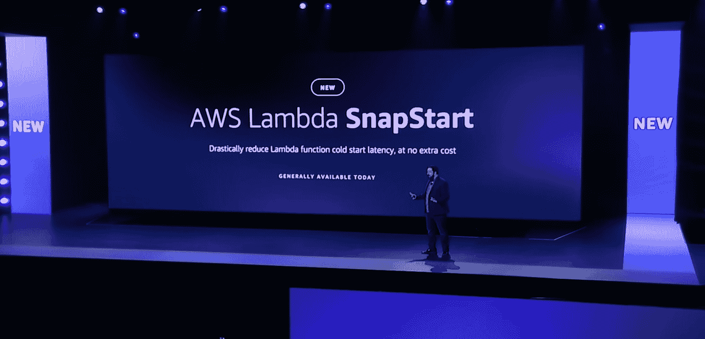

冷启动是无服务器计算的一大缺陷。当第一次调用 Lambda 函数时，AWS 将提供一个运行时容器来加载您的代码，并执行该函数。当容器启动并运行时，它可以很快返回响应！但是第一次调用通常要慢得多，从几百毫秒到几秒不等。

Lambda SnapStart 旨在通过简化一些初始启动过程来解决这个问题。它不是从头开始构建一切，而是在“初始化”阶段结束时保存内存和磁盘状态的快照，该快照可以重复使用。它目前支持使用 Coretto 的 Java，但由于它使用鞭炮的原生快照功能，我们可能会看到这种扩展在未来，并将是一个巨大的福音运行时喜欢。网！

我们已经在我们的博客上写了一份详细的摘要，地址是 [Lambda SnapStart:我们从 re:Invent 2022](https://acloudguru.com/blog/business/lambda-snapstart-reinvent-2022) 中了解到的内容，还有一个由 Jeff Barr 自己写的很棒的博客，题为[用 Lambda SnapStart](https://aws.amazon.com/blogs/aws/new-accelerate-your-lambda-functions-with-lambda-snapstart/) 加速你的 Lambda 函数。最后，来自 Datadog 的 AWS 社区构建者 AJ Stuyvenberg 发布了一篇名为[介绍 Lambda SnapShot](https://dev.to/aws-builders/introducing-lambda-snapstart-46no) 的精彩社区博文，他在文中反思了对无服务器开发人员的启示。如果您想了解更多信息，这两者都是很好的资源！

## 阶跃函数分布式映射的极端并行化

云计算最大的范式转变之一是我们处理并行化的方式——同时做许多事情。我们可以把一项任务分成 100 份，并行运行，用几乎相同的成本在一个小时内完成，而不是花 100 个小时。

Step Functions 已经支持多达 40 个并发执行，但是有了新的分布式映射流，Step Functions 现在支持多达 10，000 个并发执行。这是如此之高，以至于你不得不提高你的 AWS Lambda 服务限制来使用它。

AWS 首席开发人员支持者 Sébastien Stormacq 写了一篇很棒的博文，他在博文中演示了新流程的使用，并就[Step Functions Distributed Map——大规模并行数据处理的无服务器解决方案](https://aws.amazon.com/blogs/aws/step-functions-distributed-map-a-serverless-solution-for-large-scale-parallel-data-processing/)中的理想用例提供了一些建议。

## 使用 EventBridge 管道删除粘附代码

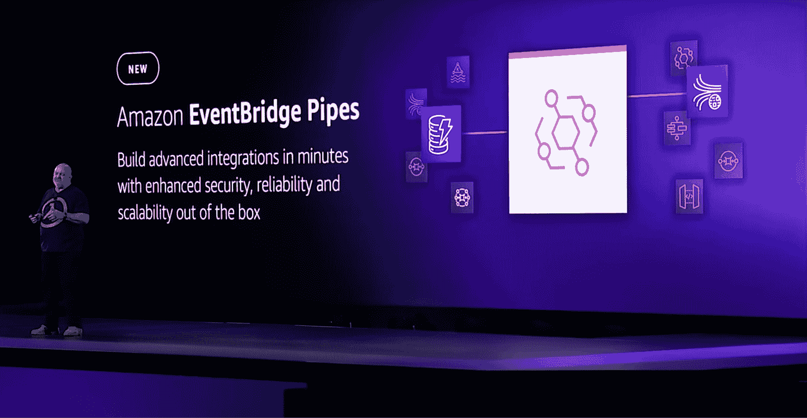

当云服务相互交互以创造真正的价值时，它们的最大威力就显现出来了。在处理不同的服务时，我们经常需要编写将两者集成在一起的代码；我们通常称之为“胶水”。例如，我们可能将消息接收到 SQS 队列中，在我们过滤掉必要的消息之后，我们希望由阶跃函数状态机来处理该队列。到目前为止，我们不得不编写一个额外的 Lambda 函数来进行集成。

输入 EventBridge 管道；它的名字来源于我们在脚本语言中经常使用的管道(`| `)来在命令之间传递信息。有了 EventBridge Pipes，我们可以抛弃大量杂乱的粘合代码，在事件的生产者和消费者服务之间配置点对点集成，包括过滤和丰富数据的内置功能！

这是 re:Invent 2022 最有趣的版本之一，AWS 首席开发人员 Donnie Prakoso 撰写的文章[New——使用亚马逊 EventBridge 管道在事件生产者和消费者之间创建点对点集成](https://aws.amazon.com/blogs/aws/new-create-point-to-point-integrations-between-event-producers-and-consumers-with-amazon-eventbridge-pipes/)涵盖了其工作方式的完整示例。参与这项服务的 AWS 首席工程师 Nik Pinski 也在他的 [Twitter 帖子 EventBridge Pipes](https://twitter.com/pinskinator/status/1598372114964578304) 中分享了他的想法。

## 使用 AWS 应用程序编辑器进行可视化构建

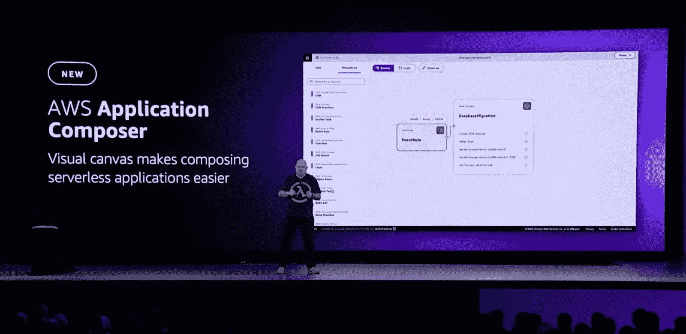

无服务器解决方案令人望而生畏，因为涉及到许多移动部件，以及它们相互作用的方式。尤其是因为当您以敏捷的速度跨分布式团队构建解决方案时，以一种可访问的方式记录所有这些信息不是一件容易的事，更不用说构建基础设施作为其背后的代码解决方案了。

AWS Application Composer 提供了一个可视化设计器，允许您通过拖放界面构建无服务器应用程序，该界面显示了各个组件以及资源之间的链接。通过生成 CloudFormation SAM 模板，您的架构图可以主动跟上代码的变化。如果这听起来像 Stackery，那也不是巧合！

构建开发人员体验，使采用无服务器解决方案变得更容易是一个巨大的优势，AWS 首席专家解决方案架构师 Luca Mezzalira 的博客文章标题为[使用 AWS Application Composer](https://aws.amazon.com/blogs/compute/visualize-and-create-your-serverless-workloads-with-aws-application-composer/) 可视化和创建您的无服务器工作负载是一个很好的起点。AWS 社区构建者 Danielle Heberling 也在她的博客文章中写了一篇很棒的文章， [AWS Application Composer，我们需要的应用构建未来](https://www.danielleheberling.xyz/blog/aws-application-composer/)。

## 用 Amazon Inspector 对 Lambda 函数进行漏洞扫描

您知道代码中运行的所有依赖项吗？如果您曾经见过 node_modules 目录的总大小，您可能会三思而行。去年的 [Log4j 漏洞](https://www.pluralsight.com/blog/security-professional/log4j-vulnerability-security-flaw-and-solution)应该让我们所有人警惕我们的软件在深深的依赖关系中的潜在漏洞。Amazon Inspector 多年来一直是一个方便的选择，现在它包括与 AWS Lambda 函数的集成。

一旦你启用了 Amazon Inspector，它就可以开始扫描你的 Lambda 函数中已知的漏洞，从而更容易找到并修复最大的问题。亚马逊检查员去年看到了巨大的提升，这是一个非常受欢迎的补充。如果您还没有针对 Lambda 函数的源代码漏洞管理解决方案，那么一定要看看这个，即使是为了找出您可能不知道的已经存在的东西。

AWS 首席开发人员 Marcia Villalba 的官方博客文章名为[Amazon Inspector Now Scans AWS Lambda Functions for vulnerability](https://aws.amazon.com/blogs/aws/amazon-inspector-now-scans-aws-lambda-functions-for-vulnerabilities/)给出了该功能及其关键点的可靠概述，您可能也想看看 AWS 无服务器英雄 Jones Zachariah Noel 的博客文章[Amazon Inspector Now can scan AWS Lambda Functions](https://dev.to/aws-heroes/amazon-inspector-can-now-scan-aws-lambda-functions-acg)，他分享了他的经历！

## 使用 Amazon CodeCatalyst 简化开发(预览版)

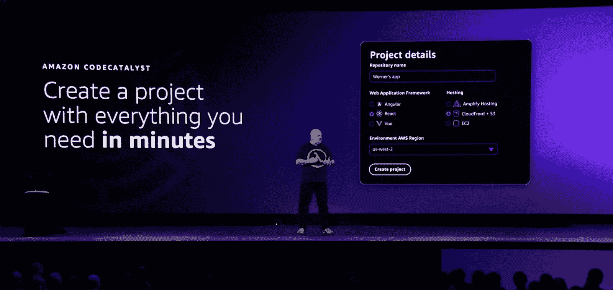

当开始一个新项目时，总有时间花在准备工作上。源代码存储库、文件夹结构、CI/CD 管道、问题跟踪器、文档等等。CodeCatalyst 使您能够创建新的项目，构建和准备您直接开始编写代码所需的一切。CodeCatalyst 提供了许多现成的蓝图，它们都是非常可定制的，并且允许您以标准的方式构建项目。

这实际上是去除一些无差别的繁重工作，并提供了无需努力工作就能获得更大一致性的机会。这填补了与五年前发布的 AWS CodeStar 非常相似的空白，但似乎从未走得很远。我计划在一个即将到来的项目中试用 CodeCatalyst，但它在未来如何工作，时间会证明一切！

AWS 高级开发人员 Steve Roberts 在博客文章[中介绍了 CodeCatalyst 中的许多不同功能，该文章宣布了 Amazon CodeCatalyst，这是一种统一的软件开发服务(预览版)](https://aws.amazon.com/blogs/aws/announcing-amazon-codecatalyst-preview-a-unified-software-development-service/)。AWS 社区构建者 Jatin Mehrotra 也探索了这个工具，在他的博客文章[中展示了使用 AWS CodeCatalyst 构建项目的过程:我创建并部署了一个 React SPA #reinvent](https://dev.classmethod.jp/articles/using-aws-codecatalyst-i-created-and-deployed-a-react-spa-reinvent/) 。

## 使用 Amazon OpenSearch 无服务器灵活配置(预览版)

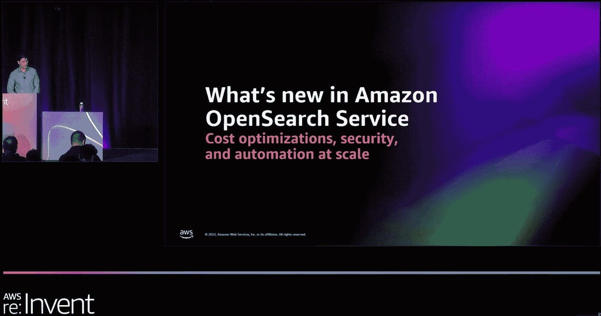

OpenSearch Serverless 现在在 Public Preview 中可用，这消除了管理特定集群的需要，而是根据需要创建您的集合，并让 AWS 为您处理供应和扩展，如果您正在处理大型动态工作负载，这将非常有用。

编辑观点:我不喜欢这种被称为“无服务器”的服务，因为它仍然是按照计算单元的持续时间来定价的，而不是按照请求或类似的弹性合适的工作单元来定价。这项最低水平的服务目前每月花费 700 多美元，这可不便宜。相反，将其描述为自动伸缩更好，对于那些非常大且不可预测的工作负载非常有用。该服务仍处于预览阶段，可能会发生变化。同样值得称赞的是，服务团队的成员一直积极参与社交媒体对此的讨论，并承认这种观点是存在的。

如果您正在运行这种类型的大型动态工作负载，那么值得看看 AWS 首席开发人员 Channy Yun 的博客文章，他是[Preview:Amazon open Search server less-Run Search and Analytics Workloads without Managing Clusters](https://aws.amazon.com/blogs/aws/preview-amazon-opensearch-serverless-run-search-and-analytics-workloads-without-managing-clusters/)的作者。

## 用亚马逊 VPC 点阵抽象网络复杂性(预览版)

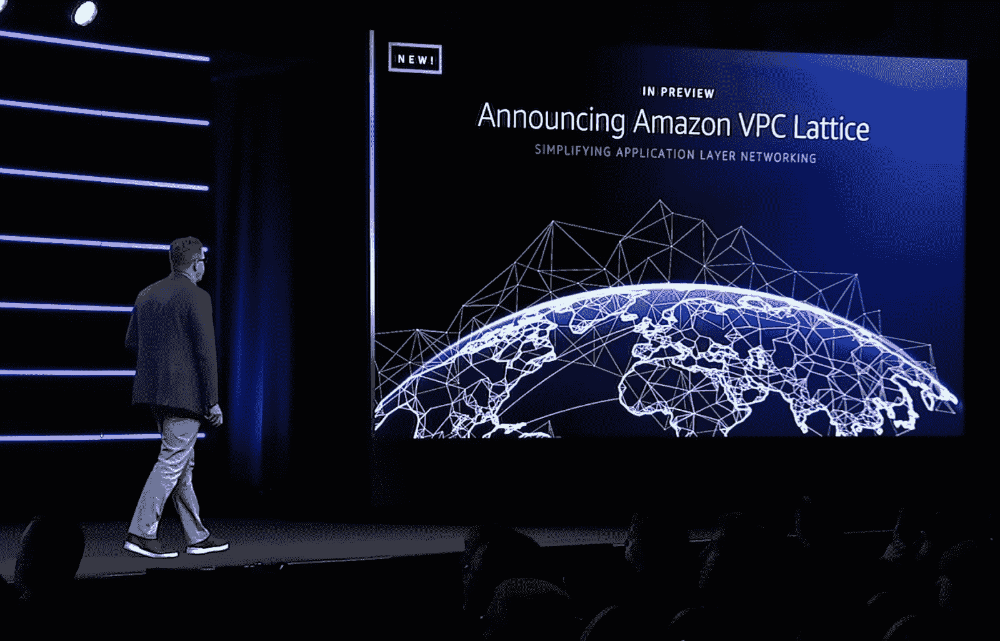

网络是我们在现代计算中构建的一切的基础，现代云也不例外。网络工程师需要能够控制和扩展他们的网络，同时开发人员也在不断地构建网络。VPC Lattice 引入了一个新的抽象层，称为服务网络，简化了跨 VPC 和帐户的连接，使构建跨复杂网络拓扑的服务变得更加容易。

对抽象的自然关注是它会导致粒度控制的丧失。在 Dave Brown(AWS Amazon EC2 副总裁)的会议上，他重申了网络管理员仍然保留他们习惯的工具(如安全组、流量日志和流量镜像)是多么重要。虽然这仍然只是在一个地区(俄勒冈州/美国西部-2)的私人预览，我们还需要一段时间才能看到它被广泛使用，但它有一些有趣的前景。

AWS Chief 首席布道者 Danilo Poccia 在他的文章[介绍 VPC Lattice——简化服务对服务通信的网络(预览)](https://aws.amazon.com/blogs/aws/introducing-vpc-lattice-simplify-networking-for-service-to-service-communication-preview/)中给出了一个使用 VPC Lattice 构建混合的有服务器/无服务器服务的演示。如果你正在与网络复杂性作斗争，这是一个值得一看的。

## 利用亚马逊数据区进行跨边界分析

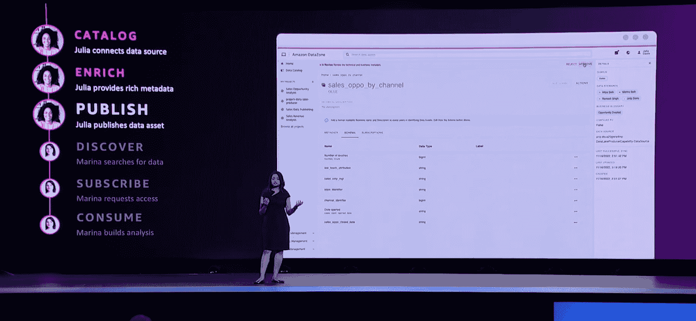

每个现代组织都依赖于数据。旧的模式是，您可能有一个或多个特定的团队来处理整个数据生命周期中的所有数据，但事实是，现在整个组织都在生成、维护和使用数据。不相信我？问你的市场部。

Amazon DataZone 已在一次私人预览中宣布为即将推出的解决方案，使您的数据生产者能够共享他们所拥有的内容，并将他们与您的数据消费者连接起来，以与您的业务相关的方式访问数据，并且在您的数据治理控制的范围内。

亚马逊数据区的 AWS 产品负责人什卡·维尔马在[数据和机器学习主题演讲](https://youtu.be/TL2HtX-FmiQ?t=3938)(在 1:05:38 到 1:14:35 之间)期间，给出了一个组织内部用例以及新工具演示的精彩示例，我强烈推荐这个示例。AWS 无服务器英雄和 DataEngBytes 会议组织者 Peter Hanssens 将其描述为数据工程领域的任何人的[最大的 re:Invent 2022 公告，因此它绝对是一个值得观看的！](https://twitter.com/petehanssens/status/1599619253128560640)

## 机器学习的治理解决方案

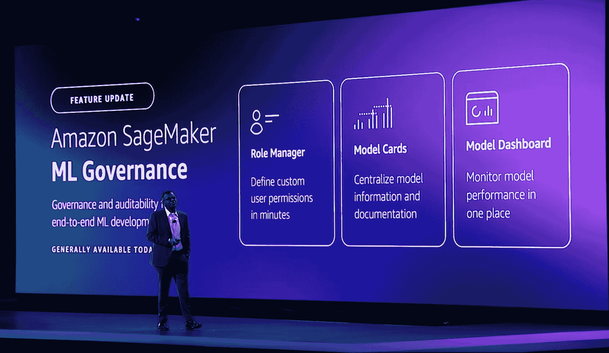

很容易忘记机器学习和算法在多大程度上驱动了我们的世界。AWS 让我们可以使用非常强大的工具，并且很容易忽略我们正在构建的东西的影响。作为建设者和技术领导者，我们需要知道我们如何使用机器学习，并且我们正在有效地、负责任地这样做。

亚马逊 SageMaker 的新 [ML 治理工具为我们提供了一系列工具来帮助治理我们的 SageMaker 解决方案及其使用。我们还有新的](https://aws.amazon.com/sagemaker/ml-governance/) [AWS 人工智能服务卡](https://aws.amazon.com/machine-learning/responsible-machine-learning/)，它为我们提供了如何利用 Rekognition 和 Textract 等服务实现最大责任效率的指导方针。

AWS 首席开发者倡导者 Antje Barth 的博客介绍了[Amazon SageMaker 的新 ML 治理工具——简化访问控制并提高 ML 项目的透明度](https://aws.amazon.com/blogs/aws/new-ml-governance-tools-for-amazon-sagemaker-simplify-access-control-and-enhance-transparency-over-your-ml-projects/)涵盖了这些新的解决方案，为您提供了一个了解这些新工具的地方

## 10，000 英尺视图，带 SageMaker 地理空间(预览)

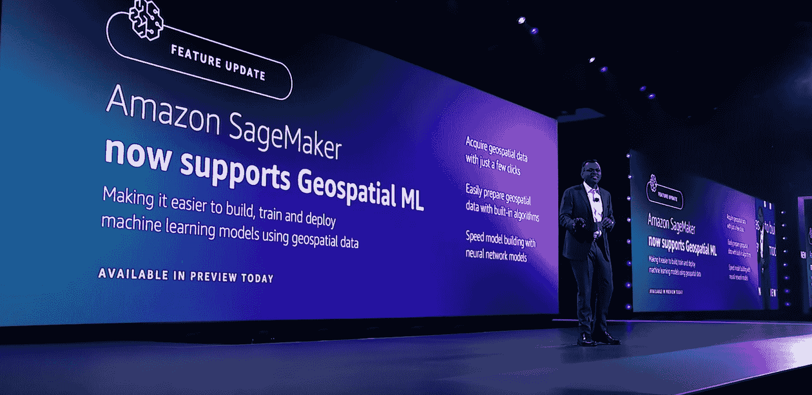

当亚马逊位置服务去年发布时，我们没有与 AWS 机器学习功能的强大套件进行更多集成，这令人感到奇怪。在这里，AWS 正在为此打开大门，亚马逊 SageMaker 地理空间正在向公众发布预览。

能够使用云移除、地理镶嵌和不同的统计函数等解决方案来处理影像，它将许多方法结合在一起，以增加一些已经存在的数据，再加上矢量丰富选项，如反向地理编码。根据我自己作为 GIS 操作员在应急管理部门的经验，这些有一些非常方便的可能性。看看 AWS 打算如何通过此服务增强我们的选项，以及它将如何与 Esri 的 ArcGIS 等 GIS 解决方案进行比较，这将是一件有趣的事情。

通过 AWS 博客文章[预览查看一些现在可用的功能:使用 Amazon SageMaker 来构建、训练和部署使用地理空间数据的 ML 模型](https://aws.amazon.com/blogs/aws/preview-use-amazon-sagemaker-to-build-train-and-deploy-ml-models-using-geospatial-data/)。

## 利用亚马逊供应链增强物流

理解、处理和分析你的供应链是任何企业的关键职能。正如这十年所显示的，全球供应链极其脆弱，能够识别我们的风险是管理它们的第一步。随着亚马逊成为世界上最大的零售商，他们利用 AWS 技术来支持他们的物流运营就不足为奇了，现在您也可以这样做了！

亚马逊供应链与您现有的 ERP 和供应链解决方案协同工作，统一信息并提供由 AWS 的机器学习服务和见解支持的覆盖。它仍在预览中，看看它如何发展会很有趣。查看 [AWS 供应链服务页面](https://aws.amazon.com/aws-supply-chain/)上的信息，了解更多信息。

## gameloft anywhere 全球多人游戏

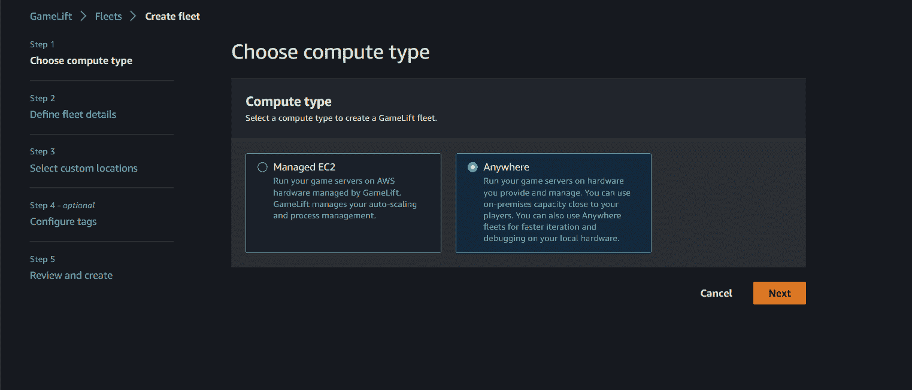

多人游戏开发者总是与一个敌人作战。技术术语是延迟，但游戏玩家最熟悉的是“滞后”，以及沮丧的最终尖叫。GameLift 提供了通过 AWS 部署和自动扩展多人游戏服务器的能力，但开发人员也希望能够在自己的硬件上部署服务器(想象一下测试您的最新补丁！).

Amazon GameLift Anywhere 提供了在您自己的硬件上运行 GameLift 服务器的能力。这有可能被利用来运行在离你的玩家市场更近的其他云提供商上，但是这需要更多的定制工程。关于[介绍 Amazon Game lift Anywhere——在您自己的基础设施上运行您的游戏服务器的博客文章](https://aws.amazon.com/blogs/aws/introducing-amazon-gamelift-anywhere-run-your-game-servers-on-your-own-infrastructure/)涵盖了许多新功能。

## 利用 SimSpace Weaver 进行大规模仿真

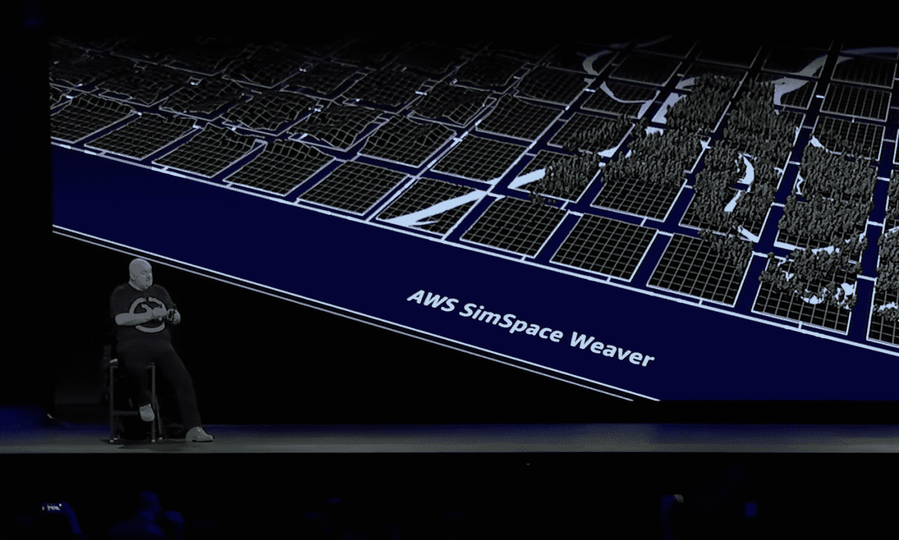

现实世界非常复杂，试图在计算机中模拟它需要大量的计算。SimSpace Weaver 是一种新的解决方案，可以直接插入到常用的引擎中，如 Unreal Engine 5 和 Unity，以缩放、编排和同步一组 EC2 实例，从而在巨大的规模上运行您的模拟。

这项服务实际上是针对需要模拟大规模的数百万实体的特定用户群，例如模拟整个城市的交通流量、模拟灾难或数百万人的移动。一些突出的用例以及如何开始的示例在新的博客文章[中有所涉及，新的 AWS SimSpace Weaver–在云中运行大规模空间模拟](https://aws.amazon.com/blogs/aws/new-aws-simspace-weaver-build-large-scale-spatial-simulations-in-the-cloud/)。

## 亚马逊组学生物信息学

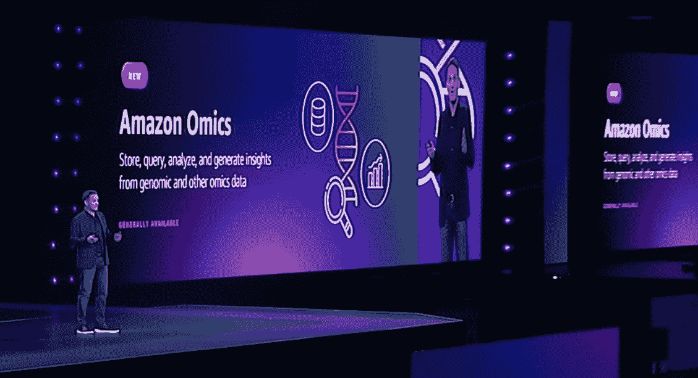

基因组学给计算带来了一些独特的挑战，主要是因为涉及到大量的数据。尝试以有意义的方式存储、访问和处理数据是云计算带来独特机遇的地方，尽管它仍然非常复杂。Amazon Omics 提供了一个句柄，并处理这些信息以生成有价值的见解。

通过像 Amazon Athena 或 Amazon Sagemaker 这样的解决方案简化数 Pb 基因组数据的处理带来了许多机会。如果你正在寻找这个领域的解决方案，AWS 在[上发布的介绍亚马逊组学的博客文章是一个很好的起点，亚马逊组学是一种专门用于存储、查询和分析大规模基因组和生物数据的服务](https://aws.amazon.com/blogs/aws/introducing-amazon-omics-a-purpose-built-service-to-store-query-and-analyze-genomic-and-biological-data-at-scale/)。