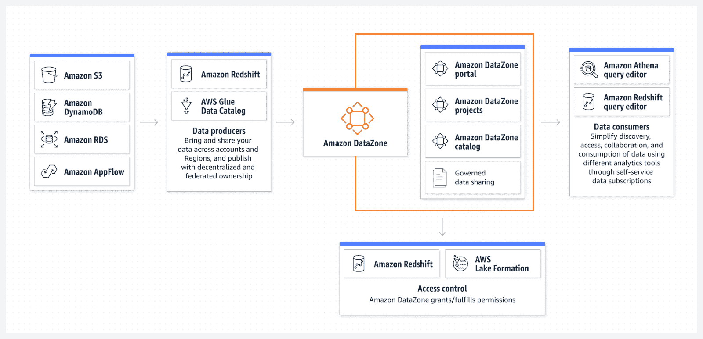
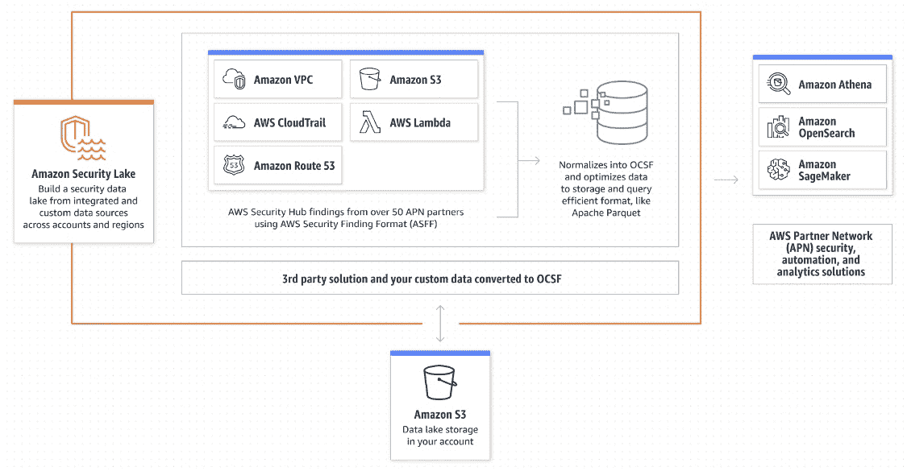

# AWS re:Invent 2022:周二的 7 大要点

> 原文：<https://acloudguru.com/blog/engineering/aws-reinvent-2022-tuesdays-top-7-takeaways>

这是 AWS re:Invent 2022 的第二天，它没有让人失望！正如[昨天的文章](https://acloudguru.com/blog/engineering/aws-reinvent-2022-day-1-overview)所预测的，今天有很多新的公告，事件还远没有结束。我们在每日更新中为您总结了最有趣的 AWS 新闻。

## 亚马逊数据区简介:大规模处理企业数据

AWS 在 re:Invent 大会上推出了亚马逊数据区，这是一种新的数据管理服务，可以帮助你大规模共享、搜索和发现数据。现在，无论数据存储在何处，您都可以获得洞察力并访问数据。这意味着能够跨组织边界查看和管理数据，以实现与其他团队的快速协作。

根据 AWS 的说法，这意味着帮助监管组织数据资产的管理员和数据管家管理对数据的访问，以便“在正确的上下文中以正确的权限级别访问数据”

[AWS 宣布](https://press.aboutamazon.com/2022/11/aws-announces-amazon-datazone)“如今，组织收集分布在多个部门、服务、内部数据库和第三方来源(如合作伙伴解决方案和公共数据集)的数 Pb 甚至数 EB 的数据。

“组织必须平衡控制需求(以确保数据安全)和访问需求(以推动新的见解),但实施考虑到整个组织中各种数据、部门和使用情形的治理策略是一项挑战。

## 亚马逊安全湖首次亮相

亚马逊安全湖(Amazon Security Lake)是一项新服务——目前处于预览阶段——将所有与安全相关的数据汇集到一个数据湖中。它从诸如 CloudTrail、VPC 流日志、GuardDuty 和 Inspector 等 AWS 服务获取信息。但它也通过安全合作伙伴连接到内部数据。

亚马逊安全湖的预览版现已在美国东部(俄亥俄州)、美国东部(弗吉尼亚州北部)、美国西部(俄勒冈州)、亚太地区(悉尼)、亚太地区(东京)、欧洲(法兰克福)和欧洲(爱尔兰)地区推出。

## 全面的 Apache Spark 与红移集成

扔掉那些第三方连接器！开发人员现在可以轻松地为 Redshift 构建 Apache spark 应用程序，无论他们是在 Sagemaker、AWS Glue 还是类似的服务中工作。

要开始使用，您可以访问 AWS analytics 和 ML services，并在 Spark 作业或笔记本中使用数据框或 Spark SQL 代码来连接亚马逊红移数据仓库。您需要首先[设置 AWS IAM 认证](https://docs.aws.amazon.com/redshift/latest/mgmt/redshift-iam-authentication-access-control.html)。

## 哦，还有一件小事:Opensearch 现在是无服务器的

无服务器的粉丝们欢呼吧！好吧，澄清一下，我们现在有了“亚马逊开放搜索服务的新[无服务器选项的预览版”。因此，您可以使用 OpenSearch，而无需管理集群大小或实例类型或任何类似的东西。好多了！](https://aws.amazon.com/blogs/aws/preview-amazon-opensearch-serverless-run-search-and-analytics-workloads-without-managing-clusters/)

## 带 Q 的最大似然预测

不是《星际迷航》里的 Q，但是如果你可以用它来预测未来，它还是很强大的。带 Q 的 ML Powered forecasting 是一种新的用于分析商业数据的自然语言查询。用户现在可以快速方便地查看业务绩效预测。它允许不是分析师或数据科学家的人获取他们需要的信息。

## simscape weaver 进入大楼

借助新的 [SimSpace Weaver 服务，](https://aws.amazon.com/blogs/aws/new-aws-simspace-weaver-build-large-scale-spatial-simulations-in-the-cloud/)您可以使用 EC2 实例运行大规模模拟。运营规划人员通常会对灾难响应、活动期间的交通控制以及许多其他应用进行模拟。

传统上，这些模拟是在单台机器上运行的，但是 SimSpace Weaver 可以在多个 EC2 实例上运行，并且可以快速扩展。

## 具有 AWS 保护功能的容器液位检测

守卫职责将很快提供集装箱级别的运行时威胁检测。虽然守卫职责已经保护了 EKS，但它现在将更深入到容器级别，以确保您的应用程序尽可能安全地运行。

## 下雨时，倾盆大雨

这是一大堆公告！还有大量新的 [EC2 实例类型可用](https://aws.amazon.com/blogs/aws/category/compute/amazon-ec2/)，比如 Graviton 实例——太多了，无法在此列出！请继续关注我们的报道，并一如既往地成为令人敬畏的云大师！

## 跟上 AWS 的一切:发明 2022

查看 [ACG 和 Pluralsight re:Invent 内容中心](https://www.pluralsight.com/reinvent-2022)以了解 re:Invent 2022 的所有信息。

你也可以在推特[和](https://twitter.com/acloudguru)[上关注 ACG](https://www.facebook.com/acloudguru)和【脸书】上关注，在 YouTube 上订阅云专家[上所有你能处理的关于 re:Invent 2022 的更新！](https://www.youtube.com/c/AcloudGuru/?sub_confirmation=1)

加入我们令人敬畏的 [Discord 社区](https://discord.com/invite/acloudguru),与 AWS 培训架构师和其他志趣相投的阴云密布的人进行数字交流。