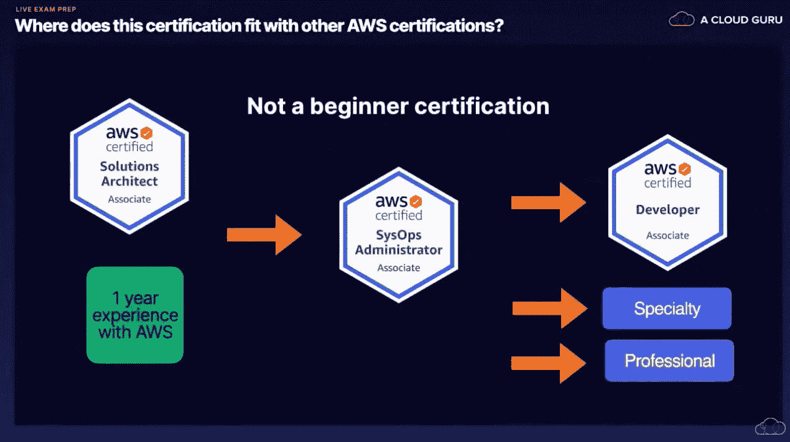
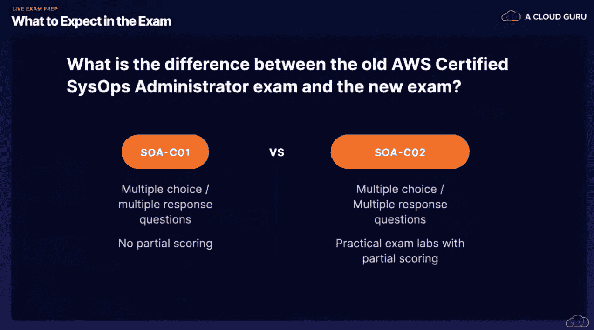
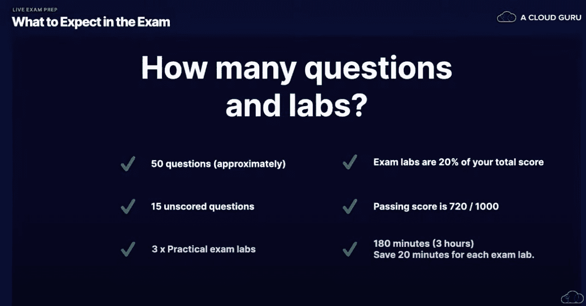

# AWS SysOps 管理员助理 SOA-C02 证书考试准备|云专家

> 原文：<https://acloudguru.com/blog/engineering/aws-sysops-administrator-associate-soa-c02-sample-exam-questions-tips-faqs>

努力获得 AWS SysOps 管理员助理认证，想知道如何准备新的 SOA-C02 考试？听说过该认证中引入的新考试实验室形式吗？不要慌！我们是来帮忙的。

在本帖中，我们将为您提供一些信息，帮助您为 SysOps 管理员助理做准备。我们将按照 [AWS 认证系统运行管理员–助理](https://acloudguru.com/course/aws-certified-sysops-administrator-associate)考试的方式，回答一些考试问题，并提供一些 AWS 考试的应试技巧和窍门。

* * *

## 加速您的职业发展

通过 AWS、Azure、Google Cloud 等领域的课程和动手实验室转变您的职业生涯。查看我们的[免费课程](https://acloudguru.com/blog/news/whats-free-at-acg)或[现在就开始 7 天试用](https://acloudguru.com/pricing)。

* * *

什么是 SOA-C02？

## SOA-C02 是当前获得 AWS 认证系统管理员助理资格所需的考试。这是第一次 AWS 认证考试，允许考生通过考试实验室展示技能。

AWS 认证系统管理员助理证书在 AWS 认证环境中处于什么位置？

## 想知道[哪种 AWS 认证适合你](https://acloudguru.com/blog/engineering/which-aws-certification-should-i-take)？好吧，你应该知道系统管理员助理不是一个初学者资格。是中级认证。

在参加本考试之前，我们建议您参加 AWS 解决方案架构师助理考试，或者至少有一年使用和操作 AWS 的实践经验。

获得 SysOps 管理员助理认证后，您有几个不同的选择。

不确定哪种认证适合你？查看我们的 [AWS 认证指南](https://youtu.be/Oi1r3e8y2jg)。(可以[看](https://youtu.be/Oi1r3e8y2jg)或者[读](https://acloudguru.com/blog/engineering/which-aws-certification-should-i-take)！活着是多么美好的时光啊！)

新旧 AWS 认证系统运行管理员助理考试有什么区别？

## 之前的考试叫 SOA-C01。这是一个没有部分评分的多项选择和多项回答的考试，这意味着如果你的答案*部分正确*，你就没有学分。

*   对于新的考试，SOA-C02，你也可以得到多项选择/多项回答的问题。但是实践考试实验室现在被引入其中。考试实验室给你部分评分。最终结果是一个问题更少的测试。耶！
*   SOA-C02 考试有多少个问题和实验？

## 考试由大约 50 个问题组成。这包括 15 个未打分的问题，这些问题不会计入你的分数，但是 AWS 正在尝试和测试。(未评分的问题对 AWS 考试来说并不陌生，但它是一个新的补充，可以了解将被评分的问题的数量。)

这些未评分的问题可能会让人觉得超出了范围。不要让他们扰乱你的头脑！如果你看到一个你完全没有准备好的问题，很有可能是其中之一。。。也就是说，假设你真的为考试做好了准备！但你会没事的，对吧？对吗？？？

有哪些实践考试实验室？

## 除了问题之外，您还有三个实践考试实验室，在那里您有一个在 AWS 控制台中完成的任务。或者，如果您熟悉命令行工具，也可以这样做。这些考试实验室可能是像配置 S3 桶或生命周期规则这样的事情。

考试实验室现在占你总成绩的 20%。及格分数是 1000 分中的 720 分。

新的实践考试实验室有多难？

## 鉴于 AWS 控制台的直观性，很容易就能清楚地找到您需要做的事情。即使你以前从未做过，你也有很大的机会。我们打赌大多数人会更喜欢实践考试实验室而不是问题。

你需要多长时间完成 SOA-C02 考试？

## 你有三个小时来完成考试。(有趣事实:总测试时间与 AWS CSA-Pro 的测试时间一样长。)

建议您为每个考试实验室保留 20 分钟，这样您就有足够的时间完成这些实验。

如果你提前结束，你就不能从头开始复习你的问题。因为考试分为两部分，一旦你提交了其中的一部分，你就不能回头再复习了。

AWS 系统操作员助理考试有多难？

## 这将取决于你的背景。如果你一直从事 Unix 或 Linux 支持或 SysOps 类型的工作，SysOps 考试对你来说会很容易，因为你会明白这项工作需要什么。如果不是，那么，你来对地方了。

如果您已经参加了 AWS 解决方案架构师助理和开发人员助理考试，那么系统运行管理员助理的难度有多大？

## 如果您已经参加了 AWS 解决方案架构师助理考试，那么您已经熟悉了 SysOps 考试中将要看到的大多数服务。

开发人员助理更多的是关于 DevOps 工具，在 SysOps 考试中你不会看到太多。

SysOps 更多的是具有生产支持的心态:如何支持这些系统，如何解决何时出现问题，如何监控一切，以及如何确保灾难恢复正常进行，再加上一些成本优化。

现在所有的 AWS 考试都有模拟考试实验室吗？

## 还没有。但我们不会惊讶地看到这些考试被推广到其他考试中，特别是在开发人员助理、机器学习专业和安全等领域。但是还没有宣布任何事情。

最好的 AWS 认证考试应试策略是什么？

## 有些问题会让人感到困惑。这足以让你发疯。你学习过。你知道这个！但是一个问题出现了，把一切都搞砸了。

以下是要遵循的流程:

从阅读问题开始，确定问题到底在问什么。通常有很多你并不真正需要考虑的场景信息。

*   然后，检查答案，排除*明显*不正确的答案。
*   最后，最后一次阅读问题，从剩下的可能答案中选择你认为可能是最佳答案的答案。
*   这在现实生活中是怎样的呢？在下一节中，我们将浏览几个 AWS SysOps 管理员助理认证考试问题示例，并向您展示我们建议的提高您获得该证书的可能性的思考过程。

[**获取 AWS 云痛苦字典**](https://get.acloudguru.com/cloud-dictionary-of-pain)
说云不一定要硬。我们分析了数以百万计的回复，找出了最容易让人犯错的概念。抓住这个[云指南](https://get.acloudguru.com/cloud-dictionary-of-pain)获取 AWS 中一些最痛苦术语的简洁定义。

* * *

样本 AWS 认证系统运行管理员-助理 SOA-C02 考试问题

* * *

## 这些问题与你将在 SOA-C02 考试中看到的问题类型相似。有时候考试的题目会比这些更啰嗦，但内容应该差不多。最重要的是，你应该遵循的思维过程是正确的。

**样题 1**

对于所有 EC2 实例，您需要集中收集应用程序日志(如/var/log/httpd/access_log)和操作系统日志(如/var/log/messages)。你如何实现这一点？

A.从 CloudWatch 控制台，为每个实例启用日志收集。

*   B.在 EC2 实例上安装 CloudWatch 代理，并将其配置为向 CloudWatch 发送所需的日志。
*   C.从 EC2 控制台，为所有实例启用日志收集。
*   D.在 EC2 实例上配置日志代理，将所需的日志发送到 CloudWatch。
*   看这个问题的时候，先考虑你需要重点关注的重点。在这种情况下，它是“集中”、“日志”和“EC2 实例”

很快，您应该知道*不可能*从 CloudWatch 控制台中启用日志收集。所以这是一个直接的否定。

*   对于 B，您*可以*使用 CloudWatch 代理将应用程序日志发送到 CloudWatch，所以这是一个可能的问题。现在，让我们考虑这种可能性，但看看其他答案。
*   对于 C，不可能从 EC2 控制台启用它，所以答案是否定的。
*   对于 D，有*有*没有日志代理可以发送日志到 CloudWatch。它不存在于 EC2 实例中。这是一个很大的不。
*   因此，我们知道答案 B 是正确答案。

***考试专家提示****:AWS 的实际操作经验对本次考试至关重要。*

**样题 2**

**2。您将使用 CloudFormation 在两个不同的 AWS 区域部署 EC2 实例。CloudFormation 模板的哪个部分允许您根据您要部署到的区域来定义使用哪个 AMI ID？**

A.输出

*   B.地区
*   C.映射
*   D.资源
*   同样，让我们首先关注我们需要考虑的关键因素。

云形成模板

*   AMI ID
*   地区
*   ***考试亲提示*** *:对一道题没有把握？只需在那里扔一个答案，并标记为后续跟进。回答错误不会受到惩罚。不如碰碰运气。*

要通过 AWS 认证考试，你不需要掌握所有的知识。你只需要知道足够多的信息就能达到及格标准。你可以通过学习如何阅读问题并找出哪些不合适来增加你的机会。上面的问题就是一个很好的例子。

如果我们在考虑云形成模板的事情，我们会考虑我们对这些的了解。

首先，我们知道(A)输出是我们吐出东西的方式，所以我们不打算在输出部分定义任何区域。让我们把它标出来。

*   接下来，(B)地区。也许吧？我们没有听说过区域是云形成模板的一部分，但也许我们只是忘记了它。让我们先把这个问题放一放。
*   接下来，(C)映射。我们知道在 CloudFormation 模板中肯定有 Mappings 部分，所以这是一个可能的答案。
*   最后，(D)资源。嗯，这些只是我们在 CloudFormation 模板中设置的东西，所以我们可以排除这种可能性。
*   这就给我们留下了 B 或 C 作为可能的答案。这至少把你的机会缩小到 50/50。

如果我知道肯定有 Mappings 部分，但我不记得 Regions 部分，那么我将抓住机会使用 Mappings(这是正确答案)。

如果你对任何问题都不太自信，你可以把它标记出来，以后再来。有时，考试中后面的问题可能会唤起你对某些事情的记忆。

***考试专家提示**:你经常可以在两个明显不正确的答案中剔除。AWS 在考试中放干扰物是出了名的。他们通常会在响应中插入一个您并不使用的服务。利用这一点，缩小你的选择范围。*

**样题 3**

**3。您的私有 EC2 实例需要访问一个 S3 桶来读写文件。然而，安全架构师已经告诉您，在任何情况下，这种流量都不能离开 AWS 网络。以下哪一项是经济高效且安全的解决方案，可确保 EC2 实例能够安全地访问 S3 存储桶？**

配置一个 VPN 网关，并通过 VPN 将所有流量路由到 S3 桶。

1.  配置 NAT 网关，并通过 NAT 网关将所有流量路由到 S3 桶。
2.  配置直连连接以安全地路由流量。
3.  将 VPC 端点配置到 S3 存储桶。将端点指定为路由表中路由的目标。
4.  让我们再次关注这里的关键点:

私人的

*   S3
*   流量不能离开 AWS 网络
*   以下是我们如何找到答案的方法。

从 A 开始:VPN 在您的内部系统和 VPC 之间提供安全连接，因此它不能用于在 EC2 和 S3 之间提供私有连接。因此，我们可以排除它。

*   对于 B，NAT 网关将通过互联网发送流量，这在这种情况下是不允许的。把那个划掉。
*   对于 C，不可能以这种方式使用直接连接。直接连接提供了使用互联网的替代方法，但它用于从您自己的数据中心连接到 VPC 中的实例。它不能让你进入 S3。
*   最后，剩下 D，这是正确的答案。VPC 端点确实允许您在不使用互联网的情况下将 VPC 中的实例私下连接到 S3 存储桶。它实际上使用了 AWS PrivateLink，因此流量永远不会离开亚马逊的网络。
*   ***考试 pro 提示*** *:有时候只要剔除错误的就能找到正确答案。*

准备 AWS 认证系统管理员助理考试

## 新的考试带来了全新的 ACG 课程。[与云专家一起准备下一代云认证考试](https://acloudguru.com/blog/news/prepare-for-the-next-generation-of-cloud-certification-exams)。

我们彻底改革了我们的 AWS 认证系统管理员助理课程，包括我们全新的[挑战实验室](https://acloudguru.com/blog/news/introducing-challenge-mode-for-a-cloud-gurus-hands-on-labs)和新的考试模拟器。

通过一些准备工作和对如何不接近考试的理解，你应该对参加 SOA-C02 考试没有问题。

**有问题吗？我们(大概)有答案了！**加入与 ACG 导师关于[不和](http://discord.gg/acloudguru)的对话。你也可以[在 YouTube 上订阅一位云专家](https://www.youtube.com/c/AcloudGuru/?sub_confirmation=1)的每周更新和各种精彩内容，比如在[脸书](https://www.facebook.com/acloudguru)上关注我们，在[推特](https://twitter.com/acloudguru)上关注我们。但是无论你做什么:继续保持威严，云大师们！

[**看点:解决“无经验”的云招聘问题**](https://get.acloudguru.com/solving-no-experience-cloud-problem-webinar)
需要经验才能得到工作，但需要工作才能得到经验。这是一个多云的第 22 条军规！[观看免费点播的网络研讨会](https://get.acloudguru.com/solving-no-experience-cloud-problem-webinar)，了解帮助数十人获得第一份云计算工作的 ACG 挑战赛。

* * *

[**WATCH: Solving The “No Experience” Cloud Hiring Problem**](https://get.acloudguru.com/solving-no-experience-cloud-problem-webinar)
Need experience to get a job, but need a job to get experience. It’s a cloudy Catch-22! [Watch this free, on-demand webinar](https://get.acloudguru.com/solving-no-experience-cloud-problem-webinar) with insights from the ACG challenge that helped dozens get their first cloud job.