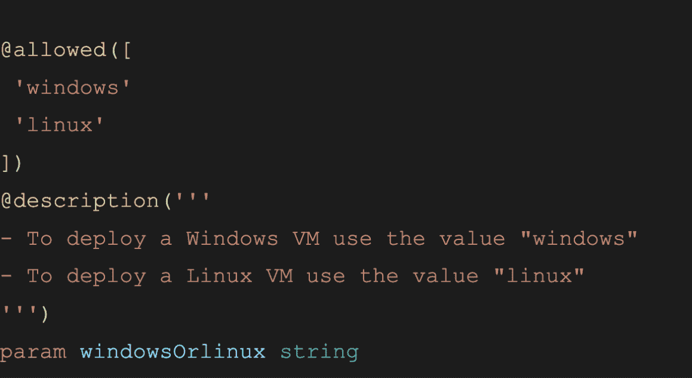
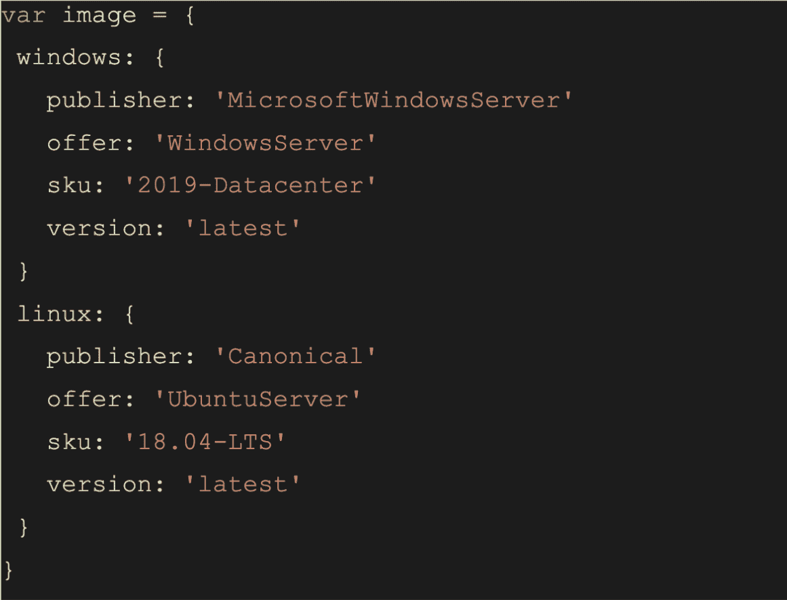
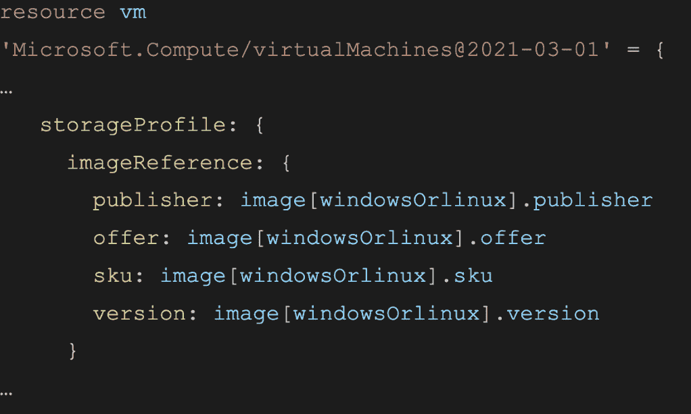

# 面向 Windows 或 Linux 虚拟机的 Azure Bicep 文件部署|云专家

> 原文：<https://acloudguru.com/blog/engineering/azure-bicep-file-windows-or-linux>

今天，我们将谈论二头肌锉刀。就像它的生物学同名物一样，二头肌的知识是一个非常*方便的*工具来*武装*你自己(对不起，我们控制不住自己！).

在其核心，Bicep 是一种声明性语言，您可以使用它以可靠和一致的方式简化和加速您的 Azure 部署过程。您可以在 Bicep 文件中定义想要部署 Azure 资源的结构。

* * *

## 权力在你手中

掌控你的职业生涯。[从 ACG 开始](https://acloudguru.com/pricing)通过 AWS、Microsoft Azure、Google Cloud 等领域的课程和实际动手实验室增强您的技能。

* * *

什么是重复性？

## 作为代码，基础设施有很多优点，但它最大的好处之一是可重复性。就其核心而言，可重复性仅仅意味着能够从相同的设置中产生完全相同的结果。目标是您编写的代码应该能够在各种环境和场景中使用和重用。

我们如何使我们的部署文件更加可重用？

## 让我们的部署文件变得更加可重用的一些方法是使用参数和变量。

因素

### 参数用于在执行代码时提示用户输入值。这样，您不必将特定的信息硬编码到部署文件中。

参数将用于每次运行部署文件时需要更新的值。

变量

### 另一方面，变量用于指定一个特定的值，该值可以在部署文件中反复使用。与参数不同，变量在值很少变化时使用。但是如果它们确实需要改变，而不是更新文件中的每个值，您只需要更新变量，并且对该变量的所有引用也将具有该值。

参数和变量可以保存多种数据，如字符串、整数、数组，甚至是具有属性层的对象。

参数和变量如何应用于编写 Bicep 文件？

* * *

## 通过使用这两个工具，参数和变量，我们可以使 bicep 文件适应许多情况。

我将介绍如何编写一个 Bicep 文件来部署一个带有 Windows 操作系统或 Linux 操作系统的虚拟机，所有这些都基于用户的输入。部署文件后，将询问用户虚拟机应该是 Windows 还是 Linux，然后根据响应，bicep 文件将知道使用什么属性来部署该操作系统。

创建参数

### 让我们从创建一个参数开始，询问用户他们是想要部署 Windows 虚拟机还是 Linux 虚拟机。在 Bicep 中，声明参数的方式是使用以下语法:

正如我们从下面的代码片段中看到的，我们将参数命名为“windowsOrlinux ”,以让运行部署的用户知道他们应该选择哪个操作系统。

```
“param <name of parameter> <type of parameter data>”
```

为了给如何使用这个参数添加更多的上下文，我们还使用了“description”修饰符。此外，我们还有“允许的”装饰者。这用于指定该参数只接受特定值的列表，“windows”或“linux”。如果使用另一个值，将会出现一个错误，告诉您部署文件无效，因为该参数只允许使用某些值。

创建可变对象



### 既然用户已经选择了要用于虚拟机的操作系统，下一步就是向部署文件中添加逻辑，以根据选择确定要使用的映像配置。我们可以通过创建一个变量对象来实现，如下图所示:

声明变量



### 在我们讨论变量对象是如何工作的之前，让我们快速回顾一下如何声明一个变量。您可以简单地使用以下语法:

当谈到变量的值时，在许多情况下，这将只是一个单一的值，如整数或字符串。这可以通过硬编码值或利用函数生成值来实现。

```
“var <name of variable> = <value of variable>” 
```

或者，您可以将一个对象存储为值，该值可以通过信息层保存多个值。这通常用在像这里这样保存配置数据的情况下。

因此，在我们的代码片段中，我们可以看到我们存储了两个值“windows”和“linux ”,它们列在花括号中。然后，在这些值中，有一些属性，如 publisher、offer、sku 和 version，它们都被包装在自己的一组花括号中。除了这些属性，还有这些属性的特定配置值。在我们的示例中，我们使用的是 Windows 2019 数据中心映像或 Ubuntu 18.04 映像。

图像参考属性

### 现在我们有了一个参数，它将存储“linux”或“windows”的值，以及一个带有相关配置的图像变量。但是他们是如何走到一起的呢？模板如何知道如果参数值是“windows ”,它需要使用图像变量中的 windows 配置？反之亦然，带有“linux”值？下面，我们有一个虚拟机资源声明的片段，重点是存储配置文件部分中的映像引用属性。

在查看这个代码片段时，您可能注意到的第一件事是 publisher、offer、sku 和 version 的图像引用属性与上面配置的 image 变量中保存的属性相匹配。



属性值

* * *

* * *

### 让我们继续讨论财产价值。

仔细看看同一个代码片段，我们首先有一个对“image”变量的引用，然后在最后我们可以看到有一个句点，后跟相应的 object 属性。例如，如果“image”的值是“linux”，那么“offer”子属性的值就是“UbuntuServer”。否则，如果“image”的值是“windows”，则“offer”子属性的值将是“WindowsServer”。


那么模板如何知道为“image”选择哪个值呢？这就是“windowsOrLinux”参数的用武之地。在“image”变量之后，括号中引用了“windowsOrLinux”参数，表示“image”变量的值是根据括号中的参数值选择的。

这就是为什么给参数添加一个允许值修饰器如此重要，因为我们必须确保参数值与变量对象中的值相匹配。所以现在，当部署这个文件时，当参数提示时，用户将选择“windows”或“linux”。然后，该参数将用于指定“image”变量对象中的哪些数据用于出版商、报价、sku 和版本属性值。

结论和下一步措施

* * *

## 这只是编写部署文件以适应多种情况的许多方法之一。还有其他可以利用的工具和策略，例如函数和模块。然而，正如我们从上面的例子中看到的，虽然这些策略中的每一个都有助于提高可重复性，但是当它们结合在一起时会更加有效。

如果你想参考本文中提到的完整二头肌文件，你可以在这里找到这个。

如果你觉得这个演练很有趣，并想了解更多关于 Bicep 以及如何更有效地部署和管理 Azure 资源，请查看我的课程*[Azure 资源管理器](https://acloudguru.com/course/introduction-to-azure-resource-manager)* 简介。

你也可以[在 YouTube 上订阅一个云专家](https://www.youtube.com/c/AcloudGuru/?sub_confirmation=1)来定期修复微小的技术内容。为什么不把本周的[变成你观看节目的一部分呢？](https://acloudguru.com/videos/azure-this-week)

* * *

别忘了在[脸书](https://www.facebook.com/acloudguru)上喜欢我们，在[推特](https://twitter.com/acloudguru)上关注我们，并在[不和](http://discord.gg/acloudguru)上加入对话。

Don’t forget to like us on [Facebook](https://www.facebook.com/acloudguru), follow us on [Twitter](https://twitter.com/acloudguru), and join the conversation on [Discord](http://discord.gg/acloudguru).