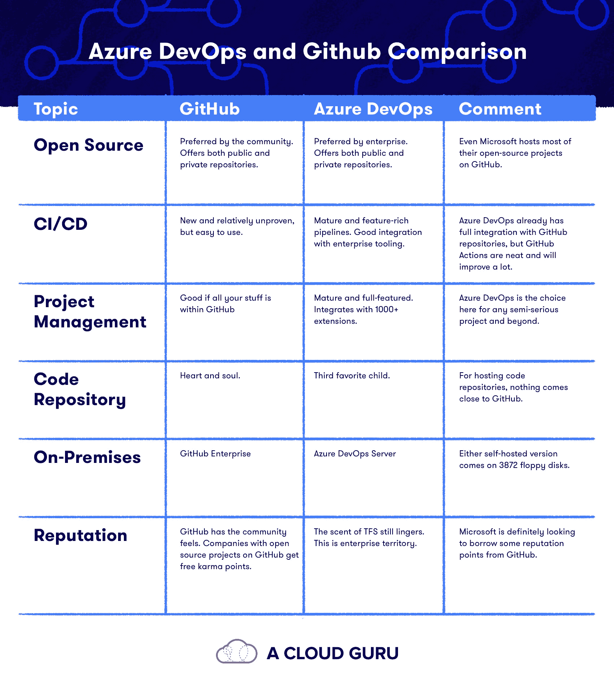

# Azure DevOps vs GitHub:哪个 DevOps 工具更好？|云专家

> 原文：<https://acloudguru.com/blog/engineering/azure-devops-vs-github-comparing-microsofts-devops-twins>

下面是两个 DevOps 工具的故事:Azure DevOps 和 GitHub。它们都归微软所有，但是这两个开发者协作工具相比如何呢？哪一个更好？让我们来了解一下！

* * *

## 加速您的职业发展

[从 ACG 开始](https://acloudguru.com/pricing)通过 AWS、Microsoft Azure、Google Cloud 等领域的课程和实际动手实验室改变你的职业生涯。

* * *

从前，有一个微软产品叫做 Team Foundation Server (TFS)。TFS 的网络版后来变成了 Visual Studio Online，又变成了 Visual Studio Team Services，也就是现在的 [Azure DevOps。](https://azure.microsoft.com/en-au/services/devops/)

微软在 2018 年收购了 Github，这也是一款 DevOps 工具，分享了很多相同的功能。我是说，这是怎么回事？

微软收购 GitHub 是为了加强其对开源开发的关注，并将微软的开发者工具带给新的受众，现在他们有两个非常成熟和非常受欢迎的 DevOps 工具。让我解释一下 Azure DevOps 和 Github 之间的一些差异和相似之处——让你更清楚地理解为什么有两个，以及每个适合在哪里。

* * *

## Azure DevOps vs GitHub:基础知识

先说一些常见的问题。已经知道 Azure DevOps 和 GitHub 是什么和做什么了吗？[往前跳！](#devopsvsgithub)

什么是 GitHub？

### [GitHub](https://github.com/) 是最知名的开源项目管理工具之一。Git 是一个版本控制系统。GitHub 是一个网站——一个人们在线共享 Git 仓库的平台。(存储库(repos)基本上是一段代码版本的快照。)

什么是 Azure DevOps？

### [Azure DevOps](https://azure.microsoft.com/en-us/services/devops/) 是一个构建软件的 Azure 开发者服务集合。Azure DevOps 包含了大多数人使用 GitHub 的功能，但它也有一些其他独特的功能。Azure DevOps 是一套完全集成的服务，为您提供构建和维护待办事项清单、托管您的源代码库、实现持续集成所需的所有工具，以及产品发布前的交付和测试工作流。无论你是不是开发人员，单独工作还是在团队中工作， [Azure DevOps training](https://acloudguru.com/course/introduction-to-azure-devops) 都可以帮助你组织你计划、创建和交付软件的方式。(翻译:基本上是你制造和推出一个产品所需要的一切。)

**人们如何使用 Azure DevOps？**

### [Azure DevOps 用于规划和协作](https://acloudguru.com/blog/engineering/devops-vs-agile-whats-the-difference)代码开发以及构建和部署应用程序。与 GitHub 相比，Azure DevOps 更受企业和[云支持](https://acloudguru.com/platform/accelerator-program)计划的青睐。像 Github 一样，它提供公共和私有存储库。

人们如何使用 GitHub？

### 开发者和公司使用 GitHub 来构建、发布和维护软件。它使协作和共享代码成为可能，并记录过程中发生的变化。(这个过程可以使追踪变得容易，比如说，一个 bug 是何时或者如何被引入的。)像 Azure DevOps 一样，它提供公共和私有存储库，并且往往是开发人员社区的最爱。甚至微软也将其大部分开源项目托管在 GitHub 上。

GitHub 能取代 Azure DevOps 吗？

### Azure DevOps 可以被看作是 GitHub 的一个替代品。它有储存库。但它也有其他工具。它还集成了 GitHub，所以有可能出现“为什么不两者都要”的情况。

如何学习 Azure DevOps？

### 无论你是不是开发人员，单独工作还是在团队中工作，ACG 的[Azure devo PS 入门课程](https://acloud.guru/overview/introduction-to-azure-devops) 都可以帮助你组织你计划、创建和交付软件的方式。本课程将向您展示 Azure DevOps 如何工作，如何开始，以及如何充分利用 Azure Boards、Azure Repos、Azure Pipelines、Azure 测试计划和 Azure 工件的提示和技巧。

我如何学习 GitHub？

### GitHub 提供学习实验室来帮助你入门。他们为期一小时的[GitHub 介绍课程](https://lab.github.com/githubtraining/introduction-to-github) 是免费的，是学习 GitHub 基础知识的好方法。

*想了解更多关于 Azure 认证的信息吗？
查看我们的 [Azure 认证指南](https://acloudguru.com/blog/engineering/which-azure-certification-is-right-for-me)。*

* * *

我们来看看 Azure DevOps 和 GitHub 共享的常用功能对比如何。

* * *

封闭源代码管理与开放源代码管理

### **GitHub:** 社区首选。提供公共和私有存储库。

*   **Azure DevOps** :企业首选。提供公共和私有存储库。
*   **哪个好？** 甚至微软也把他们的大部分开源项目托管在 GitHub 上。
*   传统上，GitHub 是开源社区和项目的首选。大型的知名项目如[Bootstrap](https://github.com/twbs/bootstrap)和[node . js](https://github.com/nodejs)都托管在 GitHub 上，甚至大部分微软的开发者工具和语言的代码库也在 GitHub 上开源。虽然公共项目在 GitHub 上是免费的，但它们也提供付费的私有库。

微软 Azure DevOps 在方法上更像是一个企业，虽然你肯定可以托管公共项目，但这并不是这个平台的特色。许多企业级公司将 Azure DevOps 作为其认可的产品套件的一部分。

**DevOps 持续集成和部署(CI/CD)**

### GitHub

*   Azure DevOps :成熟且功能丰富的管道。与企业工具的良好集成。
*   **哪个好？** Azure DevOps 已经与 GitHub 库完全集成，但 GitHub 动作很简洁，并将改进很多。
*   持续集成，或 CI，是不断将任何新代码合并到主/公共代码库中并构建它以确保没有任何东西被破坏的过程。“尽早失败”是与 CI 相关的咒语之一，其思想是越早发现错误，修复它们就越容易、越便宜。

GitHub 有一个特性叫做“”。这些操作可以“在您的存储库中自动化、定制和执行您的软件开发工作流”，包括建立一个 CI 过程。

Azure DevOps 有一整块平台专用于竞争情报。 [管道](https://azure.microsoft.com/en-au/services/devops/pipelines/) 是一项成熟且功能齐全的服务，可处理您的 CI 和 CD(持续交付)。事实上，GitHub Actions 的许多功能都是在与 Azure DevOps 相同的平台上构建的。

**DevOps 项目管理**

### **GitHub** :如果你所有的东西都在 GitHub 里面就好。

*   **蔚蓝 DevOps** :成熟且功能齐全。与 1000 多个扩展集成。
*   **哪个好？** Azure DevOps 是任何半严肃项目的选择。
*   有效流程的很大一部分意味着拥有一个有效的 [DevOps 项目管理](https://acloudguru.com/course/introduction-to-azure-devops) 工具来跟踪任务和时间表、问题和进度。GitHub 和 Azure DevOps 都有帮助项目经理的工具，但它们是平等的吗？

[GitHub 项目](https://github.com/features/project-management/) 是 GitHub 中不太为人所知的一部分，为已经在 GitHub 中的代码项目提供了一个很好的项目管理平台。

Azure DevOps 的项目管理方是 [Azure Boards](https://azure.microsoft.com/en-au/services/devops/boards/) ，它起源于 TFS，是一个非常成熟的产品。除了与 Azure DevOps 的其他部分无缝协作，Boards 还有 1000 多个扩展用于与其他系统集成。获得关于 Slack 的通知，连接到 AWS 服务，或者创建自动化文档。

**代码库**

### **GitHub** :心与心。

*   **蔚蓝 DevOps** :第三喜欢的孩子。
*   **哪个好？对于托管代码库来说，没有什么比 GitHub 更好的了。**
*   问几乎任何一个开源项目，他们的代码托管在哪里，都会是 GitHub。代码管理是 GitHub 的根基所在。这是它的心脏和灵魂。你可以用拉请求、分支、代码审查和其他东西做的一切都在这里。

Azure DevOps 也提供了很好的代码库，但它更像是第三受欢迎的孩子。它运行得非常好，几乎可以为你的项目做任何你想做的事情。

**内部**

### **GitHub** : GitHub 企业

*   **Azure devo PS**:Azure devo PS 服务器
*   **哪个好？** 要么自带 3872 软盘版本。
*   如果你不信任这种新奇的云技术，该怎么办？您可能对在云中托管新 Nicolas Cage 图像托管服务的代码有安全顾虑。好消息！你可以获得 GitHub 和 Azure DevOps 的自托管版本。

[GitHub Enterprise](https://github.com/enterprise)是来自 GitHub 的产品，提供 GitHub.com 的所有功能。同样，[Azure devo PS Server](https://azure.microsoft.com/en-au/services/devops/server/)自带 3872 软盘，让你安装愉快。

**声誉**

### **GitHub** :有社区感觉。在 GitHub 上有开源项目的公司可以获得免费的 karma 积分。

*   T2:TFS 的气味依然存在。这是企业号的地盘。
*   **哪个好？** 微软肯定是想从 GitHub 那里借点名声。
*   Azure DevOps 来自 TFS，它可能是用户中爱恨分歧最大的微软产品之一。所以 Azure DevOps 继承了一些这种划分。在许多变化和品牌重塑的实践中，出现了一种现代工具，它与过去的 TFS 时代相去甚远，但这种记忆有时仍然挥之不去。

另一方面，GitHub 是许多 DevOps 任务的默认平台，尤其是任何与代码管理有关的任务。大多数公司都会有一个使用 GitHub 的开发栈。

准备好深入潜水了吗？查看我们的 [AZ-400:设计和实施微软 DevOps 解决方案](https://acloudguru.com/course/az-400-designing-and-implementing-microsoft-devops-solutions) *认证课程。*

* * *

好吧，但是**Azure devo PS 和 GitHub 哪个更好？**

* * *

## 所有这些比较都很好，但是既然这两款产品如此相似，为什么微软会有两款呢？部分原因是 GitHub 正在成为一个巨大的微软代码库，同时也是一个巨大的竞争对手。GitHub 的流行持续到今天，现在我们也可以更直接地使用微软开发的非常优秀的开发工具。

那么，你应该选择哪个？不明确的回答当然是“视情况而定”你在创建什么样的项目？您需要哪些 DevOps 功能？您需要连接和自动化哪种系统？

希望你现在至少知道从哪里开始，首先尝试哪个平台。他们在不同的方面都很优秀。如需更多比较，请查看下面链接的[云提供商比较](https://acloudguru.com/videos/cloud-provider-comparisons)系列。