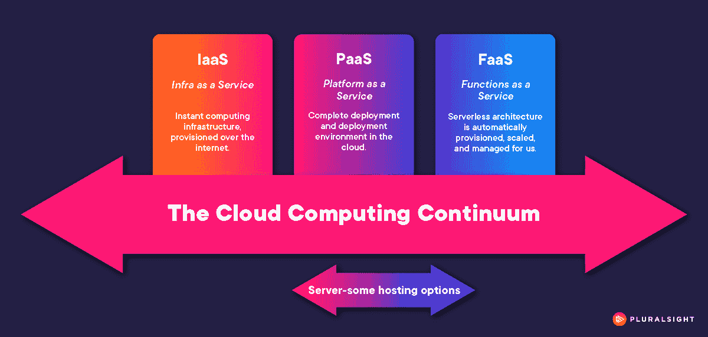

# Azure Functions:真的没有服务器，还是只有一些服务器？

> 原文：<https://acloudguru.com/blog/engineering/azure-functions-serverless-or-server-some>

如果你听过这个故事，请打断我:一名律师、一名水管工和一名 Azure Function 走进一家咖啡馆。律师立即宣布，“我每小时挣 400 美元。拿铁算我的！”水管工也不甘示弱，大声喊道:“我只要露面就能挣 125 美元，然后每小时收费 300 美元。糕点我请客！”

尴尬的沉默之后，水管工和律师都看了一眼这个功能，他咆哮道，“你看我干什么？我是*无服务器*功能。我每小时只挣几便士！”补充说，“你知道我；我是轻量级的。我只要一杯浓缩咖啡，然后回家。”

真实的故事。

好吧，好吧，我可能为了戏剧效果添加了一些细节。但我没有虚构的最重要的部分是这样一个事实，即编写良好的 Azure 功能——当部署在无服务器架构中时——每个运行时小时的成本非常低，将一件事情做得非常好，然后退出。

这里的关键词是“无服务器架构”仅仅因为有人编写并部署了 Azure 功能，并不能立即赋予该代码无服务器的地位。微软提供了几种托管 Azure 功能的方式，根据我的计算，[其中只有两种](https://learn.microsoft.com/en-us/azure/azure-functions/functions-scale)是完全“无服务器”的。

## 什么算是无服务器？

无论云提供商如何，无服务器托管通常被认为具有三个显著特征:

1.  云提供商管理运行代码的服务器。
2.  代码背后的服务器资源可以动态地伸缩。
3.  云客户只为代码运行时消耗的服务器资源付费。

Azure 针对功能的消费托管计划和高级托管计划符合这一定义，微软将这些描述为“功能即服务”。

## 寻找服务器——有些是连续的

Azure 功能的其他托管计划，涉及 Azure 应用服务的各种配置，以及 Kubernetes 和 Arc，当然有资格成为*云*架构，但不完全是*无服务器*架构。这些主机选择可以被最好地描述为*服务器-一些*。想象一下基于行业标准“某种即服务”类别的连续体上的各种托管选项:

所有的服务器-一些托管选项处于基础设施即服务(IaaS)和平台即服务(PaaS)之间的连续统一体中，只是稍微超出了功能即服务(FaaS)。这些选项将开发人员从基础设施管理的许多方面解放出来，但没有一个选项像真正的无服务器产品那样全面。

在这个连续的液体中贴上标签很像定义咖啡饮料(这个比喻是有意的；双关语是意外之喜)。一杯浓缩咖啡加半英寸泡沫牛奶是“多泡沫拿铁”还是“湿卡布奇诺？”一杯奶茶拿铁加两份浓缩咖啡是茶饮料还是咖啡饮料？那么一杯“单杯、高杯、无咖啡因、脱脂、无糖的摩卡奇诺”呢——那不就是棕色的水吗？也许这一个甚至没有找到它的方式进入咖啡连续体。

我担心我可能踩在了神圣的土地上，所以让我们回到函数和它们的托管架构上来。

## 标签改善决策

所有这些不仅仅是争论语义学的练习；对涉及 Azure 功能的架构进行分类或标记实际上有一个明显的好处。有了明确的界限，团队可以确保每个人都从相同的前提开始，以达到最佳的设计或托管决策。

(你能想象在没有共同理解定制标签(也就是菜单)的情况下决定一种咖啡饮料吗？试着在星巴克以外的任何地方点一杯大杯煮咖啡，你就会明白我的意思了。)

也就是说，很容易变得不知所措。所有的云提供商——尤其是微软——都试图随时向所有人提供一切。虽然选择是好的，但它可能会形成利弊混杂的矩阵。

幸运的是，在如何、何时以及为什么使用 Azure 功能——以及是否在无服务器环境中部署它们——的情况下，许多设计决策都归结为资源管理(顺便说一句，你永远不应该让咖啡水沸腾；它擦伤了豆子)。一旦您提出正确的问题，并在 IaaS、PaaS 和 FaaS 的更广泛类别中绘制您自己的自定义子定义和标签，这种对资源管理的关注就显而易见了。

你应该问自己这样的问题:

1.  你的 IT 管理人员比开发人员多，还是相反？
2.  你的时间比钱多吗？
3.  你有从零开始编码的奢侈吗？
4.  您是否试图将一个单一的应用程序拖到云中？
5.  您为您的解决方案设想的功能是轻量级的、单责任的、快速运行的代码，还是更有内涵的、倾向于一致或持续运行的应用程序？

有了这些问题的答案、你的标签枪、白板以及你选择的热饮，你和你的团队可以围绕无服务器和多服务器选择(你知道咖啡是一种水果吗？).作为这种方法的额外收获，当需要不可避免的航向修正时，您可以参考团队定义的标签框架。

# 想了解更多关于无服务器的信息吗？

要了解更多关于无服务器的概念，特别是 Azure 中的无服务器，请考虑查看以下 ACG 课程:

了解更多关于咖啡的知识和观点。。。好吧。。。我才不要把手指伸进那杯热咖啡里。选择你最喜欢的搜索引擎并努力去做。