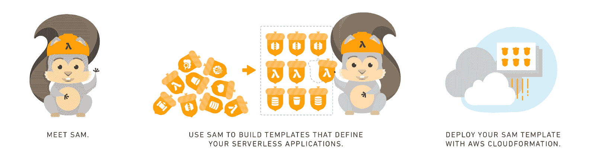
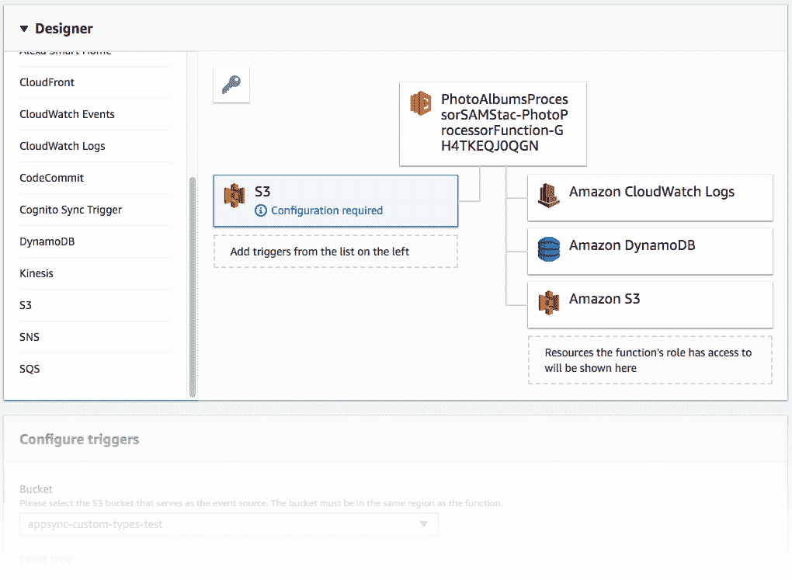
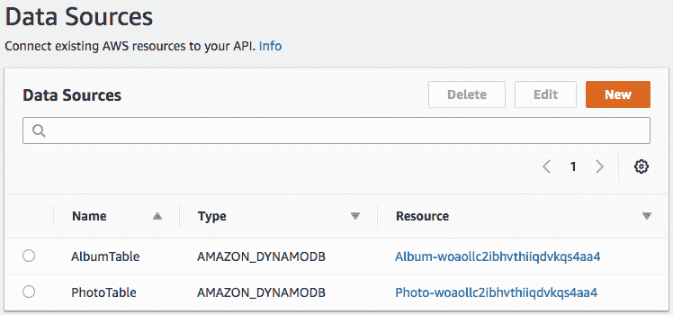
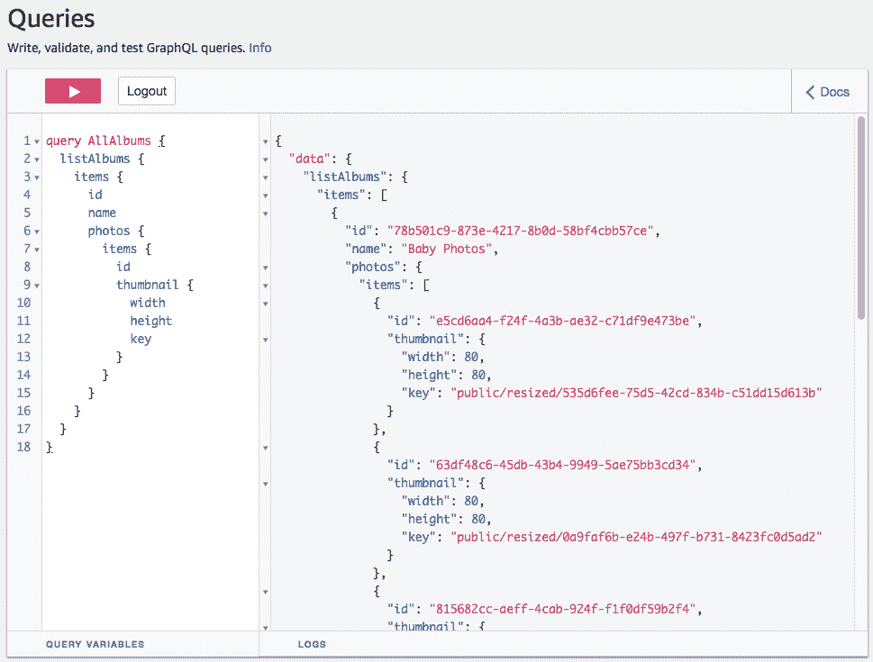
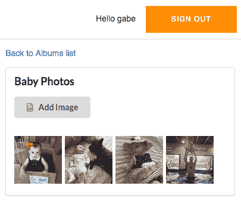

# 使用 React、GraphQL 和 AWS Amplify 构建您自己的多用户相册应用程序—第 2 部分，共 3 部分

> 原文：<https://acloudguru.com/blog/engineering/build-your-own-multi-user-photo-album-app-with-react-graphql-and-aws-amplify-part2>

添加 URL 路由、照片上传和相册详细信息视图

[***第一部分***](https://acloudguru.com/blog/engineering/build-your-own-multi-user-photo-album-app-with-react-graphql-and-aws-amplify-part1) ***|第二部分|*** [***第三部分***](https://acloudguru.com/blog/engineering/build-your-own-multi-user-photo-album-app-with-react-graphql-and-aws-amplify-part3) *这是一个由三部分组成的系列文章的第二篇，向您展示如何在 AWS 上构建一个可扩展的、高度可用的无服务器 web 应用程序，允许用户将照片上传到相册并与他人私下共享这些相册。*

* * *

**注意:**自从这个系列的最初出版以来，我已经将这些内容改编成了一个可在线访问的自定进度的研讨会，网址:【https://amplify-workshop.go-aws.com/】

* * *

在[第一部分](https://acloudguru.com/blog/engineering/build-your-own-multi-user-photo-album-app-with-react-graphql-and-aws-amplify-part1)中，我们启动了我们的应用程序，添加了身份验证，并集成了一个 GraphQL API，用于通过 web 前端创建相册记录，让我们列出相册名称并创建新的相册名称。

在第二部分中，我们将进行以下改进:

*   添加 URL 路由和视图，以便在相册列表和查看相册详细信息之间切换
*   使用 S3 将照片上传到相册，在云中自动生成缩略图，并将照片元数据存储在另一个 DynamoDB 表中，这样我们就可以将照片链接到相册
*   使用 GraphQL 模式中相册类型内的嵌套照片字段获取所选相册的所有照片

### 先决条件

在我们继续下面的步骤之前，我们还有一个要求。

**安装 SAM CLI** —在本文中，我们将使用 AWS 的一个工具来帮助打包和部署 AWS Lambda 函数，该工具名为 [AWS 无服务器应用程序模型(SAM)](https://github.com/awslabs/serverless-application-model) 和 [SAM CLI](https://github.com/awslabs/aws-sam-cli) 。请遵循 SAM CLI 的[安装说明，这也需要您安装 Docker(SAM 安装说明中提供了相关链接)。](https://docs.aws.amazon.com/serverless-application-model/latest/developerguide/serverless-sam-cli-install.html)

### 添加路由和相册详细信息视图

首先，因为我们希望有两种模式——一个相册列表视图和一个相册细节视图——让我们使用 [react-router-dom](https://reacttraining.com/react-router/web/guides/quick-start) 和一些新组件为 React 应用程序添加一些简单的路由，以帮助加载相册的细节和呈现相册。

跑`npm install --save react-router-dom`

然后，在`App.js`的顶部添加一些导入，创建一些新的组件来加载和呈现一个相册，并修改我们的应用程序组件来根据我们所处的路线呈现不同的组件。对`src/App.js`进行以下更改。

```
// src/App.js
// 1\. NEW: Import the routing components
import {BrowserRouter as Router, Route, NavLink} from 'react-router-dom';

// 2\. NEW: Add a new query we can use to render an album's details
const GetAlbum = `query GetAlbum($id: ID!) {
  getAlbum(id: $id) {
    id
    name
  }
}
`;

// 3\. NEW: Create an AlbumDetailsLoader component
//    to load the details for an album
class AlbumDetailsLoader extends React.Component {
  render() {
    return (
      <Connect query={graphqlOperation(GetAlbum, { id: this.props.id })}>
        {({ data, loading, errors }) => {
          if (loading) { return <div>Loading...</div>; }
          if (errors.length > 0) { return <div>{JSON.stringify(errors)}</div>; }
          if (!data.getAlbum) return;
          return <AlbumDetails album={data.getAlbum} />;
        }}
      </Connect>
    );
  }
}

// 4\. NEW: Create an AlbumDetails component
class AlbumDetails extends Component {
  render() {
    return (
      <Segment>
        <Header as='h3'>{this.props.album.name}</Header>
        <p>TODO: Allow photo uploads</p>
        <p>TODO: Show photos for this album</p>
      </Segment>
    )
  }
}
// 5\. EDIT: Replace the App component's render() method 
//    with updated code to control which components 
//    render depending on what route we're on
class App extends Component {
  // ...
  // Leave other parts of the App component alone
  // ...

  // Replace the render() method with this version: 
  render() {
    return (
      <Router>
        <Grid padded>
          <Grid.Column>
            <Route path="/" exact component={NewAlbum}/>
            <Route path="/" exact component={AlbumsListLoader}/>
            <Route
              path="/albums/:albumId"
              render={ () => <div><NavLink to='/'>Back to Albums list</NavLink></div> }
            />
            <Route
              path="/albums/:albumId"
              render={ props => <AlbumDetailsLoader id={props.match.params.albumId}/> }
            />
          </Grid.Column>
        </Grid>
      </Router>
    );
  }
}
```

我们的应用程序在这一点上看起来没有任何不同，但是如果我们修改 AlbumsList 组件，将相册名称呈现为遵循上面设置的路由路径的链接，我们应该能够点击并查看相册。当然，当我们查看一个相册的详细信息时，我们也需要一个链接来返回相册列表。让我们把这些都加进去。对`src/App.js`进行以下更改:

```
// src/App.js
// 1\. EDIT: Replace the AlbumsList component's albumItems()
//    with updated code to output the names as nav links
class AlbumsList extends React.Component {
  // Replace the existing albumItems() with this new one:
  albumItems() {
    return this.props.albums.sort(makeComparator('name')).map(album =>
      <List.Item key={album.id}>
        <NavLink to={`/albums/${album.id}`}>{album.name}</NavLink>
      </List.Item>
    );
  }

  // ... the rest of the AlbumsList component remains unchanged
}
```

此时，如果您查看该应用程序，您会看到我们可以单击某个专辑的名称，然后我们将更改视图并查看该专辑的详细信息(此外，我们在顶部有一个链接，可以返回到我们的专辑列表)。当然，现在我们所有的 AlbumDetails 组件所做的是呈现专辑的名称，加上一些我们稍后会用到的待办事项。在我们添加上传照片到相册的功能之前，我们不会获取任何其他相册信息，所以接下来让我们来处理这个问题。

### 将照片上传添加到相册

我们需要一个地方来存储上传到我们相册的所有照片，亚马逊简单存储服务(S3)是一个很好的选择。首先，我们将使用 Amplify CLI 为我们的应用程序启用存储，这将在亚马逊 S3 上创建一个存储桶，并为其设置适当的权限，以便登录到我们应用程序的用户可以在不同的位置和权限对其进行读写。您可以点击了解更多关于存储模块[的信息。](https://aws-amplify.github.io/amplify-js/media/storage_guide)

运行`amplify add storage`，在提示符下选择“**内容**，可以选择为资源类别和桶名输入您自己的名称，并对其进行配置，以便只有经过身份验证的用户才能访问，并具有完全的读/写权限。然后运行`amplify push`。以下是一些带有响应的示例输出:

```
$ amplify add storage
? Please select from one of the below mentioned services: Content (Images, audio, video, etc.)
? Please provide a friendly name for your resource that will be used to label this category in the project: photoalbumsstorage
? Please provide bucket name: <accept the default value>
? Who should have access: Auth users only
? What kind of access do you want for Authenticated users: read/write
$ amplify push
```

现在我们有了一个可以存储照片的 S3 存储桶，我们想创建一个 UI，让我们可以将照片上传到这个存储桶中进行存储。然后，我们需要跟踪该照片被上传到相册的意图，以便我们最终可以加载属于特定相册的所有照片。

让我们创建一个新的`S3ImageUpload`组件，它将包含一个 HTML 文件输入元素，当用户选择一张照片时，它将触发一个事件处理程序。我们的上传事件处理程序将需要上传文件到 S3 与一些元数据注释它的目的地专辑。幸运的是， [Amplify JS 存储模块](https://aws-amplify.github.io/amplify-js/media/storage_guide)让上传文件到 S3 变得非常容易。此外，我们需要为我们的应用程序引入一个新的依赖项——一种生成 UUIDs 的方法——因为我们需要确保上传到 S3 的文件具有唯一的名称(如果我们使用用户设备上的文件名，它们可能会冲突)。

运行`npm install --save uuid`然后更新我们的`src/App.js`文件，添加一些导入，创建一个`S3ImageUpload`组件，并将`S3ImageUpload`组件包含在`AlbumDetails`组件中。对`src/App.js`进行以下更改:

```
// src/App.js
// 1\. NEW: Add imports from uuid and semantic-ui-react
import {v4 as uuid} from 'uuid';
import { Form, Grid, Header, Input, List, Segment } from 'semantic-ui-react';

// 2\. EDIT: add an import of Storage from Amplify
import Amplify, { API, graphqlOperation, Storage } from 'aws-amplify';

// 3\. NEW: Create an S3ImageUpload component
class S3ImageUpload extends React.Component {
  constructor(props) {
    super(props);
    this.state = { uploading: false }
  }
  onChange = async (e) => {
    const file = e.target.files[0];
    const fileName = uuid();
    this.setState({uploading: true});
    const result = await Storage.put(
      fileName, 
      file, 
      {
        customPrefix: { public: 'uploads/' },
        metadata: { albumid: this.props.albumId }
      }
    );
    console.log('Uploaded file: ', result);
    this.setState({uploading: false});
  }
  render() {
    return (
      <div>
        <Form.Button
          onClick={() => document.getElementById('add-image-file-input').click()}
          disabled={this.state.uploading}
          icon='file image outline'
          content={ this.state.uploading ? 'Uploading...' : 'Add Image' }
        />
        <input
          id='add-image-file-input'
          type="file"
          accept='image/*'
          onChange={this.onChange}
          style={{ display: 'none' }}
        />
      </div>
    );
  }
}

// 4\. EDIT: Add the S3ImageUpload component 
//    to the AlbumDetails component
class AlbumDetails extends Component {
  render() {
    return (
      <Segment>
        <Header as='h3'>{this.props.album.name}</Header>
        <S3ImageUpload albumId={this.props.album.id}/>        
        <p>TODO: Show photos for this album</p>
      </Segment>
    )
  }
}
```

在这一点上没有太多要看的，但是你应该能够点击按钮，选择一个文件，并看到它改变为*‘Uploading…’*，然后再次切换回上传按钮。您还可以在 AWS web 控制台中手动浏览 S3 桶，查看文件是否正在上传。找到 bucket 名称最简单的方法是查看`src/aws-exports.js`并找到为`aws_user_files_s3_bucket`配置的值。在 S3 网络控制台中找到你的桶，然后在`public/uploads`下的桶中查找。

在我们的新`S3ImageUpload`组件中，有一些东西值得一提。它使用 AWS Amplify 的`Storage.put`方法将文件上传到我们为应用程序配置的 S3 桶中。在这个 API 调用中，我们传递了一些额外的选项。

我们传入`customPrefix: { public: 'uploads/' }`是因为我们想自动为每张图片制作缩略图。我们将通过在 S3 存储桶上添加一个触发器来完成这个任务，每当任何文件被添加到存储桶的`uploads/`路径时，这个触发器将为我们触发一个缩略图创建功能。新的缩略图也将被添加到桶中，为了避免递归触发器循环，其中每个缩略图的创建都会导致函数再次触发，我们将我们的触发器限定为只对添加了关键字前缀`uploads/`的文件执行。Amplify 知道使用我们的前缀，因为我们指定它用于应该公开访问的文件，这是`Storage.put`的默认权限级别。

默认情况下，应用程序中的任何用户都可以访问(在 API 级别)所有文件，这有问题吗？不。这是可以接受的，因为我们对照片键使用了不可访问的 UUID，如果用户知道某个相册的 UUID，他们将只能检索该相册的照片列表。如果你去阅读所有的 Amplify 存储模块的 API(或者如果你熟悉底层的 S3 API)，你可能会问“但是等等，用户可以只列出公共路径中的所有对象并看到所有的照片！”目前，你是对的，但我们稍后会处理这个问题，在我们的应用程序工作并采取额外的预防措施来进一步锁定它(通过将相册列表限制到某些用户名，并防止用户在桶中列出项目)。

我们传入`metadata: { albumid: this.props.albumId }`，因为我们要让我们的缩略图[S3λ触发器](https://acloudguru.com/hands-on-labs/setting-up-lambda-functions-with-s3-event-triggers)函数在完成缩略图制作后，负责将关于这张照片的信息添加到我们的数据存储中，并且该函数需要知道照片上传到了哪个相册。例如，我们可以将相册 ID 作为前缀或后缀放在 photo key 中，但我认为元数据方法更好。毕竟这个*是关于照片的*元数据吧？

### 生成缩略图

基于 AWS 构建的一个好处是服务之间的集成。在我们的例子中，我们希望有一些服务器端代码为我们上传的每张图片生成缩略图。在 AWS 上，我们可以通过创建一个 AWS Lambda 函数并设置我们的 S3 桶来在新对象进入桶时触发该函数，以无服务器的方式实现这一点。AWS Lambda 允许你用多种编程语言创作函数，但由于我们目前为止在这个应用程序中只使用 JavaScript，所以让我们留在 JS 领域，创建一个将在 Node.js 8.10 上运行的 Lambda 函数。有很多选项可以帮助您在 AWS Lambda 上创作和部署函数。对于本教程，我们将使用 [AWS 无服务器应用程序模型(SAM)](https://github.com/awslabs/serverless-application-model) 和 [SAM CLI](https://github.com/awslabs/aws-sam-cli) 。



SAM: The AWS Serverless Application Model

首先，遵循 SAM CLI 的[安装说明。

然后，在我们的`photo-albums`项目目录中，使用 SAM CLI 引导一个新的 Node.js 8.10 函数。](https://github.com/awslabs/aws-sam-cli/blob/develop/docs/installation.rst)

运行`sam init --runtime nodejs8.10 --name photo_processor`

这将在`photo_processor/hello_world`中创建一个示例函数。让我们把`photo_processor/hello_world`改名为更合适的名字:`photo_processor/src`。此外，虽然我是单元测试的粉丝，但我们不打算在本教程中编写任何单元测试，所以删除`photo_processor/src/tests`目录，因为一旦我们编写了照片处理代码，那里的占位符测试就无关紧要了。现在是时候开始写一些代码来响应来自 S3 桶的事件和调整我们的上传了。在撰写本文时，在 Node.js 中执行照片大小调整的一个流行选择是 [Sharp](http://sharp.dimens.io/en/stable/) ，因此下面是我们的 AWS Lambda 函数，我们应该将它放在`photo_processor/src/app.js`中。

当我们在这里使用 S3 API 时，我们还将包含处理从上传文件中获取元数据所需的代码，因为在本文后面将照片信息存储到 DynamoDB 时，我们将需要这些信息。

将此内容粘贴到`photo_processor/src/app.js`:

```
// photo_processor/src/app.js
const AWS = require('aws-sdk');
const S3 = new AWS.S3({ signatureVersion: 'v4' });
// Note: Sharp requires native extensions. To get sharp to install from NPM in a
// way that's compatible with the Amazon Linux environment that AWS runs Node.js
// on, we can use this command: docker run -v "$PWD":/var/task lambci/lambda:build-nodejs8.10 npm install
const Sharp = require('sharp');
// We'll expect these environment variables to be defined when the Lambda function is deployed
const THUMBNAIL_WIDTH = parseInt(process.env.THUMBNAIL_WIDTH, 10);
const THUMBNAIL_HEIGHT = parseInt(process.env.THUMBNAIL_HEIGHT, 10);
function thumbnailKey(filename) {
    return `public/resized/${filename}`;
}
function fullsizeKey(filename) {
    return `public/${filename}`;
}
function makeThumbnail(photo) {
    return Sharp(photo).resize(THUMBNAIL_WIDTH, THUMBNAIL_HEIGHT).toBuffer();
}
async function resize(bucketName, key) {
    const originalPhoto = (await S3.getObject({ Bucket: bucketName, Key: key }).promise()).Body;
    const originalPhotoName = key.replace('uploads/', '');
    const originalPhotoDimensions = await Sharp(originalPhoto).metadata();
    const thumbnail = await makeThumbnail(originalPhoto);
    await Promise.all([
        S3.putObject({
            Body: thumbnail,
            Bucket: bucketName,
            Key: thumbnailKey(originalPhotoName),
        }).promise(),
        S3.copyObject({
            Bucket: bucketName,
            CopySource: bucketName + '/' + key,
            Key: fullsizeKey(originalPhotoName),
        }).promise(),
    ]);
    await S3.deleteObject({
        Bucket: bucketName,
        Key: key
    }).promise();
    return {
        photoId: originalPhotoName,

        thumbnail: {
            key: thumbnailKey(originalPhotoName),
            width: THUMBNAIL_WIDTH,
            height: THUMBNAIL_HEIGHT
        },
        fullsize: {
            key: fullsizeKey(originalPhotoName),
            width: originalPhotoDimensions.width,
            height: originalPhotoDimensions.height
        }
    };
};
async function processRecord(record) {
    const bucketName = record.s3.bucket.name;
    const key = record.s3.object.key;
    if (key.indexOf('uploads') != 0) return;
    return await resize(bucketName, key);
}
exports.lambda_handler = async (event, context, callback) => {
    try {
        event.Records.forEach(processRecord);
        callback(null, { status: 'Photo Processed' });
    }
    catch (err) {
        console.error(err);
        callback(err);
    }
};
```

接下来，用下面的文件替换自动生成的 package.json 文件，这样我们就可以跟踪我们对 Sharp 的依赖。将以下内容粘贴到`photo_processor/src/package.json`:

```
{
  "name": "photo_processor",
  "version": "1.0.0",
  "description": "Our Photo Album uploads processor",
  "main": "src/app.js",
  "dependencies": {
    "sharp": "^0.20.2"
  }
}
```

最后，安装我们函数的依赖项。我们使用的是 Sharp，它需要本地扩展作为其安装的一部分，因此我们需要让 NPM 在亚马逊 Linux 环境中安装 Sharp，因为 AWS Lambda 将在该操作系统上运行我们的功能。幸运的是，有一个 docker 图像可以使这变得容易。

从 photo_processor/src 目录中，运行`docker run -v "$PWD":/var/task lambci/lambda:build-nodejs8.10 npm install`

，它会处理我们需要的一切，以便将我们的功能打包并部署到云中的 AWS Lambda。

### 打包和部署 Lambda 函数

SAM CLI 有助于引导 Lambda 函数(我们在上面已经做过了)，它还可以负责打包和部署 Lambda 函数。当我们引导我们的函数时，SAM CLI 还生成了一个 SAM 模板文件(YAML 格式)，它将被预处理成 AWS CloudFormation 模板文件。生成的 template.yml 定义了一个 Lambda 函数，该函数在响应 HTTP 请求时被触发。

#### 创建 SAM 模板文件

在我们的例子中，我们想要定义一个 Lambda 函数，它有权限在我们的存储桶上工作并向 Amazon CloudWatch 写入日志。我们不需要设置 HTTP 端点触发器，但是我们希望包含调整大小函数所期望的缩略图宽度和高度环境变量。此外，由于我们的存储桶是使用不同的云形成模板(通过 Amplify CLI)创建的，我们将配置该模板，以期望我们将存储桶的 Amazon 资源名称作为参数传入，以便我们可以设置适当的权限。下面的

是一个负责这一切的 SAM `template.yml`文件。用以下内容替换`photo_processor/template.yml`的内容:

```
# photo_processor/template.yml
AWSTemplateFormatVersion: '2010-09-09'
Transform: AWS::Serverless-2016-10-31
Description: >
    photo_processor
    Sample SAM Template for photo_processor
Parameters:
    S3UserfilesBucketArn:
        Type: String

Globals:
    Function:
        Timeout: 10
Resources:
    PhotoProcessorFunctionIamRole: 
        Type: "AWS::IAM::Role"
        Properties:
            AssumeRolePolicyDocument:
                Version: "2012-10-17"
                Statement:
                    - 
                        Effect: Allow
                        Principal:
                            Service: [lambda.amazonaws.com]
                        Action: ["sts:AssumeRole"]
            ManagedPolicyArns: ["arn:aws:iam::aws:policy/service-role/AWSLambdaBasicExecutionRole"]
            Path: "/"
            Policies: 
                - 
                    PolicyName: "AllPrivsForPhotoAlbumUserfilesBucket"
                    PolicyDocument: 
                        Version: "2012-10-17"
                        Statement: 
                            -
                                Effect: "Allow"
                                Action: "s3:*"
                                Resource: !Join ["/", [!Ref S3UserfilesBucketArn, "*"]]
    PhotoProcessorFunction:
        Type: AWS::Serverless::Function
        Properties:
            CodeUri: src/
            Handler: app.lambda_handler
            Role: !GetAtt PhotoProcessorFunctionIamRole.Arn
            Runtime: nodejs8.10
            Environment:
                Variables:
                    THUMBNAIL_WIDTH: 80
                    THUMBNAIL_HEIGHT: 80
    BucketPermission:
        Type: AWS::Lambda::Permission
        Properties:
            Action: 'lambda:InvokeFunction'
            FunctionName: !Ref PhotoProcessorFunction
            Principal: s3.amazonaws.com
            SourceAccount: !Ref "AWS::AccountId"
            SourceArn: !Ref S3UserfilesBucketArn
Outputs:
    PhotoProcessorFunction:
      Description: "Photo Processor Lambda Function ARN"
      Value: !GetAtt PhotoProcessorFunction.Arn
    PhotoProcessorFunctionIamRole:
      Description: "IAM Role created for Photo Processor function"
      Value: !GetAtt PhotoProcessorFunctionIamRole.Arn
```

#### 打包 SAM 模板文件

准备好 SAM 模板后，您需要让 SAM 打包您的 Lambda 函数，使其压缩函数及其依赖项，生成最终的 CloudFormation 模板，并将 CloudFormation 模板上传到 S3 存储桶(所有 CloudFormation 模板必须存在于 S3 存储桶中才能执行)。

作为一次性操作，创建一个 S3 存储桶来托管这个(以及任何未来的云信息)模板，注意创建具有唯一名称的存储桶，并指定 React 应用程序的`src/aws-exports.js`文件中引用的相同区域。运行以下命令(使用适当的替换):

```
export MY_UNIQUE_CLOUDFORMATION_TEMPLATES_BUCKET_NAME=PickAUniqueNameHere
aws s3 mb s3://$MY_UNIQUE_CLOUDFORMATION_TEMPLATES_BUCKET_NAME --region us-east-1
```

#### 部署 SAM 模板文件

现在，我们将使用 SAM CLI 将我们的 Lambda 函数打包并部署到云中。从`photo_processor`目录中，运行:

```
sam package \
--template-file template.yaml \
--output-template-file packaged.yml \
--s3-bucket $MY_UNIQUE_CLOUDFORMATION_TEMPLATES_BUCKET_NAME
```

最后，是时候部署 Lambda 函数了。前面的命令在`template.yml`文件旁边创建了一个`packaged.yml`函数，并上传了一个 lambda 函数及其依赖项的 zip 文件。我们将在部署命令中引用它，但我们还需要传入一个参数来告诉 CloudFormation 我们的应用程序用于文件存储的 S3 存储桶的 ARN。在 React 应用程序的`src/aws-exports.js`文件中查找`aws_user_files_s3_bucket`值，并在下面替换它。

在`photo_processor`目录中，运行(适当替换`S3UserfilesBucketArn`):

```
export MY_AWS_USERFILES_S3_BUCKET_ARN=arn:aws:s3:::my-aws-user-files-s3-bucket-name
sam deploy \
--template-file packaged.yml \
--stack-name PhotoAlbumsProcessorSAMStack \
--capabilities CAPABILITY_IAM \
--parameter-overrides \
--region us-east-1 \
S3UserfilesBucketArn=$MY_AWS_USERFILES_S3_BUCKET_ARN
```

经过短暂的等待，我们的 Lambda 函数应该已经部署好了，可以连接到 S3 来调整照片的大小了！如果你愿意，你可以在[部署无服务器应用文档](https://github.com/awslabs/aws-sam-cli/blob/develop/docs/deploying_serverless_applications.rst)中阅读更多关于用 AWS SAM 打包和部署 Lambda 函数的信息。

### 当照片上传到 S3 时调用我们的 Lambda 函数

现在我们的照片大小调整 Lambda 函数已经部署好了，我们需要向它添加一个*事件源*,这样每当有新照片上传到我们的存储桶时，它就会被调用。



Adding S3 uploads as a trigger for our photo_processor Lambda function

以下是如何连接 S3 桶上传触发我们的 Lambda:

1.  打开 AWS web 控制台，确保您位于我们的应用程序正在使用的同一区域，并加载 Lambda 控制台页面
2.  找到我们的 Lambda 函数的名称，其中应该有“PhotoProcessorFunction”(如果您有很多函数，可以使用搜索框缩小函数列表)，然后单击该函数以查看和管理其配置
3.  在页面顶部的设计器部分，从左侧的“添加触发器”列表中单击 S3
4.  在出现的“配置触发器”部分:
    a .选择您的存储桶的名称(您可以在`src/aws-exports.js`文件中查找)
    b .选择上传事件类型
    c .输入“上传/”作为前缀
    d .单击“添加”
5.  点击右上角的橙色“保存”按钮

完成后，每当新照片出现在前缀为`uploads/`的 S3 桶中时，就应该调用照片大小调整 Lambda 函数。您可以通过使用相册详细信息 web 界面将新照片上传到相册来检查事情是否正常，然后使用 S3 web 控制台浏览存储桶的内容；在`public/`和`public/resized/`找一张同名的照片。

### 将照片元数据存储在 DynamoDB 中

在显示相册中的所有照片之前，我们的最后一步是向 DynamoDB 中的一个表添加一个新条目，其中包含关于照片的元数据。我们在第一部分中定义的 GraphQL 模式描述了一个连接到`Album`的`Photo`类型。如果我们将新项目放入我们的 [AppSync](https://acloudguru.com/course/introduction-to-aws-appsync) Photo 的 datasource 中描述的表中，当我们试图通过 GraphQL 查询获取相册的嵌套照片时，该信息将是可用的。为了简单起见，我们将添加现有的`photo_processor` Lambda 函数，而不是创建另一个函数。我们需要为插入到 Dynamo 中的每张照片生成一个唯一的 ID，所以让我们引入另一个包。从`photo_processor/src`目录，运行:`npm install --save uuid`

由于 DynamoDB 文档客户端类的存在，从 JavaScript 和 AWS JS SDK 使用 DynamoDB 变得非常容易。对`photo_processor/app.js`进行如下更改:

```
// photo_processor/app.js
// 1\. NEW: Import the DynamoDB DocumentClient and the uuid module
const DynamoDBDocClient = new AWS.DynamoDB.DocumentClient({apiVersion: '2012-08-10'});
const uuidv4 = require('uuid/v4');

// 2\. NEW: Extract the name of the photos table 
//    from an environment variable (we'll set this value via
//    our SAM template below...)
const DYNAMODB_PHOTOS_TABLE_NAME = process.env.DYNAMODB_PHOTOS_TABLE_ARN.split('/')[1];

// 3\. NEW: Add a new function to handle putting 
//    our new Photo info into DynamoDB
function storePhotoInfo(item) {
  const params = {
    Item: item,
    TableName: DYNAMODB_PHOTOS_TABLE_NAME
  };
  return DynamoDBDocClient.put(params).promise();
}

// 4\. NEW: Add a new function to get the metadata for a photo
async function getMetadata(bucketName, key) {
  const headResult = await S3.headObject({Bucket: bucketName, Key: key }).promise();
  return headResult.Metadata;
}

// 5\. EDIT: Replace processRecord() with this definition, 
//    which passes the metadata and the sizes info 
//    to storePhotoInfo(). 
//
//    We'll also add a createdAt property to our photo items 
//    which will be helpful when we get around to 
//    paginating photos in date order.
async function processRecord(record) {
  const bucketName = record.s3.bucket.name;
  const key = record.s3.object.key;

  if (key.indexOf('uploads') != 0) return;

  const metadata = await getMetadata(bucketName, key);
  const sizes = await resize(bucketName, key);    
  const id = uuidv4();
  const item = {
    id: id,
    owner: metadata.owner,
    photoAlbumId: metadata.albumid,
    bucket: bucketName,
    thumbnail: sizes.thumbnail,
    fullsize: sizes.fullsize,
    createdAt: new Date().getTime()
  }
  await storePhotoInfo(item);
}
```

更新 SAM `template.yml`文件，添加我们在上面介绍的新环境变量，并添加一个新的策略，允许我们的 Lambda 函数写入照片表:

```
# photo_processor/template.yml
# ...
Parameters:
    # ...

    # 1\. NEW: Add another parameter
    DynamoDBPhotosTableArn:
        Type: String
# ...
Resources:
    # ....
    PhotoProcessorFunctionIamRole:
        Properties:
            # ...
            Policies:
                # ...

                # 2\. NEW: Add another policy
                - 
                    PolicyName: "AllPrivsForDynamo"
                    PolicyDocument: 
                        Version: "2012-10-17"
                        Statement: 
                            -
                                Effect: "Allow"
                                Action: "dynamodb:*"
                                Resource: 
                                    - !Ref DynamoDBPhotosTableArn

# ...

    PhotoProcessorFunction:
        # ...
            Environment:
                Variables:
                    # ...

                    # 3\. NEW: add a new environment 
                    #    variable referencing our param
                    DYNAMODB_PHOTOS_TABLE_ARN: !Ref DynamoDBPhotosTableArn
```

完成这些更改后，我们的`photo_processor` Lambda 现在应该为每张上传的照片创建一个缩略图，并在我们的 photos DynamoDB 表中创建一个新记录，该记录包含让我们的前端很好地呈现相册所需的数据。

现在是时候部署 Lambda 函数的更新版本了(重复我们之前运行的相同的 sam 包和 sam deploy 命令)。假设之前导出的变量仍然存在(您在同一个终端会话中)，我们只需要为 DynamoDB 照片表 ARN 定义一个新的环境变量。



Viewing the data sources for our AppSync AP

要查找正确的照片表，ARN:

1.  转到 AWS AppSync web 控制台中的 API
2.  单击“数据源”
3.  找到 PhotoTable 条目，单击表名的链接，转到 DynamoDB web 控制台
4.  复制 DynamoDB 表格概述选项卡底部的 ARN

找到 ARN 后，将其替换到下面的 export 语句中，并在 SAM 命令使用的同一终端窗口中运行以下命令(因此我们已经设置的其他环境变量仍然是定义的)。注意:不要改变下面的`stack-name`参数；我们希望它与 Amplify 创建的堆栈有所不同。

从`photo_processor`目录中，运行:

```
# Fill in the value below with the ARN for your DynamoDB Photos table
export MY_DYNAMODB_PHOTOS_TABLE_ARN=my-dynamo-db-photos-table-arn
sam package \
--template-file template.yaml \
--output-template-file packaged.yml \
--s3-bucket $MY_UNIQUE_CLOUDFORMATION_TEMPLATES_BUCKET_NAME
sam deploy \
--template-file packaged.yml \
--stack-name PhotoAlbumsProcessorSAMStack \
--capabilities CAPABILITY_IAM \
--region us-east-1 \
--parameter-overrides \
S3UserfilesBucketArn=$MY_AWS_USERFILES_S3_BUCKET_ARN \
DynamoDBPhotosTableArn=$MY_DYNAMODB_PHOTOS_TABLE_ARN
```

从现在开始，我们从应用程序上传的任何新照片都应该在 photos DynamoDB 表中有一行。尝试从前端进行另一次上传，在下一部分，我们将看看是否可以通过 GraphQL 获取照片信息。

### 为相册获取照片

我们的 GraphQL 模式已经表明一个`Album`中有一个`Photos`字段(类型为`[Photo]`)。我们已经注意到向保存照片信息的 DynamoDB 表写入行，通过每张照片上传期间提供的`albumid`元数据将每个条目链接到一个相册。Amplify CLI 已经编写了一个解析器来正确查找给定相册的相关照片。所以我们应该能够向 GraphQL 请求属于某个特定相册的照片。让我们试一试。



Querying our AWS AppSync API in the web console

回到 AWS AppSync web 控制台，转到查询部分并运行以下查询:

```
query AllAlbums {
  listAlbums {
    items {
      id
      name
      photos {
        items {
          id
          bucket
          thumbnail {
            width
            height
            key
          }
        }
      }
    }
  }
}
```

如果自从我们上次部署 Lambda 以来，你在相册中添加了任何照片，你应该会看到一些相册也包含了照片！剩下的就是在我们的 UI 中显示这些图像。

### 渲染相册中的所有照片

为了渲染每张照片，我们可以利用 AWS Amplify JS 库提供的另一个 React 组件:`S3Image`(你可以在这里阅读关于这个组件[的更多信息)。让我们更新我们的`GetAlbum`查询来获取相册的照片，创建一个新的`PhotosList`组件，并在我们的`AlbumDetails`组件中使用它。对`src/App.js`进行如下修改:](https://aws-amplify.github.io/amplify-js/media/storage_guide)

```
// src/App.js
// 1\. NEW: Add an import of S3Image 
//    and add Divider to imports from semantic-ui-react
import { S3Image } from 'aws-amplify-react';
import { Divider, Form, Grid, Header, Input, List, Segment } from 'semantic-ui-react';

// 2\. EDIT: Update our GetAlbum query to include 
//    fetching thumbnail info for each photo
const GetAlbum = `query GetAlbum($id: ID!) {
  getAlbum(id: $id) {
    id
    name
    photos {
      items {
        thumbnail {
          width
          height
          key
        }
      }
      nextToken
    }
  }
}
`;

// 3\. NEW: Create a new PhotosList component
class PhotosList extends React.Component {
  photoItems() {
    return this.props.photos.map(photo =>
      <S3Image 
        key={photo.thumbnail.key} 
        imgKey={photo.thumbnail.key.replace('public/', '')} 
        style={{display: 'inline-block', 'paddingRight': '5px'}}
      />
    );
  }
  render() {
    return (
      <div>
        <Divider hidden />
        {this.photoItems()}
      </div>
    );
  }
}
// 4\. EDIT: Add PhotosList to AlbumDetail's render()
class AlbumDetails extends Component {
  render() {
    return (
      <Segment>
        <Header as='h3'>{this.props.album.name}</Header>
        <S3ImageUpload albumId={this.props.album.id}/>        
        <PhotosList photos={this.props.album.photos.items} />
      </Segment>
    )
  }
}
```

如果你现在刷新你的应用，你应该会看到为你正在查看的相册加载的照片。呜！如果你添加了新的照片，等待 Lambda 函数被 S3 调用，然后刷新，你的新照片应该也可以看到了。



Viewing an album after uploading some photos

此时，关于我们的照片列表体验，有三件事值得讨论:

*   为了看到新照片而刷新相册视图并不是一个很好的用户体验，但是这篇文章已经介绍了相当多的内容，下一篇文章还会介绍更多内容。简而言之，处理这个问题的方法是让我们的 photo_processor Lambda 函数触发 API 上的一个突变，并让 AlbumDetailsLoader 组件订阅这个突变。然而，因为我们使用 Amazon Cognito 用户池身份验证，让我们的 Lambda 函数触发这种变异的唯一方法是创建一种“系统”用户(通过正常的用户注册和确认过程)，安全地存储该用户的凭证(可能在 [AWS Secrets Manager](https://aws.amazon.com/secrets-manager/) 中)，并在我们的 Lambda 中以该用户的身份向我们的 AppSync API 进行身份验证，以便触发变异。
*   如果一个相册中有很多照片，我们的 API 不会在第一个`getAlbum`查询中返回所有照片。相反，我们需要增强我们的`AlbumDetails`组件，以允许用户对旧照片进行分页，按需加载更多内容。我们将在下一篇文章中讨论这个问题。
*   我们目前只渲染每张照片的缩略图。当你点击一张照片时，显示它的完整尺寸可能会很好。我将把这些改进留给读者作为练习。🙂

### 接下来

在这篇文章中，我们已经讨论了很多内容。我们向 React 应用程序添加了路由，创建了用于加载和呈现相册细节、将照片上传到相册以及在相册中显示照片的组件。我们制作了一个 AWS Lambda 函数来为我们的照片自动创建缩略图，并且我们学习了如何使用 SAM CLI 打包和部署 Lambda。

在本系列的[下一篇(也是最后一篇)](https://read.acloud.guru/build-your-own-multi-user-photo-album-app-with-react-graphql-and-aws-amplify-bcaeba942159)文章中，我们将改进照片的列表和分页体验，为我们的相册添加细粒度的安全性，并且我们将了解如何将我们的应用部署到 CDN，以在全球范围内加快加载速度。

如果你想在新帖子发布时得到通知，请在 Twitter 上关注我: [Gabe Hollombe](https://medium.com/@gabehollombe) 。如果你对这篇文章有任何问题或反馈，这也是联系我的最好方式。

[***第一部分***](https://acloudguru.com/blog/engineering/build-your-own-multi-user-photo-album-app-with-react-graphql-and-aws-amplify-part1) ***|第二部分|*** [***第三部分***](https://acloudguru.com/blog/engineering/build-your-own-multi-user-photo-album-app-with-react-graphql-and-aws-amplify-part3) *这是一个由三部分组成的系列文章的第二篇，向您展示如何在 AWS 上构建一个可扩展的、高度可用的无服务器 web 应用程序，允许用户将照片上传到相册并与他人私下共享这些相册。*

### 启动我们到目前为止所建立的

如果你想检查一个回购并启动我们到目前为止构建的应用程序，请在 GitHub 上检查这个回购并使用 blog-post-part-one 标签，链接如下:[https://GitHub . com/gabehollombe-AWS/react-graph QL-amplify-blog-post/tree/blog-post-part-two](https://github.com/gabehollombe-aws/react-graphql-amplify-blog-post/tree/blog-post-part-two)。按照自述文件中的步骤配置和启动应用程序。