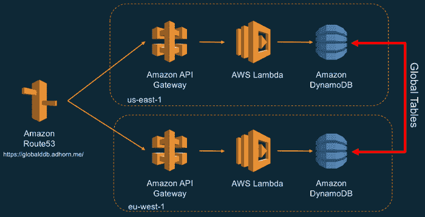
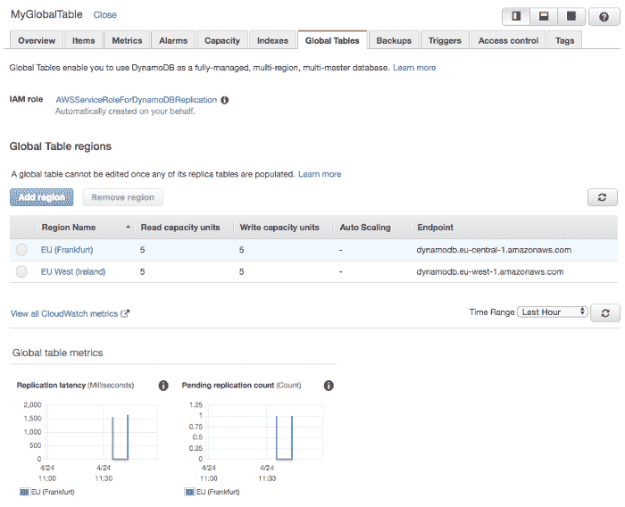
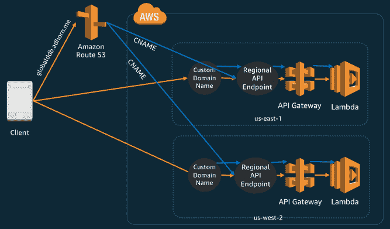

# 如何构建无服务器多区域后端

> 原文：<https://acloudguru.com/blog/engineering/building-a-serverless-multi-region-active-active-backend>

*该解决方案使用 DynamoDB 全局表、AWS Lambda、区域 API 网关和 Route53 路由策略构建*

在之前的帖子中，我们探讨了可用性和可靠性以及在 AWS 上构建多区域、主动-主动架构的 T2 需求和方法。在这篇博文中，我将带您了解构建和部署一个**无服务器多区域、主动-主动后端**所需的步骤。

这真的让我大吃一惊——因为我可以在一篇博文中解释这一点，你应该可以在大约一个小时内部署一个全功能的后端。相比之下，几年前这需要更多的专业知识、工作、时间和金钱！

首先，让我们看看最终的解决方案，这样我们就知道接下来会发生什么。

## 将 DynamoDB 用于多区域数据库

这里给出的解决方案相当简单。它利用了 [DynamoDB 全局表](https://docs.aws.amazon.com/amazondynamodb/latest/developerguide/GlobalTables.html)，后者提供了一个完全托管的多区域、多主数据库。

我们还将利用 AWS Lambda 实现业务逻辑和 API 网关中新的[区域 API 端点。最后，我们的解决方案使用](https://docs.aws.amazon.com/apigateway/latest/developerguide/create-regional-api.html) [AWS Route 53](https://acloudguru.com/blog/engineering/configure-dns-with-route-53) 路由策略在两个 AWS 区域之间动态路由流量。

Multi-Region, Active-Active Serverless Backend Solution Overview

**我们开始吧！**

* * *

### 步骤 1:在 DynamoDB 中创建一个全局表

请记住，DynamoDB 全局表由多个副本表组成，每个副本表对应一个选择区域*(目前支持 5 个区域)*，DynamoDB 将其视为一个单元。每个副本都有相同的表名和相同的主键模式。

要开始创建一个全局表，打开 [DynamoDB 控制台](https://console.aws.amazon.com/dynamodb/home)创建一个带有主键的表。在我们的示例中，我们将使用 ***MyGlobalTable*** 和 ***item_id*** 作为主键，并单击 **Create** 。该表将作为全局表中的第一个副本表。

*   一旦创建了表格，选择**全局表格**选项卡
*   您会注意到创建了一个全局表
*   您应该启用 [DynamoDB 流](https://docs.aws.amazon.com/amazondynamodb/latest/developerguide/Streams.html)
*   点击**启用流**

> **注意** *:你会注意到一个弹出窗口，提到正在使用的流的视图类型——***新旧图像** *。这仅仅意味着每当表中的数据被修改时，表中该项目的新旧图像都将被写入流中。当然，这个流用于跨区域复制数据。*

然后，您可以**将区域**添加到您想要部署副本表的全局表中。

这将在您选择的区域启动表创建过程。几秒钟后，您应该能够看到新创建的全局表的不同区域。

您可以使用 AWS CLI 做同样的事情——事实上这是值得鼓励的！

然后，您可以使用以下代码测试全局表:

你注意到 DynamoDB 全局表创建的新字段了吗？跨区域复制过程添加了***AWS:rep:update region***和***AWS:rep:update time***属性，以便您可以跟踪项目的来源；这两个字段都可以被您应用程序使用，但是当然不应该被修改。

* * *

### 步骤 2:使用 AWS Lambda 和 API 网关创建后端

由于我们解决方案的这一部分利用了新的区域 API 端点，让我们先来看看。

**API Gateway Regional Endpoints** A[Regional API Endpoints](https://docs.aws.amazon.com/apigateway/latest/developerguide/create-regional-api.html)是一种新的端点类型，可以从部署了 REST API 的同一个 AWS 区域进行访问。当 API 请求来自与 REST API 相同的区域时，这可以改善请求延迟。

Regional API Endpoints for Amazon API Gateway

**后端函数** 出于演示目的，我们将创建三个函数；一个是将项目发布到 DynamoDB，一个是从 DynamoDB 获取项目，还有一个健康检查来确保后端是健康的。

> **注意**:你注意到健康功能的极端复杂性了吗？我知道…这样做是为了以后我可以很容易地测试 Route53 中的故障转移机制。请比我聪明🙂

为了部署这些功能，让我们使用[无服务器框架](https://serverless.com/)。为什么？自从它最初作为 **[大白鲨](https://serverlesscode.com/post/serverless-formerly-jaws/)** 推出以来，我一直在使用它，我喜欢它——就这么简单。您也可以使用 [AWS 无服务器应用程序模型 SAM](https://docs.aws.amazon.com/lambda/latest/dg/serverless_app.html) 做同样的事情。

使用无服务器框架部署 API 的模板如下:

> **注意**:请确保将 [serverless.yml](https://gist.github.com/adhorn/cab4b461f46cc66f27d49e1de4230c7f) 文件中的“xxxxxxxxxxxxx”替换为您之前创建 DynamoDB 表时使用的 AWS 帐户 ID。

将 API 部署在爱尔兰和法兰克福——或者您用于 DynamoDB 表的地区。

> **注意** *:如果在部署中发现关于 endpointType 的错误，在* [serverless.yml](https://gist.github.com/adhorn/cab4b461f46cc66f27d49e1de4230c7f) *文件中将其注释掉，然后重新部署。然后，您可以登录到 API 网关控制台，手动将端点类型转换为区域类型。*

**测试地区 API** 由于我们之前已经在数据库中插入了一个“foobar”项目，我们可以尝试通过 rest API 访问它。

太好了！我们的项目可从两个地区。现在让我们创建一个新的。

太棒了——它起作用了。

* * *

### 步骤 3:创建自定义域名

接下来，让我们为这些区域 API 端点创建一个 Amazon API 网关自定义域名端点。为此，您必须拥有一个可在 Route 53 中使用的托管区域和域，以及一个用于特定域名的 SSL 证书。

现在，在您部署了 API Gateway 和 AWS Lambda 后端的每个地区，从[AWS Certificate Manager(ACM](https://eu-west-1.console.aws.amazon.com/acm/home?region=eu-west-1))请求一个 SSL 证书。

在这些步骤结束时，它会要求您通过电子邮件或在 Route 53 DNS 配置中添加特殊记录集来验证您的请求。

一旦一切都得到验证，您就可以将每个区域中的 API 网关端点配置为拥有一个自定义域名。在这两个区域中，您实际上配置了相同的自定义域名。请注意，基本路径映射需要在根路径'**/【T1]'和目标路径上，目标路径是之前部署的 API，还有 stage 变量—这里是 *dev* 。**

> **注意**:确保 name 字段中自定义域名的名称与您的域名匹配，否则它将无法工作(我使用的是 globe.adhorn.me)。

一旦您配置了新的自定义域名，就获取**目标域名**——在最后的步骤中需要它们。

* * *

### 步骤 4:在 53 号公路上增加健康检查

一旦您有两个或更多执行相同功能的资源，例如我们的多区域、主动-主动后端，您就可以使用 Route 53 的健康检查功能将流量仅路由到“健康”资源。

让我们使用之前部署的健康 API 来配置我们的健康检查。

对每个地区的运行状况检查 API 执行相同的操作。一旦完成，您应该能够在 Route 53 的健康检查中看到健康状态变为绿色。

* * *

### 步骤#5:使用 Route 53 在区域之间添加路由策略

现在是最后一部分——添加部署在法兰克福和爱尔兰的两个区域 API 之间的路由策略。

进入 Route 53 控制台，添加如下流量策略。在配置自定义域名时，使用 API Gateway 创建的**目标域名**，以便在策略中设置端点值。

最后，使用之前创建的流量策略创建策略记录 DNS 名称。

瞧！您的多区域、主动-主动后端已准备好接受测试！

它非常有效！

* * *

### 步骤 6:测试 53 号公路的故障转移功能

通过将 AWS Lambda 控制台中的环境变量 STATUS(在 ***eu-west-1*** 、Ireland 中)设置为 404 并保存，来修改精心制作的(*讥讽…*)***makehealthcheckcalls()***函数返回的值。

过一会儿，您应该会看到 53 号公路的健康检查状态从健康变为**不健康。**在理想情况下，您还会为检查创建一个警报。

现在，尝试在数据库中创建一系列项目。

正如您在下面看到的，所有创建的新项目都以 ***eu-central-1*** 地区为起点(法兰克福)——因此使用 53 号公路健康检查的故障转移功能按预期工作。

* * *

### 这是一个总结！

现在你可能想知道是不是这样——嗯，是的。这篇文章是一个介绍，给你新的想法，也许挑战一些旧的。

您可以做很多事情来改进这里介绍的解决方案，其中一些可以添加身份验证、监控、持续集成和部署，等等。

我没有包括身份验证的原因很简单，目前，Cognito 不支持跨多区域的用户池同步——所以需要手工构建。已经有一个+1 的论坛线程来支持该功能，所以如果你也想这样，请添加你的😉

在这篇文章中，我们已经构建了一个无服务器的多区域、主动-主动后端，由 DynamoDB 全局表、AWS Lambda 和 API Gateway 提供支持。我们还了解了如何使用 Route 53 在地区之间路由流量，同时支持故障转移机制。

我仍然对此感到惊讶——因为就在几年前，这还需要做更多的工作。回到 2012 年的平安夜，网飞流媒体服务经历了一次中断，这几乎是他们构建主动-主动多区域架构之旅的起点。那也是我爱上弹性架构的时候——我希望你也会受到启发，为了设计明天的解决方案，挑战目前可能的极限。

在接下来的一系列帖子中，我将谈论[混沌工程](https://acloudguru.com/blog/engineering/how-to-improve-your-systems-by-injecting-controlled-failure-with-chaos-engineering)并特别讨论为什么要练习打破东西。我将使用这里介绍的这种无服务器多区域、主动-主动体系结构作为实验的起点。敬请期待！

**【更新】—我在这里发表了** [**VPC 对 AWS Lambda 和 DynamoDB 的支持！**](https://medium.com/@adhorn/adding-support-for-vpc-build-a-serverless-multi-region-active-active-backend-solution-d80d25157688)

### 想要更多的云朵吗？看看这些: