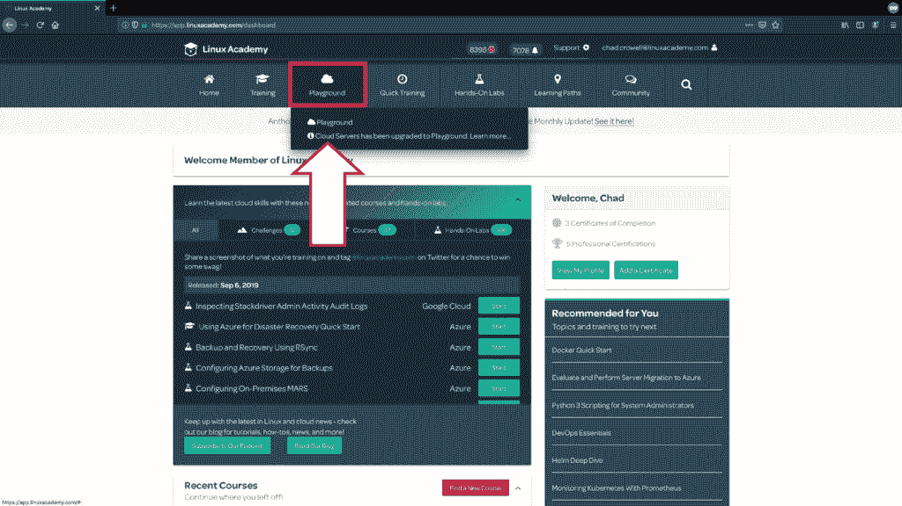
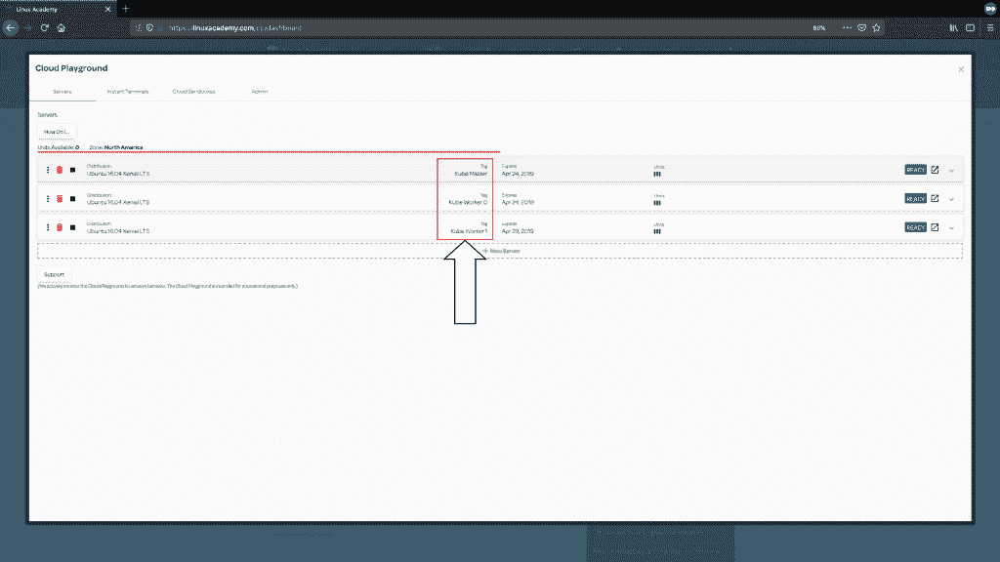
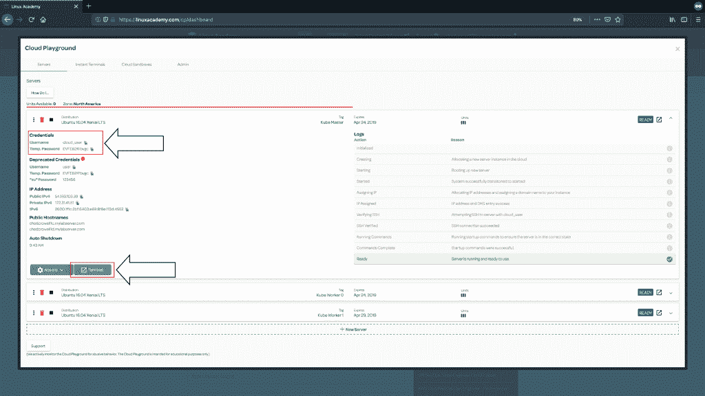

# 构建三节点 Kubernetes 集群：快速指南

> 原文：<https://acloudguru.com/blog/engineering/building-a-three-node-kubernetes-cluster-quick-guide>

构建 Kubernetes 集群有很多方法。其中之一是使用一种叫做 kubeadm 的工具。 [Kubeadm](https://acloudguru.com/hands-on-labs/building-a-kubernetes-cluster-with-kubeadm) 是创建第一个 Kubernetes 集群时的官方工具。由于启动和运行起来很容易，我想我应该整理一下使用 kubeadm 安装 Kubernetes 集群的快速指南！如果你已经是 Linux 学院的学生，[在这里登录](https://linuxacademy.com/login?utm_source)继续学习，或者你可以注册[7 天免费试用](https://linuxacademy.com/pricing?utm_source)开始学习。**立即启动服务器** Linux Academy 云服务器是构建您的集群的最佳方式，因为如果您搞砸了，很容易删除服务器并在几分钟内重新创建它。因此，让我们去我们的 Linux 学院[云操场](https://wpengine.linuxacademy.com/linux-academy/introducing-cloud-playground-even-more-hands-on-training-features/?utm_source)并启动一些服务器。从 Linux academy 导航栏中选择**云服务器**，然后选择**游乐场**。

[](https://linuxacademy.com)

Finding the Linux Academy Cloud Playground Servers

让我们启动三台服务器，都是相同的类型，使用 Ubuntu 16.04 Xenial LTS 发行版，中等大小。作为您的帐户访问的一部分，您总共有九个单元，因此创建三个中型服务器将足以达到该容量。三节点集群对于大多数实践集群来说已经足够，并且允许您创建所有想要的资源。我们将为服务器添加一个标签，这不会改变机器本身的任何内容，它只是一个帮助您组织云服务器的名称，以便您可以区分它们。特别是当您创建具有相同分布和大小的服务器时，这将有助于我们理解主服务器和工作节点之间的区别。让我们为其中一个输入“Kube Master”的名称，将另外两个称为“Kube Worker 0”和“Kube Worker 1”。以下是它们全部贴上标签后的样子:

[](https://linuxacademy.com)

Creating Linux Academy Cloud Playground Servers

**登录并开始构建**一旦服务器显示“就绪”状态，让我们继续登录。单击服务器以展开并显示每台服务器的详细信息。点击临时密码旁边的页面图标，点击**终端**，在新的浏览器标签中打开终端。输入用户名并粘贴提供的临时密码。

[](https://linuxacademy.com)

Log in to your Linux Academy Cloud Playground servers.

让我们同时登录三台服务器。这将使在每台服务器上执行命令变得更加容易，只需切换到下一个浏览器选项卡并粘贴命令即可。我们在每台服务器上要做的第一件事是为 docker 存储库添加 gpg 密钥。Docker 是我们将要使用的容器运行时。

```
curl -fsSL https://download.docker.com/linux/ubuntu/gpg | sudo apt-key add -
```

现在，在所有三台服务器上，让我们将 Docker 添加到我们的存储库中。

```
sudo add-apt-repository    "deb [arch=amd64] https://download.docker.com/linux/ubuntu    $(lsb_release -cs)    stable"
```

仍然应用于三个服务器中的每一个，为 Kubernetes 添加我们的 gpg 密钥，然后添加存储库。

```
curl -s https://packages.cloud.google.com/apt/doc/apt-key.gpg | sudo apt-key add -
```

```
cat << EOF | sudo tee /etc/apt/sources.list.d/kubernetes.listdeb https://apt.kubernetes.io/ kubernetes-xenial mainEOF
```

现在我们已经锁定了我们的库，让我们更新我们的包。

```
sudo apt-get update
```

**安装 Docker、kubelet、kubeadm 和 kubectl** 现在，让我们在所有三台 Linux Academy 服务器上安装 Docker、kubelet、kubeadm 和 kubectl。

```
sudo apt-get install -y docker-ce kubelet kubeadm kubectl
```

```
sudo apt-mark hold docker-ce kubelet kubeadm kubectl
```

kubelet 是节点代理，它将为我们运行所有的舱，包括 kube 系统舱。kubeadm 是用于部署多节点 kubernetes 集群的工具。kubectl 是与 Kubernetes 交互的命令行工具。我们已经安装了特定的版本并标记为保留，这样 Kubernetes 和 Docker 就不会自动更新并变得不兼容。好了，现在我们已经安装了 Docker、kubelet、kubeadm 和 kubectl，我们现在将只在主服务器上安装命令。以下命令将仅在主服务器*上完成*。让另外两个服务器终端保持打开状态，但是在我们最终将它们加入集群之前，我们不会使用它们。所以，继续前进，到达代表您的主服务器的终端。如果需要，请返回到“云游乐场”屏幕，检查您标记的是哪一个。专业提示:如果这是你创建的第一个服务器，它将以“1c”结尾。**初始化集群**让我们使用这个命令初始化集群，使用 kubeadm(这可能需要几分钟)。

```
sudo kubeadm init --pod-network-cidr=10.244.0.0/16
```

完成后，您会注意到它给出了一个输出，对于我们接下来需要做的步骤非常有帮助。因此，我们将按照这里的说明创建`.kube`目录，我们将复制 kube 配置，并更改配置的所有权。最后，我们将复制 kubeadm join 命令，并将其粘贴到 worker 节点的终端。

```
mkdir -p $HOME/.kube
```

```
sudo cp -i /etc/kubernetes/admin.conf $HOME/.kube/config
```

```
sudo chown $(id -u):$(id -g) $HOME/.kube/config
```

在我们将它粘贴到两个工人节点之前，让我们应用我们的法兰绒 CNI。法兰绒是我们的网络覆盖层，所以我们的节点可以互相通信。

```
kubectl apply -f https://raw.githubusercontent.com/coreos/flannel/master/Documentation/kube-flannel.yml
```

一旦我们安装了法兰绒，我们就可以将 kubeadm join 命令(确保包含 sudo)复制并粘贴到两个 worker 节点的终端中。

```
sudo kubeadm join [your unique string from the kubeadm init command]
```

既然节点已经成功加入，让我们运行第一个`kubectl`命令来查看我们的集群节点状态。

```
kubectl get nodes
```

我们已经成功设置了三节点集群，让我们开始探索集群。也许运行一些豆荚？这里有一些有趣的练习让你开始。**运行 busybox Pod**busybox Pod 是一个容器映像，允许您运行 nslookup 之类的实用程序来查找 Kubernetes 集群中的默认主机名。从 1.13 版开始，CoreDNS 已经取代 kube-dns 成为默认的集群 DNS 服务器。它是用 Go 编写的，由于其灵活性，可以在多种环境中使用。CoreDNS 通过 Kubernetes 插件与 Kubernetes 集成，或者通过 etcd 插件直接与 etcd 集成。核心 DNS 作为具有两个副本的部署运行。你可以通过运行`kubectl get deployments -n kube-system`看到这一点。kube-dns 是作为服务运行的(没错，1.13 版本还是叫 kube-dns)。这样做是为了提高工作负载的互操作性，这些工作负载依赖传统的 kube-dns 服务名称来解析集群内部的地址。您可以通过在旧的 kube-dns 中运行`kubectl get svc -n kube-`看到这一点，在一个 pod 中使用了几个容器:kubedns、dnsmasq 和 sidecar。kubedns 容器监视 Kubernetes API 并根据 Kubernetes dns 规范提供 DNS 记录，dnsmasq 提供缓存和存根域支持，sidecar 提供度量和健康检查。随着时间的推移，这种设置导致了一些问题。首先，dnsmasq 中的安全漏洞在过去导致了对 Kubernetes 安全补丁发布的需求。此外，因为 dnsmasq 处理存根域，而 kubedns 处理外部服务，所以您不能在外部服务中使用存根域，这对功能有很大的限制。所有这些功能都是在 CoreDNS 的一个容器中完成的，这个容器正在运行一个用 Go 编写的进程。启用的不同插件复制(并增强)了 kube-dns 中的功能。这里有一个 busybox pod 用于 dns 查找，只需一个命令就可以运行。

```
kubectl run busybox --image=busybox:1.28.4 --generator=run-pod/v1 --command -- sleep 99999
```

创建 busybox pod 后，运行以下命令:

```
kubectl exec busybox -- cat /etc/resolv.conf
```

```
kubectl exec busybox -- nslookup kubernetes
```

我希望你喜欢这个有趣的练习。如果你想跟进，请[在这里登录](https://linuxacademy.com/login?utm_source)或者注册一个[的 7 天免费试用](https://linuxacademy.com/pricing?utm_source)来开始。如果你想发现更多使用 Kubernetes 的方法，请查看我们所有伟大的 [Kubernetes 课程](https://linuxacademy.com/containers/courses?utm_source)，包括:

点击了解更多关于 Kubernetes [的信息。](https://linuxacademy.com/blog/?s)