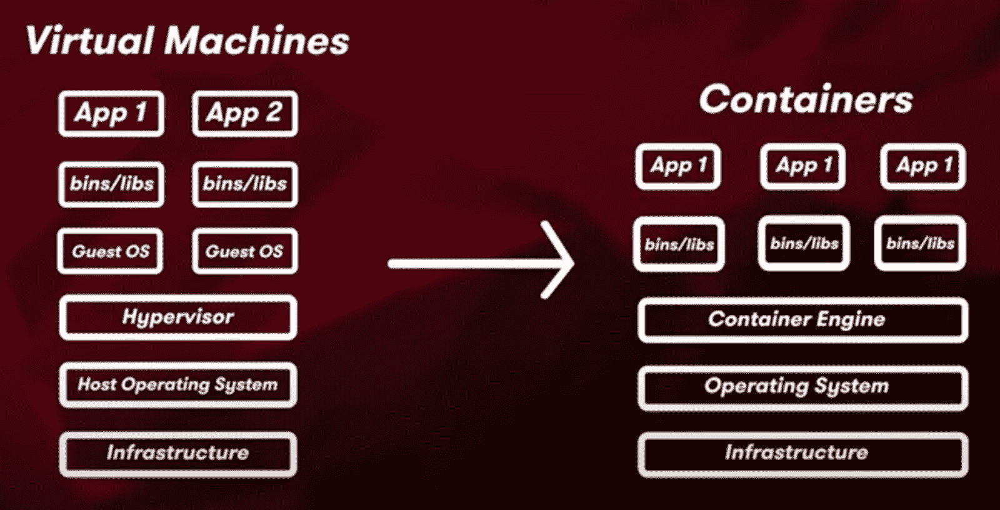

# 云容器服务对比——AWS vs Azure vs GCP |云专家

> 原文：<https://acloudguru.com/blog/engineering/cloud-container-services-compared-aws-vs-azure-vs-gcp>

我们的[云提供商比较](https://acloudguru.com/videos/cloud-provider-comparisons)系列的这一期关注容器。我们将看看每个主要云平台(AWS、Azure 和 GCP)为部署和运行容器化应用程序提供的工具。我们将评估每种方法的优缺点，以便您可以确定哪种方法最适合您的特定应用。我们还将讨论容器注册中心、独立容器限制、Kubernetes、PaaS、无服务器容器和混合多云产品。

让我们开始吧！

* * *

* * *

## **什么是容器？**

“集装箱”这个词可能会让你立即想到“海运集装箱”，这实际上是一个不错的类比。容器在一个轻量级的包中集合了运行应用程序所需的一切。

与传统的虚拟机不同，容器不直接在操作系统上运行。相反，它们运行在容器运行时之上。运行时是一组在应用程序运行时发挥作用的指令，它告诉操作系统如何解析和执行代码。这使得你的应用程序具有高度的可移植性。这种可移植性的一个好处是它大大加快了开发和发布周期。

* * *

**通往更好职业的钥匙**

[立即开始 ACG](https://acloudguru.com/pricing) 通过 AWS、Microsoft Azure、Google Cloud 等领域的课程和实际动手实验室来改变你的职业生涯。

* * *

## 什么是容器注册？

Azure、AWS 和 GCP 都支持容器集群。首先，构建一个容器映像，这是一个包含可以创建容器的代码的文件。然后，在容器注册表中注册这个容器映像，这允许您安全地访问容器映像，管理不同版本的映像，等等。

*   在 AWS 上，它被称为 [ECR](https://aws.amazon.com/ecr/) (弹性容器注册)。

*   在 GCP，考虑到团队需要管理的不仅仅是容器，你会发现下一代容器注册中心叫做 [GCP 工件注册中心](https://cloud.google.com/artifact-registry)。工件注册表不仅用于容器映像，还用于语言包，如 [Maven](https://maven.apache.org/) 和 [NPM](https://www.npmjs.com/package/languages) ，以及操作系统包，如 [Debian](https://www.debian.org/distrib/packages) 。

## 独立容器的**限制是什么？**

在所有三个云平台上，您可以直接在虚拟机实例上部署容器映像。这就是所谓的**基础设施即服务**部署。缺点是这有很高的管理负荷，并迫使您处理单独的独立容器，这是不理想的。

独立容器无法提供复制、自动修复、自动伸缩或[负载平衡](https://acloudguru.com/hands-on-labs/load-balancing-containers?utm_campaign=11244863417&utm_source=google&utm_medium=cpc&utm_content=469352928666&utm_term=_&adgroupid=115625160932&gclid=Cj0KCQjwmPSSBhCNARIsAH3cYgYCtT3__H2xF5TK9A8M_tU_9kHaRn7n6qYTKlRBWGfxPsRTqlAbASoaAusREALw_wcB)，而这些在现代应用程序中都是必备的。

这些缺点突出了为什么您需要像 Kubernetes 这样的容器集群编排器，它可以在容器集群上自动化软件开发、复制、伸缩和负载平衡。

* * *

## **关于 Kubernetes 的一切**

这三个云平台都提供了自己的托管 Kubernetes 产品，所以如果你的大部分应用程序运行在其中一个云平台上，那就坚持在同一个平台上运行 Kubernetes。这将为您提供与您已经在特定云平台上使用的其他服务的良好集成。

### **Kubernetes 在各个云平台上的优劣**

在命名惯例方面，Azure 的托管 Kubernetes 版本被称为 [Azure Kubernetes 服务](https://azure.microsoft.com/en-us/services/kubernetes-service/) (AKS)。AWS 称他们的[为弹性 Kubernetes 服务](https://aws.amazon.com/eks/) (EKS)，而 GCP——Kubernetes 的发源地——拥有[谷歌 Kubernetes 引擎](https://cloud.google.com/kubernetes-engine) (GKE)。

每个云提供商的托管 Kubernetes 服务都有自己独特的优势。

*   亚马逊的 EKS 是使用最广泛的。
*   Azure 的 AKS 可以说是性价比最高的选择。
*   然后是谷歌的 GKE，它拥有三个提供商中最多的功能和自动化能力。

#### 升级

AKS 和 GKE 比 EKS 自动化程度更高——它们会自动处理控制面板上的安全补丁，并升级构成 Kubernetes 集群的节点。升级 EKS 上的组件和节点运行状况修复需要一些手动步骤。

#### 集群节点

AK、EKS 和 GKE 都支持启用 GPU 的虚拟机节点，但只有 EKS 还支持裸机作为集群节点。

#### 命令行支持

AK 和 GKE 有完整的命令行支持，但 AK 的命令行支持要有限得多。

#### 服务网格

EKS 和 GKE 都提供了一个集成的服务网格，可以在 Kubernetes 上工作，称为 App Mesh (EKS)和 Istio (GKE)，但 AKS 还没有提供集成的服务网格来允许您使用微服务。

#### 节点

AKS 可以在一个 Kubernetes 集群中支持 500 个节点，EKS 可以支持 100 个，GKE 最多可以支持 5，000 个。

* * *

为了继续深入比较每个托管的 Kubernetes 服务，[查看我们自己的培训架构师 Alexander Potasnick 的这篇文章](https://acloudguru.com/blog/engineering/aks-vs-eks-vs-gke-managed-kubernetes-services-compared)。

* * *

### **库柏金钥匙**

如果您正在使用 Kubernetes 寻找一个更全面的解决方案，那么 [Red Hat OpenShift](https://www.redhat.com/en/technologies/cloud-computing/openshift) 是一个提供 OpenShift 构建和部署工具的平台即服务产品。OpenShift 是以 Kubernetes 为核心构建的，但它也提供 ide、运行时、构建工具、CI/CD 服务、服务网格等等。Red Hat OpenShift 在 AWS 和 Azure 上都是可用的服务，但在 GCP 上不可用。

* * *

[**获得痛苦的云词典**](https://get.acloudguru.com/cloud-dictionary-of-pain)
说云不一定要努力。我们分析了数以百万计的回复，找出了最容易让人犯错的概念。抓住这个[云指南](https://get.acloudguru.com/cloud-dictionary-of-pain)获取一些最痛苦的云术语的简洁定义。

* * *

## **无服务器容器**

如果您希望能够在不管理基础设施和创建集群的情况下部署和运行容器化的应用程序，该怎么办？

你可以使用无服务器容器来实现。

*   微软是业内第一个通过 Azure Container 实例在公共云中提供无服务器容器的公司，Azure Container 实例在不使用 Kubernetes 集群的情况下运行容器。

*   在 GCP 上，您可以使用 CloudRun 以无服务器的方式运行容器化的工作负载，而不需要底层的 Kubernetes 集群。

*   AWS Fargate 是 AWS 上的一个无服务器产品，它消除了扩展、修补和管理容器集群上的服务器的开销。它与 Azure Container Instances 和 GCP CloudRun 的一个重要区别是，Fargate 用于抽象出使用协调集群的开销，无论是 [EKS 还是 ECS](https://cast.ai/blog/aws-eks-vs-ecs-vs-fargate-where-to-manage-your-kubernetes/) 。在没有底层集群的情况下，不能使用*而不是*。

* * *

## **混合云产品**

由于 Kubernetes 可以部署在内部数据中心以及所有云平台上，它提供了 IaaS 和 PaaS 选项之间的中间地带。这使您能够在当今的混合、多云计算环境中高效工作。

每个云平台都有自己的产品来支持混合、多云环境。

*   在 Azure 上，有 [Azure Arc](https://azure.microsoft.com/en-us/services/azure-arc/) ，它超越了管理混合 Kubernetes 部署。Azure Arc 允许您管理服务器、Kubernetes 集群、Azure 数据服务和托管在 Azure 平台之外的资源上的 SQL 服务器。
*   [亚马逊 EKS Anywhere](https://aws.amazon.com/eks/eks-anywhere/) 是一个部署选项，允许客户在 AWS 支持的基础设施上创建和操作 Kubernetes 集群。
*   GCP 提供了 [Anthos](https://cloud.google.com/anthos) ，它是围绕 Kubernetes 核心构建的，你可以在你的云机器和本地数据中心的机器上运行 [GKE](https://cloud.google.com/kubernetes-engine/docs/concepts/kubernetes-engine-overview#:~:text=Google%20Kubernetes%20Engine%20(GKE)%20provides,together%20to%20form%20a%20cluster.) 。然后，Google 使用一个控制平面在这个混合环境中一致地管理您的应用程序。

* * *

我们不能 ***包含*** 我们对 Docker 和 Kubernetes 课程令人敬畏的范围的兴奋。你也可以[在 YouTube 上订阅一位云专家](https://www.youtube.com/c/AcloudGuru/?sub_confirmation=1)的每周云新闻，像我们一样关注[脸书](https://www.facebook.com/acloudguru)，在 [Twitter](https://twitter.com/acloudguru) 上关注我们，并加入 [Discord](http://discord.gg/acloudguru) 上的对话。