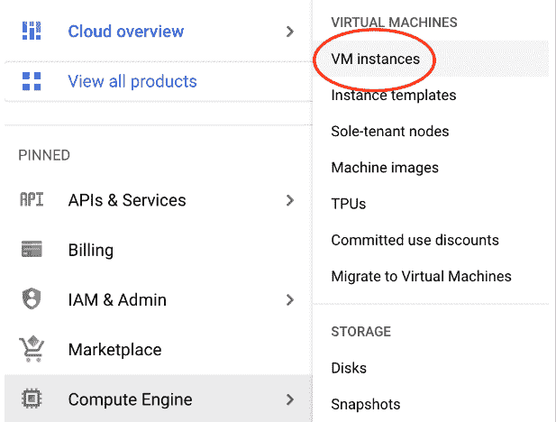
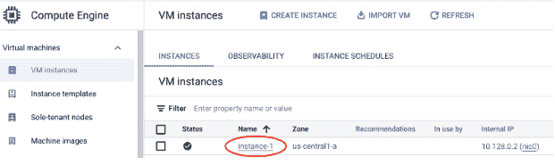
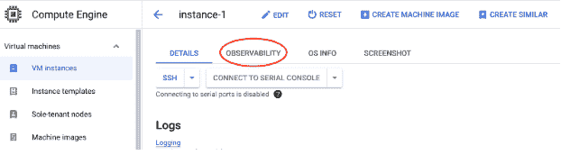
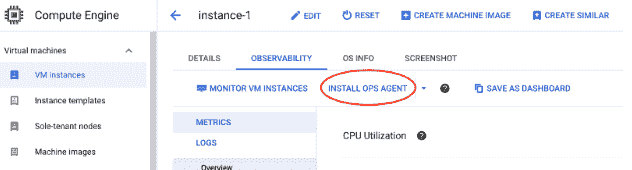
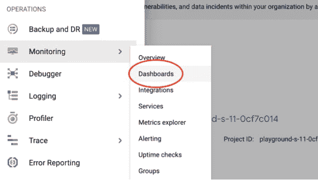
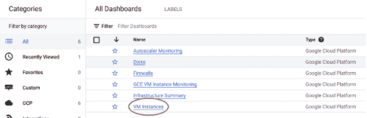
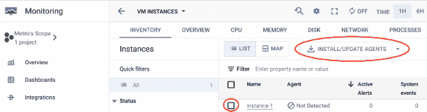

# 在 Google 计算引擎实例中使用云操作代理

> 原文：<https://acloudguru.com/blog/engineering/cloud-ops-agent>

Google Compute Engine (GCE)是领先的云计算平台之一，为运行应用程序提供了可扩展且高度可用的虚拟机。

为了监控和管理这些虚拟机的性能和资源使用情况，收集日志和使用指标非常重要。然而，这可能是一项具有挑战性的任务，尤其是在处理大量虚拟机时。

不过，不要担心，Google Cloud 的优秀员工为您提供了一个解决方案——云运营代理！

Cloud Ops Agent 是一个工具，它提供了一个集中统一的解决方案，用于收集、处理和分析来自 GCE 实例的日志和指标。

使用云运营代理的一些优势包括:

*   **集中日志收集:**从 GCE 实例收集的日志被发送到一个集中的位置，以便于访问和分析。这消除了手动收集日志的需要和丢失重要日志的风险。
*   **实时监控:**实时收集日志和使用指标，允许您监控您的 GCE 实例并及时响应任何问题。
*   **可定制的指标收集:**可以收集定制的指标，允许您跟踪对您的应用程序很重要的特定性能和资源使用指标。
*   **可扩展和高可用性:**云运营代理旨在实现可扩展和高可用性，即使是最大规模的 GCE 部署也能轻松管理。

你可能会对自己说，“这听起来很棒，但是我们实际上如何*安装*云操作代理来获得这些好处呢？”为此，我们有几个不同的选项，如谷歌云控制台或直接通过您的虚拟机实例的命令行。让我们在下面浏览一下这两个问题！

* * *

## 加速您的职业发展

[从 ACG 开始](https://acloudguru.com/pricing)通过 AWS、Microsoft Azure、Google Cloud 等领域的课程和实际动手实验室改变你的职业生涯。

* * *

## **如何使用谷歌云控制台安装云运营代理:**

为此，有两种方法。

首先:

*   转到计算引擎服务中的虚拟机实例页面



*   单击要安装代理的实例



*   单击可观察性选项卡



*   选择“安装 OPS 代理”并按照提示进行操作



或者:

*   转到监控服务中的仪表板页面



*   选择虚拟机实例仪表板



*   选中要安装代理的实例旁边的复选框，然后选择安装/更新代理，并按照提示进行操作



## **如何在命令行安装云运营代理:**

1.  使用云 Shell 或另一个 SSH 客户端连接到机器
2.  切换到您拥有写权限的目录(即您的主目录)
3.  运行以下命令:

```
curl -sSO https://dl.google.com/cloudagents/add-google-cloud-ops-agent-repo.sh
sudo bash add-google-cloud-ops-agent-repo.sh --also-install
```

一旦安装了云操作代理，默认情况下，它将开始收集其他系统使用指标。但是，它可以通过创建指定要收集的数据的配置文件来收集额外的日志和指标。

既然代理已经安装并收集了日志和指标，就可以将数据发送到一个集中的位置，如 Google Cloud Logging、Stackdriver Monitoring 或第三方日志记录和监控工具。这为用户提供了很大的灵活性，无论你是订阅了整个谷歌云生态系统，还是已经有了一个日志和监控解决方案。

云操作代理是监控和管理 GCE 实例的重要工具。通过以集中统一的方式收集日志和使用指标，可以更轻松地监控和响应问题，并对您的云基础架构做出明智的决策。

无论您管理的是小型还是大型 GCE 部署，云运营代理都可以帮助您充分利用云投资。如果你想了解更多关于 Google Cloud 提供的云操作代理、计算引擎和其他支持服务的信息，请查看我在一位云专家那里开设的课程[在 Google Cloud](https://acloudguru.com/course/running-linux-servers-on-google-cloud) 上运行 Linux 服务器。