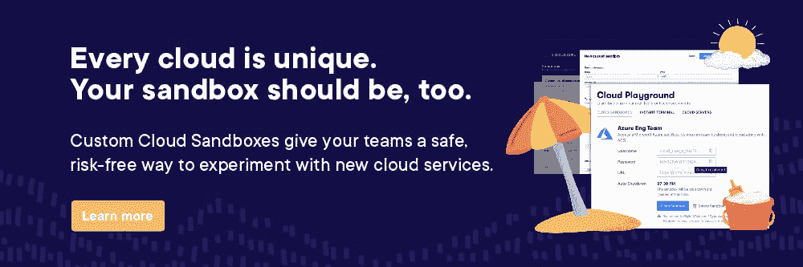
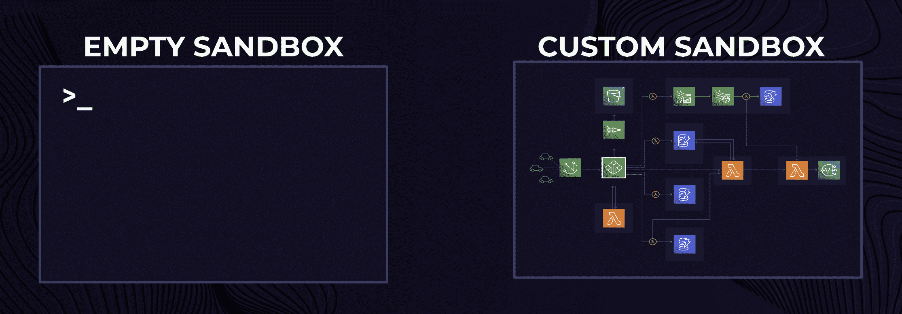

# 一位云专家推出了新的定制云沙盒环境

> 原文：<https://acloudguru.com/blog/news/cloud-sandbox-environment>

随着 [75%的云领导者寻求默认云计算](https://www.pluralsight.com/resource-center/state-of-cloud)，技术专家需要加倍努力他们的云技能。由于 [62%的技术专家更喜欢实践学习工具](https://www.pluralsight.com/resource-center/state-of-cloud)，我们的云专家为我们的 ACG 企业用户开发并推出了新的[定制云沙盒环境](https://acloudguru.com/platform/custom-cloud-sandboxes)，以弥合领导者对其团队的期望与这些团队能够合理完成的目标之间的差距。

## ***动手云*动手云**

领导者和技术专家都认为[云安全是最大的技能差距，也是云成熟的最大障碍](https://www.pluralsight.com/resource-center/state-of-cloud)。那么，如何在不超出预算的情况下培养云安全技能呢？有了云沙盒。

这些沙盒环境已经存在多年了。每个主要的云服务提供商——AWS、微软 Azure 和谷歌云——都有自己的沙盒环境，供技术人员了解他们的平台并为云认证做准备。自 2022 年 4 月以来， [A Cloud Guru 团队已经开发了实践学习工具](https://acloudguru.com/blog/business/introducing-cloud-playground-for-business),以帮助技术人员更好地获得云认证和长期云成功。

随着云计算复杂性的增加，技术专家们喜欢在处理真实数据之前先动手也就不足为奇了。这些沙盒环境让技术人员在真实的场景中实践，而没有破坏现有代码库、功能或正在进行的开发的风险。它允许“自由发挥”和探索云计算服务，而不会对您的云基础架构的完整性带来风险。

大多数领导者已经了解这些沙盒环境给云安全实践带来的价值，超过 60%的企业已经为他们的技术专家提供了沙盒环境。但真正的价值在于定制。

## ***介绍自定义云沙盒环境***

云专家为 ACG 商业加用户推出的最新功能，[定制云沙箱](https://acloudguru.com/platform/custom-cloud-sandboxes)，为您提供了一种安全、无风险的方式来试验新的云计算服务，或在为*您的*云基础设施定制的沙箱环境中实践云配置。AWS、Azure 和谷歌云平台(GCP)支持 500 多种服务，自定义沙盒环境提供真实世界的云培训，而不必担心破坏您的实际生产环境。

这种新的实践技能培养体验允许将基础和理论云素养技能转化为实践专业知识。这是一种实用的云培训，可以帮助组织减轻云环境中的技术错误和风险。

这个新的沙盒环境建立在 ACG 现有的[云游乐场](https://acloudguru.com/platform/cloud-sandbox-playgrounds)功能之上。它通过为您提供完全预配置的云沙盒环境(包含您选择的服务和配置)来安全快速地练习新技能，从而增强您的用户体验。此外，对于所有 ACG 企业用户来说，所有活动沙盒环境的时间限制现在高达每个会话八小时，是之前云游乐场四小时限制的两倍。无论你是使用 AWS、Azure、Google 云平台，还是三者的结合，都很容易为你的组织打造独一无二的体验。

## ***自定义云沙盒环境的好处***

沙盒环境让技术专家有机会体验真实的云计算环境，而领导者可以高枕无忧，因为他们的云基础架构不会受到任何错误按键的影响。这是双赢。

自定义沙盒环境使交易更加甜蜜。对于技术专家来说，了解云计算环境的外观和感觉是一回事，但是在一个与他们日常工作环境完全一样的模拟环境中玩是完全不同的另一回事。这就是读一本关于足球的书和加入一个校内团队的区别。自定义沙盒环境提供缺失的上下文和真实世界的体验。

### **对于技术人员:访问一个看起来就像你的真实环境的云沙箱**

作为技术专家，自定义沙盒环境可以节省您的时间。您可以直接进入一个预配置的环境，自动加载您公司的云服务和资源，而不是从一个空的默认沙盒环境开始。

这种预先配置的环境允许您快速启动自定义沙盒环境，以建立信心和特定于您工作角色的技能，这些技能是您在进入公司的实际生产环境之前所需要的。

您可以在安全、可控的环境中使用[定制云沙箱](https://acloudguru.com/platform/custom-cloud-sandboxes)来安全地对您的实际环境进行故障排除，在您将要工作的相同云环境中进行实践，并试验最新的云服务，以了解它们在您的生产环境中的集成情况。

### **对于领导者:更快地缩小云计算技能差距**

作为经理，您可以将自定义沙盒环境分配给个人、团队或整个组织，让他们安全、快速地练习在职成功所需的新技能。

您可以利用这种全新的实践体验来:

*   创建为您的组织量身定制的学习体验，提升员工对新云服务的技能
*   在您现有的技术基础上高效地招聘新员工
*   因没有公司所有或管理的沙盒而节省资金
*   保护您的实际生产环境免受风险

## ***客户在说什么***

我们邀请了 IBM 公司的一名 beta 测试者 Nordcloud 来分享他们的经验。

Nordcloud 的 Launchpad 云架构师/Azure 技术培训师 Alexander Arts 说:“我在 Nordcloud 的培训项目强调培养在云超大规模计算方面技术高超的顾问。“借助 ACG 的定制云沙箱，我们将能够提供有针对性的学习。一个非常重要的方面是定制水平。**定制云沙盒反映了我们组织的特定服务和配置，这将使我们的顾问具备确保客户成功的能力。”**

总而言之，自定义沙盒环境可以帮助您减少人为错误，在无风险的环境中提高云技能，并减少新员工或现有员工的准备时间。

* * *

## 请求您的自定义云沙箱演示！