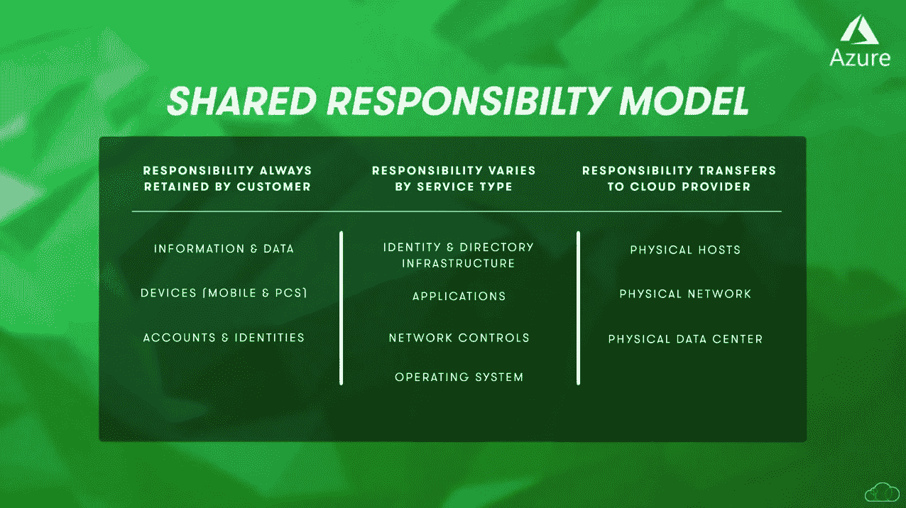
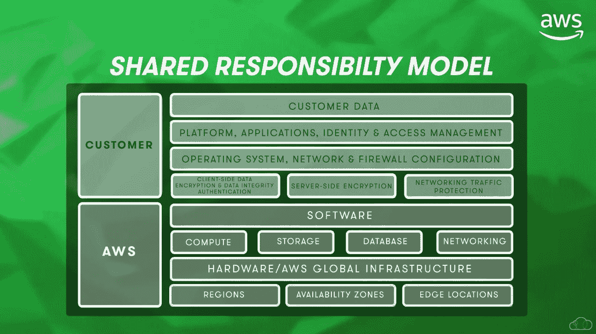
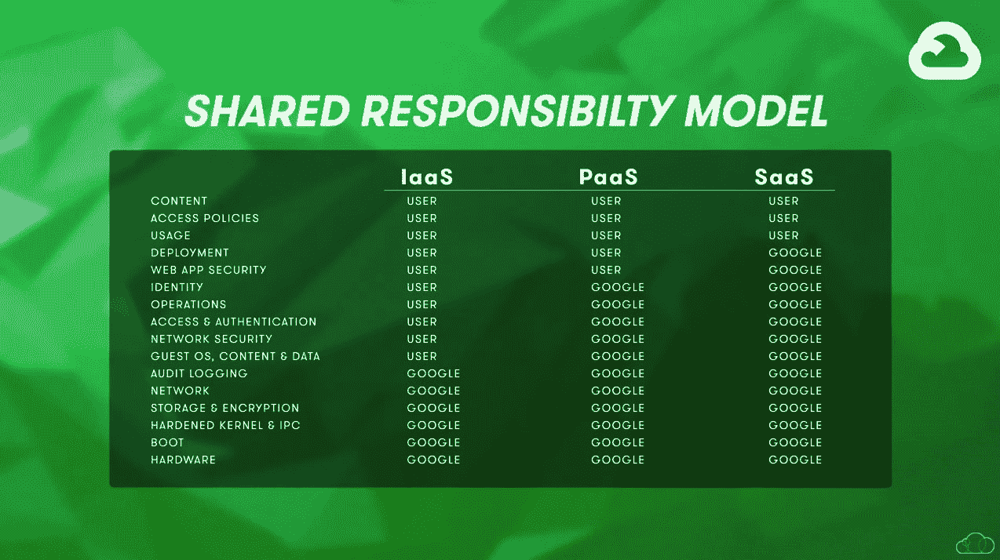

# 云安全对比:AWS vs. Azure vs. GCP

> 原文：<https://acloudguru.com/blog/engineering/cloud-security-comparison-aws-vs-azure-vs-gcp>

随着大量安全漏洞的出现，人们开始关注如何保护云中的资源。在本帖中，我们将探索来自[亚马逊网络服务(AWS)](https://acloudguru.com/blog/engineering/what-is-amazon-web-services-aws) 、[微软 Azure](https://acloudguru.com/blog/engineering/what-is-microsoft-azure) 和[谷歌云](https://acloudguru.com/blog/engineering/what-is-google-cloud-platform-gcp)的安全产品。

* * *

## 通往更好职业的钥匙

[从 ACG 开始](https://acloudguru.com/pricing)通过 AWS、Microsoft Azure、Google Cloud 等领域的课程和实际动手实验室改变你的职业生涯。

* * *

## 什么是云安全？

云安全实际上是安全控制和设置的组合，而不仅仅是单个设置或复选框。

人们对云安全经常感到困惑，这是因为组织并不总是知道他们负责什么。更糟糕的是，一些组织认为云平台应该对任何与安全相关的事情负责——这是一个大问题，因为事实绝对不是这样。

进入我们的云中安全之旅的第一站:共享责任模型。

## 什么是共同责任模式？

为了更好地理解谁对云中的安全性负责，我们需要参考一种叫做共享责任模型的东西。

共同责任模型是一个框架，有助于根据云中部署的内容，区分云提供商何时负责安全，以及贵组织何时负责安全。

现在，让我们看看三个云平台处理共享责任模型的方式。一般来说，所有三家云提供商都遵循相同的责任分担原则；他们只是方法略有不同。

### Azure 的共享责任模型

Azure 的共享责任模型将责任分为三个主要类别。

*   第一，顾客永远是负责任的。这与信息数据和设备(如移动设备和个人电脑)以及用户帐户(也称为身份)相关。

*   第二个类别不那么黑白分明，更多的是灰色区域，因为这取决于所使用的云模型，如软件即服务或 SaaS、平台即服务或 PaaS、基础架构即服务或 IaaS。

*   最后，我们有一个名为云提供商责任的类别。这是云提供商单独负责安全的时候，无论服务是 SaaS、PaaS 还是 IaaS。这方面的一个例子是托管这些服务的数据中心的物理基础设施。

### AWS 共同责任模型

对于 [AWS 共享责任模型](https://aws.amazon.com/compliance/shared-responsibility-model/)，AWS 采取了一种更简单的方法。

客户负责云中的*安全——这意味着他们自己的数据、用户账户、应用程序等等。而 AWS 负责云的安全*——包括数据中心内的底层硬件，如物理主机、存储和网络。**

### 谷歌云的共享责任模式

谷歌的共享责任模式有点复杂，因为他们详细说明了在每种情况下，谁负责安全。它被称为[共同责任矩阵](https://services.google.com/fh/files/misc/gcp_pci_srm__apr_2019.pdf)。

## 身份和访问管理(IAM)

正如我们在不同的共同责任模型下看到的，组织对用户帐户负责。这构成了所谓的身份和访问管理(简称 IAM)的一部分。IAM 是一个术语，用于定义具有特权角色的用户访问，也称为基于角色的访问控制。

我们将在这里对 IAM 做一个快速的概述，但要更深入地了解，请查看我们的单独帖子[比较 AWS、Azure 和 Google Cloud IAM 服务](https://acloudguru.com/blog/engineering/comparing-aws-azure-and-google-cloud-iam-services)。

所有三个平台都有一些共享的用户和 IAM 功能，包括多因素身份验证(MFA)、单点登录(SSO)、内置的基于角色的访问控制(RBAC)和自定义的基于角色的访问控制。

不过，跨平台的一个关键区别是特权访问管理(PAM)，它用于管理基于 IaaS、PaaS 或 SaaS 部署的用户或资源的特权帐户。

*   Azure 提供了一种叫做特权身份管理的服务，这种服务包括对 Azure AD 和 Azure 资源的即时特权访问。

*   AWS 和 GCP 没有解决 PAM 的内置功能。但是，您可以通过市场部署第三方解决方案来解决这个问题。

* * *

我想吃皮塔饼？查看[修复 5 个常见的 AWS IAM 错误](https://acloudguru.com/blog/engineering/fixing-5-common-aws-iam-errors)，了解一些最常见的 AWS IAM 错误的原因和解决方案。

* * *

## IaaS 安全性

让我们比较一下每个平台提供的一些 IAAS 工作负载安全解决方案。

#### 分布式拒绝服务保护

*   Azure 称他们的产品(不出所料)为 DDOS 保护。

*   GCP 有谷歌云盔甲。

#### 机密管理

*   Azure 有一个名为 Key Vault 的服务，用于存储密码和密钥等秘密，它也支持存储证书。

*   AWS 称他们的产品为秘密经理；它仅用于存储机密，尽管它也提供了一种存储证书的机制。

*   GCP 秘密管理器的工作方式与其他平台相同，并提供存储密码和证书的功能。

#### 虚拟专用网络

*   AWS VPN 支持点到站点和站点到站点选项，VPN 网关的站点到站点连接限制为 10 个连接。

*   Azure VPN 网关支持点对点和站点到站点 VPN，每个 VPN 网关最多支持 30 个站点到站点连接。

*   Google Cloud VPN 只支持点对点 VPN 连接，目前不支持点对点连接。

## 数据安全(PaaS)

接下来，让我们看看这些平台是如何实现平台即服务或 PaaS 安全性的。让我们把重点放在保护数据上，因为它承载着重要的组织或客户信息，这是黑客的主要目标之一。

从数据库的角度来看，这三个云平台都支持以下安全控制。

*   身份和访问管理策略，或 IAM 策略

*   防火墙规则，包括 IP 白名单。这是组织可以通过互联网公开数据库，但只允许组织公共 IP 地址连接到它。

*   传输中加密(TLS)指定数据库是否支持到它的安全连接，通过硬盘级加密来加密地址。

* * *

[**获得痛苦的云词典**](https://get.acloudguru.com/cloud-dictionary-of-pain)
说云不一定要努力。我们分析了数以百万计的回复，找出了最容易让人犯错的概念。抓住这个[云指南](https://get.acloudguru.com/cloud-dictionary-of-pain)，获取云中一些最令人头疼的术语的简洁定义。

* * *

## 内置安全性和合规性(SaaS)

大多数组织都必须遵守一套安全标准，同样的规则也适用于云工作负载。让我们花点时间来了解云平台如何帮助组织满足云安全合规性。

*   Azure 有 Azure 安全中心。

*   GCP 有信任和安全中心。

*   AWS 称他们的安全评估服务为 Amazon Inspector。

所有三个云平台上的合规性工具都支持大多数合规性标准，如 ISO 27001、PCI、DSS 等。这些工具能够审核部署的资源，并就安全最佳实践提出建议，以确保您的环境是安全的，并且从安全或配置的角度来看，您没有遗漏任何重要内容。

## 市场对云安全的支持

最后，值得一提的是，每个云平台都提供了一个市场，客户可以在其中利用第三方供应商应用来满足特定的安全需求。AWS 和 Azure 在这方面处于领先地位，GCP 正在努力追赶。

最终，当您选择云提供商时，除了定价、混合身份和支持您的解决方案的技能等其他考虑因素外，还需要做出多项安全决策。

如果你想了解更多关于云安全的知识，请查看我们的安全相关学习路径，包括 [Azure Security](https://acloudguru.com/learning-paths/azure-security) 和 [AWS Security](https://acloudguru.com/learning-paths/aws-security) 。这些学习路径将以实践学习的方式指导新手到大师。

感谢阅读，继续牛逼吧，云大师们！

* * *

#### 保护您的 AWS 环境

在这个[免费点播的网络研讨会](https://get.acloudguru.com/securing-aws-environment-webinar)中，了解如何将复杂的 AWS 环境从零提升到安全。