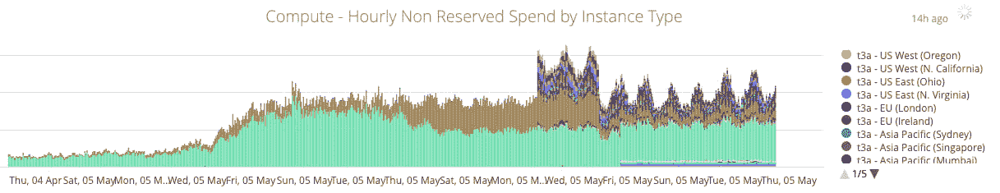
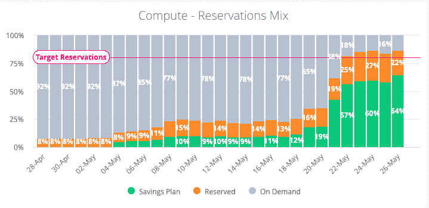

# 优化数百万美元的云账单|云专家

> 原文：<https://acloudguru.com/blog/engineering/continuous-cloud-cost-optimization>

2019 年 12 月，一位云专家收购了我们最大的竞争对手 Linux Academy，以及 270 万美元的年度 AWS 账单。

在收购之前，云支出对 ACG 来说是一项相对较小的支出。毕竟，我们是世界上第一个没有服务器的创业公司的创始人，并且喜欢炫耀我们的[空生产 EC2 控制台](https://acloud.guru/series/serverlessconf-nyc-2019/view/from-one-to-43)的照片。有一次，我们每月的办公室餐饮账单实际上比我们在 AWS 上的花费还要高。因此，我们没有在系统化的云成本控制流程中投入太多精力。

但是，当我们将两家公司的云支出合并到一份账单中时， [AWS 成本优化](https://acloudguru.com/course/aws-cloud-services-and-infrastructure-cost-optimization-deep-dive)很快成为这里的热门话题！

### **接近黑箱云账单**

首先，让我们承认，不断增长的云支出本身并不一定是一件坏事。如果你的毛利润随着云账单的增加而保持不变，这可能是非常好的——实际上是做生意的成本！但是如果利润随着你的成长而减少，或者你想增加利润，那么是时候优化支出了。

因此，在我们采取任何措施减少账单之前，我们知道我们需要制定一些谨慎的治理、规划和预算。差距是显而易见的:我们缺乏前期成本分析流程、未定义的成本指标和 KPI，并且除了账单本身之外，对我们的云支出没有太多的可见性。

这些差距的最终影响？对我们来说，确定单位成本&和支出驱动因素很困难。如果没有云财务管理，我们每年 300 万美元的云总支出就是一个黑箱。

### **定义和衡量成本指标和 KPI**

我们不仅不确定我们在哪些方面花了最多的钱，而且我们也没有一个框架来确定我们是否花了太多的钱。

但我们希望主动进行云优化，因此我们进入了成本控制发现期*–*，寻求实时信息，让我们了解我们的支出金额和支出地点。

以下是我们认为特别重要的一些指标。

| **云成本指标** | **关键问题** | **洞察力** |
| 预算支出与实际支出 | 我们预测我们的花费有多准确？ | 如果发现浪费，推动对支出的调查和削减浪费的决策 |
| 按职能/业务部门/服务领域分配的总云支出的百分比 | 我们如何在不同的部门和服务之间分配开支？ | 使我们能够识别导致预算与实际差异的领域 |
| 对毛利润的贡献百分比 | 相对于业务的其他部分，我们的云支出消耗了多少开销？ | 洞察成本增长/下降是否与收入同步 |
| 每位活跃用户的云支出—按产品线细分，如动手实验室 | 在我们的平台上服务一个用户要多少钱？ | 毛利率的领先指标。帮助我们了解用户增长如何推动 COGS |
| 每位员工(即开发人员或培训架构师)的云支出 | 我们在运营活动上的支出效率如何？ | 推动运营成本的优化 |

我们能够从现有的财务数据中回答这些问题。一旦我们提出了一组可行的指标，我们就建立一些 KPI 来帮助我们将这些指标引向正确的方向。例如，我们决定希望看到大约 80%的 EC2 支出来自保留的实例或节约计划。

* * *

*无论您处于云采用流程的哪个阶段，云专家都会结合实践学习功能、不断更新的多云培训和深厚的专业知识，帮助您和您的[企业云](https://acloudguru.com/solutions/business)取得成功。*

[请求演示](https://go.acloud.guru/request-a-demo)

* * *

### **深入了解云支出**

云专家和 Linux 学院对我们的云成本有一些相当独特的限制，因为我们允许我们的用户旋转他们自己的云资源，作为我们动手实验室和云游乐场功能的一部分。最初，这些服务的账单通过与我们的 SaaS 平台相同的 AWS 组织累计，因此我们很难分析优化的机会在哪里。

作为第一步，我们重组了我们的 AWS 帐户，以便我们的用户定义资源属于不同的顶级组织，而不是用于运行平台的组织。我们还制定了**增强标记策略**，以及我们 AWS 组织中更具体的组织单位(ou ),以进一步将成本与其相关服务和部门相匹配。

接下来，我们实施了**实时成本监控**,以便更好地了解我们的支出和支出地点。

标准的成本监控工具不太适合我们，因为我们的学习者通过 Cloud Playground 建立了所有短暂的 AWS 帐户。因此，我们最终使用 AWS Lambda、CloudFormation 和 Athena 创建了一些简单的工具来解析来自 AWS 组织的日志，并将它们提供给实时的 Looker 仪表盘。

现在，我们可以看到一些非常有趣的指标，如 EC2 的每小时支出、实例预订与按需购买的总组合，以及按服务和组织单位划分的总成本。这让我们能够识别和跟踪优化目标。

例如，上图显示了将我们的实验室帐户移出管理 Linux Academy 平台的 AWS 组织的影响——注意峰值流量如何被密切跟踪实例预留的可预测负载所取代。

### **示例优化:储蓄计划和预订**

当我们对成本有了更好的了解后，我们清楚地意识到 EC2 支出现在是 ACG / LA 合并账单的⅔……而且几乎所有支出都是按需分配的。

如前所述，我们有一些有趣的优化挑战，因为我们是一个培训平台。我们特别鼓励我们的学习者在我们的平台上创建云资源——我们承担费用。

查看下图——您可以看到，在我们动手实验室的指导下，我们的学员正在世界各地构建所有不同[大小的 EC2](https://acloudguru.com/blog/engineering/does-coding-language-memory-or-package-size-affect-cold-starts-of-aws-lambda) 实例。如果我们希望您使用一些新的、更便宜的实例类型，我们不能只是更改配置参数，我们实际上必须更新我们的课程内容，为您提供不同的说明。

出于这个原因，我们很快就喜欢上了 [AWS 计算节省计划](https://aws.amazon.com/savingsplans/faq/) —它们让我们可以对 EC2 实例应用预留，而不管实例大小、操作系统或区域。让 AWS 自动为我们节省成本是一个巨大的胜利。

使用传统保留实例的组合来覆盖我们的平台成本和我们的学习者创建的资源的节省计划，我们已经能够使我们的保留实例组合达到我们总 EC2 支出的大约 80%—这是一个 KPI，它应该在未来 12 个月内将我们的 EC2 账单减少大约 30%,而对我们的用户没有影响。

(哦，关于“无服务器启动”的事情…不，我们没有计划在短期内将所有 EC2 支出转移到无服务器。当我们看到开发人员重新架构的时间和努力，加上培训时间，它根本不在“速赢”桶中。但是我们确实努力在整个团队中分享知识，并在可行的情况下提供应用无服务器优化的选项。)

### **持续成本优化**

这里我们有更多的优化工作要做。我们现在关注 RDS 实例的合理规模，这是我们的第二大成本驱动因素(事实证明“每个微服务一个数据库”的规则有一些成本优化的缺点)。我们也在探索一些战略合作伙伴选项。我们将在软件开发生命周期中投入更多的成本控制。

我们还期待进一步整合我们的报告——目前我们分别跟踪云专家和 Linux 学院组织的成本，每个人都期待着这两个平台(和 AWS 账单)合二为一的伟大一天。

但是，由于我们实施了财务管理指标、工具和监控，我们有信心在这些领域浮出水面时优化它们，同时提高我们工程团队的整体敏捷性和我们学员的体验。