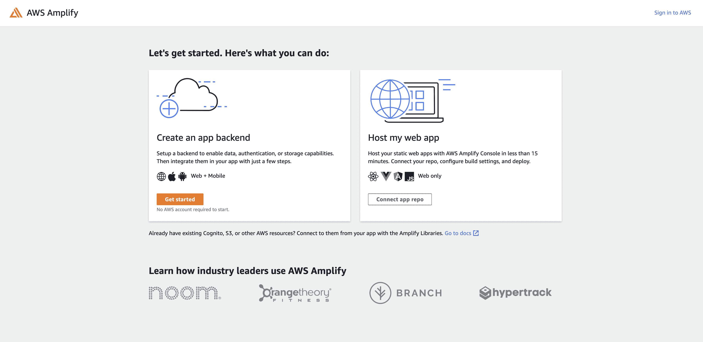
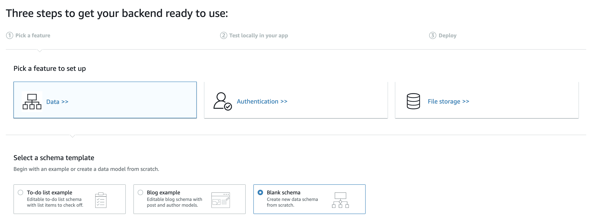
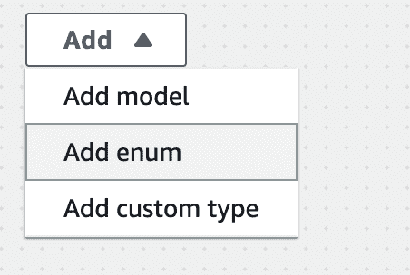
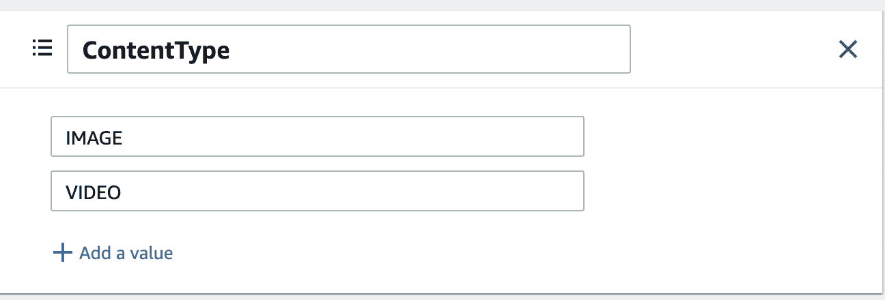
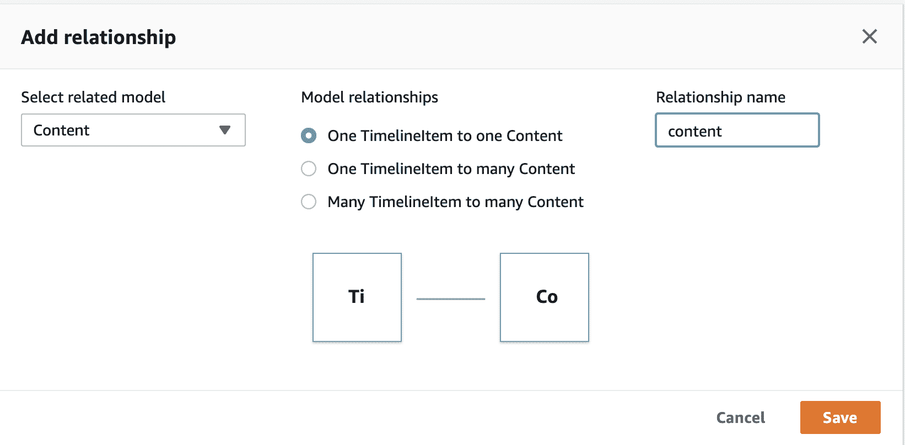
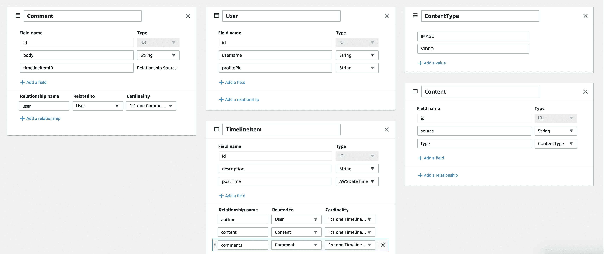
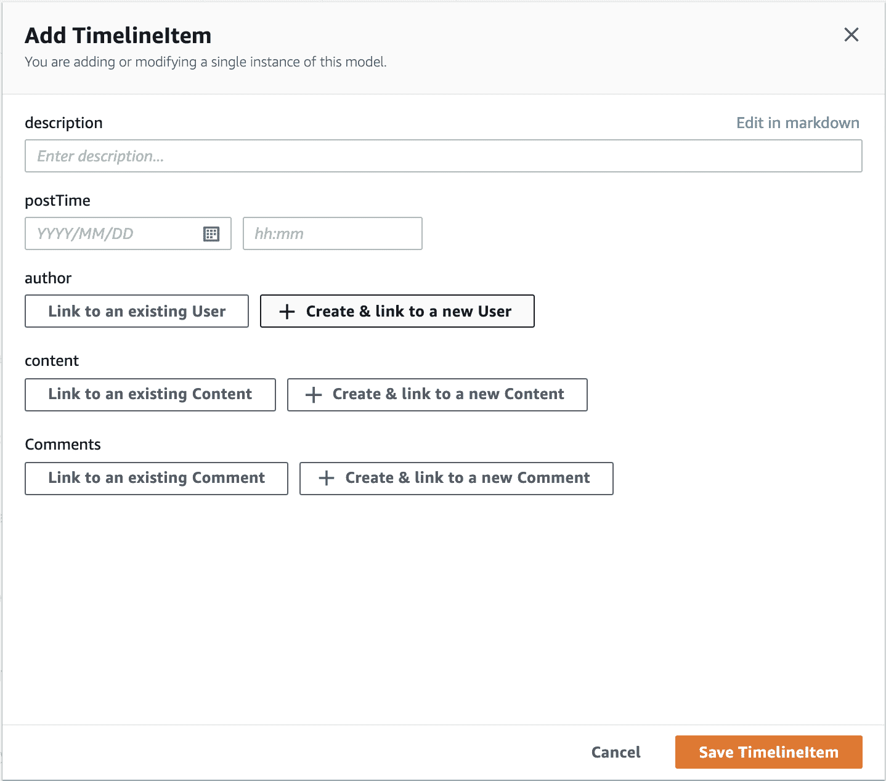
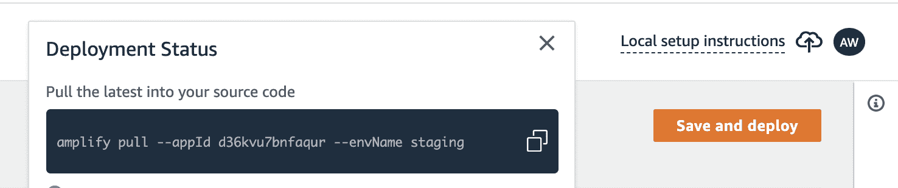

# 使用 AWS Amplify Admin UI、React 和 Chakra UI |云专家创建 Instagram Post 克隆

> 原文：<https://acloudguru.com/blog/engineering/create-an-instagram-post-clone-with-the-aws-amplify-admin-ui-react-and-chakra-ui>

# 什么是 Amplify Admin UI？

在本教程中，我们将使用 [AWS Amplify Admin UI](https://sandbox.amplifyapp.com/getting-started) 来创建 Instagram 卡克隆的后端。2020 年在 Re:Invent 上发布的 Amplify Admin UI [，它允许你使用可视化界面为应用程序创建数据。它还在您的数据模型之上创建了一个 CMS，因此您不需要首先创建表单来创建一些示例数据，也不需要为内容仲裁者创建单独的管理应用程序。此外，它允许您在将数据模型部署到云之前对其进行测试——如果您愿意，甚至可以在没有 AWS 帐户的情况下进行测试！然后，只需点击几下鼠标，就可以部署到云中。](https://acloudguru.com/blog/engineering/10-exciting-features-of-the-new-amplify-admin-ui)

对于前端，我们将使用 React 和 [Chakra UI](https://chakra-ui.com/) ，这是一个非常棒的组件库，我们将使用它来使我们的应用程序看起来更好。

这是最终产品的图片:


此外，如果你喜欢通过视频而不是书面教程学习，这里有这个项目的 YouTube 版本！

创建数据模型

## 首先，让我们为数据创建一个模式。您可以通过[此链接](https://sandbox.amplifyapp.com/getting-started)访问管理用户界面。当我们这样做时，我们正在创建一个利用 [AWS Amplify DataStore](https://docs.amplify.aws/lib/datastore/getting-started/q/platform/js) 的后端。这将自动使您的数据同时在线和离线，这对移动开发人员来说尤其方便！

在主页上，单击“创建应用后端”下的“开始”。

然后，在下一页选择“数据”和“空白模式”。



点击“添加”按钮，然后点击“添加型号”。



我们将创建的第一个模型将是一个时间轴项目。这将有一个字符串形式的`description`和一个 AWSDateTime 形式的`postTime`。



这将与`content`有 1:1 的关系，所以每个`TimelineItem`将有一个关联的`Content`实例，它存储视频或图像的实际链接。


在我们创建它之前，我们将创建一个`Enum`。这将有值`IMAGE`和`VIDEO`——我们将在`Content`上存储`TimelineItem`将呈现什么类型的内容。再次点击`add`按钮，但这次选择`Enum`。然后将两个可能的值相加！

现在，我们将创建我们的`Content`模型—再次点击`add`并选择`add model`。这个模型将有`source`，它是一个链接到图像或视频内容的字符串。然后会有一个`type`，这将是`ContentType`枚举-如果你滚动到底部，它应该会出现在下拉列表中！



现在，我们将在`TimelineItem`和`Content`之间创建一个关系。在`TimelineItem`下，点击【添加关系】。然后，选择`Content`型号，选择“一个 TimelineItem 对应一个内容”。您还可以更改关系名称——我通常将我的名称全部设置为小写。


现在，再添加两个模型。`Comment`和`User`。`Comment`会有一个主体，它是一个`String`，然后`User`会有一个`username`和一个`profilePic`，它们都是字符串。



在一个完整的生产应用程序中，您可能会添加一个从用户到您的身份验证提供者的用户的关系。

然后我们会添加关系。给`User`的`Comment`模型添加 1:1 关系，给`User`的`TimelineItem`模型添加 1:1 关系——我把这个名字改成了“作者”，然后把`TimelineItem`的 1:n 关系改成了`Comments`。

最终的模式应该如下所示:

部署您的应用



## 现在，我们将开始部署我们的后端模式。如果你点击右上角的`test`链接，你会得到在本地测试你的模式的指示——这意味着你可以编写一个初始版本的后端，而不需要创建一个 AWS 帐户，也没有任何机会为任何事情付费。也就是说，对于本教程，我想直接跳到`deploy`选项卡，这样我们就可以获得 CMS 功能。

转到`deploy`页面，在这里您将被指示创建一个 AWS 帐户或登录一个现有的帐户。

在下一页上，为您的应用程序选择一个名称，如“Instacard ”,然后选择一个 AWS 地区。部署你的应用需要几分钟时间。一旦完成，点击“后端环境”标签，然后“打开管理界面”。在此页面上，您将能够更新您部署的数据、添加身份验证和管理您的内容。

通过 CMS 添加数据

## 在管理用户界面中，转到`content`选项卡。您可以在这里为应用程序创建数据。为每个模型创建几个实例，并将数据连接在一起。我们将用它作为 Instacard 项目的测试数据！你可以从`TimelineItem`开始，然后创建你关联的`User`、`Content`和`Comments`。对于图片，使用你想要的任何地方的图片链接，我喜欢那些在 [Unsplash](https://unsplash.com/) 上的图片。

创建 React 应用程序



## 现在我们的后端可以运行了！我们可以开始我们的前端工作。我们将首先创建一个 React 应用程序:

一旦你完成了，就进入你的项目。我们需要为数据存储模型安装 AWS Amplify JavaScript 库和 TypeScript，然后是 Chakra UI 及其所有依赖项。

```
$ npx create-react-app instacard 
```

如果您没有安装 Amplify CLI，请运行以下命令:

```
$ cd instacard
$ npm i aws-amplify typescript
$ npm i @chakra-ui/react @emotion/react@^11 @emotion/styled@^11 framer-motion@^4 @chakra-ui/icons 
```

然后，我们需要运行`amplify pull`将你的应用程序放入本地项目。如果你回到管理界面，点击右上角的`local setup instructions`链接，你会得到一个命令。继续运行它。

```
$ curl -sL https://aws-amplify.github.io/amplify-cli/install | bash && $SHELL 
```

Amplify 遵循类似 Git 的推/拉模型。如果您通过 Admin UI 创建变更，您也可以运行`amplify pull`在本地获取它们。如果您在本地进行更改，运行`amplify push`来部署这些更改。

```
$ amplify pull --appId your-app-id --envName staging 
```



我们还需要为我们的项目配置 Amplify。打开您的`src/index.js`文件并添加以下内容:

我们将创建三个主要的组件文件，让我们继续创建它们。

```
import Amplify from 'aws-amplify'
import awsconfig from './aws-exports'

Amplify.configure(awsconfig) 
```

我们还将在根组件中设置`ChakraProvider`。

```
$ touch src/{Timeline.js,Card.js,CommentList.js} 
```

创建时间轴组件

```
// App.js
import { ChakraProvider } from '@chakra-ui/react'

export default function App () {
  return (
    <ChakraProvider>
      <div />
    </ChakraProvider>
  )
}
```

## 我们要编写的第一个组件是时间轴组件。首先，我们将从数据存储中提取所有的`TimelineItem`。这看起来与 React 中初始渲染时的任何其他 API 调用非常相似，除了用`DataStore.query()`而不是`fetch`或`axios`调用。`DataStore.query()`将`TimelineItem`作为参数将从数据存储中获取所有的`TimelineItem`。

现在，我们还将添加我们的 UI 代码，我们将从 Chakra 导入`Container`,这将使我们的内容在页面上居中。我们还将使用 [React 的子模式](https://welearncode.com/use-children-react/)来传递子元素。这个组件的直接子组件将是一个函数，所以我们将遍历每个`TimelineItem`并调用那个将呈现其他 React 组件的函数！

```
// Timeline.js
import { useState, useEffect } from 'react'
import { DataStore } from '@aws-amplify/datastore'

import { TimelineItem } from './models'

export function Timeline () {
  const [timeline, setTimeline] = useState([])

  useEffect(() => {
    const getTimeline = async () => {
      const timelineData = await DataStore.query(TimelineItem)
      setTimeline(timelineData)
    }

    getTimeline()
  }, [])

  return(
    <div />
  )
}
```

创建卡组件

```
// Timeline.js
import { useState, useEffect } from 'react'
import { DataStore } from '@aws-amplify/datastore'
+ import { Container } from '@chakra-ui/react'

import { TimelineItem } from './models'

+ export function Timeline ({ children }) {
  const [timeline, setTimeline] = useState([])

  useEffect(() => {
    const getTimeline = async () => {
      const timelineData = await DataStore.query(TimelineItem)
      setTimeline(timelineData)
    }

    getTimeline()
  }, [])

  return (
+    <Container>
+      {timeline.map(post => children({ post }))}
+    </Container>
  )
}
```

## 现在，我们将创建一个卡组件。我将继续从 Chakra 导入我最终需要的所有东西，这样我就不需要再回到导入上来了。

然后，我将创建我的起始组件。该组件将从一个呈现“Hello！”的框开始。它最终会接受子元素，但是让我们首先连接我们的`<Timeline>`组件，为每个`TimelineItem`呈现一个`<Card />`。

```
// Card.js
import { Box, Image, Flex, Avatar, Text, Spacer, IconButton } from '@chakra-ui/react'
import { ChatIcon, AddIcon, EmailIcon } from '@chakra-ui/icons' 
```

现在，我们将返回到我们的`<App >`组件并渲染我们的卡片时间轴！我需要导入必要的组件，然后在`<Timeline>`实例中，我们将添加一个返回`<Card>`实例的函数。时间轴中的`.map`将遍历所有的帖子，并运行这个函数为每个帖子渲染一个`<Card>`！

```
export function Card ({ children }) {
  return (
    <Box maxW='lg' borderWidth='1px' borderRadius='md' overflow='hidden' m={5}>
      <h1>Hello!</h1>
    </Box>
  )
}
```

现在我们有了“你好！”每个`TimelineItem`都显示在一个框中，我们可以继续渲染实际的卡片数据。每个`<Card>`都有一个标题、一个主标题和一个页脚。这些都是组件，但是我们将创建它们并在`Card`组件下导出它们，因为我们将一前一后地使用它们。首先，让我们创建`<Card.Header />`。这将需要考虑帖子的作者，所以我们将把它作为一个道具。然后，我们将渲染更多的脉轮盒和伸缩组件，以正确排列项目。我们还将使用 Avatar 组件来渲染图片(如果有的话)。在本教程中，我们实际上不会创建下拉菜单，所以我们只添加三个点作为占位符。

```
//App.js
import { ChakraProvider } from '@chakra-ui/react'

import { Timeline } from './Timeline'
import { Card } from './Card'

export default function App () {
  return (
    <ChakraProvider>
      <Timeline>
        {({ post }) => (
          <Card key={post.id}></Card>
        )}
      </Timeline>
    </ChakraProvider>
  )
}
```

然后，我们将创建`<Card.Main>`组件，它将呈现文章包含的视频或图像。我们将为内容类型添加一个条件，然后呈现它。

```
// Card.js
Card.Header = function ({ author }) {
  return (
    <Box p={2}>
      <Flex>
        <Box d='flex' alignItems='center'>
          <Avatar name={author.username} src={author.profilePic} />
          <Box ml={2}>
            <Text fontWeight='bold' fontSize='sm'>
              {author.username}
            </Text>
          </Box>
        </Box>
        <Spacer />
        <Box p={2}>
          &hellip;
        </Box>
      </Flex>
    </Box>
  )
}
```

最后，卡片页脚将有三个按钮，在本教程中只是为了显示目的。然后，我们将在图片下面添加标题。我们还将为注释留出一个位置，这将是一个子组件。

```
Card.Main = function ({ content }) {
  let cardContent
  if (content.type === 'VIDEO') {
    cardContent = (
      <video controls>
        <source src={content.source} />
      </video>
    )
  } else {
    cardContent = <Image src={content.source} />
  }
  return (
    <Box>
      {cardContent}
    </Box>
  )
}
```

现在，我们将创建最后一个组件，它将呈现所有的评论！这将类似于`Timeline`组件，但是我们只想查询属于该帖子的评论。因此，我们将根据评论所属的`post`的 id 来过滤评论。`DataStore.query()`接受可选的第二个参数，该参数指定查询的条件。

```
Card.Footer = function ({ author, description, children }) {
  return (
    <Box ml={3}>
      <Box>
        <IconButton icon={<AddIcon />} variant='ghost' />
        <IconButton icon={<ChatIcon />} variant='ghost' />
        <IconButton icon={<EmailIcon />} variant='ghost' />
      </Box>
      <Box mt={3}>
        <Text>
          <Text as='b'>{author.username} </Text>{description}
        </Text>
      </Box>
      <Box>
        {children}
      </Box>
      <Box mt={1} mb={2}>
        <Text fontSize='xs' color='gray.500'>
          2 HOURS AGO
        </Text>
      </Box>
    </Box>
  )
}
```

现在，我们将返回到`<App>`组件来渲染卡片的所有这些部分！

```
import { useEffect, useState } from 'react'
import { DataStore } from '@aws-amplify/datastore'
import { Box, Text } from '@chakra-ui/react'

import { Comment } from './models'

export function CommentList ({ postId }) {
  const [comments, setComments] = useState([])
  useEffect(() => {
    const getComments = async () => {
      const postComments = await DataStore.query(Comment, p => p.timelineitemID === postId)
      setComments(postComments)
    }
    getComments()
  }, [])
  return (
    <Box>
      {comments.map(comment => (
        <Text key={comment.id}>
          <Text key={comment.id}>
            <Text as='b'>{comment.user.username} </Text>
            {comment.body}
          </Text>
        </Text>
      ))}
    </Box>
  )
}
```

太神奇了！现在我们的 Instacard 完成了！

```
import { ChakraProvider } from '@chakra-ui/react'

import { Timeline } from './Timeline'
import { Card } from './Card'
import { CommentList } from './CommentList'
import { CommentForm } from './CommentForm'

export default function App () {
  return (
    <ChakraProvider>
      <Timeline>
        {({ post }) => (
          <Card post={post} key={post.id}>
            <Card.Header author={post.author} />
            <Card.Main content={post.content} />
            <Card.Footer
              author={post.author}
              description={post.description}
            >
              <CommentList postId={post.id} />
            </Card.Footer>
            <CommentForm />
          </Card>
        )}
      </Timeline>
    </ChakraProvider>
  )
}
```

结论

## 概括地说，我们通过 [AWS Amplify Admin UI](https://acloudguru.com/blog/engineering/10-exciting-features-of-the-new-amplify-admin-ui) 为 Instagram 帖子创建了一个模式。然后，我们使用它的 CMS 为我们的应用程序创建内容，然后使用 Chakra UI 在 React 应用程序中显示时间线数据。AWS Amplify 的管理用户界面支持快速后端开发，因此开发人员可以专注于他们的前端和业务逻辑。在本教程中，我们没有讨论身份验证或授权，但是您也可以通过可视化管理 UI 界面来启用它们。

To recap, we created a schema for an Instagram post via the [AWS Amplify Admin UI](https://acloudguru.com/blog/engineering/10-exciting-features-of-the-new-amplify-admin-ui). Then we used its CMS to create content for our application and then displayed the timeline data in a React app using Chakra UI for styling. AWS Amplify’s Admin UI enables rapid backend development so that developers can focus on their frontend and business logic. We didn’t talk about authentication or authorization in this tutorial, but you can enable them via the visual Admin UI interface as well.