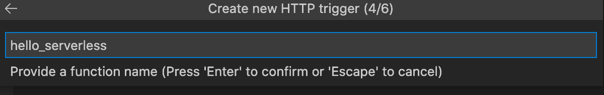
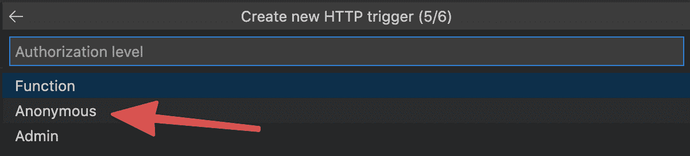
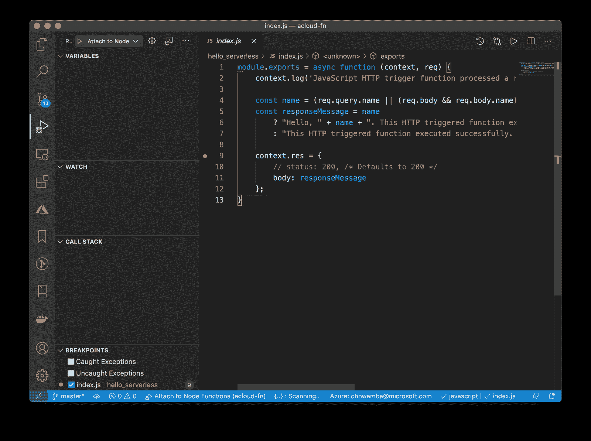

# 使用 VS 代码创建、调试和部署无服务器 API 云专家

> 原文：<https://acloudguru.com/blog/engineering/create-debug-and-deploy-a-serverless-api-with-vs-code>

无服务器为开发者体验提供了一个强有力的转变。我们可以快速原型化和构建生产级软件，而不依赖于交付过程。这意味着我们可以更快地迭代，更快地获得反馈，等等。

在像微软 Azure 这样的平台上， [serverless 令人兴奋的另一个原因是，你可以从 Azure dashboard 编写代码并立即部署。它显示了开发和生产之间的层次有多少。唯一要付出的代价是，以这种方式编写、测试和部署意味着您离开了您可能已经使用多年的编辑器。](https://acloudguru.com/blog/engineering/qa-the-state-of-azure-serverless)

### 概观

在本文中，我将向您展示如何设置 Visual Studio 代码来编写、测试、调试和部署带有 Azure 函数的无服务器 API。

更喜欢看而不是读？你可以跟随我在下面制作的视频。

*注意:这是一本初级指南。要深入了解 Azure 函数的使用，请查看 ACG 的课程[使用 Azure 函数的无服务器计算](https://acloud.guru/overview/a9fa666c-dbce-450f-bbfb-c501a195ea88)或[微软关于创建无服务器应用的学习模块](https://docs.microsoft.com/en-us/learn/paths/create-serverless-applications/?WT.mc_id=startup-12350-chnwamba)。*

### **先决条件**

要阅读本文，您需要以下内容:

1.  Azure 账户:它是免费的，你不需要为无服务器的东西付费，除非你正在构建一个大规模的 API
2.  [VS 代码](https://djcb.link/ys/vscode):永远免费
3.  [节点](https://nodejs.org):运行在计算机上的开源 JS
4.  npm:节点的程序包管理器—它随节点一起安装

### **安装 Azure 功能工具**

Azure Function Tools 解释你的无服务器代码并构建它。当您试图运行或调试您的无服务器代码时，VS 代码会寻找它。运行以下安装命令进行安装。

Mac:

```
brew tap azure/functions
brew install azure-functions-core-tools@3
```

Windows、Linux 和 Mac:

```
npm i -g azure-functions-core-tools@3 --unsafe-perm true
```

### **安装 Azure 函数 VS 代码扩展**

安装了核心工具后，您现在可以安装 VS 代码扩展，它会为您完成所有无服务器的繁重工作。这个扩展将构建、运行甚至启动你的无服务器应用。它还可以使用各种模板为您搭建一个新的无服务器功能项目。

要安装它，从[扩展页面](https://marketplace.visualstudio.com/items?itemName=ms-azuretools.vscode-azurefunctions?WT.mc_id=startup-12350-chnwamba)点击**安装**。

该扩展需要访问您的 Azure 帐户，然后才能部署您的无服务器代码。要设置它，请在安装扩展后单击出现在活动栏上的 Azure 徽标，然后单击**登录 Azure** :

VS 代码会打开你的默认浏览器，重定向到 Azure 的 auth 页面，在这里你可以登录并确认。只有拥有 Azure 帐户，您才能这样做。

### **创建新的功能项目**

我们完成了所有的杂务，可以开始创建一个无服务器的函数项目了。

1.从活动栏中点击 Azure，然后点击**创建新项目**图标:

2.选择要在其中创建该项目的文件夹。

3.VS 代码会提示你选择一种语言来编写你的函数。在本文中，我将展示 JavaScript 中的所有例子，这样你也可以选择 JavaScript。

4.我前面提到过，这个 VS 代码扩展允许您使用不同的模板创建无服务器函数。在您选择了一种语言之后，扩展将提示您选择您想要的启动模板。我们的例子是一个简单的 HTTP API，所以选择 **HTTP trigger** 模板。

5.接下来，输入函数的名称。



6.最后，选择您希望该功能是受保护的还是公共的。选择匿名使其公开，我们可以这样做，因为我们并没有构建一个安全的 API。



VS 代码将创建函数项目，并询问您是要在当前 VS 代码窗口中打开它，还是在新窗口中打开它。选择适合你的。

扩展创建了一个文件夹和几个文件。

```
. # Function project
 ├── hello_serverless # Single function. You can add more of this
 │   ├── function.json # Settings for only the hello_serverless function
 │   ├── index.js # Function logic
 ├── host.json # Global settings for all functions in this function project
 ├── local.settings.json # Environmental variables go here
 ├── package.json # Node dependencies and config go here
 └── proxies.json
```

根目录是包含我们创建的函数的`hello_serverless`文件夹。该文件夹中的`index.js`文件是您的无服务器功能逻辑，您可以对其进行编辑，使其按照您想要的方式运行。值得注意的是，这是一个节点土地，所以安装依赖关系和所有的好东西是允许的。

### **运行您的功能**

要运行该功能，点击活动栏中的**调试**按钮，然后点击**播放**按钮。

几秒钟后，您应该在终端中看到以下消息，确认运行成功，并且您的无服务器 API 现在正在端口 7071 上运行。

单击绿色的 URL 预览 API。如果您想要自定义消息:[http://localhost:7071/API/hello _ server less？名字=克里斯](http://localhost:7071/api/hello_serverless?name=Chris)

## **调试您的函数**

打开`index.js`文件，在您希望调试器暂停执行的任何地方添加一个断点:



现在，通过单击播放按钮再次运行该功能。在浏览器中打开链接，一旦执行到达断点，浏览器将冻结，您可以返回 VS 代码查看暂停的执行。

### **部署到 Azure**

与创建和调试一样，部署也可以通过表单而不是代码来完成。要部署我们创建的功能项目，请遵循以下步骤:

1.  点击**活动**栏中的 Azure 按钮，点击**部署到功能 app** 按钮:

2.  该扩展将列出您所有的 Azure 帐户订阅，并要求您选择一个。如果是新帐户，您应该获得默认订阅。无论如何，只需选择您有权部署的订阅即可

3.  选择 **+在 Azure 中新建功能 App**:

4.给函数起个名字。该名称必须是全球唯一的，这意味着没有其他 Azure 客户使用该名称。

5.选择节点 14 作为运行时。

6.  选择离你最近的地点。

VS 代码需要一两分钟在 Azure 上设置新功能并部署它。在部署过程中，您会在 VS 代码窗口的右下角看到状态更新。

部署完成后，单击 View output 按钮打开部署日志。

该日志包含关于您的部署的详细信息，还包含生产 URL，您可以在其中预览您的功能。单击 URL 进行预览。

还可以在 URL 中添加名称查询，获得自定义问候语[https://a cloud-fn-demo . azure websites . net/API/hello _ server less？name=Chris](https://acloud-fn-demo.azurewebsites.net/api/hello_serverless?name=Chris)

### **添加另一个功能并部署**

您可以通过从活动栏中单击 Azure 图标并单击 **Create function** 图标向您的函数项目添加更多函数。

您将被要求选择一个函数模板，并重复我们在**创建一个新的函数项目**中介绍的步骤。

当你创建了这个函数，你可以使用**部署到 Azure** 中的步骤进行重新部署。唯一不同的是，当提示选择功能时，不是选择 **+在 Azure 中创建新功能应用**，**选择您之前部署的功能**。

### **结论**

尝试使用 npm install 添加一个节点依赖项，并在 index.js 中导入该依赖项，看看是否可行。这篇关于 [VS 代码调试器](https://code.visualstudio.com/docs/editor/debugging?WT.mc_id=startup-12350-chnwamba)的文档将展示如何实现这一点。

#### 关于作者

克里斯蒂安·恩万巴是微软的一名软件开发人员和高级开发人员。他编码、写作、教学、演讲和组织开发者活动。