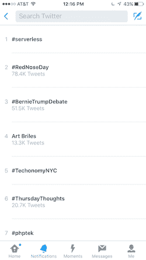

# 什么是无服务器，什么不是:揭穿神话

> 原文：<https://acloudguru.com/blog/engineering/debunking-serverless-myths>

无服务器仍在讨论中。这个术语本身(“无服务器”)是模棱两可的，在我们的会议之前、期间和之后都引发了许多 twitter 风暴。我认为现在有必要澄清一些谣言。如果你觉得我没有解决所有的误区，请告诉我，我很乐意在下面的列表中添加。

五月底，我们在纽约布鲁克林举办了第一次关于无服务器技术和架构的会议。发布会很火爆。我们的票卖完了，大约有 100 人在等候名单上。我不会给你一个总结，但我认为所有的与会者和发言者都喜欢这个活动(所有的演讲将很快在云专家的网站上发布)。

我们也收到了许多积极(和建设性)的反馈，对此我们表示感谢。感谢所有使这次会议成为可能的令人惊奇的、有趣的和热情的人们。

* * *

## 无服务器和 AWS Lambda

绝对不行。首先，除了 Lambda，还有其他无服务器计算服务，如 Azure Functions、Google Cloud Functions、Auth0 Webtask 和 IBM OpenWhisk。Lambda 目前可能会提供(IMHO)一个更成熟的解决方案，但它不是唯一的参与者。

其次，无服务器不仅仅是在 Lambda 这样的无状态计算服务中运行代码。这也是为了简化整个系统，帮助开发人员更快地移动(这是通过使用更多的第三方服务，减少后端代码量和将更多的逻辑移到前端来实现的)。

基本上，无服务器涉及到:

*   通过消除运行服务器和管理基础架构的需求，简化传统系统的复杂性。
*   帮助开发人员专注于他们的核心问题，并减少他们需要编写的代码量。

We were trending on Twitter during the conference

## 无服务器=没有服务器

我经常听到这样的话:“这个无服务器的东西没有任何意义。还有服务器。你错了，你应该感到难过”。如果我每次听到这句话都有一美元，我可能会有大约 38 美元，所以我感觉很糟糕。

当然有服务器。事实上，正是这些荣耀的动物让云和无服务器成为可能。如果你使用 Lambda 这样的无服务器计算服务，或者调用第三方 API——总有一个服务器在执行代码。

称之为无服务器的目的是说**我们**不再需要自己运行和管理(虚拟或物理)服务器。我们甚至无法接触到他们。我们部署在无状态计算服务中运行的代码，或者调用由其他人管理的服务。

## 无服务器取代开发运维

这让我有点难过。有人宣称，无服务器意味着不再需要开发运维。您可以看到它们是从哪里来的—如果您实现了一种纯粹的无服务器方法，您就不再需要担心基础架构、操作系统、网络配置、服务器修补等等。

但是——等一下！您仍然需要编码、构建、测试、打包、发布和监控您的应用程序。仍然需要考虑弹性、可用性和工具。是的，您不需要供应、配置、负载平衡和照看机器，但基础架构管理并不是 DevOps 关心的唯一任务。

有人需要对整个系统的质量和平稳运行负责。它不会自己发生。如果工程团队能处理好，那就太好了。但是仍然需要解决自动化、部署、测试、安全和监控等非开发任务。DevOps 试图解决的问题仍然存在…只是没有服务器。

请不要让这个流言不受质疑。

* * *

### 想深入了解 Serveless 吗？

一位云专家提供了一个关于云的所有内容的庞大图书馆，包括:课程、实验室、学习路径等等！

* * *

### 无服务器是一颗银弹

不，这不是银弹。无服务器解决了一些问题；它可以降低复杂性，并使许多应用程序的扩展更加容易。但是，它不能解决您的业务问题。无服务器技术和架构为系统的设计和实现提供了一种可能的方法，但是您仍然需要做这些工作。

无服务器也有它的挑战。你有一个分布式系统来处理，而不是沐浴在一个整体系统的进程内调用的相对健壮性中。然后还有这些问题:

*   无服务器工具需要改进。感谢无服务器框架让这种情况变得更容易忍受。当我们开始的时候，我们不得不推出自己的框架——这很痛苦。
*   现有的无服务器计算服务具有不同的限制和约束。
*   更多的成熟和思考(在架构和模式方面)仍然需要发生。

无服务器技术和架构可以为您的应用程序提供一个很好的方法。[我们的整个云学习平台](https://acloudguru.com/)是无服务器的。它支持成千上万的用户同时进行视频流传输和实时互动——不费吹灰之力，成本也很低。但是，无服务器可能不适合**您的**类应用程序，这没关系！

### 技术就是建筑

这是一个非常简单的问题，并不是一个神话。然而，我见过有人对此感到困惑。**无服务器技术**是特定的服务，比如 Lambda，它允许我们在不运行服务器的情况下执行代码。无服务器技术也可以指诸如 Firebase(实时流数据库服务)或 Auth0(托管认证服务)之类的服务，这些服务可以实现无服务器应用。[无服务器架构](https://acloudguru.com/blog/engineering/serverless-the-future-of-software-architecture)是利用无服务器技术构建应用程序的模式。

我错过了一个神话吗？还有什么需要解决的吗？让我知道，我很乐意在这里添加它。

彼得·斯巴尔斯基

感谢[唐纳德·费格森](https://twitter.com/dfferguson)和[山姆·克鲁宁堡](https://twitter.com/samkroon)的反馈。

> 我们正在写一本名为《AWS 上的无服务器架构》的书。我们希望得到您的反馈！如果你想买一本，请发推特到 [@sbarski](https://twitter.com/sbarski) 或 [@samkroon](https://twitter.com/samkroon) 联系我们，我们会给你发送折扣代码。

## 云专家

云专家的使命是通过提供世界领先的教育内容，让个人参与到提升云计算技能的旅程中来，这些教育内容旨在促进思维模式和职业发展。

> “不要让世界上的任何人生活在错觉中。没有上师，谁也不能渡到彼岸。”——古鲁·那纳克

我们的[云培训课程](https://acloudguru.com/browse-training)由对云计算有着共同热情的行业专家讲授。我们努力为不断壮大的云专家社区服务，他们在我们的[论坛](https://acloud.guru/forums/home)、研讨会、见面会和会议上慷慨地贡献了他们的见解。

*跟上一个云咕噜剧组*[*@ acloudguru*](https://twitter.com/acloudguru)*。*