# 使用 AWS ECS 和 Docker 部署容器化 Flask 应用程序

> 原文：<https://acloudguru.com/blog/engineering/deploying-a-containerized-flask-application-with-aws-ecs-and-docker>

如今，容器很受欢迎，这是有道理的。让我们花 15 分钟时间，通过使用 Docker、AWS 和 Flask(一种用于构建 web 应用程序的 Python 微框架)部署我们自己的应用程序来找出原因。 注意:这篇文章中的一些假设你使用的是 Linux/Mac 系统。 **第一步——先决条件** 让我们确保我们拥有完成这项工作所需的一切:

1.  安[AWS 账号 。](https://aws.amazon.com/)
2.  AWS CLI[已安装](https://docs.aws.amazon.com/cli/latest/userguide/installing.html) 和 [已配置](https://docs.aws.amazon.com/cli/latest/userguide/cli-chap-getting-started.html) (有足够的权限采取我们需要采取的所有行动)。
3.  [Docker](https://www.docker.com/community-edition)(Docker 命令可能需要 sudo，或者您可以将当前用户添加到 Docker 组)。
4.  [本项目代号](https://github.com/linuxacademy/cda-2018-flask-app/tree/ecs-master) 。可以运行`git clone https://github.com/linuxacademy/cda-2018-flask-app.git && cd cda-2018-flask-app && git checkout ecs-master`

    *   (确保切换到另一个分支，因为该分支包含特定于 ECS 的代码) 

**第 2 步——制作我们的容器图像** 从命令`sudo docker image ls`开始，查看当前的 Docker 设置。如果这是一个新的 Docker 设置，这个命令可能不会显示太多。如果 Docker 已经安装了一段时间，可能已经有一些图像了。 接下来，我们来看看资源库中带有`cat Dockerfile`的 Dockerfile。我们的 docker 文件非常简单。让我们一行一行地过一遍:

1.  `FROM python:3.5-slim`–我们从 Python 3.5 映像开始，将其作为 Docker 映像的基础。这意味着在我们进行任何定制之前，我们将免费获得 Python3.5 及其软件包管理器 pip。
2.  `MAINTAINER` [【fernando@linuxacademy.com】](mailto:fernando@linuxacademy.com)——这一行声明了图像的作者是谁。可以改成你的邮箱。这种格式已不再使用，所以您可能还想将其改为不推荐使用的标签指令，如下: `LABEL maintainer="fernando@linuxacademy.com"`
3.  `USER root`–这告诉我们哪个用户应该运行映像和任何命令，比如 docker 文件后面的 CMD 或 RUN 部分中的内容。
4.  `WORKDIR /app`–这为一些其他命令设置工作目录，例如 CMD 或 RUN 部分中的命令，这些命令稍后将在 other 文件中运行。
5.  `ADD . /app`–从当前目录复制所有文件和目录(用。)到`/app`目录。
6.  `RUN pip install --trusted-host pypi.python.org -r requirements.txt`–这将使用 pip 和提供的 requirements.txt 文件安装我们的应用程序的需求。
7.  `EXPOSE 80`–这告诉 Docker 在运行时监听哪些端口。
8.  `ENV NAME World`–将名为 NAME 的环境变量设置为 World 的值。
9.  `CMD ["python", "app.py"]`–设置运行图像时要执行的命令`python app.py`(运行我们的 Flask 应用程序所需的命令)

现在我们已经确切地了解了这里的内容，让我们创建新的 Docker 图像。我们将使用:`sudo docker build -t cda-flask-app .` 在本地构建 docker 映像，然后让我们测试我们的映像。首先，运行`curl localhost:80`只是为了确保您没有在本地提供任何东西。你什么都没得到？酷，这正是我们想要的。 接下来，运行这个命令在本地运行你的 Docker 镜像`sudo docker run -p 80:80 cda-flask-app`。现在要么再次运行这个命令:`curl localhost:80`要么打开一个网页浏览器，在你的网页浏览器的地址栏中输入`localhost`。 你现在应该看到这样的东西: 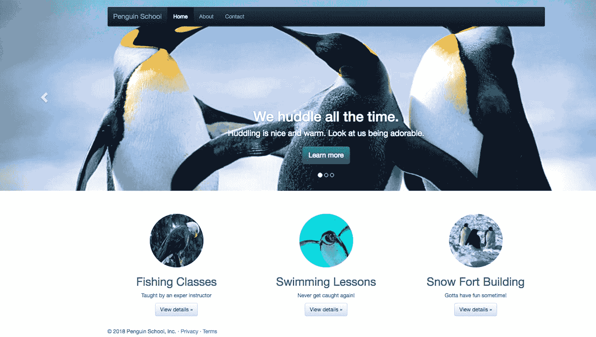 耶！我们在新的容器映像中本地运行我们的站点。 **步骤 3–将我们的图像发送到 AWS ** 现在我们将把我们新创建并测试的图像发送到 AWS。 首先在弹性容器注册表中创建一个存储库:  `aws ecr create-repository --repository-name cda-penguin-app1123`  然后运行这个命令来获得一个可以用来登录到您刚刚创建的 ECR 存储库的命令:  `aws ecr get-login --region us-east-1 --no-include-email`  然后将该命令的输出复制并粘贴回终端并运行它。这实际上将向弹性容器存储库验证您的身份，因此您可以将 Docker 映像放入其中。 现在我们已经登录到 ECR，我们可以将我们的图像放入 ECR。让我们这样做:

1.  通过运行`docker image ls` 确保我们在本地有我们的映像
2.  通过运行`docker tag cda-flask-app:latest ACCT_ID.dkr.ecr.us-east-1.amazonaws.com/`(其中 account ID 是您自己的 AWS 帐户 ID) 来标记图像
3.  使用`docker push ACCT_ID.dkr.ecr.us-east-1.amazonaws.com/hello-world`将图像上传到 AWS ECR(再次使用您自己的 AWS 帐户 ID 代替 ACCT ID)

轰！AWS 中应该有一个容器映像。 **第 4 步——使用 ECS 部署我们的 web 应用程序** 我们在本地构建的容器映像现在位于 AWS cloud 中的 ECR 内。既然我们已经这样做了，我们可以使用同一个容器映像来部署使用 Amazon ECS 的应用程序。 首先，让我们确保可以看到我们在 ECR 内部部署的图像。我们通过导航到 Amazon ECR >仓库下的 [ECS 控制台](https://console.aws.amazon.com/ecs/home?region) 的 ECR 部分来做到这一点。它应该看起来像这样，尽管您上传的存储库名称和 URL 可能有一点不同。 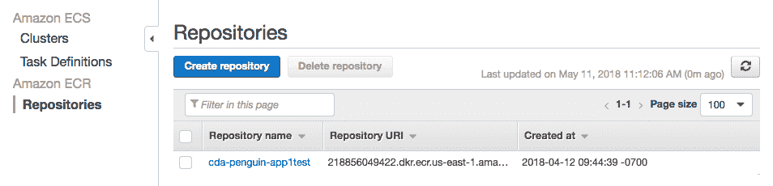 这意味着我们在 AWS 中存储了应用程序的容器映像，现在我们可以转移到 ECS 来运行它了！不过，在您这么做之前，让我们确保复制下存储库的 URI(我们很快就会需要它)。在 AWS 控制台中，转到 [  ECS 部分 ](https://console.aws.amazon.com/ecs/home?region) 并导航到集群选项卡。然后按“开始”按钮。 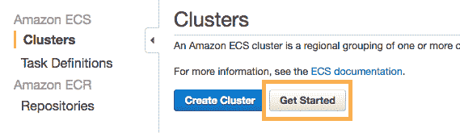 在下一个屏幕上，您应该看到这个页面: 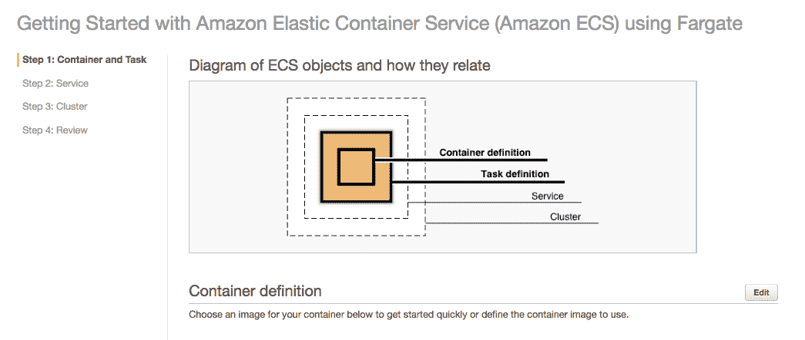 这允许您为您的新服务定义一个容器和任务定义。在同一页面的下方，您需要按“Configure”来设置一个自定义容器: 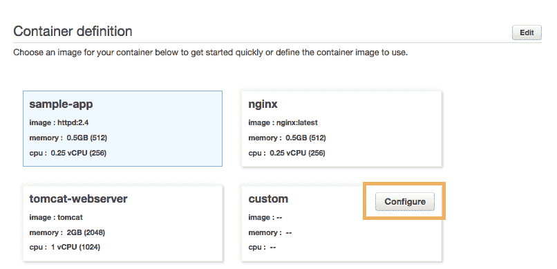 在配置容器定义时，我们需要将“Image*”旁边的框中的值更改为我们从 ECR 页面复制的图像的 URL。这允许我们在容器定义中引用 ECR 图像。我的 URL 可能看起来与你的略有不同，因为我给了我的应用程序和容器一个不同的名称，而且我们的 AWS 帐户 id 也不同。我们还需要在这个页面上设置一个内存限制——使用 128 这个硬限制。此外，在按下更新按钮之前，请确保在端口 80 上添加一个 TCP 端口映射，如图所示。 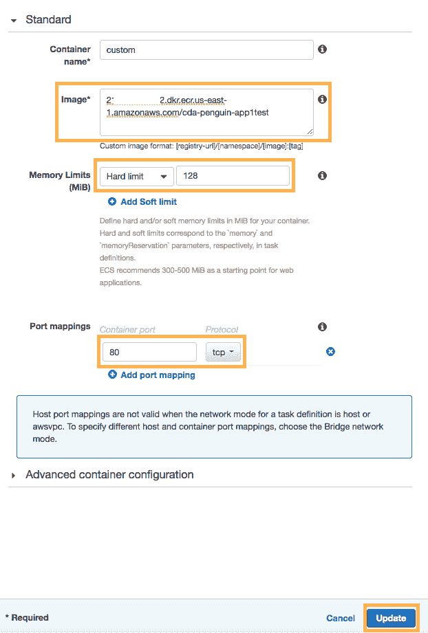 这次更新之后，我们应该准备好进入下一步了。我们不需要对任务定义做任何更改，所以只需按“Next”按钮。 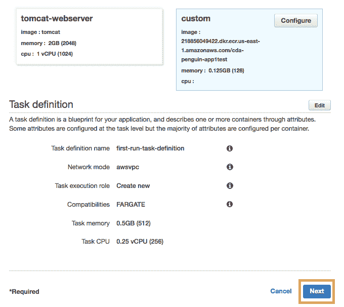 在下一页，我们将定义好容器和任务，实际上也不需要对服务配置进行任何更改。如果这是一个生产应用程序，我们可能希望设置一个负载平衡器。但事实并非如此，所以现在，我们只需按下“下一步”按钮。 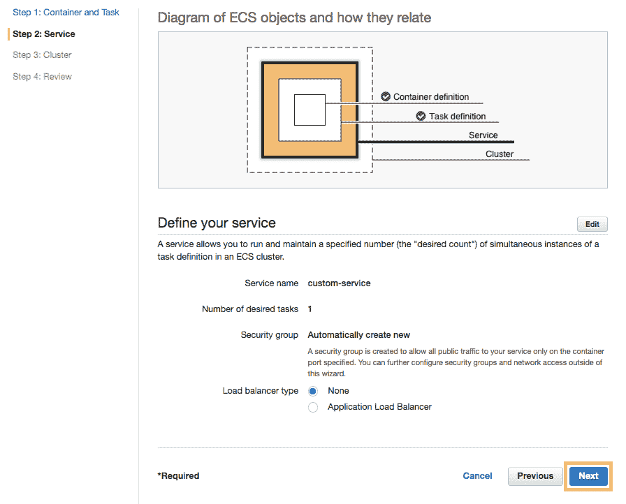 然后，如果我们愿意，我们可以通过命名集群并再次按下 Next 按钮来完成所有工作。 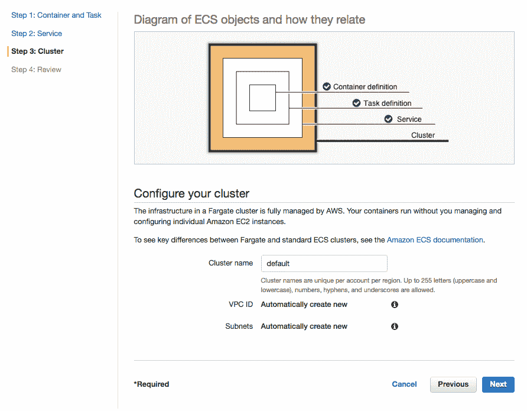 然后，我们将进入一个页面，在实际创建新服务之前，我们可以在这里查看我们的配置。它看起来应该是这样的: 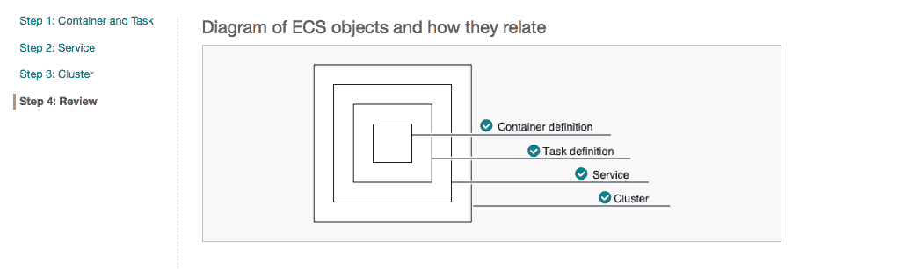 在页面的更下方应该有一个名为 Create 的蓝色按钮: 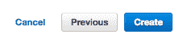 一旦我们按下它，我们应该会看到 AWS 开始为新服务创建一堆资源。让它结束，然后按“查看服务”按钮。 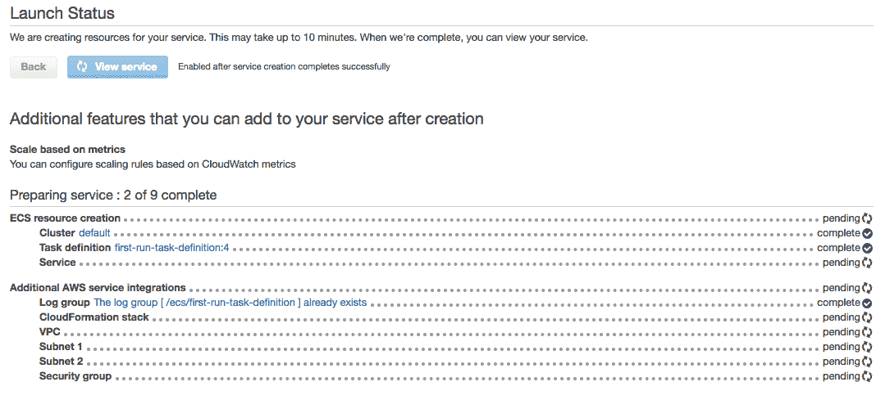 我们应该在一个新的屏幕上。如果我们迷路了，我们可以转到 ECS 控制台，单击正确的群集，然后单击服务，再次找到它。在此页面上，我们单击“任务”选项卡。 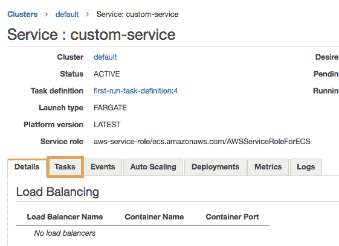 然后，从 tasks 选项卡中，我们可以单击为这项新服务运行的任务。 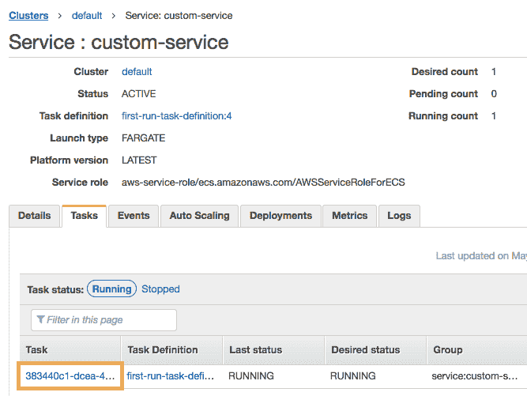 然后单击 ENI Id 旁边的 ENI ID 链接: 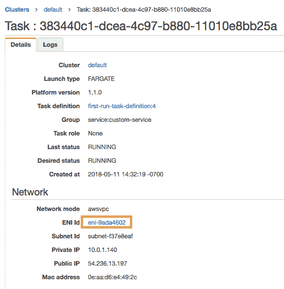 这将把我们重定向到 AWS EC2 控制台，它应该显示一个实例正在运行。我们可以获取该实例的 IPV4 IP 地址，并将其粘贴到 web 浏览器中。 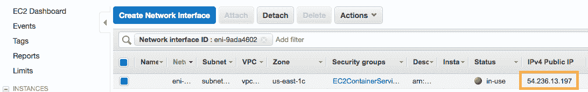 恭喜恭喜！我们刚刚使用 AWS、Docker、ECS 和 Flask 部署了一个容器化的应用程序！ 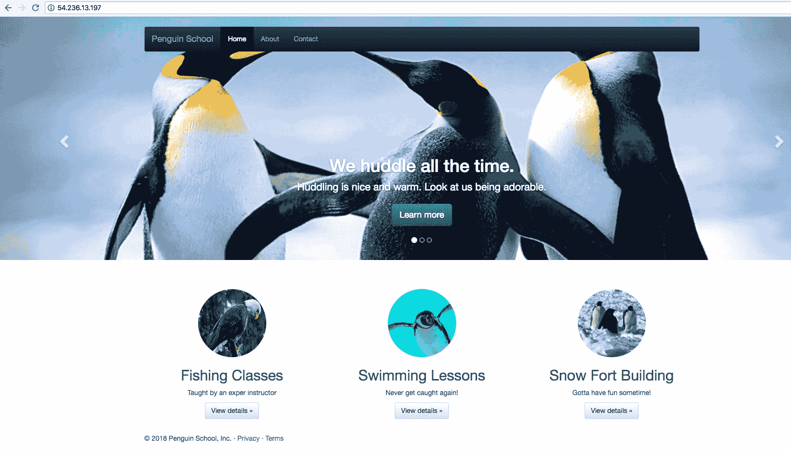 现在，我们显然可以配置或更改许多这种流程，以做更酷的事情。例如，我们可以:

1.  定制 Flask 应用程序，让它除了显示可爱的企鹅网站之外还能做其他事情
2.  根据您自己的应用需求，配置使用 ECS 时可用的许多其他设置
3.  部署大量具有不同需求、其他编程语言和更多的酷容器

但是这已经足够让你开始了！如果您想观看视频形式的演示，并在 Linux Academy 的现场环境中进行测试，请注册 Linux Academy 并查看包含实际操作环境的 [AWS 认证开发人员助理级别准备课程](https://linuxacademy.com/amazon-web-services/training/course/name/aws-certified-developer-associate-2018)、 ！