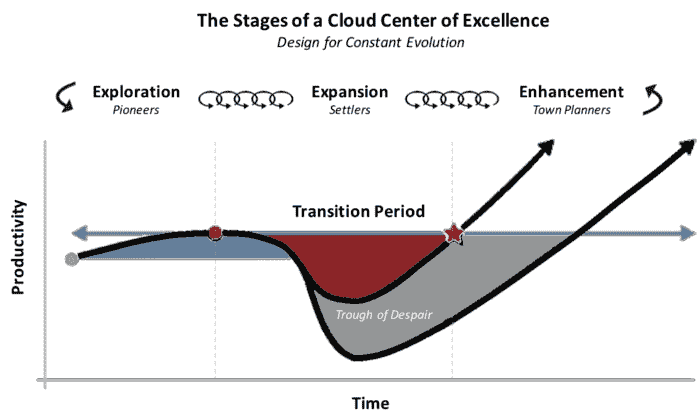

# 云中心走向卓越的 3 个阶段|云专家

> 原文：<https://acloudguru.com/blog/business/design-cloud-center-of-excellence-for-evolution>

亚马逊首席技术官[沃纳·威格尔](https://medium.com/@Werner)在 2017 年悉尼 AWS 峰会上占据了中心舞台，穿着一件印有“Werner Against the Machine”的定制 t 恤，这是现代超级英雄的胸前徽章。

作为伪装成首席技术官的终极承诺变革代理人， [Werner](https://en.wikipedia.org/wiki/Werner_Vogels) 利用他的 AWS 超能力来拯救世界各地的企业——利用速度、分析、灵活性和摆脱“敌对”数据库供应商的力量。

对于大多数企业来说，超音速是最难以捉摸的超能力。也是最有必要的。像 AWS 这样的云解决方案为组织带来了额外的速度、灵活性和整体商业价值。但许多公司仍未从内部或混合解决方案转向云。

幸运的是，AWS 云卓越中心(CCoE)可以成为您快速采用并持续发展大规模云技术的驱动力。

### 什么是 AWS 云卓越中心？

AWS 云卓越中心是一个由跨职能专家组成的团队，致力于推动组织的云之旅。他们创建符合业务需求的云迁移战略，采用和增强新的和现有的云技术，并鼓励整个组织的云流畅度。

对于希望从私有云或内部数据中心高效迁移的大型组织来说， [AWS 云卓越中心](https://acloudguru.com/content/cloud-center-of-excellence-webinar)团队成为一个重要机制。

### 成功采用云的要素是什么？

***TL；博士——速度至关重要***

这种引力阻止了许多企业获得动力和利用云，至少是以避免饿死人所需的速度。摆脱这种困境的唯一方法？创建一个 AWS 云卓越中心，并制定一个包含优先考虑速度和持续创新的最佳实践的[云迁移战略](https://medium.com/aws-enterprise-collection/dont-let-traditional-managed-services-providers-hold-your-cloud-strategy-back-3daf0da341a3)。

例如，在我在 Capital One 的 20 年职业生涯中，*规模速度*是我的工作方式。Capital One 的敏捷思维和 DevOps 文化使他们能够迅速[采用云技术](https://medium.com/aws-enterprise-collection/capital-ones-cloud-journey-through-the-stages-of-adoption-bb0895d7772c)并改造公司。这种加速转变由 AWS 的 API 驱动的云计算服务推动，由大数据的实时访问实现，并由对开源社区的承诺推动。

从内部数据中心获得实现逃逸速度所需的超音速需要大胆的领导，并长期致力于创新。虽然技术在任何云战略中都起着主导作用，但[人才转型](https://medium.com/aws-enterprise-collection/the-importance-of-talent-in-your-transformation-93179d1a3801)才是成功的真正关键。不存在神奇的药丸，但全力以赴建设 AWS 云卓越中心的组织通常会朝着正确的方向迈出一大步。

### 通过 AWS 云卓越中心(CCoE)采用云

如果您的企业希望以超音速速度实现云的采用，您需要一个愿意赞助 AWS [云卓越中心(CCoE)](https://get.acloudguru.com/cloud-center-of-excellence-webinar) 并向其投入资源的高管团队。

### 设计 AWS 云卓越中心，在您的组织中不断发展

***TL；DR–交接事宜***

AWS 云卓越中心(CCoE)使云的早期采用变得更加容易。但它需要不断发展，才能跟上云技术快速创新的步伐。因此，您应该有目的地设计您的云程序框架。

### 设计 AWS 云卓越中心，在您的组织中不断发展

首先，您的 AWS CCoE 和云计划负责人应该观察您组织内的价值流，然后设计一个与企业内部需求同步发展的适应性结构和迁移策略。

西蒙·沃德利在他的价值链映射战略[沃德利图](https://acloudguru.com/course/wardley-mapping)中注入了这些流动和转换的概念。西蒙的设计原则[先锋→定居者→城镇规划者](https://hackernoon.com/designing-for-constant-evolution-41b216741974) (PST)提供了一种创新的方法来导航组织的云采用之旅。每个小组处理旅程的不同阶段，利用他们独特的才能来创新和解决问题。通过使用这种方法，组织可以获得敏锐的态势感知，并在整个云之旅中学会从*探索*和*扩展*到整体*增强*。



Accelerate through the “Trough of Despair” with an AWS Cloud Center of Excellence and education program that achieves critical mass of cloud fluency.

## 阶段 1: AWS 云探索中心

***拓荒者探索***

踏上云之旅需要对底层 AWS 实用程序计算服务进行大量的迭代和试验。在你旅程的早期阶段，创建一个核心团队，由有能力和态度的创新工程师组成。

将这个小型的[双披萨团队](https://docs.aws.amazon.com/whitepapers/latest/introduction-devops-aws/two-pizza-teams.html)(一个只需要两个披萨的团队)与久经沙场、经验丰富、理解能力强的工程师组合在一起。他们知道关键功能目前如何运行，以及如何将现有数据中心平台转化为云中心服务。他们了解安全、网络和访问控制最佳实践，以及出现问题时如何排除故障。每天，这些*先锋*将利用敏捷技术来打破事物——并收集将决定未来成功的解决方案和模式的数据。

每天，这些*先锋*将利用敏捷技术来打破事物——并收集数据，这些数据将决定未来成功的解决方案和模式。

```
ProTip 1: An executive sponsor is absolutely essential during the early phases of cloud adoption. As a strong advocate for the cloud, the sponsor provides plenty of air cover and actively engages with the core team to remove obstacles from the board.
```

## 阶段 2: AWS 云扩展中心

***殖民者扩张***

一旦先驱们确定了模式并巩固了早期的成功，就将你的注意力转向将原型扩展成可消费的产品和服务。在广泛听取内部客户的意见后，*定居者*提炼模式，并帮助整个组织加深理解。

“[我们如何知道什么是可知的](https://read.acloud.guru/the-epistemology-of-information-technology-a3f6944cf02c?&ajs_aid=8b18379d-47bb-4050-b703-abaf45cc4bca)，或者说认识论，在云中与在内部有很大不同。”— [阿德里安·考克洛夫特](https://adrianco.medium.com/)

在云运营的这一阶段，当务之急是关注对 AWS 的早期理解。实现云流畅度的临界质量是组织能够维持向新运营模式过渡的唯一途径。

[通过忠诚的少数群体的影响达成的社会共识](https://www.sciencedaily.com/releases/2011/07/110725190044.htm)表明，当随机分布的代理中只有 10%持有不可动摇的信念时，人口中占主导地位的多数意见可以迅速逆转。

换句话说，将时间和金钱投入多维度云教育计划的组织将会获得收益。拥有令人信服的背景和内容的敬业的员工队伍将极大地加速您的组织度过 Simon 的“绝望低谷”,并确保吸引力而不是损耗。

在实施阶段，您的核心云运营团队不应再被视为最了解云的部门。通过将 AWS 云卓越中心的超能力释放给整个企业的数千名开发人员，您的核心 CCoE 团队应该转向并开始从其他部门收获新的和改进的模式。提升核心团队现有能力之外的其他部门是成功的早期关键指标。当云服务开始在整个企业中扩展时，自然会更加强调治理和控制。有了 AWS，您可以[通过利用 API 驱动的服务来访问实时控制和合规性，从而设计您的治理](https://medium.com/capital-one-developers/cloud-custodian-9d90b3160a72)。

```
ProTip 2: Instead of outsourcing your cloud training to Human Resources, tightly integrate cloud education as a core function on your program team. Leverage AWS certifications as a benchmark for cloud fluency and set a minimum goal of 10% completion enterprise-wide.
```

## 阶段 3: AWS 云增强中心

随着贵组织的云迁移和 AWS CCoE 的成熟，它们应该会带来速度更快、更具成本效益的平台。在金融服务等高度监管的行业中，组织依靠城镇规划者来确保消费者和监管者能够信任最终产品。

在这个阶段，组织主要将关注点从采用转移到增强和运营。虽然看起来令人惊讶，但创新并不仅仅局限于探索阶段的先驱者。在云采用的运营阶段也会发现这一点。

例如，Capital One 的 Terren Peterson 通过接受 T2 的现场可靠性工程概念和使用创新的方法来管理运营，进化了工程团队的思维模式。

他们的 SRE 团队利用工业化的公用事业功能，通过[云托管、](https://github.com/capitalone/cloud-custodian)基于功能的策略规则引擎来管理合规性和控制。这些团队还为不断扩展的平台贡献了新的功能——随着更高级服务的不断发展，完成了这个循环。

服务本身的起源展示了先锋、定居者和城市规划者的设计原则。最初由他们的先驱在内部开发，这个平台被定居者扩展到整个企业，最终被城镇规划者推向开源商品化。

```
ProTip 3: Involve your operational teams on day one of your cloud journey. Since operations function 24x7, consider a lift and shift for a subset of their workloads. Leverage a cloud capable MSP for interim support to lighten the load during their talent transition.
```

## 成功采用 AWS 云的最佳实践

在您创建云原生代和可持续云转型的过程中，经历以下几个关键阶段:

1.  **管理层支持:**与业务需求保持一致，并让利益相关方参与进来。创建您的 AWS 云卓越中心。
2.  **教育:**对云上的技术和非技术员工进行培训和教育。
3.  **实验:**验证证据点并定义架构、模式和治理。然后测量、监控和迭代。
4.  **混合运营:**提供集中的专业知识，指导分散的创新，发布如何成功采用云的指南和护栏。
5.  **规划 ROI 和计划**:规划应用程序的构建和/或迁移，执行 ROI 或总拥有成本收益分析，并迭代和验证假设。
6.  **组织变革:**定义和管理业务变革战略，包括政策、流程和经济。提供额外培训。
7.  **云优先战略:**创建您的愿景，激励团队成员跟随您的脚步。

有了 AWS 云卓越中心(CCoE)和这些组织设计最佳实践，云管理团队可以不断地循环探索、扩展和增强阶段。随着时间的推移，这种方法将以超音速的速度加快云的采用。

* * *

### 准备好开始你的变身了吗？

三分之二的组织表示，他们没有看到他们期望的云带来的好处。云专家可以让您的组织更快地实现云计算(及其优势)。ACG 企业版为您提供转变您的才能和业务所需的一切。

* * *

Drew 是 AWS 社区的英雄，Alexa 冠军，也是爸爸笑话的制作者。

*在推特上关注*[*@ drew firm*](https://twitter.com/drewfirment)*。*[*# wepower tech*](https://info.acloud.guru/we-power-tech?&ajs_aid=8b18379d-47bb-4050-b703-abaf45cc4bca)