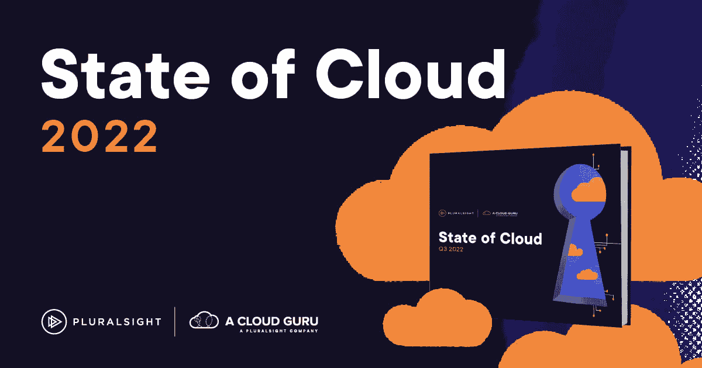

# 云认证如何解决技能差距|云专家

> 原文：<https://acloudguru.com/blog/business/develop-cloud-certification-program>

技术领导者默认使用云，但是没有云人才来实现他们的云计划。只有 8%的技术专家表示他们拥有丰富的云技术经验，64%的人表示他们正在寻求入门培训。你无法通过雇佣来摆脱这种云技能差距。你必须创造出你需要的人才。

但是说起来容易做起来难。成功的技能提升项目需要管理层的支持、清晰的流程和愿意开发云技能的团队。

## 目录

* * *

***调查称:你有云新手。你需要云大师。下载我们的 [2022 年云状态报告](https://www.pluralsight.com/resource-center/state-of-cloud)，了解为什么您需要缩小云技能与期望之间的差距，就像昨天一样。***

## 为什么对云认证的需求增加了？

领导者希望通过数字化转型来保持组织的相关性和竞争力。这意味着更多的云迁移和向云原生开发的转变。各种规模的组织都在与软件开发企业争夺云人才。不幸的是，没有足够的天赋——这并不是因为缺乏尝试。

根据我们的 2022 年云状态报告，技术专家想要学习。如果公司投资于技能发展，员工留在雇主身边的可能性会增加 94%。那么，为什么我们仍然看到云人才存在如此巨大的技能缺口呢？几个原因，包括:

*   预算限制和成本
*   时间不够
*   强调招聘而不是提高技能
*   缺少必要的工具
*   太多的干扰
*   缺乏雇主的支持

领导者的唯一解决方案是成为人才的创造者，而不是消费者。他们需要通过云认证和课程发展内部技能，而不是争夺少数合格的候选人。

* * *

### **为实现云目标，组织需要创造云人才**

* * *

## 领导者如何为云创造人才？

领导者应该利用云技能差距来突出他们的云认证计划，将其作为一项竞争优势。附带的好处是，他们将培养满足内部需求所需的云人才。

不同组织的技能提升项目看起来不同，但目标是相似的:解决技能差距，培养技术流利度，推动内部人才管道。成功需要领导层改变他们对人才的看法。技术专家拥有的最有价值的技能是适应性。没有它，几年后它们就死在水里了。

技术技能是可以教的。有什么不那么好教的？学习的动力、适应能力和领导项目的意愿。当领导者用这种视角看待顶尖人才时，他们的候选人云就会爆炸。

## 领导者如何推动云认证？

领导者必须建立云认证计划，让他们的技术专家能够最有效地学习。领导者应该依靠三个支柱来建立认证计划。

### 1.确定您希望您的团队学习哪些云技能

技术人员可以参加许多云认证和课程。领导者应该根据总体目标、当前技术和当前技能差距，准确定义员工需要学习的技能。

#### 按平台划分的流行云认证

开发[多云环境](https://acloudguru.com/blog/business/how-to-build-a-cloud-first-strategy#h-be-intentional-about-adding-multicloud-to-your-cloud-first-strategy)的组织应该关注所有提供商的课程，而使用单一云的组织应该关注特定提供商的云认证。领导者应该利用为主要平台提供的基础和专家级云认证:

*   AWS 认证云从业者
*   Azure 基础知识
*   谷歌云认证

#### 其他云计算课程和学习机会

技能提升提供商，比如云专家 T1，提供按需学习途径。这些课程帮助技术人员为云认证做好准备，并强化其他云技能。AWS、Azure 和 Google 云平台最受欢迎的课程有:

除了提供者特定的课程，ACG 还有提供者不可知的课程，如:

目标是帮助学习者通过云认证考试，并更有效地应用他们的技能。

### 2.将云认证作为业务重点

领导认为员工会在下班时间进行培训。他们不应该。技能提升，尤其是对于云技能来说，是一种商业需要。领导应该每周留出受保护的学习时间，员工可以在这段时间内参加课程、参加模拟考试并完成云认证。领导者还可以围绕增长路径建立计划，以创建云技能管道，并与员工合作，为完成云认证设定具体的 okr。

***需要准确了解整个组织的云计算能力？*** *从[云培训需求分析](https://acloudguru.com/platform/skills-assessments)开始，找出技能差距。尝试我们的技能评估，帮助您的团队在云计算领域取得更大成功。*

*[Watch this free on-demand webinar to learn about the costs and complexities of rehosting, replatforming, and rearchitecting applications for the cloud.](https://go.acloudguru.com/cloud-migration-patterns-that-really-work-webinar?ajs_aid=75d9f18d-5716-4079-964c-b3b6e8c7a73b)*

### 3.以身作则

相信技能提升项目力量的领导者以身作则。他们参加课程，完成资源指南，并与员工一起参加考试——他们用资源鼓励团队，帮助他们取得成功。这增加了参与度，并为制定计划的领导者提供了见解。这也有助于他们识别项目中的障碍，并根据需要进行调整。

* * *

### **了解 Pluralsight 的 EMEA SVP 营销团队如何带领她的团队成功获得云认证！**

* * *

## 超越云认证:如何培养云流畅度

[Cloud-fluent](https://www.pluralsight.com/blog/learning-and-development/fluency-matters-creating-an-end-to-end-tech-fluency-program) 团队知道为什么云对他们的组织很重要，它是如何应用的，以及它如何与其他技术协同工作。他们可以就其对整个组织工作的影响进行高层对话。

领导者不应将云技术升级局限于技术团队。随着时间的推移，向所有员工开放的项目产生高收入增长的可能性是其他项目的 5.4 倍。近 70%的组织被员工认为是理想的工作场所，68%的组织在客户满意度方面领先同行，62%的组织在创新方面领先同行。

组织对云转型有很好的想法，但缺乏将这些想法变为现实的技术人才。最有效的解决方案？通过云技能提升计划培养人才，首先是建立一支适应性强、愿意学习新事物的员工队伍。这些计划有助于领导者培养云流畅的文化，在他们的组织内发现云人才，并推动云的真正变革。

* * *

## 准备好升级您公司的云了吗？

创建云创新文化，通过大规模实践学习加速云成功。使用最全面、最新的学习库、评估和[沙盒软件](https://acloudguru.com/platform/cloud-sandbox-playgrounds)对 10 或 10，000 人进行升级或再升级。

* * *