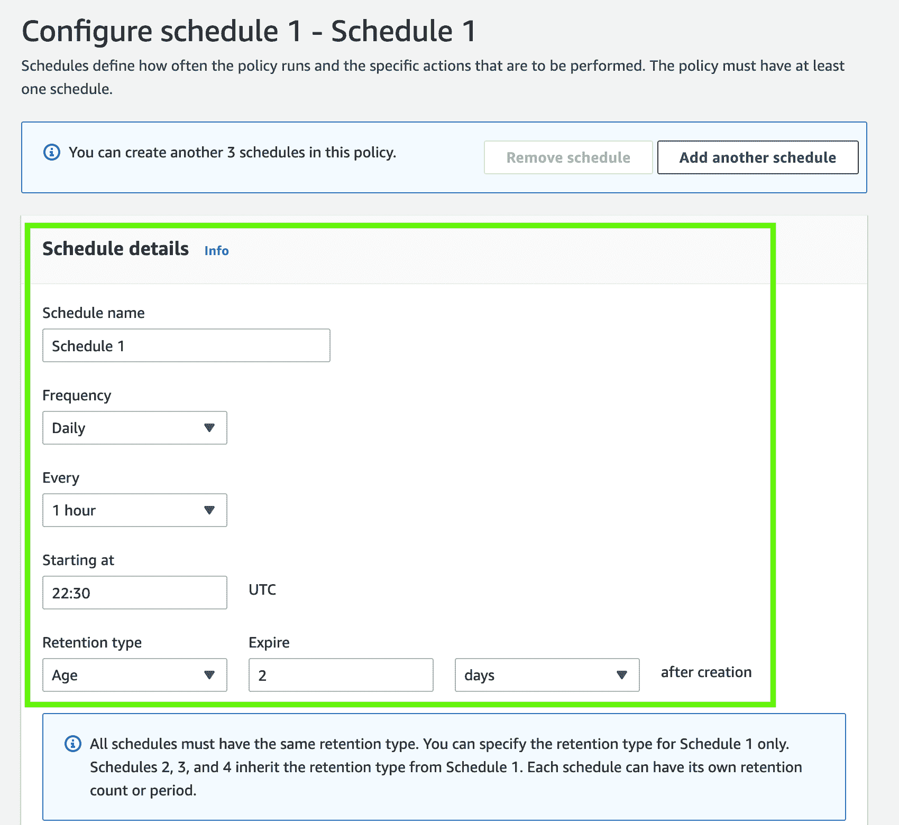

# EBS 快照生命周期|云专家

> 原文：<https://acloudguru.com/blog/engineering/ebs-snapshot-lifecycle>

亚马逊弹性块存储(EBS)快照是您备份和灾难恢复计划的重要补充，亚马逊数据生命周期管理器(DLM)可以简化这一过程。

* * *

加速你的职业生涯！

[从 ACG 开始](https://acloudguru.com/pricing)通过 AWS、Microsoft Azure、Google Cloud 等领域的课程和实际动手实验室改变你的职业生涯

* * *

Amazon EBS(弹性块存储)快照是您备份和灾难恢复计划的绝佳补充。它们通常被大大小小的组织用于此目的。任何好的灾难恢复计划的一部分是定期检查和测试它。您的审查应该包括清理旧的快照，因为随着时间的推移，随着环境的变化和增长，您可能会发现您已经积累了大量的快照。虽然快照被认为是增量的，并且每个快照的相关存储成本往往很低，但情况并非总是如此。例如，您可能需要拥有频繁的大容量快照，这些快照具有不同的保留时间。随着时间的推移，这可能会增加大量存储费用。此外，手动管理所有这些快照可能相当麻烦。这就是亚马逊数据生命周期管理器(DLM)能帮上忙的地方。

## 什么是 DLM？

Amazon Data Lifecycle Manager 为您管理 EBS 快照备份提供了一种简单的自动化方式。使用此服务，您将能够自动创建、保留和删除您的 EBS 快照。使用它的一些好处包括:

*   通过实施定期备份计划来保护宝贵的数据。
*   创建可以定期刷新的标准化 ami。
*   根据审计员或内部合规要求保留备份。
*   通过删除过时的备份来降低存储成本。
*   创建将数据备份到独立帐户的灾难恢复备份策略

### **让我们来看一个简单的用例**

您有一个法规遵从性指令，要求您创建 EBS 卷的新快照。快照需要每小时生成一次，并删除超过 2 天的快照。这可能是一个重复性的任务，但在 DLM 的帮助下，我们可以快速设置为自动化。

对于我们的示例，我们将假设该卷已经存在，并且我们正在设置一个新的生命周期策略。从我们的 EC2 控制面板中，我们希望转到导航窗格中的“Volumes”并选择我们的卷。

DLM 使用标记，因此我们要做的第一件事是为该卷(以及未来的潜在卷)设置一个特殊标记，生命周期策略将使用该标记来管理快照。

1.  单击卷 ID，然后单击“标记”选项卡。在这里，我们要单击“管理标签”，然后添加标签。
2.  我将使用键:enable-snapshot 值:yes，然后保存它。
3.  现在，我们的卷已被标记，单击导航窗格中的 LifeCycle Manager 链接。
4.  在那里，从下拉列表中选择 EBS 快照，然后单击下一步。
5.  在这种情况下，我们的目标是一个卷，因此请确保选中该卷，然后我们希望将我们新添加的标记用于目标资源。输入标签，然后单击添加。
6.  提供此策略的描述。
7.  我们将 IAM 角色保留为默认角色，尽管您可以为此创建自定义角色。此外，在本例中，我们不会向快照添加任何标签，但是如果您需要或想要，您可以这样做。
8.  接下来，验证策略是否设置为启用。然后单击下一步。

现在我们需要为策略创建时间表。我们知道它需要每小时运行一次，并且应该保留 2 天。在计划屏幕上，我们可以填写此内容。因为我们只创建这一个计划，所以我将保留默认名称。需要注意的一点是，开始时间采用 UTC，策略将在开始时间的一小时内运行。我们可以跳过其余的高级设置，继续查看策略。验证一切正常后，单击创建策略。

这将我们带回到生命周期管理器视图，我们可以看到我们的新策略。等待时间表的开始时间过去后，我们可以检查“Snapshots”选项卡，看到我们有了一个新的快照。根据我们设置的保留策略，这将在 2 天后删除。

* * *

就像这样，我们设置了自动化快照创建和删除策略来帮助我们实现合规性。您不必再担心数量不断增长的快照，因为它们现在由数据生命周期管理器管理。所有技术都有失败的可能，幸运的是，您可以使用 CloudWatch 来监控此类事件，并解决任何可能出现的问题。

* * *

### 想了解更多关于 AWS 的知识？

想了解更多关于 AWS 的知识？看看我最新的课程，[在 AWS](https://learn.acloud.guru/course/running-linux-servers-on-aws/overview) 上运行 [Linux](https://learn.acloud.guru/course/running-linux-servers-on-aws/overview) [服务器。由于 AWS 云的很大一部分都是基于 Linux 构建的，所以公司和个人在 AWS 中运行的许多虚拟机也使用 Linux 也就不足为奇了。查看本课程，我们将深入了解在 AWS 平台上运行 Linux 系统的世界。](https://learn.acloud.guru/course/running-linux-servers-on-aws/overview)

*想跟上 AWS 的一切？* [*在 YouTube 上订阅一位云大师*](https://www.youtube.com/c/AcloudGuru) *的每周亚马逊新闻和 AWS 公告。你也可以像 ACG 上的***一样，关注我们上的* [*推特*](https://twitter.com/acloudguru) *，或者加入* [*不和谐*](https://discord.com/invite/pluralsight) *的对话！**