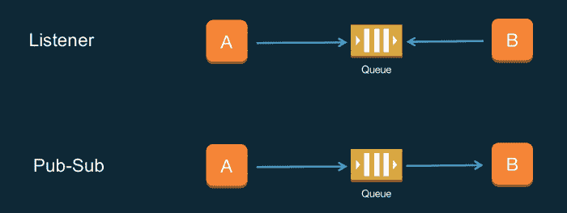
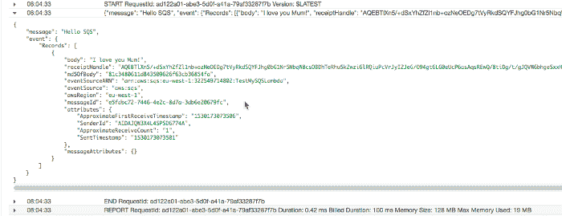

# 亚马逊 SQS 和 AWS Lambda 的事件驱动架构

> 原文：<https://acloudguru.com/blog/engineering/event-driven-architecture-with-sqs-and-aws-lambda>

事件驱动架构的核心是队列——现在亚马逊 SQS 可以触发 AWS Lambda 函数，这变得更容易了。

您可能知道我非常喜欢事件驱动模式。当系统发生变化时，动作发生，而不是等待和轮询变化。

我们已经谈论这个架构模式很多年了——但是直到最近，它更多的是一个理论上的想法，而不是一个简单实现的模式。

然而，AWS Lambda 为每个人带来了事件驱动计算，并将事件驱动范式提升到了一个全新的水平。像网飞( [Bless](https://github.com/Netflix/bless) )和 Capital One ( [云托管](https://github.com/capitalone/cloud-custodian))这样的公司现在正在使用事件驱动的架构来执行实时安全性、合规性和策略管理。

Event-driven patterns

事件驱动架构的核心通常是队列。在 AWS 上，这个中心构件由[亚马逊简单队列服务(SQS)](https://aws.amazon.com/sqs/) 负责。为了从 SQS 队列中读取信息，您的 lambda 函数必须轮询它——直到现在！

在喝咖啡的时候，我注意到在测试 lambda 函数的触发器列表中有一些有趣的东西。我就像——什么？？我做梦吗？

### 让我们试试这个！

*   首先，创建一个 SQS 队列。我把我的测试队列叫做`***TestMySQSLambda***`,这是我在两杯早餐咖啡之前能想到的最原始的名字。
*   我还使用了默认的`***Stand*ard Queue** `——它不能保证消息的顺序。
*   点击`***Quick-Create Queue*** ` —是的，我们想要快点！

*   然后为您的 lambda 函数创建一个 IAM 角色，以便能够被 SQS 触发。这是一个测试，所以让我们大胆地将下面的策略添加到您的基本 lambda 执行角色中——并将其保存为`***SQSLambda***`角色。

*   然后登录 AWS Lambda 控制台，让我们从头开始创建一个函数。还是需要一个非常原创的名字——`***MySQSTriggerTest***`。

*   点击`***create***`然后编辑 Lambda 函数——我使用了以下超级高级的 python 代码。

*   现在选择之前刚刚创建的`**Execution role**`。

*   然后从触发器的长列表中选择已创建的 SQS 触发器—它是列表中的最后一个。

*   最后，选择先前创建的`***TestMySQSLambda***` SQS 队列。
*   点击`***Add***`，然后点击`***Save***`。
*   如果一切都做得正确，您应该在 AWS 控制台中看到类似的内容——用绿色显示`**Saved**`。

### 考验的时候到了！

*   从如下所示的菜单中选择`***Configure test event***`。

*   然后搜索`***SQS***`，您应该会看到如下测试模板。

*   点击`***Create***`，然后点击`***Test***`。

全绿——我们很好！现在让我们通过将数据直接放入 SQS 队列来测试整个管道。

*   进入 SQS 控制台，选择之前创建的队列，点击`***Queue Actions***` **和**，然后在 ***下拉列表中选择 **`***Send a Message***` **。*******************

*   ****在这里输入你对世界的希望。今天是你做一个好人的机会！****

****现在去查看 Cloudwatch 日志控制台并搜索`***aws/lambda/MySQSTriggerTest***`——你应该能看到 SQS 到[λ触发器](https://acloudguru.com/hands-on-labs/setting-up-lambda-functions-with-s3-event-triggers)！****

********

****尼利斯。这是一个期待已久的功能，现在允许开发人员构建真正的事件驱动架构，而无需轮询 SQS 队列获取数据！迫不及待地想看看你要用它来建造什么🙂****

* * *

## ****获得更好职业所需的技能。****

****掌握现代技术技能，获得认证，提升您的职业生涯。无论您是新手还是经验丰富的专业人士，您都可以通过实践来学习，并在 ACG 的帮助下推进您的云计算职业生涯。****

* * *