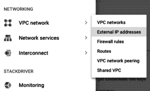
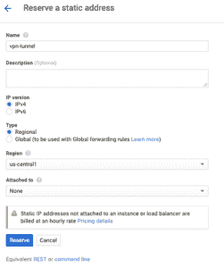
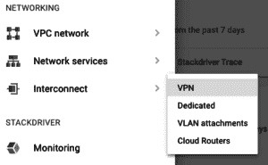

# 使用云 VPN 将您的网络扩展到 Google Cloud

> 原文：<https://acloudguru.com/blog/engineering/extend-your-network-to-google-cloud-using-cloud-vpn>

将您的私有内部网络连接到 Google 云平台上的安全资源的能力非常强大。通过虚拟专用网络(VPN)将您的 GCP 资源连接到您的专用网络，您可以创建一个加密隧道，将 GCP 资源与您组织的其他资源放在同一个专用网络上。本指南将向您展示如何创建和配置到 GCP 的基本 VPN 连接(或隧道)。首先，几个参数:

*   云 VPN 通过使用共享密钥(IKEv1 或 IKEv2)的 IPsec 连接运行
*   云 VPN 支持静态和动态路由(使用云路由器时)
*   云 VPN 适用于站点到站点的 VPN 连接(即路由器到路由器)，但不支持客户端到站点的连接，例如您用笔记本电脑连接的连接。

在我们开始之前，您需要从您的本地网络路由器:

*   路由器 IP 地址
*   您的网络上将通过 VPN 连接的子网
*   为您的本地路由器 VPN 设置配置的共享密钥。

## 为 VPN 隧道选择一个区域(GCP 端)

默认情况下，GCP 项目在全球每个地区都有一个子网，所有子网都在同一个专用网络中。您可以在任何地区建立 VPN 隧道，并让其他地区可以访问它。为了获得最佳性能，您应该在托管 GCP 资源的同一区域创建 VPN 隧道，例如需要访问您的本地网络的虚拟服务器。例如，如果您的大多数 GCP 资源位于美国中部 1 的“子网 a”中，您可能希望将您的 VPN 隧道连接到同一个美国中部 1 区域。请注意，同一区域中可以有多个子网，但是 VPN 连接只关心它所连接的单个区域。

## 为 VPN 隧道保留静态 IP 地址

在创建 VPN 通道之前，您需要保留一个静态 IP 地址。下面是这样做的步骤。

*   从 GCP 控制台，从左上角菜单，导航到**网络-VPC 网络-外部 IP 地址**。

*   选择**保留静态地址**。
*   为保留的地址命名以供参考(在本演示中，我们将使用“vpn-tunnel”)。
*   选择我们的 VPN 通道将使用的同一个区域。静态 IP 仅在保留它们的区域可用。请注意，同一个区域中可以存在多个子网。
*   将所有其他设置保留为默认设置，并点击**保留**。【T2

创建 VPN 隧道

## 现在我们已经保留了一个静态 IP 地址，接下来是创建 VPN 隧道的有趣部分。从您的 GCP 控制台，在左上角的菜单中，导航到**网络–互联–VPN**。  点击**创建 VPN 连接**。这将带您到主菜单来创建您的 VPN 通道。这里有很多要讨论的，所以让我们来分解一下。我们将首先配置我们的 VPN 网关。

给 VPN 连接一个名称；我们将使用“vpn-1”。

*   选择要使用的 VPC 网络，我们将使用默认网络。
*   选择创建 VPN 连接的区域。我们正在使用我们的中心 1。
*   选择一个保留的 IP 地址。请注意，如果我们在不同的地区保留了一个 IP 地址，它将无法访问。
*    接下来，我们需要配置 VPN 网关将使用的本地网络隧道。在同一区域的一个 VPN 网关上可以有多个隧道。

**远程对等 IP 地址**是您本地 VPN 路由器的 IP 地址。将其输入本栏位。

*   留下艾克版本为 IKEv2。
*   输入共享密钥，您需要在本地路由器中进行配置。
*   由于我们在本演示中使用静态路由，因此在**路由选项**下，选择静态并输入该 VPN 隧道需要访问的本地网络子网。
*   将所有其他设置保留为默认设置，并点击**创建。**
*   短暂延迟后，您的云 VPN 连接将成功完成，您的 GCP 资源将可以通过专用网络访问您公司的内部网络。哇-啦！准备好开始使用谷歌云了吗？这是我们最新的[谷歌云实践培训内容](https://wpengine.linuxacademy.com/linuxacademy-com/google-cloud-online-training-new-releases/)！如果你对更多的实践教程感兴趣，请务必[订阅我们的 YouTube 频道](https://www.youtube.com/linuxacademycom)，我们将在每周四展示谷歌云平台的现场实践演示，更不用说在周三重点介绍最新的谷歌云新闻了！

 After a brief delay, your Cloud VPN connection will be successfully completed and your GCP resources will then have private network access to your company’s on-prem network. Wa-La!Ready to get started with Google Cloud? Here’s our latest [hands-on Google Cloud training content](https://wpengine.linuxacademy.com/linuxacademy-com/google-cloud-online-training-new-releases/)! If you’re interested in more hands-on tutorials, make sure to [subscribe to our YouTube channel](https://www.youtube.com/linuxacademycom) where we’ll be demonstrating live hands-on demos of the Google Cloud platform every Thursday, not to mention highlighting the latest Google Cloud news on Wednesdays!