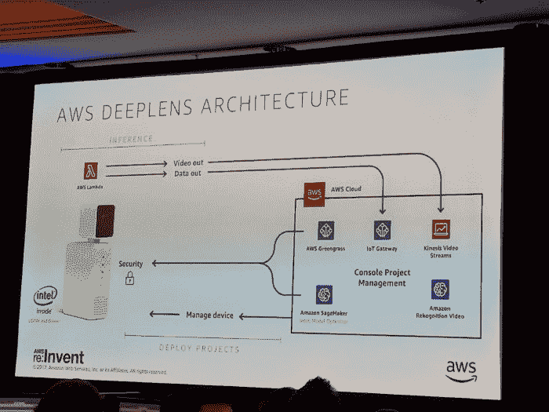
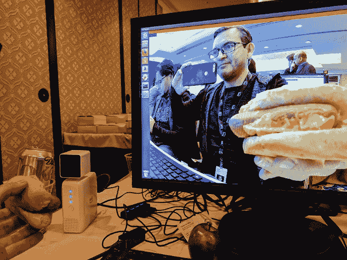
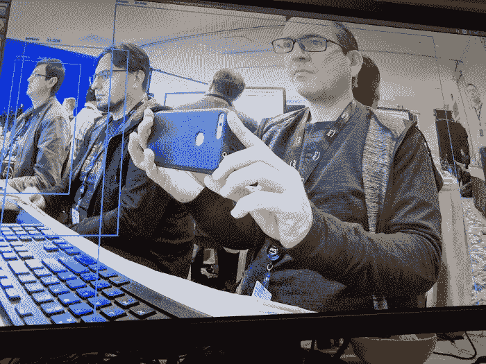

# AWS DeepLens 为每一位开发者带来视频人工智能

> 原文：<https://acloudguru.com/blog/engineering/first-looks-the-new-deeplens-device>

## *深度学习的未来不是热狗，而是在边缘*

来自 Andy Jassy 的 AWS re:Invent 2017 主题演讲向世界介绍了亚马逊的新 DeepLens 设备——一种完全可编程的摄像机，可以让你在本地运行深度学习模型，以分析并采取行动。这款最先进的相机将从 4 月份开始以 250 美元的价格零售，现在可以预订。

宣布之后，AWS 为 re:Invent 参与者开放了几个动手实验室，以探索和试验新设备。初步检查，外观没什么特别的。DeepLens 设备基本上是一个安装在一个白色盒子顶部的摄像头，上面有一些端口和按钮——但神奇之处就在里面。

这是一个运行 Ubuntu 的小盒子，内存 8GB。DeepLens 预配置了 AWS Greengrass，因此处理发生在设备上，而不是云上。

> AWS Greengrass 是一款软件，可让您运行本地计算、消息传递、数据缓存、同步和机器学习功能。连接的设备可以运行 AWS Lambda 功能，保持设备数据同步，并与其他设备安全通信，即使没有连接到互联网。

要认识到的关键事情是，DeepLens 不仅仅是一个摄像机，它是世界上第一个支持深度学习的开发套件。可编程摄像机持续监控视频流，使用干扰模型来查找您定义的项目，然后根据需要在云中采取后续行动。

摄像机配备了一些现有的训练模型，以帮助进行对象检测、人物检测、活动检测等。

该架构旨在将所有繁重且消耗带宽的活动保留在设备上。DeepLens 使用云来管理下游连接和事件处理，并使用新的 SageMaker 工具来管理机器学习的日常和困难部分。

从工作流的角度来看，这实际上是非常好的构想——让人想起其他复杂的 AWS 工具(如 Elastic Beanstalk)中清晰的指导流程。

当您登录到 AWS DeepLens 控制台时，设置设备就像选择训练模型、选择推理 Lambda 函数并部署到设备一样简单。拆箱后，只需使用 Amazon 控制台，几分钟就可以上线。

在 AWS 培训实验室中，我们使用了预先配置的模型，这些模型是整个机器学习过程的大脑。我们的实验室是围绕可疑的硅谷灵感“有热狗还是没有热狗”任务建立的，就像电视节目中一样，它实际上并没有很好地工作。

有没有芥末，有没有面包，都没什么区别。我们的模型在热狗大赛中惨败。

The red bar indicates the probability of “No HotDog”.

但这只是第一天——更有用的识别人的任务出奇地成功。正如下面的照片所示，DeepLens 能够拍摄现场视频，并轻松找到所有没有任何问题的人。

令人印象深刻的是——即使在拥挤的培训室中——边界框即使在奇怪的角度也始终准确。

DeepLens 与 AWS 物联网世界集成，因此您可以将事件连接到 Lambda 进行 SNS(电子邮件、短信等)或在生态系统内采取任何其他行动。在设备上完成所有工作的绝对速度开辟了一个可能性的领域，这在云中处理是不可行的。

公平地说，你仍然需要熟悉机器学习的模型构建，才能充分利用深度学习，尽管我可以想象模型市场会很快出现。

即使有了 SageMaker，也无法跨越这样一个事实，即你需要一些培训来掌握机器学习概念。这个产品直接面向开发者，而不是普通大众。一旦它在野外变得松散起来，我们只是触及了可能性的表面。

研讨会与会者获得了免费的 DeepLens 设备。我将在接下来的几周继续玩它，并提供更新。尽管我可能不会用热狗。

*你在 re:Invent 获得了试验 DeepLens 的机会，或者计划订购该设备来探索深度学习吗？我很乐意听到你对 DeepLens 的想法，并在下面的评论中了解你的项目！*