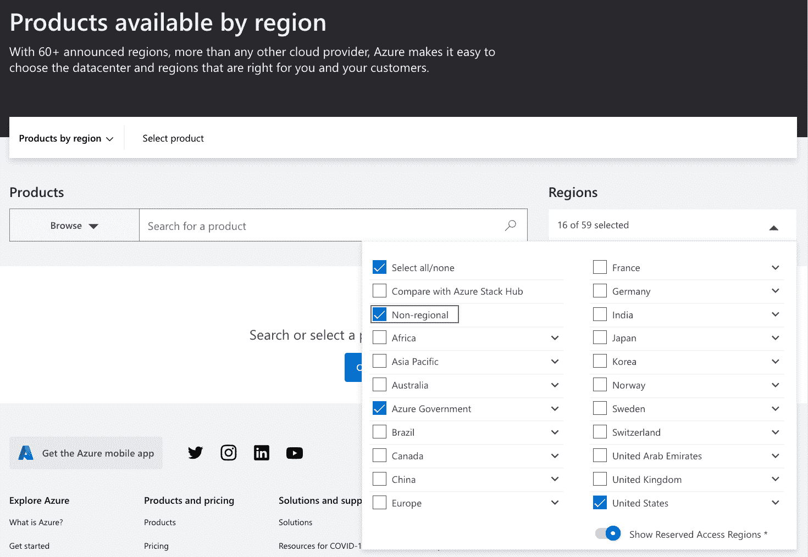
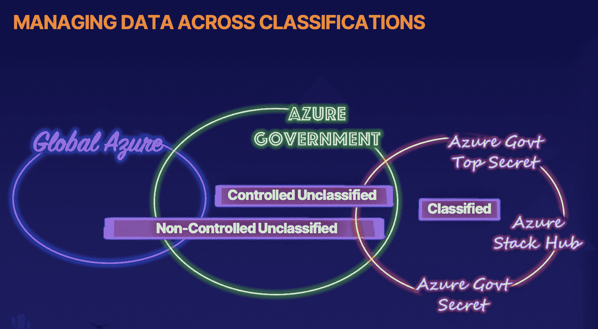

# Azure 政府云:必须知道的四件事

> 原文：<https://acloudguru.com/blog/business/four-essential-things-about-azure-government-cloud>

## 什么是蔚蓝政府？

当我告诉人们我已经建立了一个专注于 Azure Government 的云课程时，我得到了两种常见的回应。在第一种情况下，在我说完“受控、非机密数据”这句话之前，先前有意识和警觉的个人突然打瞌睡。

第二个是明确的信念，即这只是“香草”Azure 的一个营销角度。你知道，蓝色代表政府，蓝色代表医疗保健，蓝色代表气球艺术家，对吗？

第一个反应也许是有根据的。大多数第一个回复的人都有真正的需求想知道 Azure Government 是什么，所以在短暂的小睡之后，他们通常会带着新的兴趣回到对话中。

然而，第二种回应是基于一种误解。说到 Azure Government，我们谈论 Azure 并不是为了某个特定的目的。我们正在谈论一个完全不同的云平台，称为“Azure 政府”

* * *

## **转变职业，转变组织**

知识就是力量。是时候爬上职业阶梯，在 AWS、微软 Azure、谷歌云等领域的实践实验室中进行严格的学习了。

* * *

## 蓝色政府的四个 w

让我们看看我能否通过回答四个问题来为你总结一下。为了避免这篇文章变成助眠剂，我会保持简短——然后你可以决定你是否想继续你的探索，了解更多关于 Azure Government 的知识(我保证这是非常值得的)！

* * *

### 1.是什么让 Azure Government 与众不同？

Azure Government 是 [**微软美国主权云**](https://techcommunity.microsoft.com/t5/public-sector-blog/history-of-microsoft-cloud-offerings-leading-to-the-us-sovereign/ba-p/2157821) 的一部分，构建在物理上和逻辑上都分离的完全隔离的环境中。除了 Azure，Office 365 和 Dynamics 365 也可以在美国主权云中托管服务。顾名思义，美国主权云中的所有服务都包含在一个认证边界内，该边界要求筛选美国人和美国大陆内的数据主权。

#### 政府产品–Azure vs AWS vs GCP

AWS 和 GCP 也有针对政府的产品。但 Azure 的方法与 AWS 和 GCP 的产品明显不同。目前，无论是 AWS 还是 GCP 都没有选择自主云之路。与 Azure Government 类似，AWS 和 GCP 宣传额外的物理安全措施。但与 Azure Government 不同，他们声称与全球云平台隔离的数据中心就足够了。

* * *

如果你有兴趣深入研究其他云提供商提供的政府专用产品，请探索我们的[AWS gov cloud:Beyond the buzz words](https://acloudguru.com/course/aws-govcloud-beyond-the-buzzwords)课程。

* * *

#### 蔚蓝政府 vs 全球蔚蓝

Azure Government 建立在与 global Azure 完全相同的技术上，但它是一个完全独立的云平台。以下是 Azure Government 与 global Azure 的一些不同之处:

Azure Government 有几个地区或数据中心位置，都位于美国。这与 global Azure 中的几十个全球范围的区域形成了对比。

有几个国防部特定区域和“未公布”区域，为处理机密数据的组织提供服务。

Azure Government 中的数据中心有额外的物理安全性，管理和支持 Azure Government 的微软人员要经过额外的筛选过程。

#### 蔚蓝政府机密和蔚蓝政府绝密

在 Azure Government 内部，有两种产品，称为 Azure Government Secret 和 Azure Government Top Secret，但公开提供的对该基础架构的描述是模糊的(可以理解)。

Azure Government 包含了很多 Azure 特性，但是为了覆盖更多的合规范围，并没有包含*所有* Azure 资源。你很少会在 Azure Government 的预览版中看到资源，但是，每隔一段时间，一个服务或功能会在 Azure Government 中可用，然后才在 global Azure 中可用。

要了解按地区(包括 Azure Government)划分的可用服务，请查看按地区划分的 Azure 产品资源。确保使用区域下拉列表并选择“非区域”、“Azure Government”以将这些区域包括在您的搜索结果中，并勾选“保留访问区域”选项选择“美国”作为与 Azure Government 最相关的服务可用性对比。

#### Azure 政府和多租户

就像几乎所有的云平台一样，Azure Government 是多租户的。也就是说，多个客户可以共享相同的硬件。然而，在 Azure Government 中，可能是数字邻居的客户都必须是公共部门组织。

* * *

### 2.谁可以使用 Azure Government？

Azure 政府订阅仅适用于美国公共部门的组织或其指定的服务提供商。

这些公共部门类别包括联邦政府、国防部、英特尔社区、市政当局、部落政府、司法和公共安全以及电力和公用事业。

微软对这个要求非常严格，我甚至无法获得 Azure 政府订阅来制作我们的 Azure 政府介绍课程！(幸运的是，出于培训和试验的目的，这两个门户中的所有功能看起来和行为都与 global Azure 非常相似。)

* * *

### 3.为什么使用 Azure Government 而不是 global Azure——反之亦然？

如果您的组织在公共部门安全和隐私标准方面的法规遵从性要求相对较低；或者你的绝大多数服务和内容都是面向公众消费的，你应该考虑 global Azure 而不是 Azure Government。

#### Azure 政府服务集

global Azure 中有更多的服务，这本身就是一个令人信服的理由。但是，Azure Government 中的一些服务有一些 global Azure 中没有的差异和限制，如 Azure Government 和 global Azure 中的服务的[比较中记录的那样](https://docs.microsoft.com/en-us/azure/azure-government/compare-azure-government-global-azure)当然，没有什么可以阻止您的组织订阅 Global Azure 和 Azure Government 云！

#### Azure 政府合规标准

通常，合规性标准将决定你应该采用哪种云，以及你何时应该使用 Azure Government Secret 或 Azure Government Top Secret 产品。微软维护这个[Azure Government Services by Audit Scope](https://docs.microsoft.com/en-us/azure/azure-government/compliance/azure-services-in-fedramp-auditscope#azure-government-services-by-audit-scope)文档，它告诉你什么时候应该使用什么。

不管服务集和审计范围如何，有时您的决策就像您需要存储和管理的数据类型一样简单。这张文氏图说明了一切:

* * *

### 4.Azure Government 在混合和云计算架构中处于什么位置？

通常，当您将传统网络与云平台相结合时，这被视为混合云部署。但是，同样，如果你在不止一个微软产品中拥有云资源，比如 global Azure 和 Azure Government，这被认为是一个“混合”选择。当您将来自微软和亚马逊等多家供应商的云平台产品组合在一起时，这被认为是多重云。

如果这开始变得令人困惑，不要惊慌。幸运的是，许多公共部门组织发现他们可以采取“以上所有”的方法。你可能已经在 AWS 或 GCP 有了业务，或者你决定在云提供商之间进行多元化发展。如果是这样的话，Azure Government 与 AWS 或 GCP 政府产品相结合，可能会提供一个合理的多云机会。

想了解更多关于 Azure Government 的信息吗？在我的课程 *[蔚蓝政府介绍](https://learn.acloud.guru/course/introduction-to-azure-government)中，你可以在历史悠久的 66 号公路上进行一次虚拟的公路旅行。*

* * *

公共部门采用云面临着一系列挑战。但是也有巨大的机会。在这份深入的白皮书中，克里斯·休斯专业地阐述了公共部门采用云的挑战、机遇和潜力。