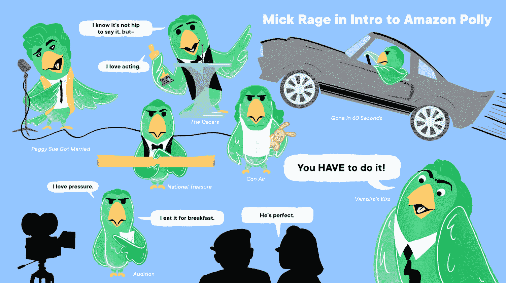
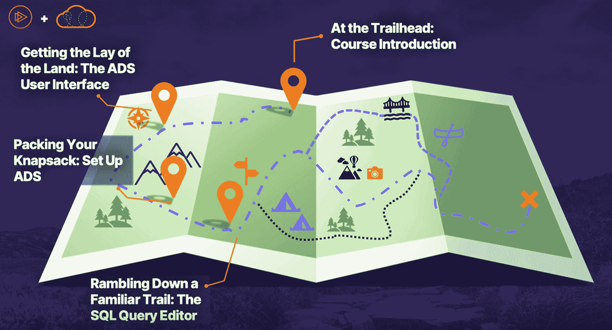
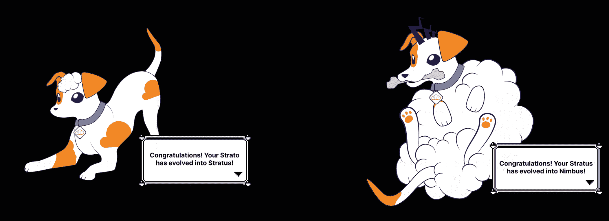
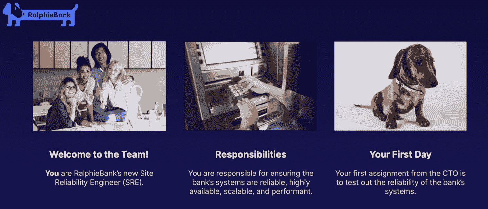
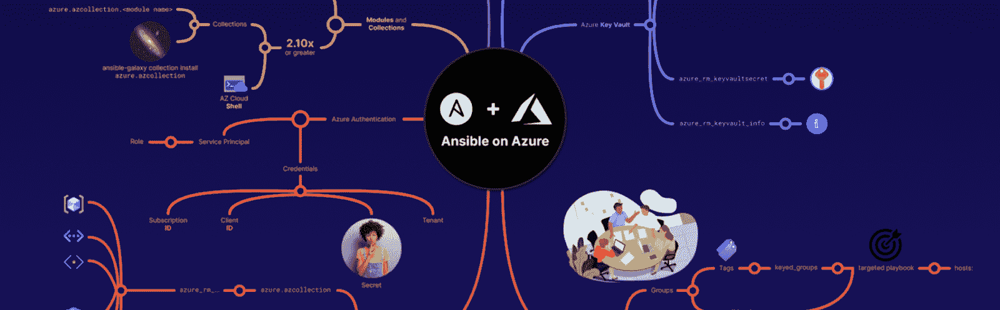
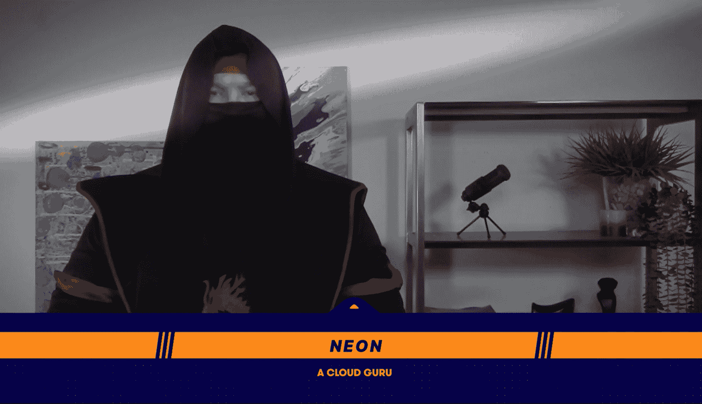
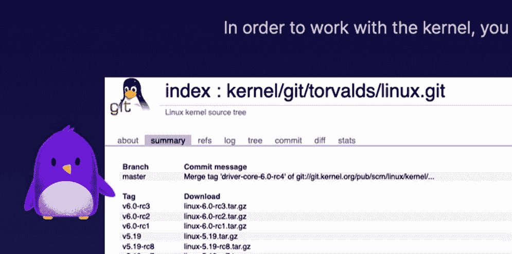

# 云冒险:5 个有趣的免费云计算课程

> 原文：<https://acloudguru.com/blog/engineering/fun-free-cloud-adventures-courses>

云冒险不是你一般的云计算培训。这些课程将学习科学与积极参与结合起来，帮助您掌握云技术。

我们希望您在学习最新的云技术和应用的同时也能获得乐趣。因此，为了保持生动和新鲜，我们正在帮助您以尽可能最好的方式学习云(包括使用如下漫画！).

## **5 门免费云探险课程**

我们正在将云计算带入生活。参加云冒险课程意味着你将观看动画来了解 Amazon Polly，阅读关于 Microsoft Azure 的漫画，甚至去寻宝——所有这些都是在你获得将在工作中使用的实用知识的同时！

在本文中，我们将介绍每一门云冒险课程。当然，我们包括了我们的 5 个免费(是的，完全免费！)您可以参加的课程，开始探索云冒险并提升您的云技能。

### 亚马逊 Polly 简介

通过[了解亚马逊 Polly](https://acloudguru.com/course/introduction-to-amazon-polly) 开始你的冒险，这是一项真正面向机器学习大师的创新技术。

与作者 Jess Alvarez 一起近距离接触亚马逊 Polly 服务。本课程包括令人惊叹的动画，将帮助您了解 Amazon Polly 的文本到语音(TTS)服务，了解如何使用它，并在真实的使用案例中演示其功能。

作为对电影爱好者的奖励，你的培训将包括观看亚马逊 Polly 配置为从博客页面阅读尼古拉斯·凯奇的电影评论。毕竟，如果你不能从中获得一点乐趣，为什么还要提升机器学习的水平呢？

### 在 Microsoft Azure 中使用 CLI 部署基础架构

想对命令行部署感到兴奋吗？好吧，别再找了。Mike Boorman 将漫画带入生活，帮助您了解 Microsoft Azure 中的新部署策略。[本课程](https://learn.acloud.guru/course/a743a389-98ef-4b89-8bbc-ccdd9d15ded5/dashboard)以漫画形式展示了“本月最佳部署者”在不同基础设施部署中的表现。

本课程概述旨在提供概述，既可作为入门知识，也可立即转化为实践。通过四次动手实验，您将学会如何轻松地导航 Azure 图形用户界面来满足客户的要求。

### 使用云运行启动和更新网站

准备好深入研究基于云服务的托管网站。作为该技术的一种非常常见和流行的使用，Cloud Run 可以帮助您更轻松、更快速地进行开发和部署。

[您将一步一步地学习](https://learn.acloud.guru/course/fcb2ac86-2310-422a-a7e9-0c0c20760408/overview)，从最初在 GCP 上测试您的网站，到使用云构建创建容器化的映像，将其存储在容器注册表中，并将其部署到云运行。

本课程不采用边做边学的方法，每节课都配有实验，为您提供刚刚涵盖的主题的在职知识。最终，一个全面的动手实验以指导和挑战两种模式提供，在一个稍微复杂一些的场景中包含了所有过去的培训。

### Azure Data Studio 探索者指南

如果没有 Azure Data Studio，这个免费课程列表将是不完整的！ Azure 已经成为许多组织的主要产品，这意味着现在是了解 Azure 可以为您和您的团队提供的诸多好处的最佳时机。

加入艾米·库格林和丹妮尔·凡西亚对 Azure Data Studio (ADS)的探索。这门课程是沉浸式的，主题性的。您将获得使用该工具以及连接到各种数据源(包括本地和基于云的数据源)的经验。

数据讲故事是技术领域最受欢迎的技能之一，这意味着学习如何使用广告的独特功能来可视化和共享数据将会带来巨大的好处！

另外，你将通过 A+讲故事来学习所有这些技能。通过生动的叙述、生动的视觉效果和背景音乐，我们保证您会感觉像一个真正的探险家！

### 在翻译中找到:亚马逊翻译简介

加入印第安纳·琼斯、内森·德雷克和劳拉·克罗夫特的行列，成为一名认证的寻宝者。与作者伊丽莎白·霍德和朋友马普·E 一起，你将使用[亚马逊翻译来翻译一张多语言的藏宝图。](https://learn.acloud.guru/course/95e6d2cc-3919-4f98-904c-da5728c92bc6/learn/3af9a426-6140-4001-8bd5-9230a5375aa2/97122a2f-f4fb-4723-8d28-e7be11395546/watch)在这次冒险结束时，您将能够使用快速翻译技术帮助更多人以更多语言阅读您的内容。多酷啊。

更好的是，本课程与我们的其他几个云专家课程相结合，包括[亚马逊 Polly 简介](https://acloudguru.com/course/introduction-to-amazon-polly)。你可以选择两门课程(按照你喜欢的顺序)来加倍乐趣！

## 学习云计算最好的方法是什么？

*   [动手学习](https://acloudguru.com/platform/labs)
*   一口大小的内容
*   吸引讲师和演示
*   适用于在职情况

这就是为什么我们的云冒险服务不仅仅是普通的培训，而是一种学习体验。一位云专家在我们策划的云冒险课程选项中结合了这些学习方法。这意味着学习云从未如此简单！还是这个好玩！

更好的是，这些课程是为在职云从业者设计的。通过微观或“小范围学习”的经历，这些课程让你享受到学习新知识的乐趣，你会在日常生活中用到这些知识。Cloud Adventures 将带您踏上掌握 AWS、Azure、Linux 等新技能的旅程！

## 还有哪些好的在线云计算课程？

喜欢我们的免费云冒险服务吗？通过完整的云冒险课程，您可以将您的云学习提升到一个新的水平。20 多门课程和超过 30 个小时的学习，每个人都有适合自己的东西。

如果你是一个目标是成为 AWS 云认证的新人，这可以是你认证旅程的开始。如果您正在开发成功的云计算战略，这些课程是增长知识的绝佳场所。或者，也许你是一名专业人士，希望[缩小行业技能差距](https://acloudguru.com/blog/business/develop-cloud-certification-program)，我们也为你提供服务！

**如果你准备好开始享受乐趣，你可以在这里注册一个免费的 ACG 账户******(只需不到一分钟！)，或者用一个** [**免费 7 天试用**](https://acloudguru.com/pricing) **获得完整的 A 云宗师体验。****

**这是《云历险记》目前的学习行程【最后更新于 11/16/22】。从这个课程列表中，你可以策划你自己的云学习体验。**

### ****AWS****

**[**用 AWS 故障注入模拟器动手操作混沌工程**](https://acloudguru.com/course/hands-on-chaos-engineering-with-aws-fault-injection-simulator)**

**Faye Ellis 教授如何使用 AWS 故障注入模拟器在您的 AWS 环境中运行混沌工程实验！动手+乱？！从来没有比这更令人兴奋的组合了！注意:在这个场景中，你的老板是一只狗(这是一个 ruff gig)。**

****

**[**用 AWS 安全中枢**动手安全](https://acloudguru.com/course/hands-on-security-with-aws-security-hub)**

**AWS 安全中心简介，重点介绍安全发现。这些发现提供了对一个 AWS 帐户或多个帐户的当前安全状况的见解。通过威胁模拟练习，本课程让您通过深入的实验甚至短剧，以互动的方式了解并提高您的安全性！**

**[**使用 AWS CDK**](https://acloudguru.com/course/deploying-applications-with-aws-cdk) 部署应用程序**

**如果您正在寻找构建无服务器应用程序并与之交互的新方法，请不要犹豫！**

**您将学习使用 AWS CDK 部署基本的无服务器应用程序，这是一个开源的基础设施即代码(IaC)框架。本课程始终充满挑战，因此您能够快速轻松地掌握新技能。**

**[**利用实例调度程序降低 AWS 成本**](https://acloudguru.com/course/leveraging-instance-scheduler-to-reduce-cost-on-aws)**

**通过本课程了解实例调度程序的架构。您将了解如何应用三种不同的方法来削减成本和标记资源——在 DynamoDB 中手动、通过 Scheduler CLI 和使用 SSM 维护窗口。**

****在自动气象站上展开云系部署****

****本课程将帮助您掌握构建自己的云信息模板或修改现有模板以包含适合您环境的参数所需的技能和知识。通过构建一个多层次游戏的例子，Chris Silva 通过一个有趣的 CloudFormation 案例指导学习者。****

****[**了解 AWS EC2 和 GCP GCE 的区别**](https://acloudguru.com/course/understanding-the-differences-between-aws-ec2-and-gcp-gce)****

****在本课程中，您将简要了解 AWS EC2 和 Google Compute Engine 的对比。通过两次动手实验的全面实践，您将为部署做好准备****

****以及使用 AWS 和 GCP 自动扩展组。****

****[**将 DevSecOps 应用于 AWS 网络应用**](https://acloudguru.com/course/applying-devsecops-to-aws-web-apps)****

****想要提升 AWS web 应用的安全性吗？本课程将为您提供确保安全的方法和实践！您将获得识别问题和编写安全代码的练习，以便在日常实践中使用。****

******亚马逊技术培训主题******

****[**从现场 PostgreSQL 迁移到亚马逊极光**](https://learn.acloud.guru/course/e9c91850-400a-40cd-8c14-ec807035adde/overview)****

****在从现场 PostgreSQL 迁移到 Amazon Aurora 的课程中，您将加入 Steady Shelly the turtle 和 quick-Up Hank the hare，学习如何将现场 PostgreSQL 数据库迁移到 Amazon Aurora 云数据库。****

****[**在亚马逊 EC2 上配置 OpenVPN**](https://acloudguru.com/course/configuring-openvpn-on-amazon-ec2)****

****在这个课程中，马修·皮尔森向你展示了如何在亚马逊的 EC2 服务上安装和配置 OpenVPN。在客户机和服务器之间建立信任关系很重要，但也不一定很无聊！在巧妙的服装变化和简洁的学习大纲之间，本课程一定会吸引你的注意力！****

### ******蔚蓝色******

****[**用 Ansible** 管理 Azure 资源](https://acloudguru.com/course/managing-azure-resources-with-ansible)****

****本课程教你如何配置 Ansible 来管理 Azure 资源，以及如何为 Azure 创作 Ansible 剧本。这个课程是为那些拥有 Azure 和 Ansible 实际操作经验的人设计的，他们希望了解 Ansible 如何与 Azure 一起使用。我们最喜欢的部分？über 视觉思维导图将帮助您从头到尾分解技术细节。****

********

****[**使用 Azure 容器实例部署 Minetest 服务器**](https://acloudguru.com/course/deploying-a-minetest-server-using-azure-container-instances)****

****花点时间了解一下容器、Docker 和 Azure 容器实例。然后准备使用 Azure 容器实例部署一个简单的游戏服务器。在本课程中，您将使用 Minetest，但是您可以应用这些知识来部署几乎任何您选择的游戏服务器！****

****[**使用 Azure 基础架构即服务(Iaas)进行实际网络故障排除——密室冒险**](https://acloudguru.com/course/hands-on-network-troubleshooting-with-azure-infrastructure-as-a-service-iaas-an-escape-room-adventure)****

****如果你曾经做过密室逃脱活动，那么你应该知道密室逃脱是为了解决问题(或者用技术术语来说，“排除故障”)。完成本课程后，您将具备解决现实世界中的 Azure 网络问题和逃出虚拟密室所需的 Azure IaaS 网络故障排除技能！****

****[**使用 Azure 应用服务环境保护您的应用**](https://acloudguru.com/course/secure-your-app-with-azure-app-service-environment)****

****这个课程是为安全忍者准备的！通过一个诡秘的忍者主题和一个测验来测试你的知识，这个课程将帮助你获得你需要的知识，以帮助保护和隔离你在 Azure 中托管的应用程序。****

********

****[**自动化 Azure 文件共享的生命周期管理**](https://acloudguru.com/course/automating-lifecycle-management-of-azure-file-shares)****

****在本课程《Azure 文件共享的自动化生命周期管理》中，您将学习为 Azure 文件定制开发自动化。首先，您将探索如何挂载 Azure 文件。接下来，您将了解如何利用 Azure Automation，最后，您将了解如何将这两种技术结合起来进行定制云开发。学完本课程后，你将具备实施定制云开发所需的 Azure 文件和自动化的技能和知识。****

****[**排查 Azure 数据工厂——失败的实验**](https://acloudguru.com/course/troubleshooting-azure-data-factory-the-failed-experiment)****

****在本课程中，排除 Azure 数据工厂故障-失败的实验，您将学习在 Azure 中构建数据管道。本课程被称为“失败的实验”，因为你将通过纠正一些最常见的错误来学习构建管道。通过失败的实验学习管道，你会更好地理解数据管道是如何工作的，如何纠正常见错误，最重要的是，如何避免它们，你自己。****

****[**如何保障 Azure AI 服务**](https://acloudguru.com/course/how-to-secure-azure-ai-services)****

****如果你曾经想知道人工智能服务的安全性或安全性，或者想，“嘿，我想了解更多，”那么你就来对地方了。在本课程中，您将通过配置网络访问、保护凭据和学习几个安全最佳实践来实际操作如何保护 Azure AI 认知服务。这是一个循序渐进的课程，非常适合拥有大约六个月 Azure 经验的学习者！****

### ******Linux******

****[**Linux 发行版对比**](https://acloudguru.com/course/comparison-of-linux-distributions)****

****动画。颜色编码。企鹅。我们还需要多说这门课有多有趣吗？这个课程会给你介绍 Linux，而不会让你感到不知所措。有了引导式教学，您将能够通过一系列动手实验实践您所学到的知识，并测试您使用各种 Linux 发行版的技能****

********

****[**用 Linux 和灰名单控制垃圾邮件**](https://acloudguru.com/course/controlling-spam-with-linux-and-greylisting)****

****如果有一件事我们都希望自己做得更好，那就是保护我们的收件箱。电子邮件灰名单是一种减少垃圾邮件数量的方法。它的工作原理是稍微延迟收到的电子邮件，并迫使发件人重新发送电子邮件。本课程是一个实际应用，你的整个团队都可以使用和欣赏！****

### ******地形******

****[**为多云使用创建地形配置**](https://acloudguru.com/course/creating-a-terraform-configuration-for-multi-cloud-use)****

****你会觉得你是在一个 8 位主题的视频游戏中。当然，您实际上必须使用 Terraform 配置将相同类型的资源部署到两个不同的云环境中(单独或同时)。本课程可能是您制定成功的云计算战略的下一步！****

********

### ******Kubernetes******

****[**Kubernetes**中的水平 Pod 自动缩放](https://acloudguru.com/course/horizontal-pod-autoscaling-in-kubernetes)****

****准备好以前所未有的方式进行部署！您将了解如何使用 Kubernetes 来自动缩放数量，从而提高工作流程的效率，让开发团队更加快乐！****

### ******Vim******

****[**高级 Vim 定制**](https://acloudguru.com/course/advanced-vim-customization)****

****完成本课程后，您将具备 Vim 向导的技能和知识，随时准备开发任何类型的代码，而无需退出臭名昭著的文本编辑器。****

### ******SDS******

****[**根据预算设置软件定义的存储(SDS)**](https://acloudguru.com/course/setting-up-software-defined-storage-sds-on-a-budget)****

****成功地坚持预算是每个人都可以支持的前提。随着应用程序收集和存储越来越多的数据，管理本地存储变得非常麻烦也就不足为奇了。在本课程中，我们将探讨如何创建您自己的软件定义的存储(SDS ),而无需在软件上花费大量资金。****

## ****选择云计算之旅的下一步****

****云计算中总是有新的东西需要学习。有了五门全新的交互式免费课程，这是开始学习云冒险的最佳时机。在此 注册 [**您的免费 ACG 账户，开始学习吧！**](https://acloudguru.com/pricing)****

****通过注册一个 [**免费试用来访问 ACG 的全部内容库**](https://acloudguru.com/pricing) ，你有丰富的选择。从完善你的谷歌云知识到成为 Ansible 或 Terraform 的专家，前途无量。****