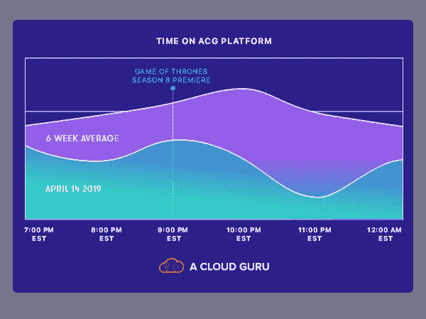

# 《权力的游戏》对《云》|《云大师》

> 原文：<https://acloudguru.com/blog/engineering/game-of-thrones-vs-the-cloud>

《权力的游戏》回来了！时隔近两年，这部热播剧在周日晚上回归了第八季，也是最后一季，我们迫不及待地想看看它会如何发展。

谁来阻止夜王？谁会最终登上铁王座？哪些心爱的角色会变成冰僵尸？Clegane Bowl 最终会发生吗？我们还会看到热馅饼吗？

是的，我们是七大王国的吸盘。如果是的话，我们认为我们的云专家可能也是。所以我们昨晚看了一下我们的平台活动，看看当人们暂停学习观看第一季首播时，是否有任何明显的下降。

Dip 似乎是轻描淡写。

## **城墙和悬崖**

HBO 将《权力的游戏》的流媒体流量模式描述为

[“the wall”](https://www.eweek.com/cloud/why-hbo-chose-kubernetes-to-help-stream-game-of-thrones)

，而如果是这样的话，我们绝对看到了“悬崖”！

与前六个周日的平均活动相比，昨晚的活动总体下降了近 11%，在首映式播出期间下降了 17%。事实上，大约过了三个小时，经济活动才开始反弹。这可能是一个挥之不去的影响，飘带开始一集有点晚，情绪恢复，并在安顿下来学习更多令人敬畏的云的好处之前看到通常的夜间例行公事。

众所周知，当新一集《权力的游戏》播出时，人们会暂停各种在线活动，所以看到我们的云大师们暂停几个小时并不奇怪。我们大多数人也是！

幸运的是，我们所有的课程、实验、测验、原创系列和新推出的学习路径都是全天候可用的。所以请尽情享受这最后几集吧——当演职员表滚动时，我们会在这里。

> 顺便提一句，如果你想知道 HBO 如何在不融化整个互联网的情况下成功播放《权力的游戏》，[他们在 AWS 上部署 Kubernetes 背后的故事非常有趣](https://www.eweek.com/cloud/why-hbo-chose-kubernetes-to-help-stream-game-of-thrones)。

* * *

##### **成为云学士**

加入一个云专家来学习 AWSteros 的最远端或掌握 Azure Ahai 的奥秘。我们的认证课程、学习路径、实验室、测验和原创系列为您提供了赢得您的链所需的一切。

* * *