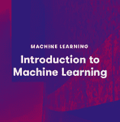

# 与 Amazon SageMaker 线性学习者一起动手

> 原文：<https://acloudguru.com/blog/engineering/getting-hands-on-with-amazon-sagemaker-linear-learner>

在这篇文章中，我们将讨论如果你是机器学习的新手或者正在寻找构建 AWS ML 技能的实践介绍，亚马逊 SageMaker 的线性学习器算法是一个很好的起点。

|  | 这是亚马逊 SageMaker 内置算法系列帖子的第一篇。本系列确实假设您以前有过机器学习的经验。如果你想了解更多，请观看我们的[机器学习介绍](https://acloudguru.com/course/introduction-to-machine-learning)课程。 |

四年前，我开始了我的机器学习之旅，当时我是一名 Java 软件工程经理，想要转型。我不知道从哪里开始，所以我求助于[亚马逊网络服务(AWS)](https://acloudguru.com/blog/engineering/what-is-amazon-web-services-aws) 来提升我的技能。快进到今天，我已经在 [AWS re:Invent](https://acloudguru.com/blog/business/the-ultimate-guide-to-aws-reinvent-2021) 和 TED 舞台上谈论过[机器学习](https://acloudguru.com/blog/engineering/what-is-machine-learning-as-a-service-mlaas)，被命名为 AWS 机器学习英雄，并获得了我的 [AWS 认证机器学习-专业认证](https://acloudguru.com/course/aws-certified-machine-learning-specialty)。

* * *

## 加速您的职业发展

[从 ACG 开始](https://acloudguru.com/pricing)通过 AWS、Microsoft Azure、Google Cloud 等领域的课程和实际动手实验室改变你的职业生涯。

* * *

## 监督学习和二元分类

我解决的第一个机器学习问题类型是二进制分类的监督学习。我发现这个用例简单易懂。在这个用例中，通过给机器提供已经标注了您希望它学习如何预测的答案的数据样本，您可以教它回答简单的是/否问题。

当时，我从亚马逊机器学习服务开始，但很快就升级到了亚马逊 SageMaker。如果你不熟悉 [Amazon SageMaker](https://aws.amazon.com/sagemaker/) ，它是机器学习即服务，为准备、构建、培训和部署机器学习模型提供端到端的环境。

我发现使用 Amazon SageMaker 很容易复制我的 Amazon 机器学习用例。内置的[线性学习器](https://docs.aws.amazon.com/sagemaker/latest/dg/linear-learner.html)算法允许我更多地使用 Python、Jupyter 笔记本和各种数据科学库来训练我的模型。

* * *

*想了解更多关于在 AWS 上设计和部署机器学习解决方案的信息吗？云大师的* [*AWS 机器学习*](https://acloudguru.com/learning-paths/aws-machine-learning) *学习路径提供适合初学者和高级大师的定制课程！*

* * *

## 线性学习算法

Amazon SageMaker 的美妙之处在于它带有几个内置算法[可以应用于几个问题类型。](https://docs.aws.amazon.com/sagemaker/latest/dg/algos.html)

| **学习类型** | **问题类型** | **内置算法** |
| 监督 | 二元分类
多类分类
回归 | 线性学习器
因式分解机
K-最近邻(KNN)
XGBoost |
| 受监督，RNN | 时间序列预测 | 迪帕尔 |
| 无人监督的 | 降维 | 主成分分析 |
| 无人监督的 | 异常检测 | 随意砍伐的森林(RCF) |
| 无人监督的 | IP 异常检测 | 知识产权洞察 |
| 无人监督的 | 嵌入 | 对象 2Vec |
| 无人监督的 | 使聚集 | k-均值算法 |
| 无人监督的 | 主题建模 | 
潜在狄利克雷分配(LDA)神经主题模型(NTM) |
| 文本分析 | 文本分类 | BlazingText |
| 文本分析 | 机器翻译
文本摘要
语音转文本 | 序列对序列 |
| 图像处理 | 图像和多标签 | 图像分类 |
| 图像处理 | 目标检测和分类 | 目标检测 |
| 图像处理 | 计算机视觉 | 语义分割 |

线性学习器非常适合我的用例，因为它解决了二进制分类问题(以及其他问题)。

### 线性学习者解决的问题类型

线性学习算法解决了几种问题类型。

| **方法** | **问题类型** | **描述** | **例题** |
| 逻辑回归 | 二元分类 | 通过预测 0 或 1 来回答是/否问题 | 这是不是垃圾邮件？
这笔交易是不是欺诈？
犯罪可能性大不大？ |
| 多项式逻辑回归 | 多类分类 | 通过预测 0 到 n-1 类来回答许多问题中的 1 个 | 这个物品是书、电影还是玩具？这种动物是狗、鸟还是猫？ |
| 线性回归 | 回归 | 回答连续数值问题 | 亚特兰大明天的气温是多少？这种产品会卖出多少台？这栋房子会卖多少钱？ |

### 它是如何工作的

对于训练，线性学习者需要一个数据矩阵，其中的行代表观察值，列代表特征。数据矩阵中的一列应该代表您希望机器学习如何预测的标签。对于 SageMaker 的线性学习者，标签应出现在数据矩阵的第一列，列标题应排除在外。

对于我的用例，我将训练数据存储在亚马逊 S3 中，并指定输入桶作为训练数据源，指定输出桶保存最终的模型工件。线性学习器支持 RecordIO (protobuf)或 CSV 格式的训练数据，接受 JSON、CSV 或 RecordIO (protobuf)格式的推理请求。对于我最初的用例，我使用 CSV。将 S3 数据加载到 Amazon SageMaker 托管的 Jupyter 笔记本实例有两种模式:`file`或`pipe`。虽然我最初使用文件模式，`pipe`模式更有效，因为它通过流式传输数据减少了训练时间并节省了资金，而不是像`file`模式那样将完整的训练数据集存储在磁盘上。

在配置您的培训工作时，有几个超参数。我在下面列出了一些用于模型训练的更重要的超参数。线性学习算法的[超参数](https://docs.aws.amazon.com/sagemaker/latest/dg/ll_hyperparameters.html)的完整列表可以在[亚马逊 SageMaker 开发者指南](https://docs.aws.amazon.com/sagemaker/latest/dg/whatis.html)中找到。

| **超参数** | **描述** | **可能值** |
| `predictor_type` | 这表示目标变量。对于二进制分类，我选择了`binary_classifier`。如果您正在使用多类分类，您将选择`multiclass_classifer`。对于回归，您将选择`regressor`。 | `binary_classifier
multiclass_classifier
regressor` |
| `epochs` | 通过数据的次数。 | 一个正整数，默认值为 15。 |
| `feature_dim` | 输入数据中的要素数量。 | `auto`或正整数 |
| `l1` | L1 正则化值。 | `auto`或非负浮点数 |
| `wd` | L2 正则化值。 | `auto`或非负浮点数 |
| `optimizer` | 优化算法。 | `auto, sgd, adam, rmsprop
Adam`是自动的默认设置。 |
| `learning_rate` | 优化器的步长。 | `auto`或正浮动 |
| `loss` | 损失函数。 | 这根据选择的`predictor_type`而变化。
对于`binary_classifier`，选项有`auto`、`logistic`或`hinge_loss`。
自动的默认值是`logistic`。 |
| `mini_batch_size` | 每批的观察次数。 | 正整数；默认值为 1000 |
| `num_models` | 线性学习器并行训练多个模型。这允许您设置模型的训练数量并相互比较。 | `auto`或正整数 |

当你准备好训练你的机器学习模型时，一个单机或多机 CPU 和 GPU 实例。需要注意的是，线性学习者不支持[增量训练](https://docs.aws.amazon.com/sagemaker/latest/dg/incremental-training.html)；相反，它使用分布式培训。

### 模型调整

线性学习者报告了几个指标，以帮助您在将模型发布到生产环境之前对其进行评估和调整。每个指标都被报告为测试和验证指标。

*   **目标损失**–这代表损失函数的平均值。对于我的用例，损失是物流损失。
    *   `test:objective_loss`
    *   `validation:objective_loss`
*   **准确性**–这代表正确的真阳性和真阴性的数量。
    *   `test:binary_classification_ accuracy`
    *   `validation:binary_classification_accuracy`
*   **Precision**–这表示所有的预测阳性–实际阳性的百分比。
    *   `test:precision`
    *   `validation:precision`
*   **回忆一下**–这代表所有的实际阳性–正确预测的百分比。
    *   `test:recall`
    *   `validation:recall`
*   **F1 得分**——这是精准和召回的平衡。
    *   `test:binary_f_beta`
    *   `validation:binary_f_beta`

* * *

**观看**:**re:Invent 2021** 一年中最激动人心的大汇演时间到了:re:Invent 2021。请于 11 月 17 日周三加入我们，与我们的 AWS 英雄小组一起在牌桌上抢占一个席位，他们将对今年的大会上将发布什么产品下注。

* * *

## 行动中的线性学习者

现在让我们看一个真实的例子。我的用例的目的是使用 SageMaker 的[线性学习器](https://docs.aws.amazon.com/sagemaker/latest/dg/linear-learner.html)算法来训练犯罪预测的线性模型。在这个例子中，拦截搜查犯罪数据来自 https://data.police.uk/data/[的](https://data.police.uk/data/) [data.police.uk](https://data.police.uk/) 数据集。data.police.uk 是一个公开英格兰、威尔士和北爱尔兰犯罪和治安数据的网站。

此处的目的是使用该数据集构建预测性警务模型，以确定在给定以下数据点的情况下是否可能发生犯罪:

*   位置
*   年龄
*   性别
*   一天中的时间
*   星期几
*   月

该模型根据提供的输入返回“犯罪”或“不犯罪”的预测。用例的[样本代码](https://gitlab.com/wwc-workshops/case-studies/public-safety/-/blob/master/wwc-public-safety.ipynb)是免费提供的。为了开始这个过程，我推出了一款由亚马逊 SageMaker 托管的 Juptyer 笔记本。

### 导入库

我在笔记本中导入了必要的数据科学和 SageMaker Python 库。

### 数据摄取

接下来，我将数据集从在线 URL 读入内存，用于训练前的预处理。

### 数据检查和可视化

一旦数据集被导入，通常作为机器学习过程的一部分来检查数据，理解分布，并确定可能需要哪种类型的预处理。

我检查了数据的前几行。

我用直方图来理解分布。

我分析了各县的犯罪数量。

我使用交叉表来了解性别分布。

### 数据清理

在可视化和理解数据之后，我删除了空值或坏值。在我学习的这个阶段，我没有考虑任何数据插补技术。

我发现性别和平均年龄字段有几个应该从数据集中删除的观察值。

* * *

[**获得痛苦的云词典**](https://get.acloudguru.com/cloud-dictionary-of-pain)
说云不一定要努力。我们分析了数以百万计的回复，找出了最容易让人犯错的概念。抓住这个[云指南](https://get.acloudguru.com/cloud-dictionary-of-pain)获取一些最痛苦的云术语的简洁定义。

* * *

### 数据编码和转换

在训练之前，我将分类特征转换为数字特征，因为分类器只处理数字值。

我将“星期几”转换成它的数字表示。

我把性别转换成数字表示。

### 分成训练集、验证集和测试集

为了防止模型过度拟合，并允许我在模型尚未看到的数据上测试模型的准确性，我将数据集分为训练集、验证集和测试集。

### 训练线性模型

在我将清理后的训练数据加载到 S3 之后，我使用线性学习器来训练模型。第一步是设置容器图像。

然后，我为最终的模型工件设置了必要的超参数和存储桶位置。

### 模型评估

在每个时期，评估度量被记录。我用这个来确定模型在数据集上的每次运行情况。这些分数帮助我调整我的模型以获得更好的性能。

### 模型托管

一旦我有了一个训练好的模型，我就把它放在 Amazon SageMaker 上，这样其他用户和应用程序就可以使用`deploy`函数来访问它。

### 结论

### 删除模型端点

当我完成使用我的模型进行预测时，我删除了它，以确保我不再为此付费。

### 了解有关机器学习的更多信息

如果你是机器学习的新手，亚马逊 SageMaker 的线性学习算法是一个很好的起点。我发现回答简单的是/否问题是最简单的用例。

在本系列的下一篇文章中，我将回顾用于聚类和查找数据中离散分组的内置算法。

想了解更多关于机器学习的知识吗？查看 ACG 的[机器学习简介](https://acloudguru.com/course/introduction-to-machine-learning)和 [AWS 认证机器学习-专业认证](https://acloudguru.com/course/aws-certified-machine-learning-specialty)课程。

*想跟上万物云？* [*在 YouTube 上订阅一位云专家*](https://www.youtube.com/c/AcloudGuru/?sub_confirmation=1) *的每周 AWS 新闻(以及其他云提供商的新闻)。你也可以像我们一样关注***，关注我们的* [*推特*](https://twitter.com/acloudguru) *，或者加入* [*不和谐*](http://discord.gg/acloudguru) *的对话！**