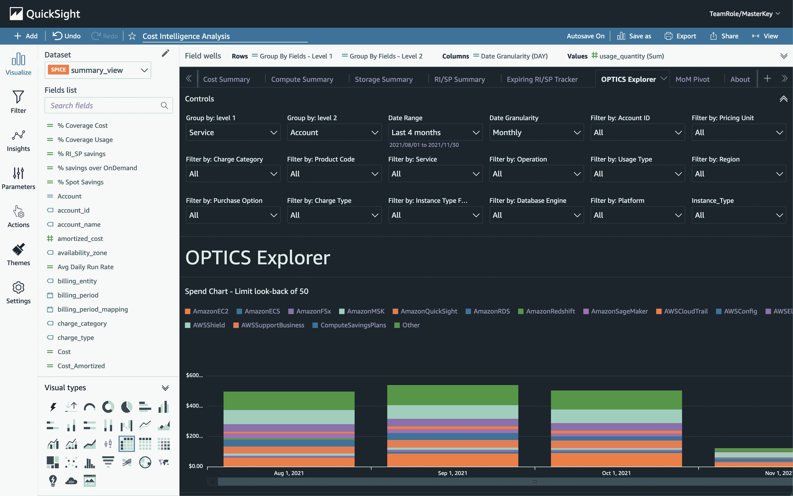
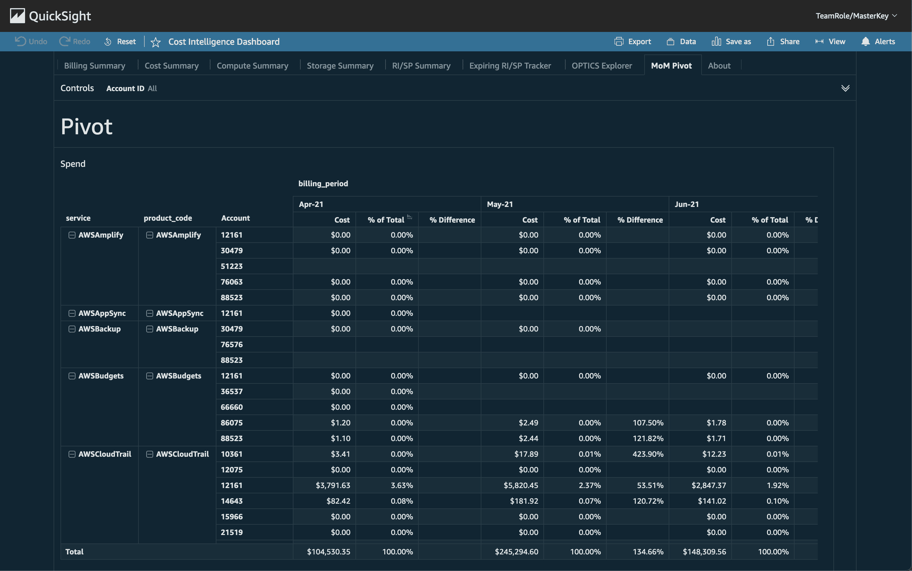
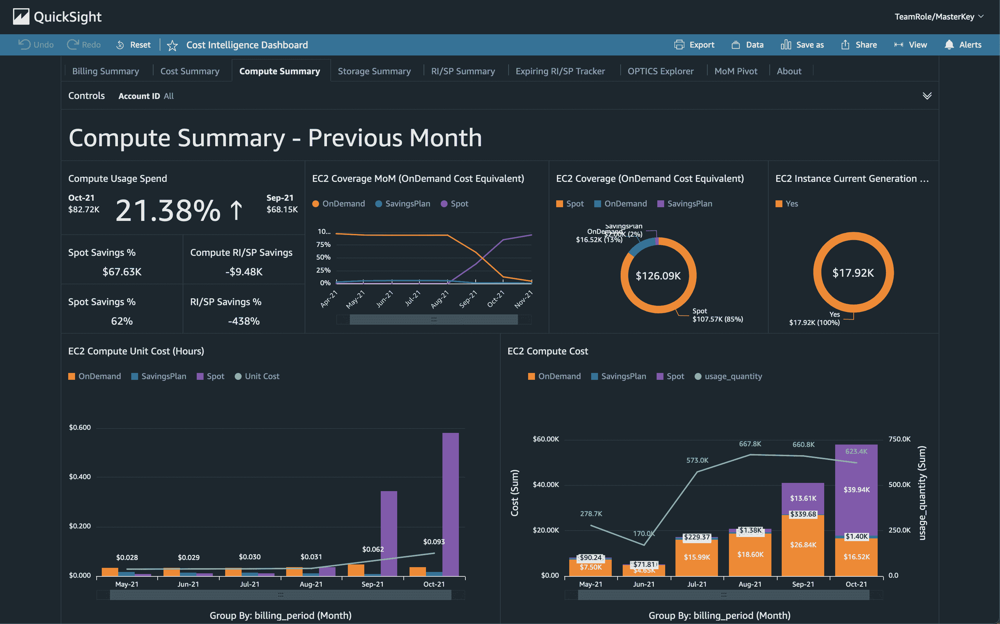
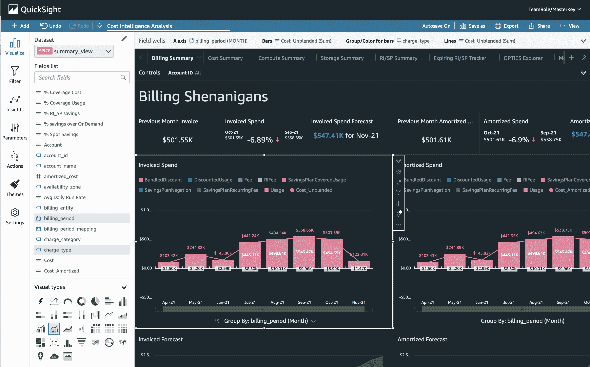
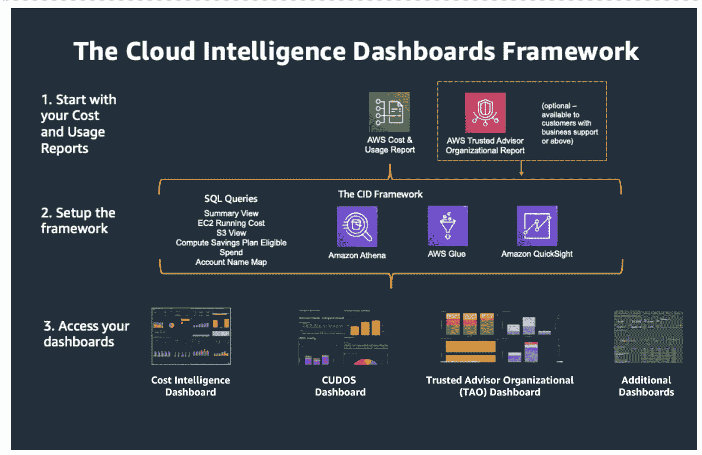

# 在 AWS re:Invent 2021 会议上亲身体验 QuickSight

> 原文：<https://acloudguru.com/blog/engineering/getting-hands-on-with-quicksight-at-aws-reinvent-2021>

首先，让我先说 [AWS re:Invent 2021](https://acloudguru.com/blog/tag/reinvent2021) 绝对是*惊艳*！好了，现在我已经把它从我的系统中剔除了，让我们来谈谈我在 re:Invent 参加的一个研讨会:构建你自己的可定制的成本报告仪表板。

* * *

## 加速您的职业发展

[从 ACG 开始](https://acloudguru.com/pricing)通过 AWS、Microsoft Azure、Google Cloud 等领域的课程和实际动手实验室改变你的职业生涯。

* * *

我选择这个会议来了解一些成本服务，并深入了解一下 [Amazon QuickSight](https://acloudguru.com/blog/engineering/amazon-quicksight-how-to-put-eyes-on-your-data-with-this-aws-bi-tool) ，它非常有用，定制和使用起来也非常容易。

研讨会为我们提供了一个 JSON 模板，以启动必要的最低限度的基础设施，以便能够进入并拥有供我们的仪表板使用的数据。

如果你不熟悉亚马逊 QuickSight，它是一种无服务器的商业智能(BI)服务。它允许每个人通过用自然语言提问、利用交互式仪表盘或通过机器学习自动发现模式和异常值来理解你的数据。您可以共享仪表板，将其作为报告，将您的控件固定或保留在主页上，以及自定义控件，这有助于过滤您需要可视化的信息。

我参加的研讨会允许我们定制已经存在的条形图和折线图，通过添加新的控件和创建新的视觉效果来定制控件。

我们添加了一个新选项卡，专门查看客户的退款。如果您的公司需要能够正确地向客户收取使用费，那么这个特定的用例会很有帮助。这些视觉效果让我想起了 Kibana，但是有了更多的可定制性。

您可以选择要提取的数据以及如何对这些数据进行分组，以便将它们转换成最能描述您需要显示的数据的视觉效果。

例如，如果您需要查看月环比视图，您可以使用如下所示的表格来更好地了解每个月如何影响您的成本。

如果您想了解您的即期、按需和储蓄计划计算成本如何构成您的月成本，您可以使用如下所示的圆环图。

可供您可视化数据的选项非常丰富！

要进一步了解成本智能控制面板的框架，请看下图。

您可以从您的成本和使用报告(CUR)或可信顾问组织报告开始，并使用 SQL 查询、Amazon 的 Athena、Glue 和 QuickSight 服务设置您的 CID 框架。

这些服务中的每一个都可以在将数据输入到您的仪表板中发挥作用。

总的来说，研讨会很有趣，如果你遇到困难或有问题时，有人可以帮助你，这是一次令人难以置信的经历。

我希望这些信息能帮助你更好地理解亚马逊的 QuickSight 服务。如果你能亲自动手，希望你能更轻松地驾驭它。感谢阅读，继续牛逼吧，云大师们！

## 跟上 AWS 的一切:发明 2021

在推特[上关注 ACG](https://twitter.com/acloudguru)和[脸书](https://www.facebook.com/acloudguru)，以及[在 YouTube 上订阅一位云专家](https://www.youtube.com/c/AcloudGuru/?sub_confirmation=1)来更新:发明 2021！查看 [ACG 和 Pluralsight re:Invent 内容中心](https://www.pluralsight.com/reinvent-2021)获取新闻和 AWS 资源。加入我们令人敬畏的 [Discord 社区](https://discord.com/invite/acloudguru)，与 AWS 培训架构师和其他志同道合的阴云密布的人一起接触数字。