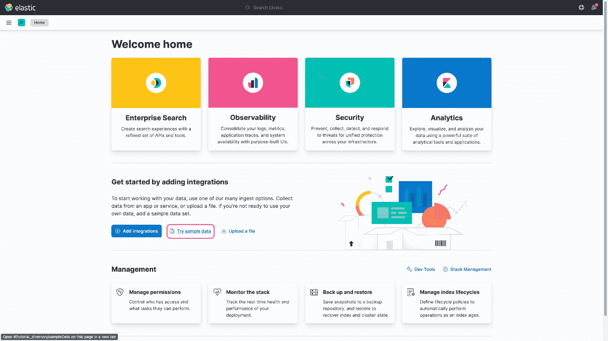
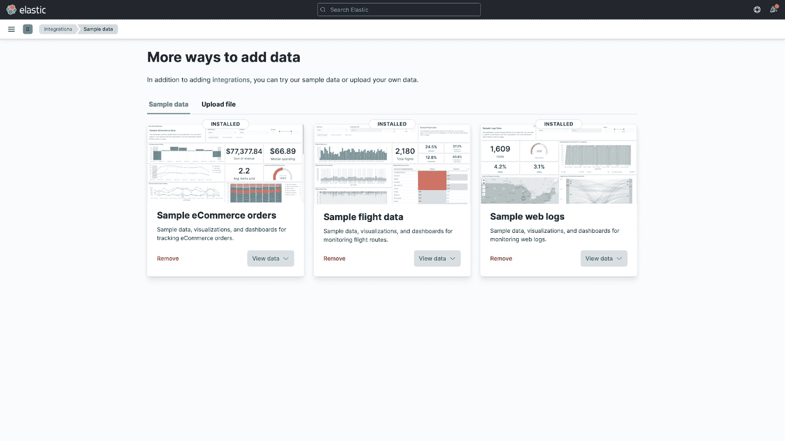
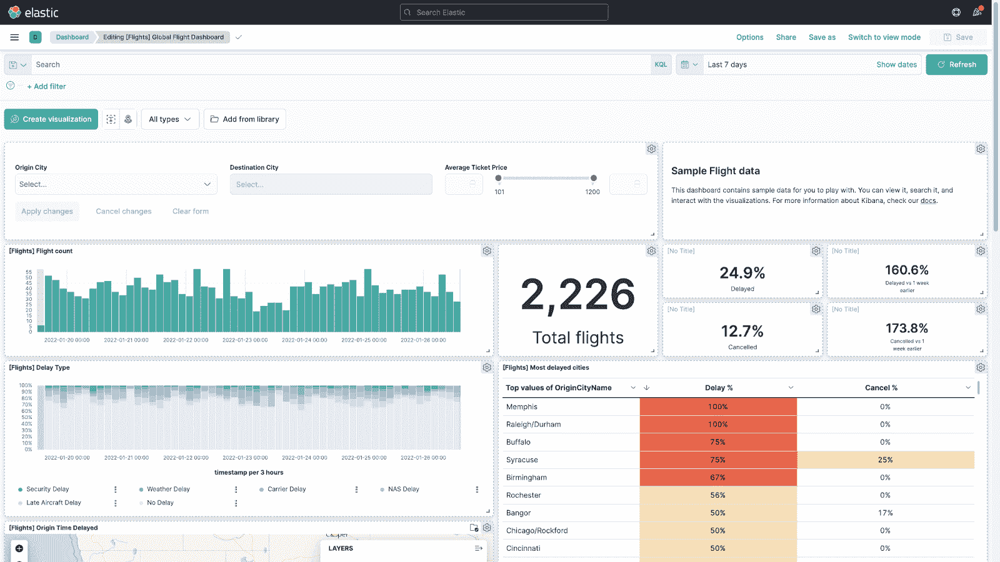
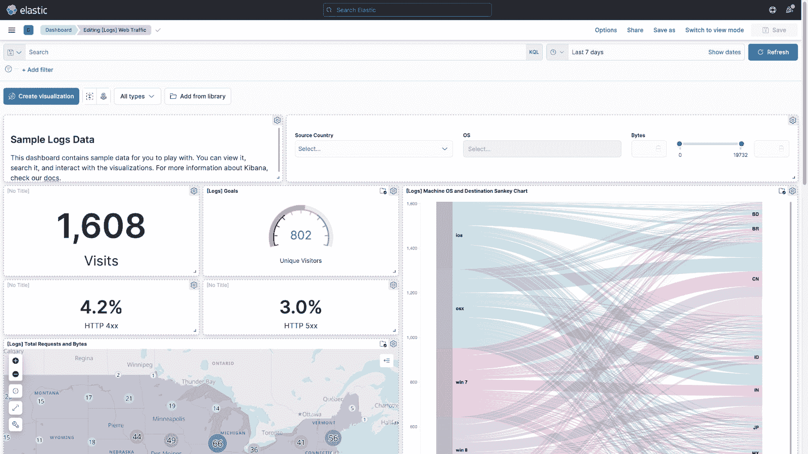
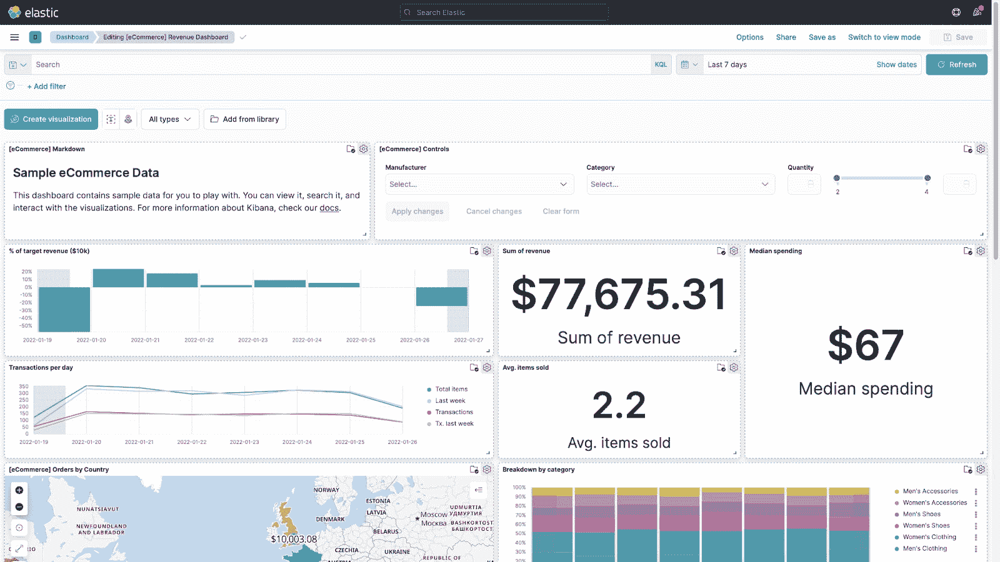
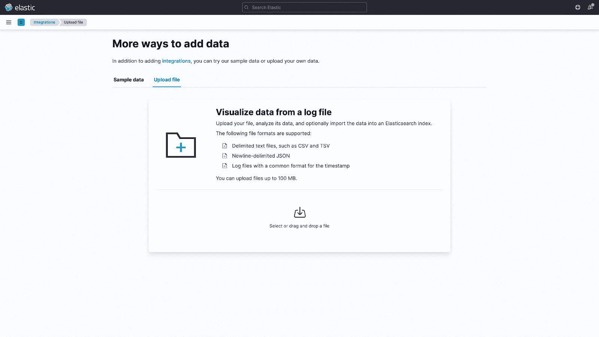

# 弹性堆栈入门

> 原文：<https://acloudguru.com/blog/engineering/getting-started-with-the-elastic-stack>

在让初学者更容易入门方面，弹性堆栈在几年内已经取得了长足的进步。由于每个弹性堆栈服务都有合理的缺省值，建立一个工作堆栈并使用它已经大大简化了。让我们通过创建一个基本的单节点弹性堆栈并加载示例数据、可视化和仪表板来演示这一点。

* * *

**通往更好职业的钥匙**

[立即开始 ACG](https://acloudguru.com/pricing) 通过 AWS、Microsoft Azure、Google Cloud 等领域的课程和实际动手实验室来改变你的职业生涯。

* * *

## 弹性搜索

首先，让我们安装 Elasticsearch。我将把我的弹性堆栈部署到我们的[云操场](https://learn.acloud.guru/cloud-playground/cloud-servers)上的 64 位 CentOS 8 主机，因此我将下载并安装 x86_6.rpm 包:

```
wget https://artifacts.elastic.co/downloads/elasticsearch/elasticsearch-7.16.3-x86_64.rpm
sudo rpm --install elasticsearch-7.16.3-x86_64.rpm
```

你可以从 Elastic 下载 x86_64 或 aarch 系统[的其他 Linux、MacOS 或 Windows 发行版。](https://www.elastic.co/downloads/elasticsearch)

现在，由于我们将部署一个单节点集群，我们可以在没有任何配置的情况下启动 Elasticsearch:

```
sudo systemctl start elasticsearch
```

我们可以用`curl localhost:9200`检查 Elasticsearch startup 以获得一些基本的集群信息:

```
{
  "name" : "9d995fe8ce1c.mylabserver.com",
  "cluster_name" : "elasticsearch",
  "cluster_uuid" : "AoP-d-faTdCJYgHHBscm7g",
  "version" : {
    "number" : "7.16.3",
    "build_flavor" : "default",
    "build_type" : "rpm",
    "build_hash" : "4e6e4eab2297e949ec994e688dad46290d018022",
    "build_date" : "2022-01-06T23:43:02.825887787Z",
    "build_snapshot" : false,
    "lucene_version" : "8.10.1",
    "minimum_wire_compatibility_version" : "6.8.0",
    "minimum_index_compatibility_version" : "6.0.0-beta1"
  },
  "tagline" : "You Know, for Search"
}
```

## Kibana

随着 Elasticsearch 的启动和运行，让我们部署并连接 Kibana。在安装 Elasticsearch 的同一个节点上，我将下载并安装 x86_64.rpm 包:

```
wget https://artifacts.elastic.co/downloads/kibana/kibana-7.16.3-x86_64.rpm
sudo rpm --install kibana-7.16.3-x86_64.rpm
```

就像 Elasticsearch 一样，你可以从 Elastic 下载适用于 x86_64 或 aarch 系统[的其他 Linux、MacOS 或 Windows 发行版的 Kibana。](https://www.elastic.co/downloads/kibana)

现在，因为我将它部署到一个云服务器，为了从我本地机器的 web 浏览器访问 Kibana，我需要在`/etc/kibana/kibana.yml`文件中做两个小的配置更改。首先，因为 ACG 的 Cloud Playground 没有对公众开放 Kibana 的默认端口`5601`，所以我将把`server.port`参数设置为`8080`。其次，我将把`server.host`参数设置为`0.0.0.0`，这样就可以从任何主机地址访问 Kibana。您的配置应该如下所示:

```
# Kibana is served by a back end server. This setting specifies the port to use.
server.port: 8080

# Specifies the address to which the Kibana server will bind. IP addresses and host names are both valid values.
# The default is 'localhost', which usually means remote machines will not be able to connect.
# To allow connections from remote users, set this parameter to a non-loopback address.
server.host: "0.0.0.0" 
```

保存了这些 Kibana 配置更改后，我们需要打开本地防火墙中的端口`8080`并启动 Kibana:

```
sudo firewall-cmd --add-port=8080/tcp --permanent
sudo firewall-cmd --reload
sudo systemctl start kibana
```

现在，我们可以在本地 web 浏览器中导航到服务器的公共 IP 地址和端口`8080`(例如:`http://public_ip_here:8080`)。

## 抽样资料

在 Kibana 主页上，您可以选择“尝试样本数据”来加载电子商务、航班和网络日志样本数据集的数据、可视化和仪表板。



从那里，您可以查看示例数据仪表板，并开始使用过滤器和查询来询问数据问题。



一旦你有了感觉，你可以从 CSV、TSV、ND-JSON 或日志文件上传你自己的样本数据，然后创建一些你自己的可视化！



## 了解更多关于弹性堆栈的信息

想了解更多关于弹性堆栈及其其他惊人的功能？查看我们的[弹性堆栈要点](https://acloudguru.com/course/elastic-stack-essentials)和[弹性搜索深度潜水](https://acloudguru.com/course/elasticsearch-deep-dive)课程。想要更进一步并获得认证吗？查看我们的[弹性认证工程师](https://acloudguru.com/course/the-linux-academy-elastic-certification-preparation-course)和[弹性认证分析师](https://acloudguru.com/course/a-cloud-gurus-elastic-certified-analyst-exam-preparation-course)预备课程。我们所有的弹性内容都加载了实践演示，您可以通过使用云操场和基于场景的实践实验室来了解这些演示。

*关注 [Twitter](https://twitter.com/acloudguru) 、[脸书](https://www.facebook.com/acloudguru)、[订阅 YouTube 上的云专家](https://www.youtube.com/c/AcloudGuru/?sub_confirmation=1)，或者加入我们的 [Discord 社区](https://discord.com/invite/acloudguru)的讨论，跟上所有的科技技能。*