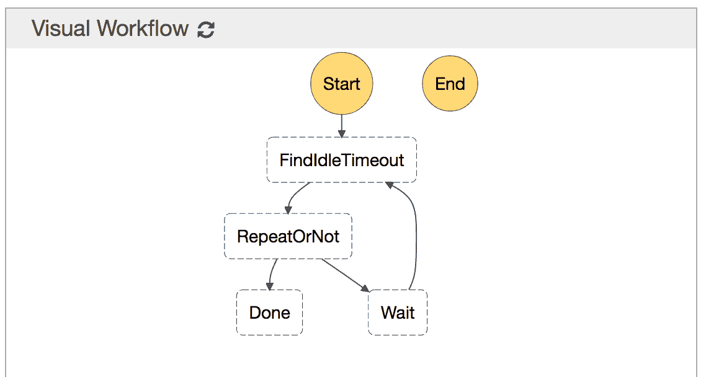
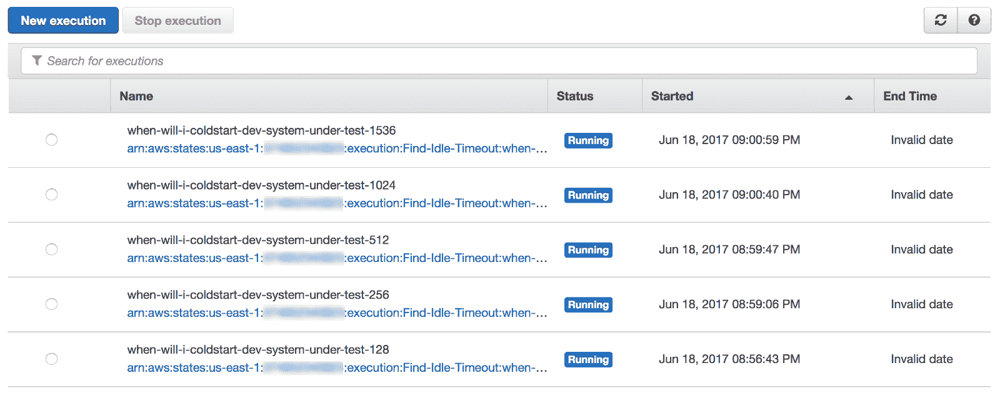
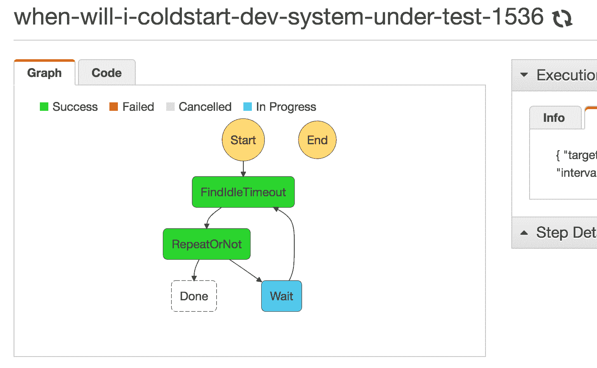
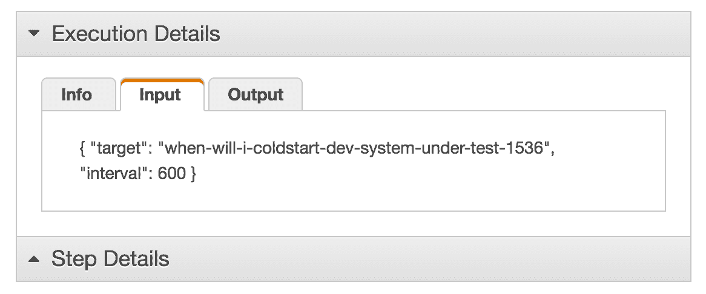
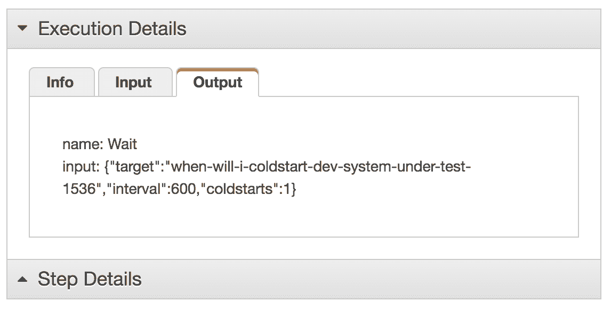
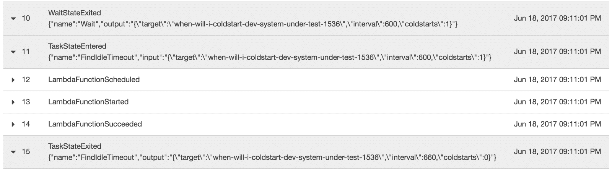
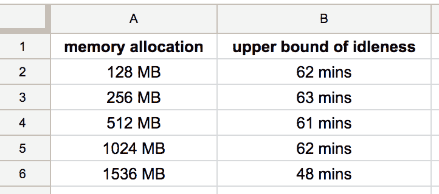
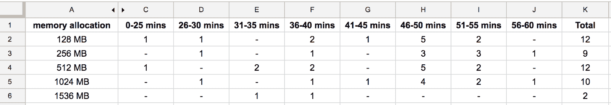

# 在冷启动之前，AWS Lambda 会将您的闲置功能保留多长时间？

> 原文：<https://acloudguru.com/blog/engineering/how-long-does-aws-lambda-keep-your-idle-functions-around-before-a-cold-start>

**AWS Lambda 通常会在 45-60 分钟的不活动状态后终止功能，尽管空闲功能有时会提前终止，以释放其他客户所需的资源。**

在最近的一次实验中，我比较了使用不同语言、内存分配和部署包大小的 AWS Lambda 的冷启动时间。

当 [AWS Lambda 函数](https://acloudguru.com/blog/engineering/packaging-aws-lambda-functions-as-container-images)在长时间未使用后被调用，导致调用延迟增加时，发生冷启动。

一个有趣的观察结果是，功能在 5 分钟不活动后不再循环——这使得冷启动远没有那么糟糕。

了解语言、内存和封装大小如何影响 AWS Lambda 的冷启动。[比较使用不同语言](https://acloudguru.com/blog/engineering/does-coding-language-memory-or-package-size-affect-cold-starts-of-aws-lambda?utm_source=medium_blog&utm_medium=redirect&utm_campaign=medium_blog)、内存分配和部署规模的 AWS Lambda 的冷启动时间。

## λ超时实验

在实验过程中，我的一些功能直到 30 分钟的空闲时间后才经历冷启动。更长时间的不活动是亚马逊在幕后悄悄改变的——这是一个好消息。然而，这一变化促使我提出了几个后续问题:

1.  触发冷启动的新的不活动期是什么？
2.  内存分配会影响冷启动前的空闲时间吗？

为了满足我的好奇心，我设计了一个实验和假设。该实验旨在帮助我们了解 AWS Lambda 平台的实现细节。

由于 AWS 可以——并且将会——在不事先通知的情况下更改这些实现细节，所以您不应该用这些结果来构建您的应用程序！

#### 假设 1

在回收相关资源之前，Lambda 允许你的函数保持空闲的时间是有上限的

这应该是必然的 AWS 永远保留闲置的功能是没有任何意义的。闲置功能占用的资源可用于帮助其他 AWS 客户扩大规模以满足他们的需求。对 AWS 来说，最重要的是，一个不活跃的功能不是支付账单。

#### 假设 2

*空闲超时不是常数*

从开发人员的角度来看，冷启动前持续公布一段空闲时间更好，例如，功能总是在 X 分钟不活动后终止。

但是，AWS 很可能会改变超时时间，以优化更高的利用率。这使他们能够在其物理服务器群中保持更均匀的性能水平。例如，如果某个地区的资源争用程度较高，AWS 缩短冷启动时间并终止功能以释放资源是有意义的。

#### 假设 3

*不活动的上限因内存分配而异*

具有 1536 MB 内存分配的空闲函数比具有 128 MB 内存的空闲函数浪费更多的资源。AWS 提前终止内存分配较高的空闲函数是有意义的。

#### 尝试寻找不活动的上限

为了找到不活动的上限，我们首先需要创建一个 Lambda 函数作为`system-under-test`来报告它何时经历了冷启动。

然后，我们将需要一种机制来逐渐增加调用之间的间隔，直到我们到达一个地方，在那里每次调用都保证是冷启动——上界*。当间隔 X 分钟调用后观察到十(10)次连续冷启动时，确定上限值。*

为了回答假设 3——内存的影响——我们还将使用不同的内存分配来复制`system-under-test`函数。

这个实验是一个耗时的过程，它需要纪律和一定程度的时间精度。我只想说，我不会用手来做这件事！

#### 设置实验的阶跃函数

我的第一个方法是使用一个 [CloudWatch 调度](https://acloudguru.com/hands-on-labs/monitoring-and-notifications-with-cloudwatch-events-and-sns)来触发`system-under-test`函数，并让该函数根据它是否经历了冷启动来动态调整调度。

这种方法惨败。每当`system-under-test`更新时间表时，它立即触发，而不是等待新指定的时间间隔。

相反，我向*阶跃函数*寻求帮助。

*[AWS 步骤函数](https://acloudguru.com/blog/engineering/processing-an-arbitrary-number-of-jobs-with-aws-step-functions)* 允许您创建一个状态机，您可以在其中调用*函数、等待指定的时间、执行并行任务、重试、捕捉错误等等。*

下面是用来进行这个实验的状态机。可视化工作流描述了 FindIdleTimeout 状态将如何调用`system-under-test`函数。根据它的输出，它要么完成实验，要么在递归之前等待。



AWS Step Functions Visual Workflow

`wait`状态允许你使用数据驱动等待的秒数——更多细节参见[文档](http://docs.aws.amazon.com/step-functions/latest/dg/amazon-states-language-wait-state.html)中的`SecondsPath`参数。`wait`状态允许我用这样的输入启动状态机:

```
{ 
    “target”: “when-will-i-coldstart-dev-system-under-test-128”, 
    “interval”: 600, 
    “coldstarts”: 0 
}
```

*   然后输入作为调用事件传递给另一个`find-idle-timeout`函数。
*   该函数将调用`target`——它是`system-under-test`函数的一个变体，具有不同的内存分配
*   如果`system-under-test`功能没有报告冷启动，它将增加间隔。
*   最后，`find-idle-timeout`函数将为*步骤函数*的执行返回一条新数据

```
{ 
    “target”: “when-will-i-coldstart-dev-system-under-test-128”, 
    “interval”: 660, 
    “coldstarts”: 0 
}
```

*   此时，`wait`状态将使用`interval`值，并在切换回`FindIdleTimeout`状态之前等待`660`秒。
*   然后它将再次调用`find-idle-timeout`函数——使用之前的输出作为输入。

```
"Wait": {
    "Type": "Wait",
    "SecondsPath": "$.interval",
    "Next": "FindIdleTimeout"
},
```

有了这个设置，我可以开始多次执行——每次执行一个内存设置。使用 Steps Functions 仪表板，您可以观察状态机的活动执行。



The Steps Functions Dashboard

一路上，我对正在发生的事情有了充分的了解，所有这些都来自舒适的*步骤功能*管理控制台。



The Step Functions Console

使用阶跃函数控制台，您还可以看到状态机的输入和当前输出。



Execution Details: Input

第一次调用目标函数时，保证是冷启动。在这里，您可以看到当前冷启动计数为一(1)。



Execution Details: Output

使用阶跃函数控制台，您还可以看到状态转换何时发生，以及每次转换时的相关输入和输出。



State Transitions

#### 结果！

从数据来看，很明显 AWS Lambda 在整点左右关闭了空闲功能。有趣的是，1536 MB 内存的功能提前 10 多分钟 **终止*。***这一发现支持假设 3*——*内存分配较高的空闲函数会被较早终止。



为了帮助分析结果，我收集了所有冷启动的空闲时间间隔的数据，并将它们分成 5 分钟的类别。

该表显示了在每个功能达到其上限空闲时间之前发生的冷启动次数

********

**从这个图表中，您可以看到超过 60%的冷启动发生在 45 分钟之后——在功能达到其不活动上限之前。**

**尽管数据严重缺乏，但收集的少量数据仍然让我们观察到一些高水平的趋势:**

*   **超过 60%的冷启动发生在不活动 45 分钟之后——达到上限之前**
*   **具有 1536 MB 内存的函数在达到上限之前经历的冷启动次数明显更少**
*   **值得注意的是，与其他函数相比，1536 MB 的函数也有一个较低的上限(48 分钟)**

**数据似乎清楚地支持假设 2*——空闲超时不是一个常数。*我们没有办法找出这些冷启动背后的原因，或者 45 分钟障碍是否有意义。**

#### **结论**

**AWS Lambda 通常会在 45-60 分钟不活动后终止功能，尽管有时空闲功能可以提前终止，以释放其他客户所需的资源。**

**我希望你觉得这个实验很有趣——它只是为了好玩和满足好奇心——仅此而已！请不要在假设这些结果有效的基础上构建应用程序，或者假设它们在可预见的未来仍然有效。实验的[源代码。](https://github.com/theburningmonk/lambda-when-will-i-coldstart)**

**虽然我回答了几个问题，但这个实验的结果也值得进一步研究。例如，与其他函数相比，1536 MB 函数表现出非常不同的行为。这是个特例，还是 1024 MB 以上内存的函数都有这些特质？**

**我很想知道。也许以后我会写一篇这个实验的后续。(用于命令)等待下面发表的消息😉**

* * *

## **获得更好职业所需的技能。**

**掌握现代技术技能，获得认证，提升您的职业生涯。无论您是新手还是经验丰富的专业人士，您都可以通过实践来学习，并在 ACG 的帮助下推进您的云计算职业生涯。**

* * *

***感谢阅读！如果你喜欢你所读的，点击下面的❤按钮，以便其他人可以找到它。可以* [*在 Twitter 上关注我*](https://web.archive.org/web/20190503125920/https://twitter.com/theburningmonk) *。***