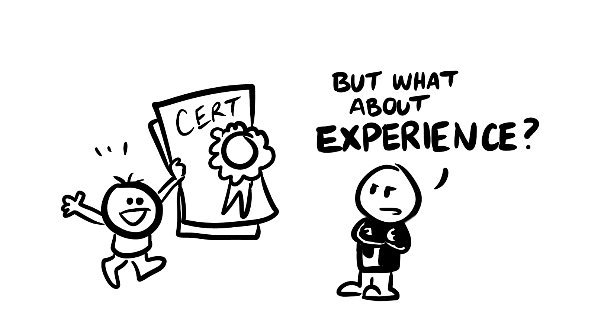
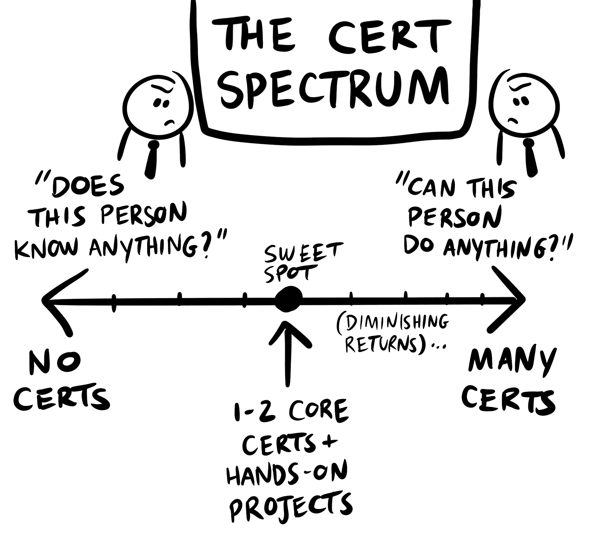
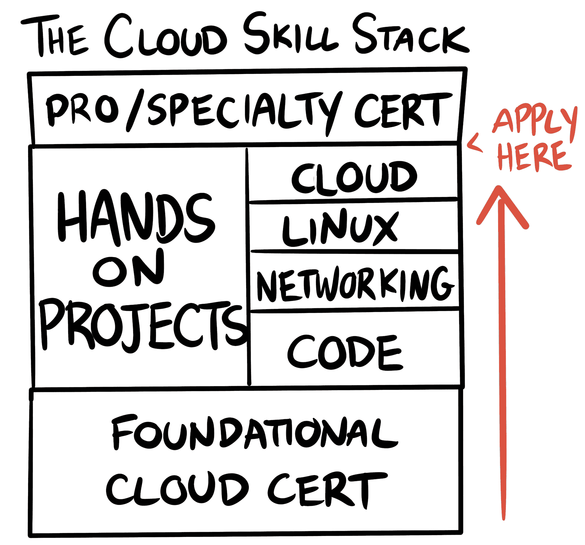

# 我需要多少认证才能获得云工作？|云专家

> 原文：<https://acloudguru.com/blog/engineering/how-many-certifications-do-i-need-to-get-a-cloud-job>

所以你想找一份云工程师的工作？

我明白了。云工程师[赚六位数](https://acloudguru.com/blog/engineering/how-much-do-aws-google-and-microsoft-pay-cloud-talent)。他们致力于改变世界的问题。他们拥有[迅速扩大的职业选择](https://acloudguru.com/blog/news/a-cloud-guru-unveils-state-of-cloud-learning-report)。

而且，与其他一些高薪职业不同，如果你了解自己的专长，不需要昂贵的大学文凭也能被雇佣。谁*不想*在云中工作？

当然，事情没那么简单。云计算技能很受欢迎，报酬也很高，因为它们在就业市场上很稀缺。通常最难的云工作是你的第一份；没有专业经验很难展示技能。

在过去的几个月里，我一直在通过 [#CloudGuruChallenge](https://acloudguru.com/blog/news/introducing-the-cloudguruchallenge) 帮助数百名云计算新手获得认证、面试和聘用。我收到的最常见的问题之一是:*在申请工作之前我应该获得多少认证*？

### “多少证书”是个错误的问题

让我们花一分钟时间真正了解证书。我还没见过一个招聘经理相信 IT 证书能保证技术能力。(老实说，你不会想为相信这一点的人工作。)毕竟，证书只是一张纸——而且前提是你要打印出 PDF 文件。它不会神奇地给你在现实世界中获得成功所需的经验。

然而，云认证对我的工程职业生涯很有帮助，我鼓励每个希望在行业中立足的人都这么做。证书是强大的工具，只要你明白它们是什么和不好用。

### 云证书什么时候有帮助？

**证书给你一个全面的知识库**。你可能没有传统的计算机科学学位。但是如果你通过了 AWS 认证解决方案架构师助理认证，你将会接触到行业专业人士使用的核心 AWS 服务和架构模式。你不必担心你在工作准备中错过了大的话题。证书把所有这些都放在一个地方。非常方便。从这个意义上说，你是否参加 cert 考试几乎无关紧要！仅仅研究材料就能给你真正的价值。

证书帮你获得面试机会。当招聘人员通读你的简历时，云认证的确会脱颖而出。它表明你对这个领域是认真的，并且有一些外部验证——特别是如果你缺少一个传统的证书，比如计算机科学的大学学位。证书不会让你得到工作，但它可能会让你有机会参加面试。

对于一个非常特殊的工作类型，证书是一个很大的优势。像咨询商店和 MSP 这样的专业服务公司是云认证人员的最大雇主之一(也是云专家的一些[最大客户！)这是因为证书在咨询行业非常有价值:](https://acloudguru.com/blog/business/partner-story-accenture)

*   认证计数有助于咨询公司与 AWS 和微软等云提供商保持重要的合作关系。拥有 certs 的人越多，合作层级越高，收益越大。
*   证书有助于将专业知识传达给顾问的客户。如果我要聘请外部顾问，我希望看到资格证书！
*   某些类型的咨询项目需要它们(例如，AWS 只允许认证解决方案架构师专业人员正式进行 [AWS 良好架构评审](https://acloud.guru/learn/aws-well-architected-framework?_ga=2.15607222.1040396949.1601913549-415638573.1596472192))。

大型咨询公司对经过云认证的专业人士有着无尽的需求…当然，假设你真的知道证书上说你知道什么！因此，通过获得认证，你真正打开了你的工作选择。

* * *

这是一个古老的问题。没有工作就无法获得经验。没有经验谁会雇佣你？谜题！[观看这一免费点播的网络研讨会](https://get.acloudguru.com/solving-no-experience-cloud-problem-webinar)，该研讨会就云计算职业发展进行了小组讨论，包括我们的云计算大师挑战赛的见解，该挑战赛帮助数十人获得了他们的第一份云计算工作。

* * *

### 但是说真的，申请云工作要考多少 certs？

虽然从某种意义上来说，证书越多越好(我从来没有对拥有全部 12 个 AWS 证书的人印象深刻——无论从哪个角度来看，这都是一个令人印象深刻的成就)，但你确实需要专注于培养其他技能。否则，你就有可能看起来像是只懂理论而没有实际能力。

如果您是全新的云用户，我建议您采取以下步骤:

#### 1.**挑一朵云**

将你的精力集中在熟悉一个云提供商上，而不是在你没有专业经验的多种云上深耕细作。我建议从两大市场领导者之一的 AWS T1 或 T2 Azure T3 开始。

#### **2。获得初级助理技术认证**

我说的不是 AWS 认证的云从业者或者 Azure 的 AZ-900；这些入门证书很棒，但它们不会传达一个工程角色的技术信息。我建议你先获得 [AWS 解决方案架构师助理](https://acloud.guru/learn/aws-certified-solutions-architect-associate?_ga=2.110608773.1040396949.1601913549-415638573.1596472192)或[微软 Azure 管理员认证](https://acloud.guru/learn/160303d7-6947-4fbc-9d19-fa304849f92e?_ga=2.1508785.1040396949.1601913549-415638573.1596472192)，然后进入本指南的下一步*同时继续追求你感兴趣的云计算领域的专业认证*。

#### 3.**建立一个文件夹，亲自动手掌握基础知识**

云是一长串 IT 范例中最新的一个。尽管需求量很大，但“云”本身并不是一项技能。招聘经理会希望看到你在几个基础领域有知识。

我建议建立 **2-3 个作品集项目**，展示你对以下关键技能的掌握，然后将它们发布在 GitHub 上:

##### **代码**

你必须能够编写基本的脚本。我推荐学习作为编程语言的[Python](https://acloud.guru/learn/df3778be-ba58-4be7-a232-aa658bed7517?_ga=2.111381508.1040396949.1601913549-415638573.1596472192)——它被全世界的云团队所使用。你不需要成为算法和数据结构方面的摇滚明星，但你应该知道如何[操作数据对象](https://acloud.guru/learn/a0abe7d4-ce82-4dfe-beb9-21d98f4c6941?_ga=2.102549889.1040396949.1601913549-415638573.1596472192)并与云服务交互。尝试这个[免费#CloudGuruChallenge](https://acloudguru.com/blog/engineering/cloudguruchallenge-python-aws-etl) 的 Python 组合项目，展示真实世界的技能。

##### **联网**

你将被期望对互联网如何工作有扎实的了解。 [DNS](https://acloud.guru/learn/2c3ff8e6-59e4-4e89-8b66-f82a507647ab?_ga=2.14541111.1040396949.1601913549-415638573.1596472192) 、TCP/IP 和证书——这些协议将统治你在云中的生活，在云中，一切都是由通过网络相互通信的服务组成的。一位云专家有一些很棒的[动手实验](https://learn.acloud.guru/handson/934b78e6-5327-4ed3-a369-1b60b382722f)来帮助你感受这里。

##### Linux 操作系统

Linux 在云中就像在老派的系统管理员工作中一样重要。知道如何[导航 Linux 文件系统](https://acloud.guru/learn/91c2746a-dfb4-46bb-98a3-a526efd0477b?_ga=2.169854497.1040396949.1601913549-415638573.1596472192)，[使用 Vim](https://acloud.guru/learn/85a18eac-0e55-419e-a416-301beed637e6?_ga=2.175040674.1040396949.1601913549-415638573.1596472192) 和终端命令，以及一点关于[容器化](https://acloud.guru/learn/108f9d35-6966-4fb6-a6cd-7af135329bba?_ga=2.169854497.1040396949.1601913549-415638573.1596472192)。我们的 [LFCS](https://acloudguru.com/course/linux-foundation-certified-system-administrator-lfcs) 课程旨在匹配 Linux 基金会详述的领域、技能、知识和能力。

#### 4.应用，同时继续学习

在这一点上，我会说继续前进，并开始申请协理级云支持和工程角色。在这个过程中，你应该继续提高你的技能，通过学习专业或专业水平的认证，如我上面提到的 [AWS 解决方案架构师专业证书](https://acloud.guru/learn/aws-certified-solutions-architect-professional?_ga=2.82636310.1040396949.1601913549-415638573.1596472192)。如果你还没考上也没关系；招聘经理喜欢看到你有上进心，不断自学。

这个阶段开始面试可能会感觉不舒服，可能会遇到一些前期的拒绝。但是这些面试暴露出的弱点将帮助你保持一个简短的反馈循环，回去完善那些关键的编码、Linux 和网络技能。

另外，现在你已经完成了基础学习过程，你会对你想专攻的领域和原因有更好的认识。你可以在采访中分享这些信息——以及你从作品集项目中收集到的战争故事。

过渡到您的第一份云工作需要大量工作吗？很有可能。你可以期待在厨房的餐桌上度过一些深夜，并花一些时间在 StackOverflow 上沮丧的兔子洞。但是在这里工作几个月将会带来丰厚的回报。

因为如果你聪明地学习，并按照我给你展示的方式建立你的技能库，你就不必发送成千上万的简历，也不必奇怪为什么没有人给你回电话，不管你有多少证书。证书和实践构建经验的正确结合将脱颖而出，这是在云计算中取得成功的最快方式。

*Forrest Brazeal 是 AWS 无服务器英雄，也是 AWS 认证解决方案架构师专家。*