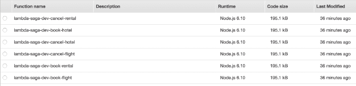
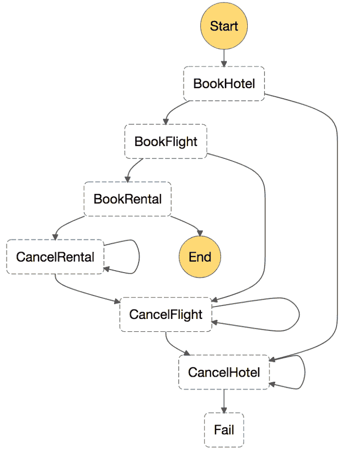
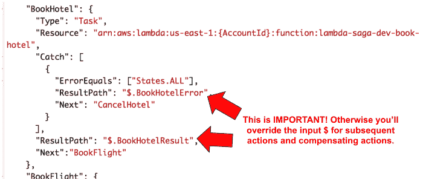
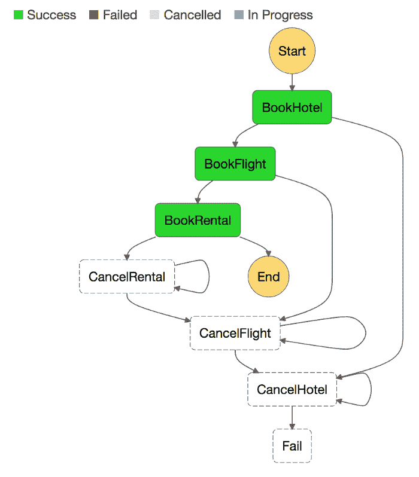
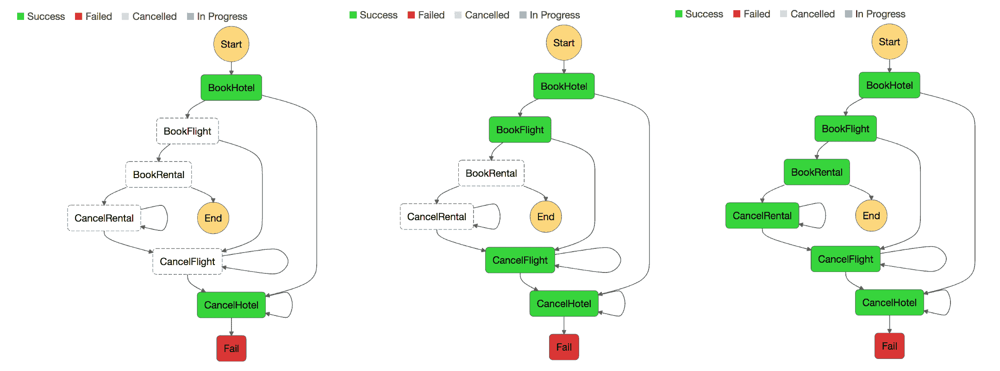

# Saga 模式如何使用 AWS Lambda 和阶跃函数管理故障

> 原文：<https://acloudguru.com/blog/engineering/how-the-saga-pattern-manages-failures-with-aws-lambda-and-step-functions>

在微服务领域，确保分布式事务之间的数据一致性非常重要。

在埃克托·加西亚-莫利纳 [1987 年的论文“*Sagas*](http://www.cs.cornell.edu/andru/cs711/2002fa/reading/sagas.pdf)*中，他描述了一种解决长时间运行的数据库事务中的系统故障的方法。*

*赫克托将传奇描述为一系列相关的小交易。在 Saga 中，协调者(在他们的例子中是数据库)确保所有涉及的事务都成功完成。否则，如果事务失败，协调器运行补偿事务来修改部分执行。*

*这种方法在[微服务的世界中越来越重要，因为应用逻辑](https://acloudguru.com/blog/engineering/evolution-of-business-logic-from-monoliths-through-microservices-to-functions)经常需要跨多个有界上下文进行事务处理——每个上下文都由自己的微服务封装，具有独立的数据库。*

*Caitie McCaffrey 最近分享了一个很棒的演示，总结了她在分布式系统中使用 Saga 模式的经验。*

 *在演示过程中，财经用下面一组关联交易的例子来说明这种模式。

```
Begin transaction
    Start book hotel request
    End book hotel request
    Start book flight request
    End book flight request
    Start book car rental request
    End book car rental request
End transaction
```

## 协调传奇故事

我们可以使用一个 Lambda 函数来建模每个动作——以及它们的补偿动作——并在 [AWS 步骤函数](https://acloudguru.com/blog/engineering/processing-an-arbitrary-number-of-jobs-with-aws-step-functions)中使用一个状态机作为整个事件的**协调器**。



Each action and compensating action are modelled as a Lambda function.

由于补偿动作也可能失败，我们需要能够重试它们直到成功——这意味着它们必须是**幂等的**。我们还将在系统出现故障时实现**向后恢复**。

下面是代表我们故事的状态机。每个操作——预订酒店、预订航班和预订租赁——都有一个补偿操作，并将按顺序执行。递归箭头表示补偿动作被重试，直到成功。



每个 Lambda 函数都希望输入为以下形式:

```
{
  "trip_id": "5c12d94a-ee6a-40d9-889b-1d49142248b7",
  "depart": "London",
  "depart_at": "2017-07-10T06:00:00.000Z",
  "arrive": "Dublin",
  "arrive_at": "2017-07-12T08:00:00.000Z",
  "hotel": "holiday inn",
  "check_in": "2017-07-10T12:00:00.000Z",
  "check_out": "2017-07-12T14:00:00.000Z",
  "rental": "Volvo",
  "rental_from": "2017-07-10T00:00:00.000Z",
  "rental_to": "2017-07-12T00:00:00.000Z"
}
```

每个函数内部都有一个针对不同 DynamoDB 表的简单的`PutItem`请求。相应的补偿函数将对相应的表执行一个`DeleteItem`来回滚`PutItem`动作。

状态机依次将相同的输入传递给每个动作(预订酒店→预订航班→预订租赁),并记录它们在特定路径的结果。这将避免覆盖将传递给下一个函数的输入`$`。

在这个简单的实现中，我们将对任何失败应用补偿操作——因此有了下面的`State.ALL`。在实践中，您应该考虑给某些错误类型一个[重试](http://docs.aws.amazon.com/step-functions/latest/dg/amazon-states-language-errors.html#amazon-states-language-retrying-after-error) —例如，暂时性错误，如 DynamoDB 的供应吞吐量超出异常。

每个动作和补偿动作的输出和错误都存储在特定的路径中。这将避免覆盖其余动作的输入值`$`。



### 快乐之路流动

沿着这条快乐的道路，每个动作依次执行，状态机将成功完成。



### 失败案例

当故障发生时，我们需要根据故障发生的位置依次采取相应的补偿措施。

在下面的例子中，如果失败发生在`BookFlight`，那么`CancelFlight`和`CancelHotel`都将被执行，以回滚到目前为止所执行的任何更改。

类似地，如果失败发生在`BookRental`，那么所有三个补偿动作——`CancelRental`、`CancelFlight`和`CancelHotel`——将按顺序执行，以回滚事务的所有状态改变。

每个补偿动作也有一个无限的重试循环！实际上，在提醒人为干预之前，重试次数应该有一个合理的上限。



如果你想用这个例子自己试验 Saga 模式，这里是这个演示的源代码。

我很想知道你对使用 Saga 模式和微服务架构的优缺点的看法…请在下面留言。*感谢阅读！*

* * *

## 获得更好职业所需的技能。

掌握现代技术技能，获得认证，提升您的职业生涯。无论您是新手还是经验丰富的专业人士，您都可以通过实践来学习，并在 ACG 的帮助下推进您的云计算职业生涯。

* * **