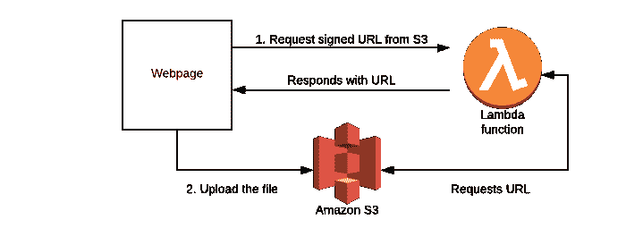
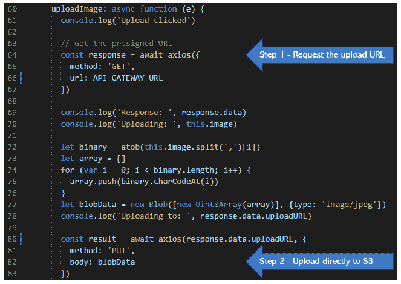

# 如何使用 AWS Lambda 和云专家 S3 为您的网站添加文件上传功能

> 原文：<https://acloudguru.com/blog/engineering/how-to-add-file-upload-features-to-your-website-with-aws-lambda-and-s3>

*文件上传带来了一个可扩展性问题，使用无服务器很容易解决——而不会增加您的钱包负担*。

从浏览器上传文件的机制在互联网早期就已经存在了。在全服务器环境中，很容易使用 Django、Express 或任何其他流行的框架。这不是一个令人兴奋的话题——除非你经历了伸缩问题。

想象一下这个场景—您有一个上传文件的应用程序。一切都很好，直到网站突然流行起来。在纳税日之前的一个月，每小时的使用量增长到了 100Gb，而不是每月处理 1gb 的上传量。之后，使用量会在下一年再次下降。这正是我们要解决的问题。

大规模的文件上传会吞噬你的资源——网络带宽、CPU、存储。所有这些数据都是通过您的 web 服务器获取的，然后您必须对其进行扩展——如果您幸运的话，这意味着 AWS 中的自动扩展，但是如果您不在云中，您还必须应对物理网络瓶颈问题。

如果您的服务器在处理上传文件的过程中失败，您还可能面临一些困难的竞争条件。文件到达最终目的地了吗？处理的状态如何？当服务器过载时，很难重放失败的步骤或知道事务的状态。

幸运的是，这个特殊的问题被证明是无服务器的一个很好的用例——因为您可以完全消除伸缩性问题。对于需求不可预测的移动和 web 应用程序，您可以简单地允许应用程序将[文件直接上传到 S3](https://acloudguru.com/hands-on-labs/introduction-to-amazon-s3) 。这有一个额外的好处，即启用 https 端点进行上传，这对于在传输过程中保持文件内容的安全至关重要。

所有这些听起来都很棒——但是当服务器不再做身份验证和中间的跑腿工作时，这在实践中如何工作呢？

### S3 上传程序演示应用程序

我在 [AWS 无服务器应用程序库](https://serverlessrepo.aws.amazon.com/applications/arn:aws:serverlessrepo:us-east-1:526237104669:applications~Serverless-S3-Uploader)中设置了一个应用程序，您可以将其部署到自己的 AWS 帐户中。尝试安装应用程序并在文档中部署 Gist homepage，然后我们将介绍解决方案:


幕后发生的是一个两步过程——首先，网页调用一个 Lambda 函数来请求上传 URL，然后它将 JPG 文件直接上传到 S3:



URL 是该过程的关键部分，它在授权传输的查询参数中包含一个密钥、签名和令牌。没有这些，传输将会失败。

*随意克隆 [Github repo。](https://github.com/jbesw/askjames-s3uploader)面向公众的演示应用程序会在 24 小时内删除所有文件，并启用节流功能以防止滥用，正如您所知。*

### 为什么要使用 Lambda 函数？

有可能[取消 Lambda 函数](https://docs.aws.amazon.com/AmazonS3/latest/API/sigv4-authentication-HTTPPOST.html)并从客户端浏览器做所有事情——但是有许多好的理由来避免这种方法。除了向 web 页面添加更多的代码之外，Lambda 函数还允许您控制这个过程，避开任何潜在攻击者的窥探。

例如，如果您想先授权用户，也许只有付费用户可以上传，而免费试用版是只读的，该怎么办？或者您可能需要在流程中添加额外的挂钩来触发其他工作流、日志记录，或者在上传太多的情况下添加一个中断器。或者您可能不愿意在客户端代码中透露存储桶名称或其他信息。

请求签名 URL 的 Lambda 函数——演示应用程序的第一步——相当简单:

```
const uuidv4 = require('uuid/v4')
const AWS = require('aws-sdk')
AWS.config.update({ region: process.env.REGION || 'us-east-1' })
const s3 = new AWS.S3();
exports.handler = async (event) => {
  return await getUploadURL()
}
const getUploadURL = async () => {
  const actionId = uuidv4()
  const s3Params = {
    Bucket: '<< ENTER YOUR BUCKET NAME HERE >>',
    Key:  `${actionId}.jpg`,
    ContentType: 'image/jpeg',
    ACL: 'public-read',
  }
  return new Promise((resolve, reject) => {
    let uploadURL = s3.getSignedUrl('putObject', s3Params)
    resolve({
      "statusCode": 200,
      "isBase64Encoded": false,
      "headers": { "Access-Control-Allow-Origin": "*" },
      "body": JSON.stringify({
        "uploadURL": uploadURL,
        "photoFilename": `${actionId}.jpg`
      })
    })
  })
})
```

尽管这个函数很简单，但是在请求签名的 URL 之前，可以很容易地在这个阶段添加各种逻辑。一旦函数就绪，接下来的事情就是设置 API Gateway 并创建一个 GET 方法来创建端点。或者，您可以使用[无服务器框架](https://serverless.com/)进行部署，并自动执行这一步骤。

### 构建前端

该项目基于一个[样板 Vue 模板](https://vuejs.org/v2/guide/)，但是演示该功能的所有重要工作都发生在 s3uploader.vue 中。



s3uploader.vue

同样，这是最少的代码，没有错误处理或细节以保持示例的简单，但是您可以看到实现这一点所需的代码只有几行。如果你打开 Chrome 开发者控制台(按 F12)，你可以在整个过程中看到 console.log 输出。

### 设置您的权限

最后，谈谈权限——当您请求签名的 URL 时，请求函数需要适当的 IAM 权限来请求和上传文件。

一些管理政策包括过于慷慨的 S3:*许可。这些功能在开发中工作而在生产中失败是很常见的，因为当提升到生产时，IAM 角色被切换到一组更窄的特权。函数使用的 IAM 角色必须能够写入桶中，否则无法工作。

### 回到可伸缩性

这一切之所以值得，是因为可伸缩性。如果您需要允许大量用户上传文件，这种方法可以减轻您的所有网络负担(用户直接上传到 S3 ),并且扩展是无缝和自动的。当没人使用你的功能时，你不用付费。

此外，由于用户和 S3 之间没有服务器中继，您可以消除另一个故障点。 [S3 以其“11 个 9”的耐用性而闻名](https://acloudguru.com/blog/engineering/brazeal-in-praise-of-s3-the-greatest-cloud-service-of-all-time)，所以您也可以从文件几乎不可能消失这一事实中受益。

总的来说，考虑到无服务器实现的好处，在使用 AWS 基础设施时，这似乎是管理任何形式的文件上传的明显而简单的方法。

* * *

## 获得更好职业所需的技能。

掌握现代技术技能，获得认证，提升您的职业生涯。无论您是新手还是经验丰富的专业人士，您都可以通过实践来学习，并在 ACG 的帮助下推进您的云计算职业生涯。

* * *